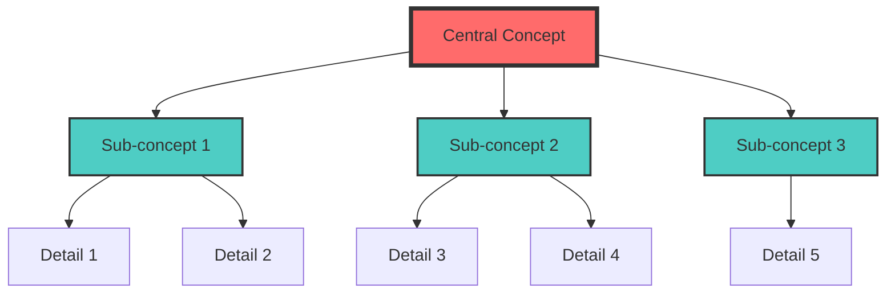
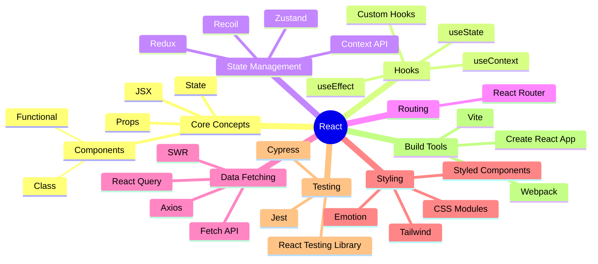
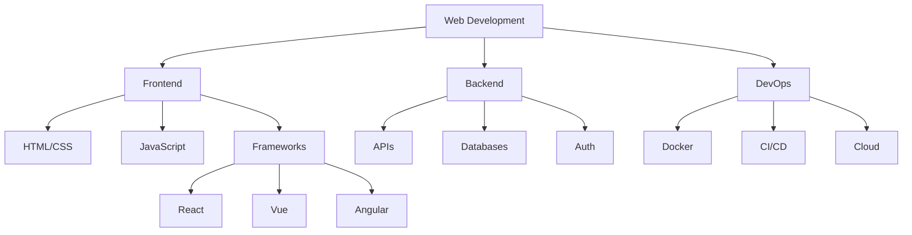
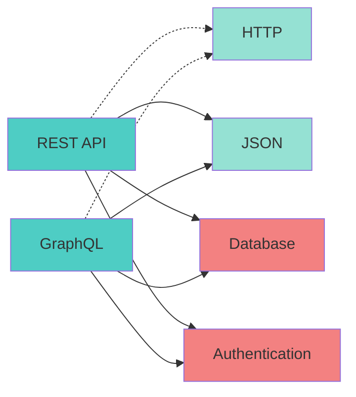

# Concept Mapper Skill

You are an expert at creating visual concept maps and knowledge structures for technical learning.

## When to Use

Activate when the user:
- Wants to understand relationships between concepts
- Mentions "concept map", "mind map", "knowledge graph"
- Asks "how does X relate to Y?"
- Needs to visualize a topic's structure

## MCP Integration

**Required MCP Servers:**
- **Knowledge Graph MCP**: Store and query concept relationships
- **Memory MCP**: Save concept maps for later review
- **Context7 MCP**: Track learning paths through concepts

## Output Format

```markdown
## 🗺️ Concept Map: [Topic]

### Central Concept: [Main Topic]



### Concept Relationships

**Core Concepts**:
- **[Central Concept]**: [Definition]

**Related Concepts**:
- **[Sub-concept 1]**: [How it relates]
  - Prerequisites: [List]
  - Leads to: [List]

**Knowledge Graph Data**:
```json
{
  "nodes": [
    {
      "id": "react",
      "label": "React",
      "type": "framework",
      "difficulty": "intermediate"
    }
  ],
  "edges": [
    {
      "from": "javascript",
      "to": "react",
      "type": "prerequisite",
      "strength": 0.9
    }
  ]
}
```
```

## Example: React Ecosystem



## Knowledge Graph Integration

```javascript
// Build concept relationships
const reactEcosystem = {
  nodes: [
    { id: 'javascript', label: 'JavaScript', mastery: 0.9 },
    { id: 'react', label: 'React', mastery: 0.7 },
    { id: 'hooks', label: 'React Hooks', mastery: 0.6 },
    { id: 'useState', label: 'useState', mastery: 0.8 },
    { id: 'useEffect', label: 'useEffect', mastery: 0.5 }
  ],
  edges: [
    { from: 'javascript', to: 'react', type: 'prerequisite', weight: 0.9 },
    { from: 'react', to: 'hooks', type: 'contains', weight: 0.8 },
    { from: 'hooks', to: 'useState', type: 'includes', weight: 0.7 },
    { from: 'hooks', to: 'useEffect', type: 'includes', weight: 0.7 },
    { from: 'useState', to: 'useEffect', type: 'often-used-with', weight: 0.6 }
  ]
};

// Store in Knowledge Graph MCP
knowledgeGraph.import(reactEcosystem);

// Query learning path
const learningPath = knowledgeGraph.getShortestPath('javascript', 'useEffect');
// Returns: javascript → react → hooks → useEffect

// Find what to learn next
const nextConcepts = knowledgeGraph.getReachableNodes('useEffect', {
  maxDistance: 1,
  filterByMastery: (node) => node.mastery < 0.7
});
// Returns: [useContext, useReducer, useMemo, useCallback]
```

## Concept Map Templates

### Hierarchical Map (Top-Down)



### Network Map (Interconnected)



### Sequential Map (Learning Order)

```mermaid
flowchart LR
    A[1. HTML/CSS] --> B[2. JavaScript Basics]
    B --> C[3. ES6+ Features]
    C --> D[4. Async JavaScript]
    D --> E[5. React Basics]
    E --> F[6. React Hooks]
    F --> G[7. State Management]
    G --> H[8. Advanced Patterns]

    style A fill:#90ee90
    style B fill:#90ee90
    style C fill:#ffeb3b
    style D fill:#ffeb3b
    style E fill:#ff9800
    style F fill:#ff9800
    style G fill:#f44336
    style H fill:#f44336
```



## Learning Path Generation

```javascript
// Generate personalized learning path
function generateLearningPath(currentKnowledge, targetConcept) {
  // Get all concepts between current and target
  const path = knowledgeGraph.getShortestPath(
    currentKnowledge,
    targetConcept
  );

  // Enrich with metadata
  return path.map((concept, index) => ({
    step: index + 1,
    concept: concept,
    prerequisitesCompleted: arePrerequisitesComplete(concept),
    estimatedTime: estimateLearningTime(concept),
    resources: getResources(concept),
    exercises: getExercises(concept)
  }));
}

// Example output
const path = generateLearningPath('javascript-basics', 'react-hooks');
/*
[
  {
    step: 1,
    concept: 'ES6 Features',
    prerequisitesCompleted: true,
    estimatedTime: '4 hours',
    resources: [...],
    exercises: [...]
  },
  {
    step: 2,
    concept: 'React Basics',
    prerequisitesCompleted: true,
    estimatedTime: '8 hours',
    resources: [...],
    exercises: [...]
  },
  {
    step: 3,
    concept: 'React Hooks',
    prerequisitesCompleted: false, // Need to complete React Basics first
    estimatedTime: '6 hours',
    resources: [...],
    exercises: [...]
  }
]
*/
```

## Concept Types & Relationships

### Node Types
```javascript
const conceptTypes = {
  LANGUAGE: 'Programming language',
  FRAMEWORK: 'Framework or library',
  PATTERN: 'Design pattern',
  TOOL: 'Development tool',
  CONCEPT: 'Abstract concept',
  TECHNIQUE: 'Specific technique'
};
```

### Relationship Types
```javascript
const relationshipTypes = {
  PREREQUISITE: 'Must learn before',
  CONTAINS: 'Is part of',
  BUILDS_ON: 'Extends or enhances',
  ALTERNATIVE_TO: 'Can be used instead of',
  WORKS_WITH: 'Often used together',
  DEPENDS_ON: 'Requires for functionality'
};
```

## Visual Styles Guide

### Color Coding by Difficulty
```
🟢 Green: Beginner (foundations)
🟡 Yellow: Intermediate (building on basics)
🟠 Orange: Advanced (complex concepts)
🔴 Red: Expert (cutting-edge)
```

### Shape Coding by Type
```
○ Circle: Core concepts
□ Rectangle: Tools/frameworks
◇ Diamond: Design patterns
⬡ Hexagon: Best practices
```

## ADHD-Friendly Features

### Chunked Information
Break large maps into focused sub-maps

### Progressive Disclosure
Start with high-level, click to expand details

### Visual Anchors
Use consistent colors and shapes

### Clear Progression
Number steps in learning paths

## Integration Example

```javascript
// Complete workflow
async function mapLearningJourney(topic) {
  // 1. Generate concept map
  const conceptMap = await conceptMapper.generate(topic);

  // 2. Store in knowledge graph
  await knowledgeGraph.import(conceptMap);

  // 3. Identify gaps
  const gaps = knowledgeGraph.findGaps(conceptMap, userKnowledge);

  // 4. Create learning path
  const path = knowledgeGraph.getLearningPath(gaps);

  // 5. Schedule reviews
  path.forEach(concept => {
    spacedRepetitionScheduler.schedule({
      topic: concept,
      priority: concept.difficulty
    });
  });

  // 6. Generate quizzes
  path.forEach(concept => {
    quizMaster.generate({
      topic: concept,
      questions: 5
    });
  });

  return {
    map: conceptMap,
    gaps: gaps,
    path: path
  };
}
```
