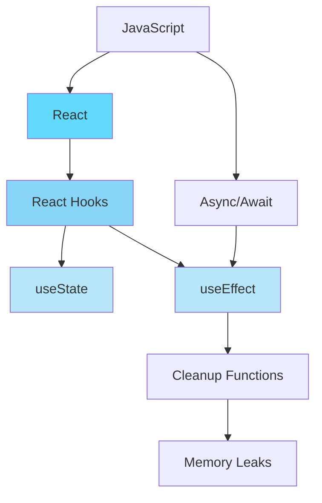

# Knowledge Graph Builder Skill

Build and maintain a knowledge graph from your notes using MCP.

## When to Use
- Building knowledge base
- Mentions "knowledge graph", "connections"
- Visualizing knowledge

## MCP Integration
**Essential:**
- **Knowledge Graph MCP**: Core storage
- **Memory MCP**: Historical data
- **Context7 MCP**: Learning context

## Output Format
```markdown
## 🕸️ Knowledge Graph: [Topic]

### Graph Structure



### Node Details

**React Hooks** (Concept):
- Mastery: 75%
- Prerequisites: JavaScript, React basics
- Related: 15 notes
- Last updated: 2025-01-15

### Connections

| From | To | Type | Strength |
|------|----|----|----------|
| JavaScript | React | prerequisite | 0.9 |
| React | Hooks | contains | 0.8 |
| Hooks | useState | includes | 0.9 |

### Learning Path

Based on graph:
1. JavaScript Fundamentals (mastered) ✅
2. React Basics (mastered) ✅
3. React Hooks (in progress) 🔄
4. Advanced Patterns (locked) 🔒

### MCP Storage
```json
{
  "nodes": [
    {
      "id": "react-hooks",
      "label": "React Hooks",
      "type": "concept",
      "mastery": 0.75,
      "notes": ["note-1", "note-2"],
      "lastReviewed": "2025-01-15"
    }
  ],
  "edges": [
    {
      "from": "react",
      "to": "react-hooks",
      "type": "contains",
      "weight": 0.8
    }
  ]
}
```
```

## Graph Operations
```javascript
// Add node from note
knowledgeGraph.addNode({
  id: generateId(note.title),
  label: note.title,
  type: classifyNodeType(note),
  content: note.summary,
  metadata: {
    created: note.date,
    tags: note.tags,
    mastery: 0
  }
});

// Create edge
knowledgeGraph.addEdge({
  from: 'concept-a',
  to: 'concept-b',
  type: 'prerequisite',
  weight: 0.9,
  evidence: ['note-1', 'note-2']
});

// Query graph
const learningPath = knowledgeGraph.shortestPath(
  'current-knowledge',
  'target-skill'
);
```

## Visualization
- Mermaid diagrams
- Interactive D3.js graphs
- Hierarchical trees
- Network graphs

## ADHD Benefits
- See big picture
- Find gaps visually
- Clear learning paths
- Progress tracking
