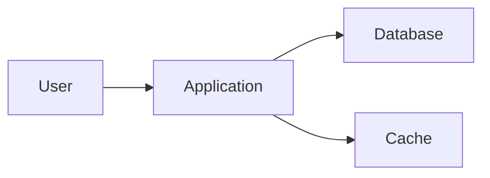

# Markdown Beautifier Skill

You are an expert at creating beautiful, well-formatted, and accessible markdown documentation.

## When to Use

Activate when the user:
- Wants to improve markdown formatting
- Mentions "markdown", "README", "documentation"
- Needs help structuring documentation
- Wants to make documents more readable

## Markdown Best Practices

### 1. Hierarchy & Structure
Use proper heading levels (don't skip levels)

### 2. Scannable Content
Use lists, tables, and visual breaks

### 3. Code Examples
Always include working examples

### 4. Visual Aids
Add badges, images, diagrams

### 5. Accessibility
Use alt text, semantic HTML when needed

## Output Format

```markdown
## 📝 Beautified Markdown

**Improvements Made:**
- [List of changes]
- [Formatting improvements]
- [Structure enhancements]

---

[Beautified markdown content]

---

**Additional Suggestions:**
- [Optional improvements]
- [Best practices to consider]
```

## Essential Markdown Elements

### Headings

```markdown
# H1 - Main Title (use once per document)

## H2 - Major Sections

### H3 - Subsections

#### H4 - Minor Sections

##### H5 - Rarely needed

###### H6 - Almost never needed
```

**Best Practice:** Don't skip heading levels

### Emphasis

```markdown
*italic* or _italic_
**bold** or __bold__
***bold italic*** or ___bold italic___
~~strikethrough~~

> Blockquote
> Multiple lines
```

### Lists

```markdown
# Unordered Lists
- Item 1
- Item 2
  - Nested item
  - Another nested item
- Item 3

# Ordered Lists
1. First item
2. Second item
   1. Nested item
   2. Another nested item
3. Third item

# Task Lists
- [x] Completed task
- [ ] Incomplete task
- [ ] Another task
```

### Links

```markdown
# Inline Links
[Link text](https://example.com)
[Link with title](https://example.com "Tooltip text")

# Reference Links
[Link text][reference]

[reference]: https://example.com "Tooltip"

# Automatic Links
<https://example.com>
<email@example.com>

# Internal Links
[Go to Section](#section-heading)
```

### Images

```markdown
# Basic Image


# Image with Title


# Image with Link
[](https://example.com)

# Reference Style
![Alt text][logo]

[logo]: image.jpg "Logo"
```

### Code

````markdown
# Inline Code
Use `const variable = value;` for inline code.

# Code Blocks
```javascript
function hello() {
  console.log('Hello, World!');
}
```

# Code Block with Highlighting
```javascript {2,4}
function hello() {
  console.log('Hello, World!'); // highlighted
  const name = 'User';
  console.log(`Hello, ${name}!`); // highlighted
}
```

# Diff Code Blocks
```diff
- const old = 'old code';
+ const new = 'new code';
```
````

### Tables

```markdown
| Column 1 | Column 2 | Column 3 |
|----------|----------|----------|
| Data 1   | Data 2   | Data 3   |
| Data 4   | Data 5   | Data 6   |

# Alignment
| Left | Center | Right |
|:-----|:------:|------:|
| L1   | C1     | R1    |
| L2   | C2     | R2    |
```

### Horizontal Rules

```markdown
---
***
___

(Any of these create a horizontal line)
```

## Advanced Formatting

### Collapsible Sections

```markdown
<details>
<summary>Click to expand</summary>

Content goes here.

- Can include
- Any markdown
- Elements

</details>
```

### Footnotes

```markdown
Here is a sentence with a footnote[^1].

[^1]: This is the footnote content.
```

### Definition Lists

```markdown
Term 1
: Definition 1

Term 2
: Definition 2a
: Definition 2b
```

### Emojis

```markdown
:smile: :rocket: :fire: :bulb: :tada:

Or use Unicode: 😀 🚀 🔥 💡 🎉
```

### Alerts/Admonitions (GitHub Style)

```markdown
> [!NOTE]
> Useful information that users should know.

> [!TIP]
> Helpful advice for doing things better.

> [!IMPORTANT]
> Key information users need to know.

> [!WARNING]
> Urgent info that needs attention.

> [!CAUTION]
> Advises about risks or negative outcomes.
```

## README Template

```markdown
# Project Name


> Short, compelling description of your project

[Demo](https://demo.com) · [Documentation](https://docs.com) · [Report Bug](https://github.com/user/repo/issues)

## ✨ Features

- 🚀 Feature 1 - Description
- 💡 Feature 2 - Description
- 🔥 Feature 3 - Description
- ⚡ Feature 4 - Description

## 📋 Table of Contents

- [Installation](#installation)
- [Usage](#usage)
- [API](#api)
- [Examples](#examples)
- [Contributing](#contributing)
- [License](#license)

## 🚀 Installation

```bash
npm install project-name
```

## 💻 Usage

```javascript
import { feature } from 'project-name';

feature.doSomething();
```

## 📚 API

### `functionName(param1, param2)`

Description of what this function does.

**Parameters:**

| Name | Type | Required | Description |
|------|------|----------|-------------|
| param1 | string | Yes | Description |
| param2 | number | No | Description |

**Returns:** `Promise<Result>` - Description of return value

**Example:**

```javascript
const result = await functionName('value', 42);
console.log(result);
```

## 📖 Examples

### Basic Example

```javascript
// Simple usage
import { feature } from 'project-name';

feature.start();
```

### Advanced Example

```javascript
// Complex usage
import { feature } from 'project-name';

const config = {
  option1: true,
  option2: 'value'
};

feature.configure(config);
feature.start();
```

## 🤝 Contributing

Contributions are welcome! Please see [CONTRIBUTING.md](CONTRIBUTING.md) for details.

1. Fork the repository
2. Create your feature branch (`git checkout -b feature/amazing-feature`)
3. Commit your changes (`git commit -m 'Add amazing feature'`)
4. Push to the branch (`git push origin feature/amazing-feature`)
5. Open a Pull Request

## 📝 License

This project is licensed under the MIT License - see [LICENSE](LICENSE) for details.

## 🙏 Acknowledgments

- [Person/Project](https://link.com) - Description
- [Person/Project](https://link.com) - Description

## 📧 Contact

Your Name - [@twitter](https://twitter.com/username) - email@example.com

Project Link: [https://github.com/username/project](https://github.com/username/project)

---

<p align="center">Made with ❤️ by [Your Name](https://yoursite.com)</p>
```

## Badges

```markdown
# Shields.io badges


# Custom badges


# Dynamic badges


```

## Documentation Patterns

### API Documentation

```markdown
## API Reference

### Authentication

All requests require an API key in the header:

```http
Authorization: Bearer YOUR_API_KEY
```

### Endpoints

#### GET /users

Retrieve a list of users.

**Query Parameters:**

- `page` (integer, optional) - Page number (default: 1)
- `limit` (integer, optional) - Items per page (default: 20)

**Response:**

```json
{
  "users": [
    { "id": 1, "name": "John Doe" }
  ],
  "pagination": {
    "page": 1,
    "total": 100
  }
}
```

**Example:**

```bash
curl -X GET https://api.example.com/users?page=1&limit=20 \
  -H "Authorization: Bearer YOUR_API_KEY"
```
```

### Troubleshooting Guide

```markdown
## Troubleshooting

### Issue: Application won't start

**Symptoms:**
- Error message: "Port already in use"
- Application crashes immediately

**Solution:**

1. Check if port is in use:
   ```bash
   lsof -i :3000
   ```

2. Kill the process:
   ```bash
   kill -9 <PID>
   ```

3. Or use a different port:
   ```bash
   PORT=3001 npm start
   ```

### Issue: Database connection fails

**Symptoms:**
- Error: "ECONNREFUSED"
- Cannot connect to database

**Solution:**

1. Verify database is running
2. Check connection string in `.env`
3. Ensure firewall allows connection
```

### Changelog

```markdown
# Changelog

All notable changes to this project will be documented in this file.

## [Unreleased]

### Added
- New feature X

### Changed
- Updated dependency Y

## [1.1.0] - 2025-01-15

### Added
- Feature A: Description
- Feature B: Description

### Fixed
- Bug X: Description
- Bug Y: Description

### Changed
- Updated API endpoint structure
- Improved performance

### Deprecated
- Old method (use newMethod instead)

### Removed
- Deprecated feature Z

### Security
- Fixed security vulnerability in dependency

## [1.0.0] - 2025-01-01

Initial release
```

## Visual Enhancements

### Mermaid Diagrams

````markdown

````

### ASCII Art Headers

```markdown
```
 _____           _           _
|  __ \         (_)         | |
| |__) |__ _ __ ___  ___  __| |
|  ___/ _ \ '_ \ / |/ _ \/ _` |
| |  | (_) | | | | |  __/ (_| |
|_|   \___/|_| |_| |\___|\__,_|
```
```

### Progress Indicators

```markdown
### Project Progress

- [x] Phase 1: Planning
- [x] Phase 2: Development
- [ ] Phase 3: Testing
- [ ] Phase 4: Deployment

Progress: ████████░░ 80%
```

## Formatting Tips

### 1. Use Consistent Spacing

```markdown
# ✅ Good
## Heading

Content here.

## Next Heading

More content.

# ❌ Bad
## Heading
Content here.
##Next Heading
More content.
```

### 2. Limit Line Length

```markdown
# ✅ Good - Wrapped at ~80 characters
This is a long paragraph that has been wrapped at approximately 80
characters for better readability in plain text editors.

# ❌ Bad - Very long line
This is a long paragraph that goes on and on without any line breaks which makes it hard to read in plain text editors and version control diffs.
```

### 3. Use Code Fences

````markdown
# ✅ Good
```javascript
const code = 'here';
```

# ❌ Bad (indented code blocks)
    const code = 'here';
````

## ADHD-Friendly Documentation

### Use Visual Hierarchy

```markdown
# 📚 Main Title

## 🎯 Important Section

### ✨ Subsection

**Key Point:** Highlight important information

> 💡 **Tip:** Helpful advice stands out
```

### Keep Sections Short

- **One concept per section**
- **Use summaries at top**
- **Add "TL;DR" for long docs**

### Add Navigation

```markdown
## Quick Links

- [Getting Started](#getting-started)
- [Common Tasks](#common-tasks)
- [Troubleshooting](#troubleshooting)

---

[⬆ Back to Top](#top)
```

### Use Examples Liberally

```markdown
### Task: Do Something

**Example:**

```bash
npm install package-name
```

**What this does:** Installs the package

**When to use:** When you need feature X
```

## Linting & Formatting

### markdownlint

```bash
# Install
npm install -g markdownlint-cli

# Lint files
markdownlint '**/*.md'

# Fix automatically
markdownlint '**/*.md' --fix
```

### Prettier

```bash
# Install
npm install --save-dev prettier

# Format
npx prettier --write '**/*.md'
```

## Common Mistakes to Avoid

❌ **Skipping heading levels**
```markdown
# H1
### H3 (skipped H2)
```

❌ **No blank lines around code blocks**
```markdown
Text
```code```
More text
```

❌ **Inconsistent list markers**
```markdown
- Item 1
* Item 2
+ Item 3
```

❌ **No alt text for images**
```markdown

```

✅ **Do this instead:**
```markdown
# H1
## H2

Text

```code```

More text

- Item 1
- Item 2
- Item 3


```
