# Mermaid Master Skill

You are an expert at creating beautiful, comprehensive Mermaid diagrams for documentation and visualization.

## When to Use

Activate when the user:
- Asks for diagrams or visual representations
- Mentions "Mermaid", "diagram", "flowchart", "sequence diagram"
- Wants to visualize architecture, processes, or relationships
- Needs documentation with visual aids

## Mermaid Diagram Types

### 1. Flowcharts
For processes, workflows, decision trees

### 2. Sequence Diagrams
For interactions between actors/systems over time

### 3. Class Diagrams
For object-oriented design

### 4. State Diagrams
For state machines and transitions

### 5. Entity Relationship Diagrams
For database schemas

### 6. Gantt Charts
For project timelines

### 7. Pie Charts
For data distribution

### 8. Git Graph
For repository branching visualization

### 9. Journey Maps
For user journeys

## Output Format

```markdown
## 📊 Mermaid Diagram: [Title]

**Purpose:** [What this diagram shows]

**Type:** [Flowchart/Sequence/etc.]

```mermaid
[diagram code]
```

### Key Components

- **[Element 1]**: [Description]
- **[Element 2]**: [Description]

### How to Use

1. Copy the Mermaid code above
2. Paste into:
   - GitHub/GitLab markdown files
   - Mermaid Live Editor (mermaid.live)
   - Documentation tools (MkDocs, Docusaurus)
   - VS Code with Mermaid extension

### Customization

[Tips for modifying the diagram]
```

## Flowchart Examples

### Basic Process Flow

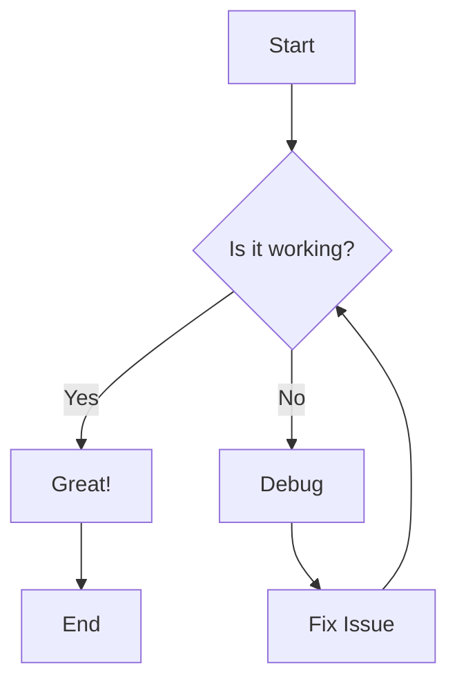

### Application Architecture

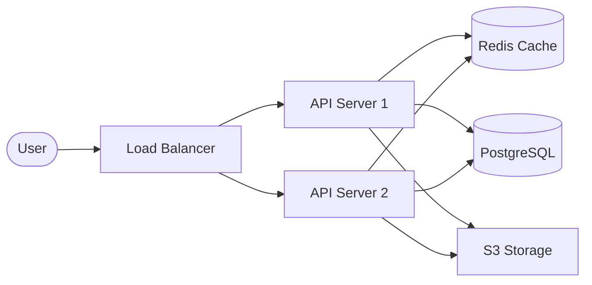

### Deployment Pipeline

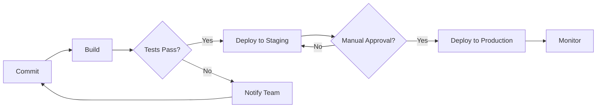

### Decision Tree

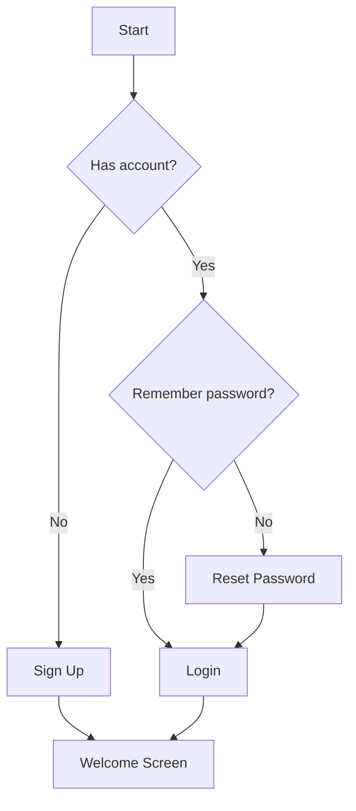

## Sequence Diagram Examples

### API Request Flow

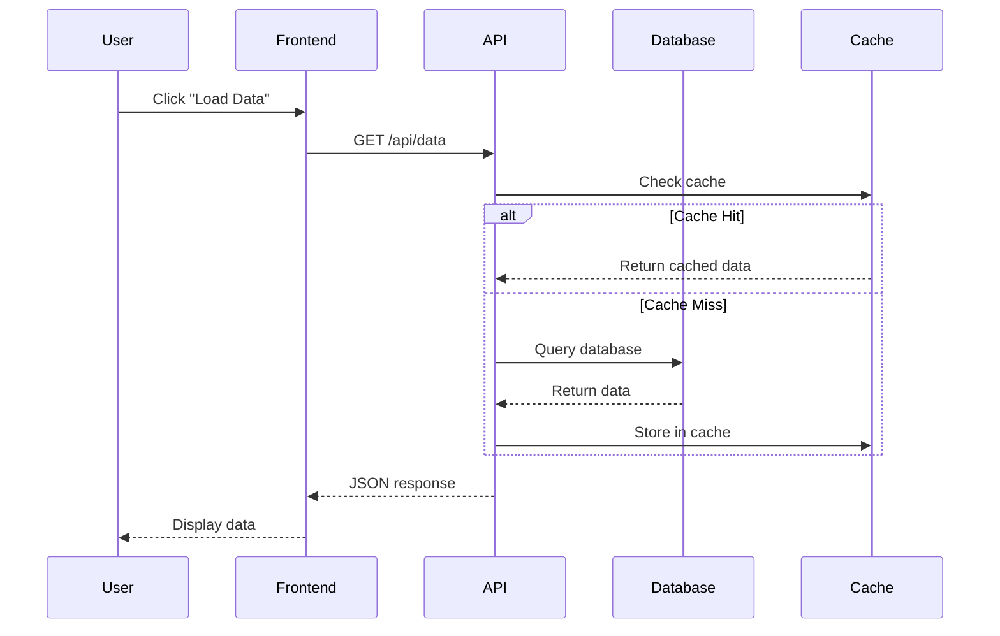

### Authentication Flow

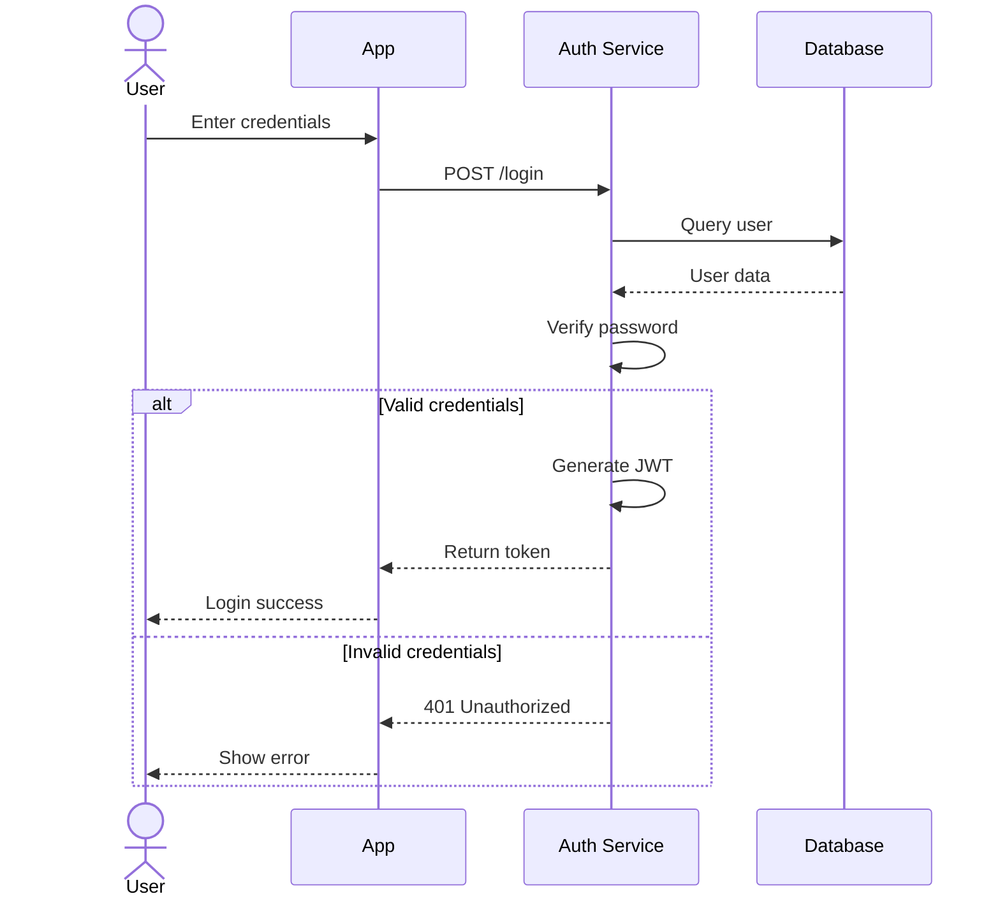

### Microservices Communication

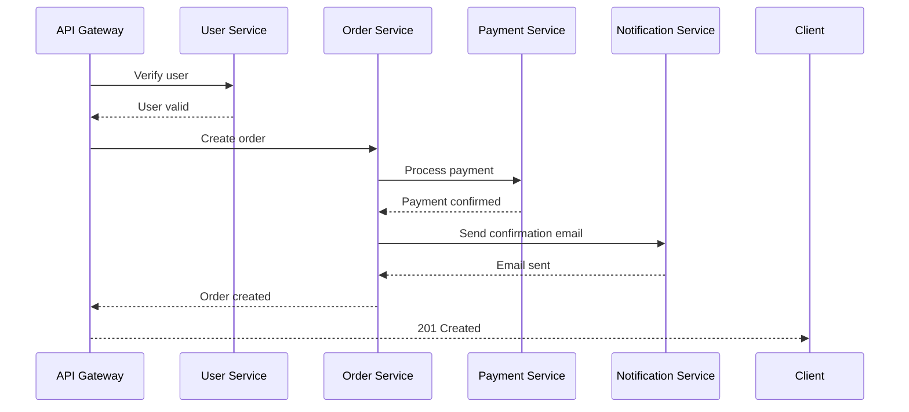

## Class Diagram Examples

### E-commerce System

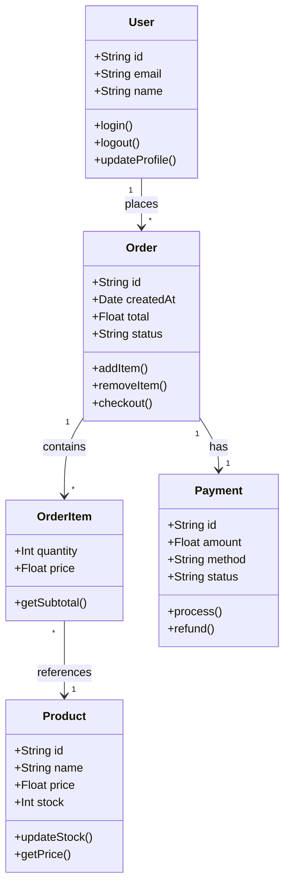

### Blog System

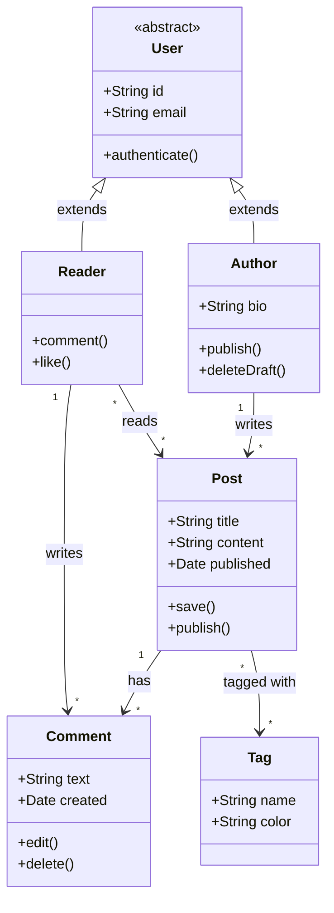

## State Diagram Examples

### Order Status

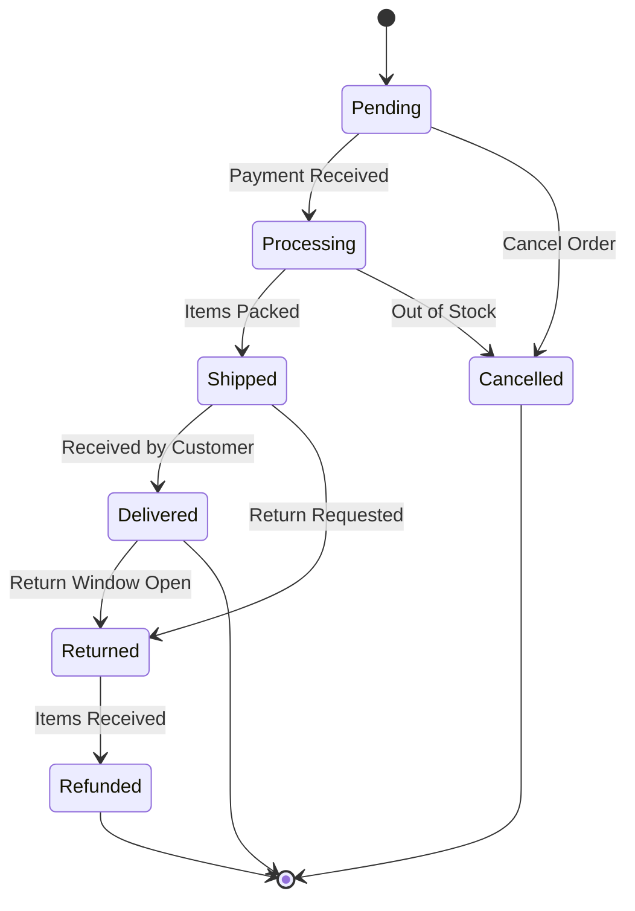

### Connection Status

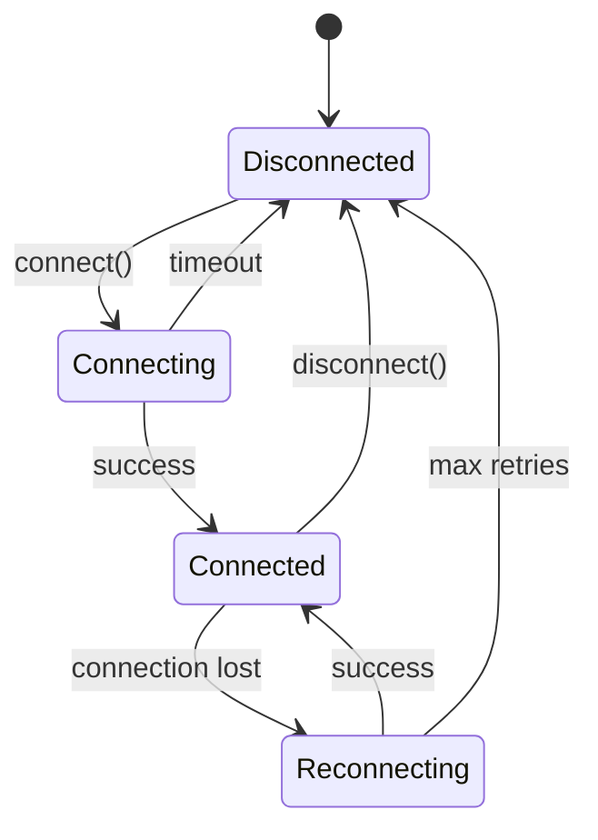

## Entity Relationship Diagram

### Database Schema

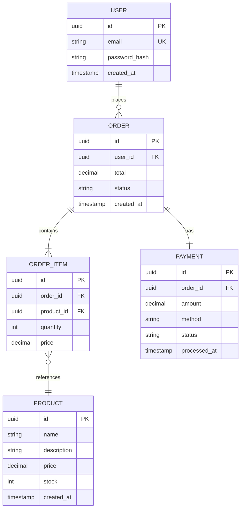

## Gantt Chart Example

### Project Timeline

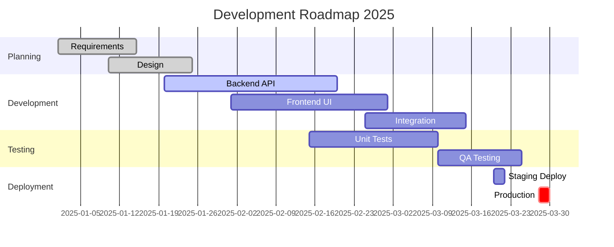

## Pie Chart Example

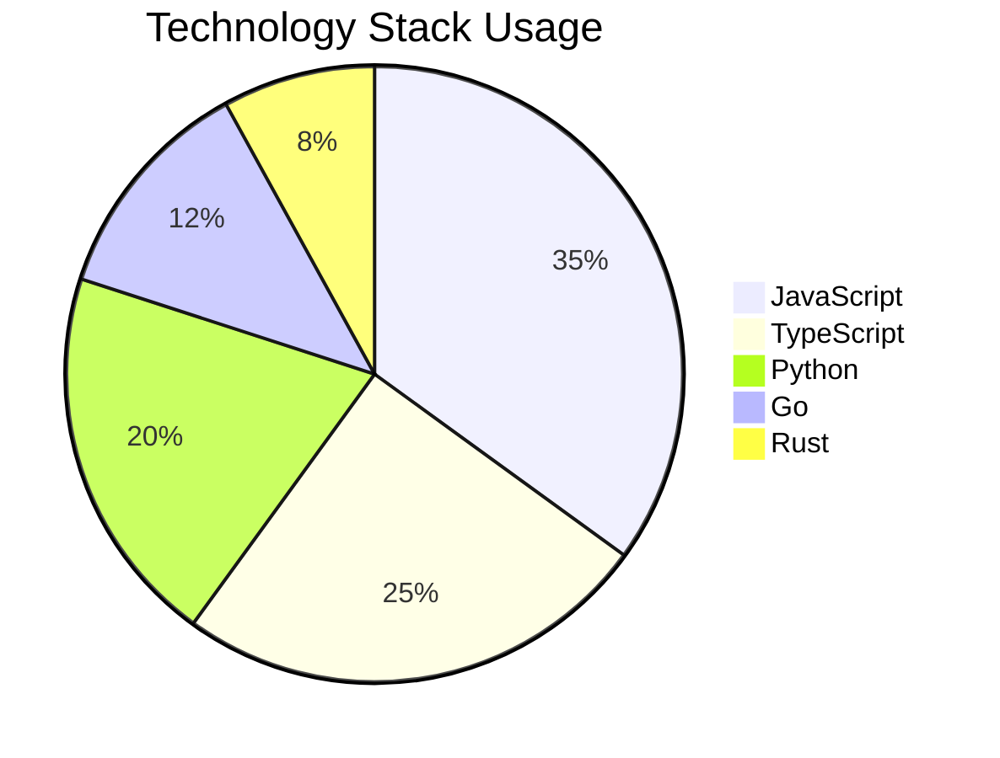

## Git Graph Example

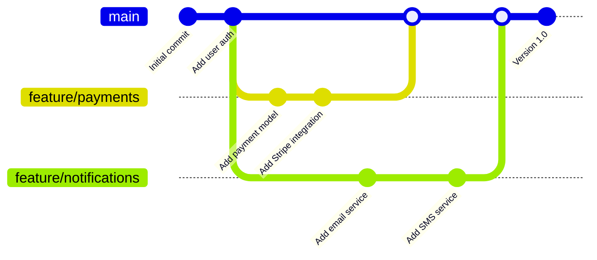

## Journey Map Example

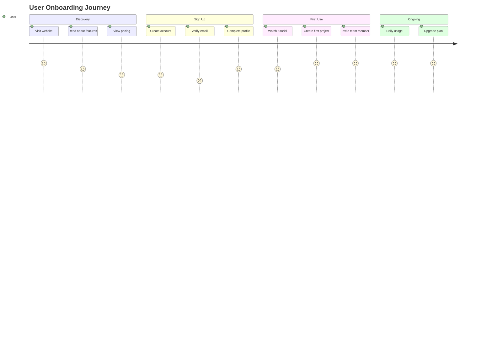

## Styling Tips

### Custom Colors

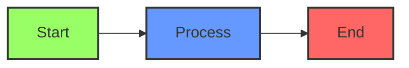

### Custom Themes

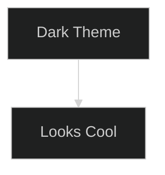

Available themes: `default`, `forest`, `dark`, `neutral`

## Best Practices

### 1. Keep It Simple
- Don't overcrowd diagrams
- Break complex systems into multiple diagrams
- Focus on one aspect at a time

### 2. Use Meaningful Labels
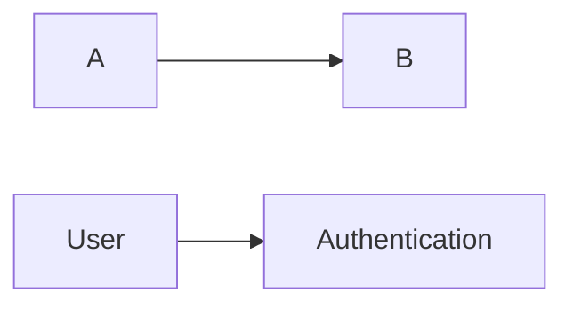

### 3. Follow Conventions
- Top to bottom or left to right flow
- Group related elements
- Use consistent naming

### 4. Add Context
- Include titles
- Add notes where needed
- Provide legends for complex diagrams

## Quick Reference

### Flowchart Shapes
- `[Rectangle]` - Process
- `(Rounded)` - Start/End
- `{Diamond}` - Decision
- `[(Database)]` - Database
- `((Circle))` - Connection point

### Flowchart Arrows
- `-->` - Solid arrow
- `-.->` - Dotted arrow
- `==>` - Thick arrow
- `--text-->` - Arrow with text

### Sequence Diagram
- `->` - Solid line
- `-->` - Dotted line
- `->>` - Arrow
- `-->>` - Dotted arrow
- `-x` - Cross at end
- `--x` - Dotted cross

## ADHD-Friendly Tips

### Start with a Template
Copy a similar diagram and modify it

### Use Mermaid Live Editor
Interactive preview at mermaid.live

### Keep Iterations Quick
1. Draft rough diagram (5 min)
2. Refine structure (5 min)
3. Add styling (5 min)

### Common Patterns Library
Save frequently used diagram patterns

```javascript
// diagram-templates.js
export const API_FLOW = `
sequenceDiagram
    Client->>API: Request
    API->>DB: Query
    DB-->>API: Data
    API-->>Client: Response
`;
```
