# 🧪 Fantastic Engine - Experiments Repository

**Purpose:** A playground for learning, experimenting, and building projects with Claude Code before graduating them to their own repositories.

**Owner:** Has ADHD - Keep instructions clear, concise, and actionable with visual aids.

## Repository Structure


### Folder Purposes

- **`experiments/`** - Quick tests, POCs, and learning exercises. Fail fast, learn faster.
- **`projects/`** - More mature experiments that show promise. These are candidates for graduation.
- **`templates/`** - Starter templates for common project types and environment configs.
- **`docs/`** - MkDocs documentation (auto-published to GitHub Pages).
- **`.claude/`** - Custom subagents, skills, and commands for this repository.

## Workflow

### 1. Starting a New Experiment

```mermaid
flowchart LR
    A[💡 Idea] --> B{Quick test or<br/>Structured project?}
    B -->|Quick| C[experiments/]
    B -->|Structured| D[Copy template]
    C --> E[Create folder]
    D --> E
    E --> F[Setup environment files]
    F --> G[Start coding!]
    G --> H[Document as you go]

    style A fill:#ff00ff,stroke:#00ffff,stroke-width:2px
    style G fill:#00ff00,stroke:#00ffff,stroke-width:2px
    style H fill:#ff69b4,stroke:#00ffff,stroke-width:2px
```



**Quick Start:**

```bash
# For quick experiments
mkdir experiments/my-experiment
cd experiments/my-experiment

# For structured projects
cp -r templates/project-template projects/my-project
cd projects/my-project

# Setup environment (copy appropriate file from templates/env-configs/)
cp ../../templates/env-configs/.nvmrc .  # For Node.js
# OR
cp ../../templates/env-configs/.python-version .  # For Python
# OR copy other env files as needed
```

### 2. Environment Configuration

Each project should have environment configuration files based on its tech stack:

| Tech Stack | Environment File | Setup Command |
|------------|------------------|---------------|
| Node.js | `.nvmrc` | `nvm use` or `nvm install` |
| Python | `.python-version` | `uv venv` or `pyenv install` |
| Deno | `deno.json` | Auto-detected by Deno |
| Rust | `rust-toolchain.toml` | Auto-detected by rustup |
| Ruby | `.ruby-version` | `rbenv install` |
| Go | `go.mod` | Auto-detected by Go |

**When entering a project directory, always check for these files and activate the environment.**

### 3. Documentation Requirements

**⚠️ IMPORTANT: Update MkDocs Configuration When Adding Markdown Files**

Every time you create a new markdown file in this repository:

1. **Create the markdown file** in the appropriate location
2. **Add entry to `mkdocs.yml`** in the `nav` section
3. **Use Mermaid diagrams** for concepts better explained visually
4. **Keep it concise** - ADHD-friendly documentation

**Example mkdocs.yml update:**

```yaml
nav:
  - Home: index.md
  - Experiments:
    - My New Experiment: experiments/my-experiment.md
  - Projects:
    - My Project: projects/my-project.md
```

### 4. Project Documentation Template

Each project should maintain its README.md with:

- **Status badge** (🧪 Experimental, 🚧 In Progress, ✅ Stable, 📦 Graduated)
- **Tech stack** and version
- **Architecture diagram** (use Mermaid!)
- **Environment setup** instructions
- **Dependencies** list
- **Learning log** - what you learned, challenges, next steps
- **Graduation criteria** - checklist for when it's ready to move

### 5. Graduating a Project

When a project is ready to move to its own repository:


**Steps:**
1. Verify graduation criteria met
2. Create new repository
3. Copy project files (git history can be preserved with filter-branch if needed)
4. Move project to `projects/graduated/` and mark as 📦 Graduated
5. Update documentation with link to new repository

## Custom Claude Code Tools

This repository includes custom subagents and skills optimized for ADHD-friendly workflows.

### Available Subagents (.claude/agents/)

- **`learn-assistant`** - Helps break down new concepts into digestible chunks
- **`experiment-guide`** - Guides you through setting up and running experiments
- **`brainstorm-buddy`** - Facilitates brainstorming with structured thinking
- **`doc-writer`** - Creates clear, concise, visual documentation

### Available Skills (.claude/skills/)

- (Skills will be added as needed)

### Using Subagents

```bash
# In Claude Code, mention the subagent in your prompt
"Hey @learn-assistant, help me understand how async/await works in Rust"
```

## MkDocs Configuration

**Theme:** Cyberpunk-inspired dark theme

**Auto-publishing:** Docs are automatically built and published to GitHub Pages on every push to main branch.

**Local preview:**

```bash
# Install mkdocs
pip install mkdocs-material mkdocs-mermaid2-plugin

# Serve locally
mkdocs serve

# Open http://localhost:8000
```

## Best Practices for ADHD-Friendly Development

### ✅ Do

- **Break tasks into small steps** - Use checklists liberally
- **Document immediately** - Don't wait until "later"
- **Use visual aids** - Mermaid diagrams, flowcharts, graphs
- **Time-box experiments** - Set a timer for 30-60 minutes
- **Celebrate small wins** - Mark tasks complete, update status badges
- **Keep focus visible** - Use TODO comments, GitHub issues

### ❌ Avoid

- **Starting multiple experiments simultaneously** - Finish or pause one first
- **Perfectionism** - Done is better than perfect for experiments
- **Scope creep** - Stick to the original experiment goal
- **Analysis paralysis** - Time-box research, then start coding

## Quick Reference Commands

```bash
# Create new experiment
mkdir experiments/my-test && cd experiments/my-test

# Create new project from template
cp -r templates/project-template projects/my-project

# Preview documentation
mkdocs serve

# Build documentation
mkdocs build

# Activate Node environment
nvm use

# Activate Python environment
uv venv && source .venv/bin/activate

# Check all project statuses
grep -r "Status:" experiments/*/README.md projects/*/README.md
```

## Repository Metadata

- **Created:** 2025-11-04
- **Purpose:** Learning and experimentation playground
- **Deployment:** Documentation auto-published to GitHub Pages
- **Maintenance:** Keep mkdocs.yml updated with all markdown files

---

**Remember:** This is a playground. Experiment freely, fail fast, learn faster, and graduate the winners! 🚀
