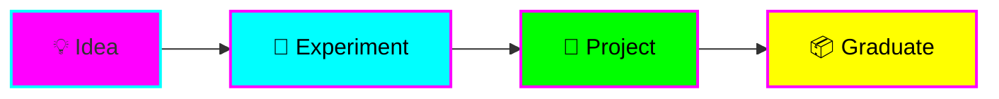

# 🌟 Fantastic Engine

**A playground for experiments, learning, and project incubation with Claude Code.**

## What is This?

Fantastic Engine is a multi-language, multi-project repository designed for rapid experimentation and learning. Think of it as a personal lab where ideas can grow from quick tests to production-ready projects.



## Quick Start

```bash
# Create a quick experiment
mkdir experiments/my-test
cd experiments/my-test

# Or use the project template
cp -r templates/project-template projects/my-project

# View documentation
mkdocs serve
```

## Features

- 🧪 **Multi-language support** - Node.js, Python, Deno, Rust, Go, Ruby, and more
- 🤖 **Custom Claude agents** - ADHD-optimized AI assistants for learning, experimenting, and documenting
- 📚 **Auto-published docs** - GitHub Pages with cyberpunk theme
- 🎯 **ADHD-friendly** - Clear structure, visual aids, time-boxing, progress tracking
- 🚀 **Rapid iteration** - Templates, examples, and quick-start guides

## Documentation

📖 **[Full Documentation](https://angelcantugr.github.io/fantastic-engine/)** - Published on GitHub Pages

📋 **[CLAUDE.md](CLAUDE.md)** - Complete guide for Claude Code (read this for full context)

## Repository Structure

```
fantastic-engine/
├── experiments/     # Quick tests and POCs
├── projects/        # Mature experiments
├── templates/       # Starter templates
├── docs/            # MkDocs documentation
└── .claude/         # Custom Claude agents
```

## Custom Claude Agents

- 🎓 **learn-assistant** - Break down complex concepts
- 🧪 **experiment-guide** - Guide through experiments
- 💭 **brainstorm-buddy** - Facilitate brainstorming
- 📝 **doc-writer** - Create documentation

See [.claude/README.md](.claude/README.md) for usage.

## Philosophy

> **Experiment freely, fail fast, learn faster, graduate the winners.**

This repository embraces:
- Rapid iteration over perfection
- Documentation as learning tool
- Visual thinking for clarity
- Small wins for momentum
- Graduation when ready

## Getting Started

1. Read [CLAUDE.md](CLAUDE.md) for the complete guide
2. Browse [templates/](templates/) for boilerplate
3. Check the [documentation](https://angelcantugr.github.io/fantastic-engine/)
4. Start experimenting! 🚀

## License

MIT License - See [LICENSE](LICENSE) for details

---

**Built with Claude Code** ⚡
