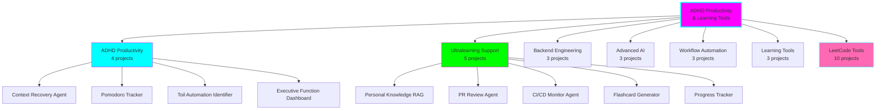
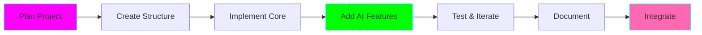

# 🎯 ADHD Productivity & Learning Tools - Master Roadmap

**Status:** 🚧 In Progress
**Created:** 2025-11-16
**Purpose:** Comprehensive suite of tools to support ADHD productivity, ultralearning, and technical skill development

## Overview

This roadmap encompasses 31 projects across 7 categories, designed to create an integrated ecosystem for productive learning and development with ADHD-friendly features.

## Project Categories & Status

### 🎯 Tier 1: ADHD Productivity Tools (High ROI)

| # | Project | Status | Location | Description |
|---|---------|--------|----------|-------------|
| 1 | Context Recovery Agent | 🚧 In Progress | `projects/context-recovery-agent` | AI agent that helps resume work after interruptions |
| 2 | Pomodoro + Time-Boxing Tracker | 🚧 In Progress | `projects/pomodoro-tracker` | Smart timer tracking time-boxed sessions with analytics |
| 3 | Toil Automation Identifier | 🚧 In Progress | `projects/toil-automation-identifier` | Analyzes git history to identify repetitive tasks |
| 4 | ADHD Executive Function Dashboard | 🚧 In Progress | `projects/executive-function-dashboard` | Visual dashboard for tasks, energy, focus patterns |

### 📚 Tier 2: Ultralearning Support Tools

| # | Project | Status | Location | Description |
|---|---------|--------|----------|-------------|
| 5 | Personal Knowledge RAG System | 🚧 In Progress | `projects/personal-knowledge-rag` | Search Obsidian vault with natural language (OpenAI + Ollama) |
| 6 | PR Review Agent | 🚧 In Progress | `projects/pr-review-agent` | AI agent reviewing PRs with intelligent feedback |
| 7 | CI/CD Monitor Agent | 🚧 In Progress | `projects/cicd-monitor-agent` | Monitors pipelines and provides smart notifications |
| 8 | Flashcard Generator | 🚧 In Progress | `projects/flashcard-generator` | Auto-generates Anki flashcards from Obsidian notes |
| 9 | Ultralearning Progress Tracker | 🚧 In Progress | `projects/ultralearning-tracker` | Visualizes progress across all ultralearning projects |

### 🔧 Tier 3: Backend Engineering Practice

| # | Project | Status | Location | Description |
|---|---------|--------|----------|-------------|
| 10 | Scalable URL Shortener | 🚧 In Progress | `projects/url-shortener` | High-performance URL shortener with caching |
| 11 | Real-Time Chat System | 🚧 In Progress | `projects/realtime-chat` | WebSocket chat with message persistence |
| 12 | GraphQL API with Subscriptions | 🚧 In Progress | `projects/graphql-api` | GraphQL server with real-time subscriptions |

### 🤖 Tier 4: Advanced AI Projects

| # | Project | Status | Location | Description |
|---|---------|--------|----------|-------------|
| 13 | Multi-Agent SDLC Orchestra | 🚧 In Progress | `projects/multi-agent-sdlc` | Coordinated agents for code review → testing → deployment |
| 14 | Production Guardian Agent | 🚧 In Progress | `projects/production-guardian` | Monitors logs and takes automated remediation |
| 15 | Self-Improving Agent | 🚧 In Progress | `projects/self-improving-agent` | Agent that learns from feedback and adjusts |

### ⚡ Tier 5: Workflow Automation

| # | Project | Status | Location | Description |
|---|---------|--------|----------|-------------|
| 16 | Obsidian-TickTick Sync | 🚧 In Progress | `projects/obsidian-ticktick-sync` | Bidirectional sync between Obsidian and TickTick |
| 17 | Daily Note Generator | 🚧 In Progress | `projects/daily-note-generator` | Auto-generates daily notes with context |
| 18 | Meeting Notes Processor | 🚧 In Progress | `projects/meeting-notes-processor` | Converts recordings to structured notes |

### 🧠 Tier 6: Learning & Experimentation

| # | Project | Status | Location | Description |
|---|---------|--------|----------|-------------|
| 19 | LangGraph Pattern Library | 🚧 In Progress | `projects/langgraph-patterns` | Collection of reusable LangGraph patterns |
| 20 | Cost Optimization Analyzer | 🚧 In Progress | `projects/cost-optimizer` | Analyzes OpenAI usage and suggests optimizations |
| 21 | Experiment Tracking Dashboard | 🚧 In Progress | `projects/experiment-tracker` | Tracks ADHD productivity experiments |

### 💻 Tier 7: LeetCode Learning Tools

| # | Project | Status | Location | Description |
|---|---------|--------|----------|-------------|
| 22 | Solution Explainer Agent | 🚧 In Progress | `projects/leetcode-explainer` | Explains solutions in multiple ways |
| 23 | Pattern Recognition Trainer | 🚧 In Progress | `projects/leetcode-pattern-trainer` | Teaches algorithmic pattern recognition |
| 24 | Session Analyzer | 🚧 In Progress | `projects/leetcode-session-analyzer` | Analyzes practice sessions for insights |
| 25 | Code Trace Visualizer | 🚧 In Progress | `projects/leetcode-trace-visualizer` | Step-by-step execution traces |
| 26 | Progressive Hint System | 🚧 In Progress | `projects/leetcode-hints` | Hints with progressive disclosure |
| 27 | Similar Problems Generator | 🚧 In Progress | `projects/leetcode-similar-problems` | Generates problem variations |
| 28 | Study Plan Generator | 🚧 In Progress | `projects/leetcode-study-planner` | Creates personalized study plans |
| 29 | Mistake Pattern Analyzer | 🚧 In Progress | `projects/leetcode-mistake-analyzer` | Analyzes mistakes to identify patterns |
| 30 | Pair Programming Bot | 🚧 In Progress | `projects/leetcode-pair-bot` | AI pair programming partner |
| 31 | Streak & Gamification | 🚧 In Progress | `projects/leetcode-gamification` | Gamifies practice with streaks |

## Technology Stack

### AI/ML
- **OpenAI API** (GPT-4, GPT-3.5-turbo, Embeddings)
- **Ollama** (Local LLMs - Llama 3, Mistral, CodeLlama)
- **LangChain / LangGraph** (Agent orchestration)
- **Chroma / Qdrant** (Vector databases)

### Backend
- **Python** (FastAPI, Flask)
- **Node.js** (Express, NestJS)
- **PostgreSQL** (Primary database)
- **Redis** (Caching, pub/sub)
- **Kafka** (Message queuing)

### Frontend/CLI
- **Rich** (Terminal UIs)
- **Typer** (CLI framework)
- **React** (Web dashboards - where needed)

### Integrations
- **Obsidian** (Markdown files)
- **TickTick MCP** (Local server)
- **GitHub API** (PR reviews, CI/CD)
- **Anki** (Flashcards)

## Development Workflow

### Phase 1: Foundation (Weeks 1-2)
1. Set up project structures
2. Create base templates
3. Implement core utilities
4. Set up integrations (OpenAI, Ollama, TickTick)

### Phase 2: ADHD Tools (Weeks 3-4)
- Context Recovery Agent
- Pomodoro Tracker
- Executive Function Dashboard
- Toil Automation Identifier

### Phase 3: Learning Tools (Weeks 5-8)
- Personal Knowledge RAG
- Flashcard Generator
- LeetCode core tools (Explainer, Pattern Trainer, Session Analyzer)

### Phase 4: Workflow Automation (Weeks 9-10)
- Obsidian-TickTick Sync
- Daily Note Generator
- Meeting Notes Processor

### Phase 5: Advanced AI (Weeks 11-14)
- Multi-Agent SDLC
- Production Guardian
- Self-Improving Agent
- Remaining LeetCode tools

### Phase 6: Backend Practice (Weeks 15-18)
- URL Shortener
- Real-Time Chat
- GraphQL API

### Phase 7: Polish & Integration (Weeks 19-20)
- Cross-tool integrations
- Documentation
- Testing
- Deployment

## Success Metrics

### ADHD Productivity
- ✅ Context recovery time reduced by 50%
- ✅ Daily task completion rate increased
- ✅ Time-boxing adherence improved
- ✅ Toil tasks identified and automated

### Learning Effectiveness
- ✅ LeetCode pattern recognition speed improved
- ✅ Knowledge retention (flashcard success rate)
- ✅ Study plan adherence
- ✅ Ultralearning project completion

### Technical Skills
- ✅ Backend projects completed and deployed
- ✅ AI agent patterns mastered
- ✅ Production-ready code quality

## Next Steps

1. ✅ Create master roadmap (this document)
2. 🚧 Set up project templates
3. 🚧 Implement Context Recovery Agent (highest ROI)
4. 🚧 Build Pomodoro Tracker
5. 🚧 Create Executive Function Dashboard

## Resources

- [CLAUDE.md](../CLAUDE.md) - Repository guidelines
- [OpenAI API Docs](https://platform.openai.com/docs)
- [LangGraph Docs](https://langchain-ai.github.io/langgraph/)
- [Ollama Models](https://ollama.ai/library)

---

**Last Updated:** 2025-11-16
**Maintainer:** ADHD-friendly development practices applied throughout
