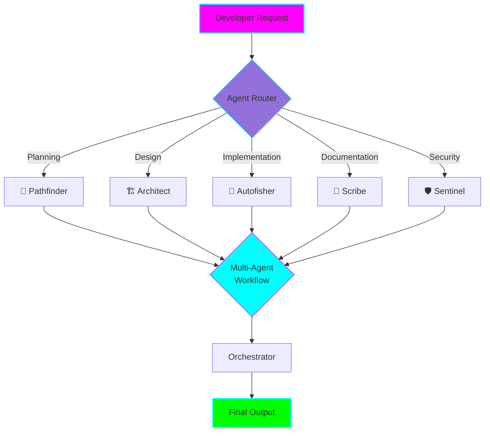

# AI Kit: Gamified Agent System

**Status:** 🧪 Experimental
**Created:** 2025-11-05
**Location:** `experiments/ai-kit-gamified-agents/`

## Overview

An experiment exploring building an **AI Agent Kit** based on the "Beyond Code Generation" gamified approach. Instead of a single AI assistant, this creates specialized agent personas that collaborate throughout the development lifecycle.

## Core Concept



## The Five Agent Personas

| Agent | Role | Emoji | Primary Use Cases |
|-------|------|-------|-------------------|
| **Pathfinder** | Navigation & Planning | 🧭 | Project planning, debugging, tech selection |
| **Architect** | System Design | 🏗️ | Architecture design, patterns, scalability |
| **Autofisher** | Code Implementation | 🎣 | Feature implementation, refactoring |
| **Scribe** | Documentation | 📝 | Docs, API references, comments |
| **Sentinel** | Security & Quality | 🛡️ | Security review, vulnerability detection |

## Solution Approaches

Five different implementation approaches, ranging from simple to complex:

### 1. Claude Code Subagents 🟢

**Complexity:** Low-Medium | **Time:** 2-4 hours

Implement agents as Claude Code subagent files in `.claude/agents/`. Quickest way to start experimenting.

**Status:** ✅ **Ready to use**

**Pros:**
- Minimal setup
- Works within existing Claude Code
- Easy to iterate

**Cons:**
- Manual agent selection
- No automation
- No persistent state

[View Implementation →](../../experiments/ai-kit-gamified-agents/solution-1-claude-subagents/)

### 2. Python CLI 🟡

**Complexity:** Medium | **Time:** 1-2 weeks

Build a CLI tool that orchestrates multiple AI agents using the Anthropic API.

**Pros:**
- Scriptable and automatable
- Works in CI/CD
- Persistent conversations

**Cons:**
- Requires API configuration
- No GUI

[View Implementation Details →](../../experiments/ai-kit-gamified-agents/README.md#solution-2-python-cli-with-agent-framework-)

### 3. Multi-Agent Framework (CrewAI) 🟡

**Complexity:** Medium | **Time:** 1-2 weeks

Use CrewAI or LangGraph for advanced agent collaboration and autonomous workflows.

**Pros:**
- Autonomous workflows
- Built-in delegation
- Parallel execution

**Cons:**
- Steeper learning curve
- Less control
- Higher API costs

[View Implementation Details →](../../experiments/ai-kit-gamified-agents/README.md#solution-3-multi-agent-framework-crewailang graph-)

### 4. Web Dashboard 🟠

**Complexity:** Medium-High | **Time:** 2-4 weeks

Interactive web interface with real-time agent collaboration.

**Pros:**
- Intuitive UI
- Team collaboration
- Rich analytics

**Cons:**
- Significant dev effort
- Requires hosting
- More complex deployment

[View Implementation Details →](../../experiments/ai-kit-gamified-agents/README.md#solution-4-interactive-web-dashboard-)

### 5. VSCode Extension 🔴

**Complexity:** High | **Time:** 4-8 weeks

Deep IDE integration with context-aware assistance.

**Pros:**
- Seamless workflow
- Rich context awareness
- No context switching

**Cons:**
- Complex development
- VSCode-specific
- High maintenance

[View Implementation Details →](../../experiments/ai-kit-gamified-agents/README.md#solution-5-vscode-extension-)

## Quick Start

### Try Solution 1 (Recommended)

The fastest way to experiment with gamified agents:

1. Navigate to the solution directory:
   ```bash
   cd experiments/ai-kit-gamified-agents/solution-1-claude-subagents
   ```

2. Start Claude Code:
   ```bash
   claude
   ```

3. Use agents by mentioning them:
   ```
   "@pathfinder, I need to build a REST API for user authentication"
   ```

## Example Workflow

```
# 1. Planning
"@pathfinder, I want to add OAuth login to my app"
→ Pathfinder provides step-by-step plan

# 2. Design
"@architect, based on this plan, design the OAuth system"
→ Architect provides architecture and data models

# 3. Implementation
"@autofisher, implement the OAuth middleware based on this design"
→ Autofisher writes the code

# 4. Security Review
"@sentinel, review this OAuth implementation for security issues"
→ Sentinel performs security audit

# 5. Documentation
"@scribe, document the OAuth system with setup guide and API reference"
→ Scribe creates comprehensive documentation
```

## Comparative Analysis

| Criteria | Solution 1 | Solution 2 | Solution 3 | Solution 4 | Solution 5 |
|----------|:----------:|:----------:|:----------:|:----------:|:----------:|
| **Time to MVP** | ⭐⭐⭐⭐⭐ | ⭐⭐⭐⭐ | ⭐⭐⭐ | ⭐⭐ | ⭐ |
| **Ease of Use** | ⭐⭐⭐⭐ | ⭐⭐⭐ | ⭐⭐ | ⭐⭐⭐⭐⭐ | ⭐⭐⭐⭐ |
| **Automation** | ⭐⭐ | ⭐⭐⭐⭐ | ⭐⭐⭐⭐⭐ | ⭐⭐⭐ | ⭐⭐⭐ |
| **Flexibility** | ⭐⭐⭐⭐⭐ | ⭐⭐⭐⭐ | ⭐⭐⭐ | ⭐⭐⭐ | ⭐⭐⭐ |
| **Context Awareness** | ⭐⭐⭐ | ⭐⭐ | ⭐⭐⭐ | ⭐⭐ | ⭐⭐⭐⭐⭐ |
| **Team Collaboration** | ⭐⭐ | ⭐⭐ | ⭐⭐ | ⭐⭐⭐⭐⭐ | ⭐⭐ |

## Benefits

### Increased Productivity
- Specialized agents handle domain-specific tasks more effectively
- Reduced context-switching between different types of work
- Faster iteration cycles through focused agent expertise

### Enhanced Code Quality
- Multiple specialized reviews from different agent perspectives
- Consistent application of best practices per domain
- Proactive identification of potential issues

### Improved Developer Experience
- More engaging and less repetitive work
- Clear guidance on which agent to use for specific tasks
- Reduced cognitive load through specialized assistance

## Learning Log

### 2025-11-05: Experiment Setup
- ✅ Created experiment structure
- ✅ Documented 5 solution approaches
- ✅ Implemented Solution 1 (Claude Code Subagents)
- ✅ Created all 5 agent personas with detailed prompts
- ⏳ Testing with real use cases (pending)

### Key Learnings

- Agent personas make AI assistance more intuitive
- Different solutions serve different use cases
- Start simple, expand based on proven value
- Context awareness is critical for quality

## Graduation Criteria

This experiment is ready to graduate when:

- [ ] All 5 agents implemented and tested
- [ ] At least 10 real-world use cases documented
- [ ] Positive feedback from 3+ users
- [ ] Clear ROI demonstrated (time saved, quality improved)
- [ ] Comprehensive documentation created
- [ ] Decision made on which solution to productionize

## Resources

- [Full Experiment Documentation](../../experiments/ai-kit-gamified-agents/README.md)
- [Solution 1: Claude Code Subagents](../../experiments/ai-kit-gamified-agents/solution-1-claude-subagents/)
- [Anthropic Claude API Docs](https://docs.anthropic.com/)
- [CrewAI Documentation](https://docs.crewai.com/)

## Next Steps

1. **Try Solution 1** - Start with Claude Code subagents
2. **Test Each Agent** - Validate with real use cases
3. **Gather Feedback** - Document what works and what doesn't
4. **Iterate** - Refine agent prompts based on results
5. **Decide Next Phase** - Choose which solution to expand to

---

**Maintainer:** Your Name
**Last Updated:** 2025-11-05
**Status:** 🧪 Ready for testing
