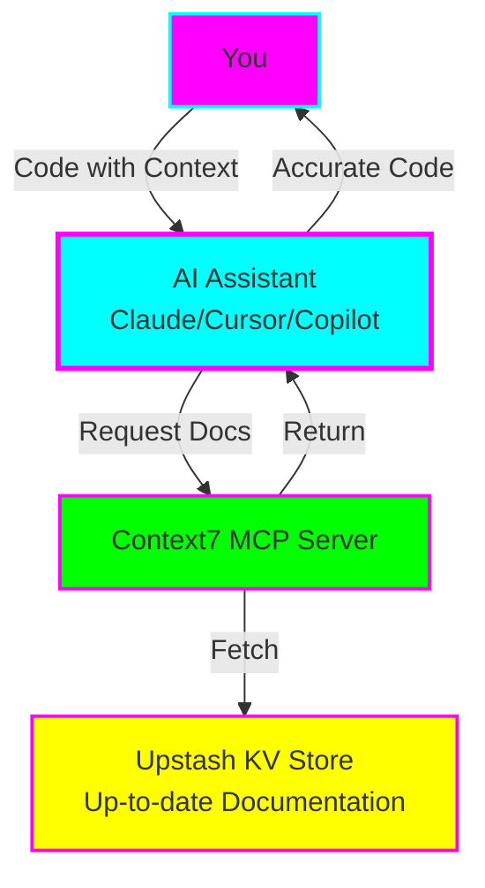
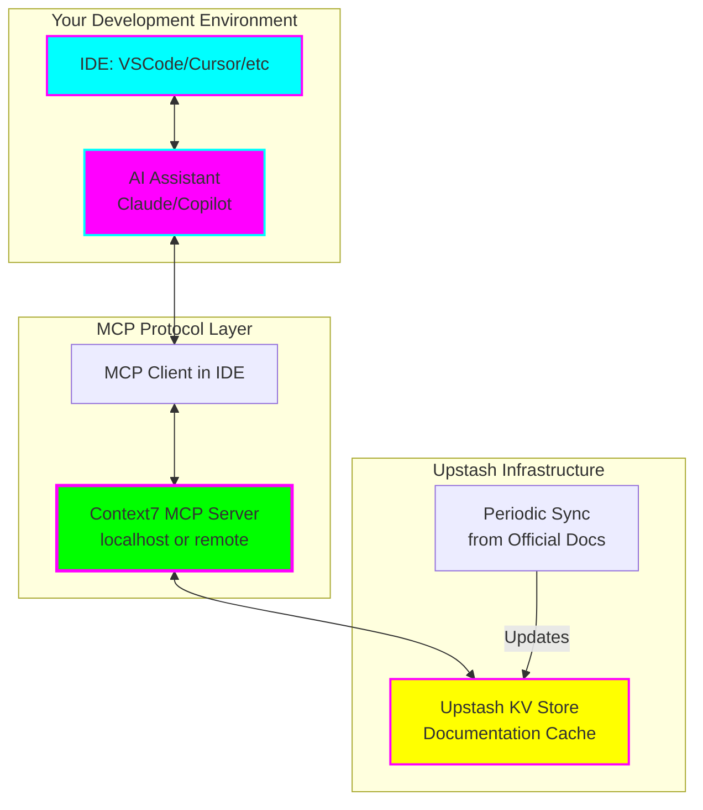

# 📚 Context7 MCP Server Experiment

**Status:** 🧪 Experimental
**Created:** 2025-11-05
**Location:** [`/experiments/context7-mcp-experiment/`](https://github.com/AngelCantugr/fantastic-engine/tree/main/experiments/context7-mcp-experiment)

---

## Overview

An experiment to improve AI-assisted coding by using **Context7 MCP Server** to provide real-time, up-to-date library documentation to AI assistants, eliminating outdated code suggestions and hallucinations.



---

## What is Context7?

Context7 is a specialized Model Context Protocol (MCP) server developed by Upstash that addresses one of the biggest challenges in AI-assisted coding: **outdated documentation**.

### Key Benefits

- **No More Outdated Examples** - Documentation is kept current automatically
- **Version-Specific Context** - Get docs for the exact library version you're using
- **Reduced Hallucinations** - AI grounded in factual, current information
- **Persistent Memory** - Context retained across sessions (no re-explaining)
- **Lower Token Costs** - Efficient context retrieval vs. repeated full context
- **Multi-Library Support** - Works with any library/framework documentation

---

## Experiment Goals

This experiment aims to answer:

1. **Does Context7 reduce outdated code suggestions?**
2. **How much faster is development with up-to-date docs?**
3. **Does it work better for certain types of tasks?**
4. **Is the setup effort worth the benefit?**

### Methodology

- **Duration:** 2 weeks minimum
- **Tasks:** 15+ coding tasks across different libraries
- **Comparison:** A/B testing (with vs without Context7)
- **Libraries:** React, Next.js, TypeScript, Tailwind CSS, and more
- **Metrics:** Time, accuracy, errors, token usage, satisfaction

---

## Quick Start

### 5-Minute Setup

1. **Create Upstash Account** (free tier)
   - Go to [upstash.com](https://upstash.com)
   - Create a Redis database
   - Copy credentials

2. **Install Context7**
   ```bash
   npm install -g @upstash/context7-mcp-server
   ```

3. **Configure AI Assistant**
   - Add MCP server configuration
   - Use your Upstash credentials
   - Restart your AI tool

4. **Test It**
   ```
   "Using Context7, fetch the latest React 18.3 documentation
   for the useTransition hook and show me a complete example."
   ```

**[Full setup guide →](https://github.com/AngelCantugr/fantastic-engine/blob/main/experiments/context7-mcp-experiment/QUICKSTART.md)**

---

## Resources

### Experiment Documentation

- **[README.md](https://github.com/AngelCantugr/fantastic-engine/blob/main/experiments/context7-mcp-experiment/README.md)** - Complete experiment overview, architecture, and methodology
- **[QUICKSTART.md](https://github.com/AngelCantugr/fantastic-engine/blob/main/experiments/context7-mcp-experiment/QUICKSTART.md)** - Get started in 15 minutes
- **[PROMPT-LIBRARY.md](https://github.com/AngelCantugr/fantastic-engine/blob/main/experiments/context7-mcp-experiment/PROMPT-LIBRARY.md)** - 120+ optimized prompts for Context7
- **[METRICS.md](https://github.com/AngelCantugr/fantastic-engine/blob/main/experiments/context7-mcp-experiment/METRICS.md)** - Tracking templates and analysis tools
- **[config.example.json](https://github.com/AngelCantugr/fantastic-engine/blob/main/experiments/context7-mcp-experiment/config.example.json)** - Configuration template

### External Resources

- [Context7 Official Documentation](https://upstash.com/docs/context7)
- [Model Context Protocol](https://modelcontextprotocol.io/)
- [MCP Servers Repository](https://github.com/modelcontextprotocol/servers)

---

## Prompt Examples

### Basic Usage

```
"Using Context7, fetch the latest Next.js 14 documentation for
server-side data fetching and show me the recommended pattern."
```

### Version Migration

```
"Using Context7, compare React 17 vs React 18.3 documentation
for data fetching. Show me how to migrate this useEffect + fetch
code to Suspense + use() hook pattern."
```

### Library Comparison

```
"Using Context7, fetch documentation for both Zod and Yup's
latest versions and compare their TypeScript integration
capabilities."
```

### Debugging

```
"This error suggests a deprecated API. Check Context7 for the
latest [library] documentation and tell me what replaced this
deprecated method."
```

**[See 120+ more prompts →](https://github.com/AngelCantugr/fantastic-engine/blob/main/experiments/context7-mcp-experiment/PROMPT-LIBRARY.md)**

---

## Success Criteria

Before graduating or archiving this experiment:

- [ ] Complete 15+ tasks with metrics tracked
- [ ] Document clear ROI (time/money saved)
- [ ] Create library of optimized prompts
- [ ] Identify 5+ ideal use cases
- [ ] Identify 3+ poor use cases
- [ ] Test with 3+ different libraries
- [ ] Evaluate token cost savings
- [ ] Create troubleshooting guide
- [ ] Make final recommendation: Adopt, Archive, or Graduate

---

## Architecture



---

## Expected Outcomes

### Potential Benefits

- ⏱️ **Time Savings:** Reduced debugging from outdated patterns
- 🎯 **Accuracy:** Fewer errors from deprecated APIs
- 🧠 **Context Retention:** Less need to repeat context
- 📚 **Learning:** Exposure to current best practices
- 💰 **Cost Efficiency:** Potentially lower token usage

### Potential Limitations

- ⚙️ **Setup Complexity:** Initial configuration required
- 🔌 **Dependency:** Requires external service (Upstash)
- 📦 **Library Coverage:** Not all libraries may be covered
- 🐌 **Latency:** Additional request time for documentation
- 💵 **Cost:** Potential Upstash costs at scale

---

## Timeline

### Week 1: Baseline & Initial Testing

- Days 1-3: Complete 5 tasks **without** Context7 (baseline)
- Days 4-7: Complete 5 tasks **with** Context7 (comparison)

### Week 2: Advanced Testing & Analysis

- Days 8-10: Advanced scenarios (multi-library, migrations, debugging)
- Days 11-14: Analysis, documentation, final recommendation

---

## Metrics to Track

| Metric | Baseline | With Context7 | Improvement |
|--------|----------|---------------|-------------|
| Avg Time per Task | ___ min | ___ min | ___% |
| Avg Errors per Task | ___ | ___ | ___% |
| Outdated Suggestions | ___ | ___ | ___% |
| Satisfaction (1-10) | ___ | ___ | ___% |
| Token Usage | ___ | ___ | ___% |

**[Full metrics template →](https://github.com/AngelCantugr/fantastic-engine/blob/main/experiments/context7-mcp-experiment/METRICS.md)**

---

## ADHD-Friendly Tips

- ⏱️ **Time-box sessions:** 45 min max, then break
- ✅ **One task at a time:** Don't parallel test multiple things
- 📊 **Visual tracking:** Use checkboxes liberally
- 🎯 **Quick wins first:** Start with simple tasks for momentum
- 🔔 **Set reminders:** Review experiment log every 2-3 days
- 🎉 **Celebrate progress:** Mark completed tasks immediately

---

## Contributing

Found a great prompt pattern? Discovered an optimal use case? Add your findings to the experiment documentation!

---

## Status Updates

- **2025-11-05** - Experiment created and documented
- _Track progress here as you go_

---

## Related Experiments

- [Goose Documentation Management](./goose-doc-management.md) - Another MCP experiment focused on documentation workflows
- [AI Kit Gamified Agents](./ai-kit-gamified-agents.md) - Exploring AI agent architectures

---

**Ready to start?** [Jump to Quick Start →](https://github.com/AngelCantugr/fantastic-engine/blob/main/experiments/context7-mcp-experiment/QUICKSTART.md)
