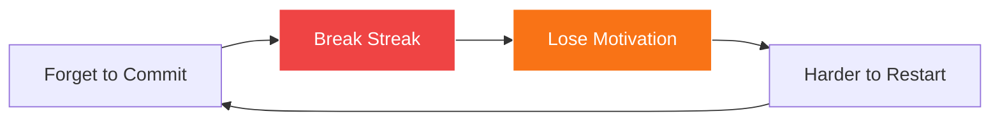
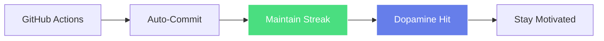

# 📈 GitHub Streak Saver Bot

**Quick Win Experiment | Deno + GitHub Actions**

## Overview

Never break your GitHub streak again! Automatically commits daily learning notes to keep those green squares flowing.

## The ADHD Struggle



## The Solution



## Quick Start

```bash
# Navigate to experiment
cd experiments/github-streak-saver

# Test locally
deno task generate

# Check the generated note
ls -l notes/
```

## How It Works

**Every day at 10 PM UTC:**
1. GitHub Actions triggers
2. Deno script generates a learning note
3. Bot commits and pushes
4. Your contribution graph stays green! 🎉

## Setup

### 1. Enable GitHub Actions

Go to Settings → Actions → General
- ✅ Enable "Read and write permissions"

### 2. Customize Schedule (Optional)

Edit `.github/workflows/daily-note.yml`:
```yaml
schedule:
  - cron: '0 22 * * *'  # 10 PM UTC
```

Use [crontab.guru](https://crontab.guru/) to customize.

### 3. Test Manual Run

Actions tab → Daily Learning Note → Run workflow

## Note Format

Auto-generated notes include:
- 📅 Date and day of week
- 😊 Mood emoji
- ⭐ Focus level (1-10)
- 📝 Random learning topics
- 💡 Key insights
- ✅ Next steps

## Features

**Automated**
- Runs daily without thinking
- No manual intervention needed
- Idempotent (safe to run multiple times)

**Customizable**
- Change topics pool
- Adjust note template
- Set your own schedule

**Bonus**
- Weekly summaries on Sundays
- Mood and focus tracking
- Learning pattern analysis

## Time Investment

```mermaid
gantt
    title 4-6 Hour Timeline
    dateFormat  HH:mm
    section Setup
    Install Deno                :00:00, 30m
    Build note generator        :00:30, 2h
    section Integration
    GitHub Actions workflow     :02:30, 1h
    Testing & debugging         :03:30, 1h
    section Polish
    Customization               :04:30, 30m
    Documentation               :05:00, 1h
```



## Learning Outcomes

**Deno Runtime:**
- Modern JS/TS environment
- Permission system
- Standard library

**GitHub Actions:**
- Workflow syntax
- Scheduled jobs
- Git automation

**Automation:**
- Idempotent scripts
- Error handling
- CI/CD patterns

## Next Steps

Once working:
- Customize topics for your learning
- Add real content from commit messages
- Build analytics dashboard
- Create streak visualizations

## Advanced Ideas

**Smart Content:**
- Parse git commits for actual topics
- Extract from code comments
- Integration with Notion/Obsidian

**Analytics:**
- Calculate current streak
- Longest streak tracking
- Learning pattern visualization

**Integrations:**
- IDE plugin for manual notes
- MCP server for Claude Code
- Web dashboard

## Resources

- [Full README](../../experiments/github-streak-saver/README.md)
- [Deno Manual](https://deno.land/manual)
- [GitHub Actions Guide](https://docs.github.com/en/actions)

---

**Status:** 🧪 Ready to build
**Difficulty:** ⭐ Beginner
**ADHD-Friendly:** ✅ Set and forget automation
