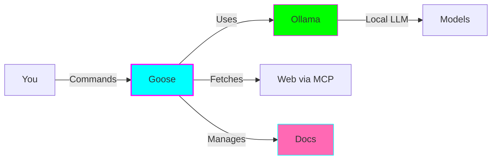
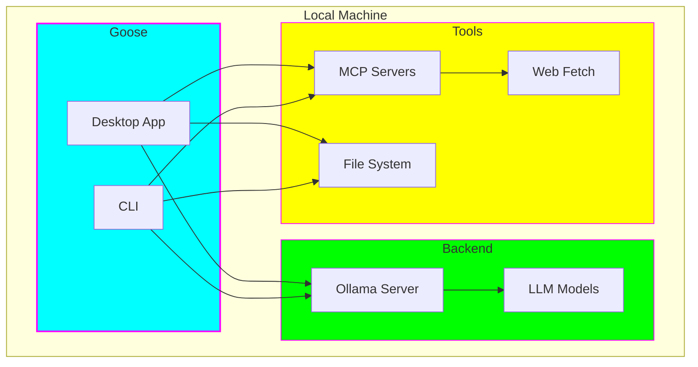
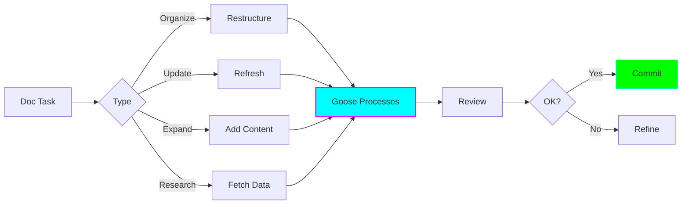

# 🦆 Goose Documentation Management

**Status:** 🧪 Experimental | **Created:** 2025-11-05

---

## Overview

An experiment to test **Goose AI agent** + **Ollama** + **MCP servers** for managing and enhancing documentation workflows. The goal is to evaluate whether this stack can effectively process, update, and maintain documentation in the learning-depot repository.



---

## What is Goose?

**Goose** is an open-source, on-machine AI agent from Block that:

- ✅ Works fully locally (no cloud dependencies)
- ✅ Supports any LLM via Ollama, OpenAI, Anthropic, etc.
- ✅ Uses Model Context Protocol (MCP) for extensibility
- ✅ Available as desktop app and CLI
- ✅ Can read/write files, execute commands, browse web

**Key Advantage:** Complete privacy and control over your data and AI interactions.

---

## Architecture



---

## Tech Stack

| Component | Purpose | Why? |
|-----------|---------|------|
| **Goose** | AI Agent | Orchestrates tasks, maintains context |
| **Ollama** | LLM Server | Runs models locally, no API costs |
| **MCP Fetch** | Web Access | Fetches external documentation |
| **Brave Search** | Web Search | Research current information (optional) |
| **learning-depot** | Target | Documentation to manage |

---

## MCP Server Options

### Option 1: Fetch Server ⭐ Recommended

**Best for:** Fetching specific documentation pages

```bash
pip install mcp-server-fetch
```

**Capabilities:**
- HTML → Markdown conversion
- Optimized for LLM consumption
- Simple setup
- Official implementation

---

### Option 2: Brave Search

**Best for:** Research and discovery tasks

```bash
npm install -g @modelcontextprotocol/server-brave-search
```

**Capabilities:**
- Real-time web search
- Current events tracking
- Privacy-focused
- Requires API key (free tier)

---

### Option 3: Custom MCP

**Best for:** Specialized workflows

Build custom tools:
- Documentation-specific processors
- Repository integrations
- Custom markdown transformations

---

## Experiment Goals

### Primary Objectives

1. **Setup & Configuration**
   - ✅ Connect Goose → Ollama → MCP
   - ✅ Verify local model performance
   - ✅ Test web fetching capabilities

2. **Documentation Tasks**
   - Organize scattered notes
   - Update outdated content
   - Expand brief documentation
   - Research and integrate external sources

3. **Evaluation**
   - Measure time savings
   - Assess output quality
   - Identify optimal use cases
   - Document workflow patterns

---

## Example Use Cases



### Organization Tasks
- Create documentation indexes
- Standardize formatting
- Generate table of contents
- Categorize by topic

### Update Tasks
- Refresh version numbers
- Update deprecated APIs
- Add status badges
- Timestamp documents

### Expansion Tasks
- Elaborate on brief notes
- Add code examples
- Create tutorials
- Generate diagrams

### Research Tasks
- Fetch official docs
- Find best practices
- Validate technical accuracy
- Add external references

---

## Sample Prompts

### Quick Wins (Start Here!)

```
"Create an index.md with categorized links to all markdown files in this directory"
```

```
"Standardize all markdown files to use consistent heading styles (ATX format)"
```

```
"Add a 'Last Updated: YYYY-MM-DD' line to the top of each markdown file"
```

### Intermediate Tasks

```
"Review my notes on [topic] and expand them into a comprehensive guide with:
- Overview section
- Key concepts explained
- Practical examples
- Common pitfalls
- Additional resources"
```

```
"Find all references to [old version] and update them to [new version],
including installation commands and API changes"
```

### Advanced Tasks

```
"Fetch the latest official documentation for [framework] and compare it
with my notes. Create a report of what's outdated and suggest updates."
```

```
"Process all markdown files and:
1. Fix broken links
2. Add language tags to code blocks
3. Ensure images have alt text
4. Generate a quality report"
```

---

## Metrics to Track

### Quantitative
- ⏱️ **Time:** Task duration vs. manual
- 📝 **Tasks:** Completed successfully
- 🔁 **Iterations:** Edits needed for quality
- ❌ **Errors:** Mistakes introduced

### Qualitative
- 📊 **Quality:** Readability & accuracy
- 🔄 **Workflow:** Integration smoothness
- 📈 **Learning:** Time to productivity
- 🎯 **Fit:** Best use cases identified

---

## Current Status

**Phase:** Initial setup and configuration

**Next Steps:**
1. Install Ollama and models
2. Install and configure Goose
3. Setup MCP Fetch server
4. Run first test tasks
5. Document findings

---

## Resources

### Quick Links
- 📁 [Experiment Folder](../../experiments/goose-doc-management/)
- 📖 [Full README](../../experiments/goose-doc-management/README.md)
- 🚀 [Quick Start Guide](../../experiments/goose-doc-management/QUICKSTART.md)

### Official Documentation
- [Goose GitHub](https://github.com/block/goose)
- [Goose Docs](https://block.github.io/goose/)
- [Ollama](https://ollama.com/)
- [MCP Docs](https://modelcontextprotocol.io/)
- [MCP Servers](https://github.com/modelcontextprotocol/servers)

### Guides
- [Goose + Ollama Integration](https://block.github.io/goose/blog/2025/03/14/goose-ollama/)
- [Best MCP Servers 2025](https://www.pomerium.com/blog/best-model-context-protocol-mcp-servers-in-2025)

---

## ADHD-Friendly Tips

- ⏱️ **Time-box:** 30-minute focused sessions
- ✅ **Quick wins:** Start with simple tasks
- 📊 **Track progress:** Visual checklists
- 🎯 **One task:** Don't multitask
- 🔔 **Set reminders:** Weekly review

---

## Questions to Answer

- [ ] Is Goose faster than manual work?
- [ ] What's the quality vs. speed trade-off?
- [ ] Which tasks are best automated?
- [ ] What requires human review?
- [ ] Is local LLM performance adequate?
- [ ] Worth the setup complexity?

---

**Last Updated:** 2025-11-05
