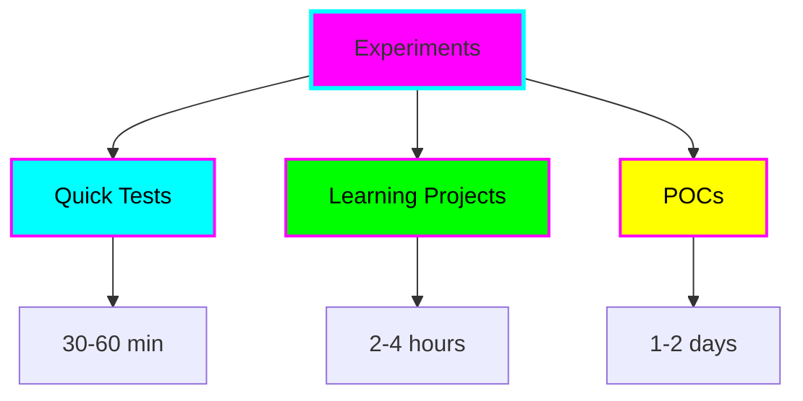

# Experiments

Quick tests, POCs, and learning exercises. Fast iteration, rapid feedback.



## What Goes Here?

Experiments are for:

- 🧪 **Testing** - "Can I use X with Y?"
- 📚 **Learning** - Following tutorials, exploring new tech
- 💡 **Prototyping** - Quick POCs before committing
- 🎯 **Exploring** - Trying out APIs, frameworks, libraries

## Active Experiments

!!! note "No experiments yet"
    Start your first experiment! See [Quick Start Guide](../getting-started/quick-start.md)

<!-- Add your experiments here as you create them:

### 🧪 experiment-name
**Tech:** {Language/Framework}
**Goal:** {What you're testing}
**Status:** {Started/In Progress/Complete/Abandoned}
**Learnings:** {Key takeaway}

[View details](../experiments/experiment-name/)

---
-->

## Experiment Types

### Type 1: Quick Test (⏱️ 30-60 min)

**Purpose:** Answer a specific question

**Structure:**
```
experiments/quick-test/
├── main.{ext}
├── .{env-file}
└── README.md (minimal)
```

**Example questions:**
- Can I parse JSON with library X?
- Does API Y support feature Z?
- How fast is algorithm A vs B?

### Type 2: Learning Project (⏱️ 2-4 hours)

**Purpose:** Learn a new technology

**Structure:**
```
experiments/learning-{tech}/
├── src/
├── examples/
├── .{env-file}
├── {package-file}
└── README.md (with learning log)
```

**Examples:**
- Learning Rust basics
- Exploring GraphQL
- Understanding async patterns

### Type 3: POC (⏱️ 1-2 days)

**Purpose:** Prove out an idea

**Structure:**
```
experiments/poc-{name}/
├── src/
├── tests/
├── docs/
├── .{env-file}
├── {package-file}
└── README.md (full)
```

**Examples:**
- Real-time chat proof of concept
- ML model integration test
- API design prototype

## Creating an Experiment

```bash
# Quick way
mkdir experiments/my-test
cd experiments/my-test

# Copy environment config
cp ../../templates/env-configs/.nvmrc .  # or other

# Start coding!
```

Or use Claude Code:

```
@experiment-guide help me set up an experiment to test {technology}
```

## Documentation Guidelines

### Minimal (Quick Tests)

```markdown
# {experiment-name}

**Goal:** {What I'm testing}

## Result
{✅ Works / ❌ Doesn't work / 🤔 Interesting finding}

## Notes
- {Key finding}
```

### Learning Log (Learning Projects)

```markdown
# Learning: {Technology}

## What I Learned
- {Concept} - {Explanation}

## Code Examples
{Examples with comments}

## Resources
- [{Tutorial}]({link})
```

### Full README (POCs)

Use the project template structure. See [Templates](../templates/project-template.md).

## When to Graduate

Move to `projects/` when:

- ✅ POC proves the concept works
- ✅ You want to build it further
- ✅ It needs more structure
- ✅ Others might use it

## Archive Policy

Completed experiments stay in the folder as reference. Add status to README:

- 🧪 **Experimental** - Just started
- ✅ **Complete** - Finished successfully
- ❌ **Failed** - Didn't work out (that's okay!)
- 📦 **Graduated** - Moved to projects/
- 🗄️ **Archived** - Complete, not actively maintained

## Tips for Successful Experiments

### Time Box It

```mermaid
gantt
    title Experiment Timeline
    dateFormat mm
    axisFormat %M min

    section Experiment
    Setup: 0, 5m
    Code: 5, 30m
    Test: 35, 10m
    Document: 45, 15m
```


Set a timer. When time's up, document and decide: continue, pivot, or stop.

### Document Failures

Failed experiments are valuable! Document:

- What you tried
- Why it didn't work
- What you learned
- What you'd try differently

### Keep Scope Small

❌ "Build a social network"
✅ "Test user authentication with OAuth"

### Use Version Control

```bash
# Quick experiments still benefit from git
git add .
git commit -m "Test: can parse CSV with library X"
```

## Getting Help

Use the custom Claude agents:

- **@learn-assistant** - Understand concepts
- **@experiment-guide** - Setup and implementation
- **@brainstorm-buddy** - Plan experiments
- **@doc-writer** - Document findings

## Example Experiments

### Web Scraping Test

```bash
experiments/web-scraping-test/
├── scraper.py
├── .python-version
├── requirements.txt
└── README.md
```

**Goal:** Test BeautifulSoup vs Scrapy for simple scraping
**Result:** ✅ BeautifulSoup sufficient for this use case
**Time:** ⏱️ 45 minutes

### API Rate Limiting

```bash
experiments/api-rate-limit-test/
├── test.js
├── .nvmrc
├── package.json
└── README.md
```

**Goal:** Understand rate limiting behavior of API X
**Result:** 🤔 Rate limit resets every hour, not on sliding window
**Time:** ⏱️ 30 minutes

### Rust Ownership

```bash
experiments/learning-rust-ownership/
├── src/
│   ├── main.rs
│   ├── borrowing.rs
│   └── lifetimes.rs
├── rust-toolchain.toml
└── README.md
```

**Goal:** Understand Rust ownership and borrowing
**Result:** ✅ Concepts clicked, documented key learnings
**Time:** ⏱️ 3 hours

---

**Ready to experiment? [Get started now!](../getting-started/quick-start.md)**
