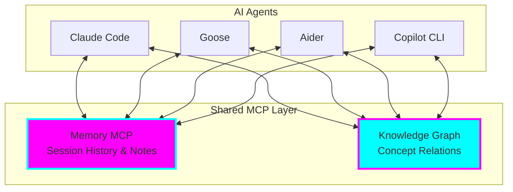
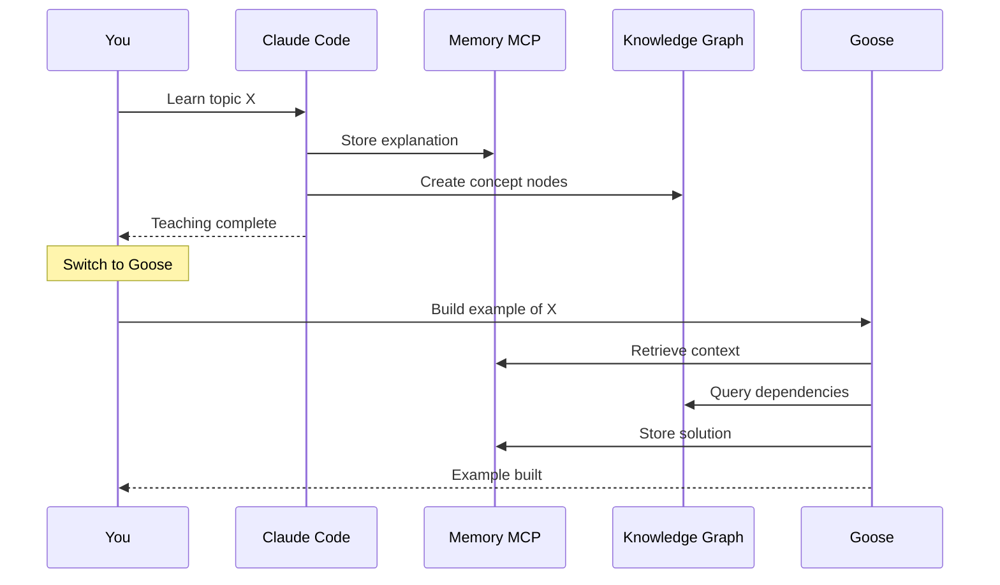
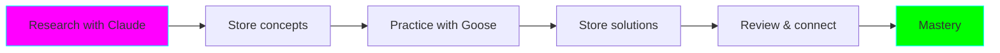
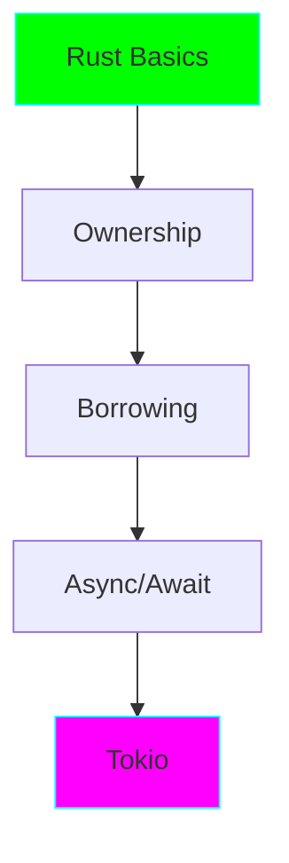

# 🧠 Memory & Knowledge Graph MCP Learning Accelerator

!!! info "Experiment Status"
    **Status:** 🧪 Experimental
    **Created:** 2025-11-05
    **Location:** `experiments/memory-knowledge-graph-learning/`

## Overview

An experiment to use Memory and Knowledge Graph MCP servers to create persistent context and knowledge connections across multiple AI agents (Claude Code, Goose, Aider, Copilot CLI, Opencode, Codex).

## The Problem

When using multiple AI agents, each conversation starts fresh. Context from previous sessions is lost, making it harder to:

- Build on previous learnings
- Connect related concepts
- Track learning progress
- Share knowledge between agents

## The Solution



Use MCP (Model Context Protocol) servers to create a shared memory and knowledge layer that all agents can read from and write to.

## Key Features

### Memory MCP Server

- ✅ Persistent session memory
- ✅ Searchable notes and code snippets
- ✅ Learning goal tracking
- ✅ Cross-agent context sharing

### Knowledge Graph MCP Server

- ✅ Concept relationship mapping
- ✅ Learning dependency tracking
- ✅ Knowledge gap identification
- ✅ Visual knowledge exploration

## Architecture



## Quick Start

```bash
# Navigate to experiment
cd experiments/memory-knowledge-graph-learning

# Run setup
./setup.sh

# Configure your agent (see QUICKSTART.md)
cp configs/claude-desktop-config.json ~/.config/claude/

# Test it
# In your agent: "Store this learning note: Testing MCP"
```

## Documentation

The experiment includes comprehensive documentation:

| Document | Purpose |
|----------|---------|
| [README.md](https://github.com/AngelCantugr/fantastic-engine/tree/main/experiments/memory-knowledge-graph-learning) | Full architecture and concepts |
| [QUICKSTART.md](https://github.com/AngelCantugr/fantastic-engine/blob/main/experiments/memory-knowledge-graph-learning/QUICKSTART.md) | Step-by-step setup guide |
| [example-prompts.md](https://github.com/AngelCantugr/fantastic-engine/blob/main/experiments/memory-knowledge-graph-learning/example-prompts.md) | Copy-paste prompts for effective use |
| `configs/` | Sample configurations for each agent |

## Example Use Cases

### 1. Technology Deep Dive

Learn a new technology across multiple sessions and agents:



### 2. Multi-Agent Debugging

Continue debugging across different agents with full context:

- Agent 1 identifies the bug → Stores in Memory
- Agent 2 tries fix A → Stores result (didn't work)
- Agent 3 retrieves both → Tries fix B → Success!

### 3. Learning Path Construction

Build a structured learning path with dependencies:



The Knowledge Graph tracks what you know and what's next.

## Tech Stack

- **MCP Servers:** Memory, Knowledge Graph
- **Storage:** SQLite (memory), JSON (graph)
- **Agents:** Claude Code, Goose, Aider, Copilot CLI, etc.
- **Protocol:** Model Context Protocol (MCP)

## Current Status

!!! warning "Experimental Stage"
    - ✅ Documentation complete
    - ✅ Architecture designed
    - ✅ Configuration examples created
    - 🚧 Testing with real agents (in progress)
    - ⏳ Real-world usage patterns (pending)

## Next Steps

1. Install and configure MCP servers
2. Test with primary agent (Claude Code)
3. Add secondary agent (Goose)
4. Complete first multi-agent learning session
5. Document learnings and iterate

## Resources

- [MCP Documentation](https://modelcontextprotocol.io/)
- [Experiment Directory](https://github.com/AngelCantugr/fantastic-engine/tree/main/experiments/memory-knowledge-graph-learning)
- [Setup Guide](https://github.com/AngelCantugr/fantastic-engine/blob/main/experiments/memory-knowledge-graph-learning/QUICKSTART.md)

## Graduation Criteria

This experiment will graduate to its own repository when:

- [ ] Successfully used across 3+ agents
- [ ] Completed 5+ multi-agent learning sessions
- [ ] Built knowledge graph with 50+ concepts
- [ ] Documented 10+ real-world use cases
- [ ] Created backup/export tooling
- [ ] Proven learning acceleration

---

**Try it yourself!** This experiment is ready for testing. Follow the [QUICKSTART.md](https://github.com/AngelCantugr/fantastic-engine/blob/main/experiments/memory-knowledge-graph-learning/QUICKSTART.md) to get started. 🚀
