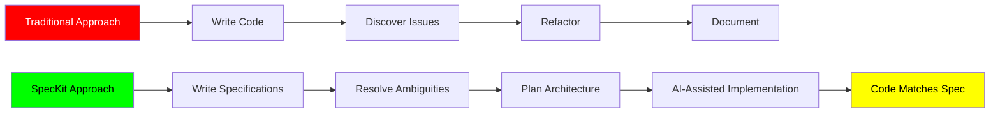
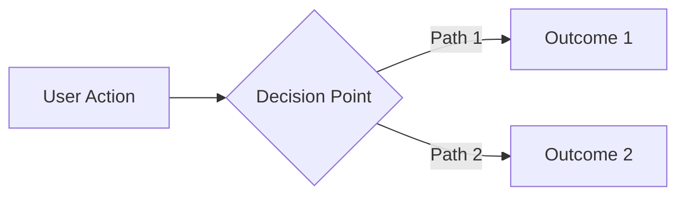
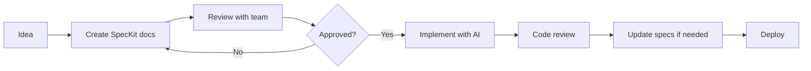

# SpecKit Learning Guide - Complete Tutorial

**Created**: 2025-11-05
**Purpose**: Comprehensive guide to learning specification-driven development with SpecKit
**Experiments**: Simple Blog + Complex E-Commerce

---

## Introduction

This guide provides a structured learning path through two SpecKit experiments in this repository. Whether you're new to specification-driven development or looking to master advanced architectural patterns, this guide will help you understand how to use SpecKit effectively.

## What is SpecKit?

**SpecKit** is GitHub's toolkit for **Specification-Driven Development (SDD)**, a methodology where detailed specifications drive AI-assisted implementation. Instead of jumping directly into code, you:

1. **Define principles** (constitution)
2. **Specify requirements** (specification)
3. **Clarify ambiguities** (clarification)
4. **Plan architecture** (plan)
5. **Implement with AI** (using tools like Claude Code, GitHub Copilot)

### Why Specification-Driven Development?



**Benefits**:
- ✅ Better AI-generated code (clear specifications = better results)
- ✅ Reduced rework (issues found before coding)
- ✅ Built-in documentation (specs are living docs)
- ✅ Team alignment (everyone understands the plan)
- ✅ Decision transparency (trade-offs documented)

## The Learning Path

### Level 1: Beginner - Simple Blog Experiment

**Location**: `/experiments/speckit-simple-blog/`

**Purpose**: Learn SpecKit fundamentals through a straightforward project

**Time Investment**: 2-3 hours to study thoroughly

**What You'll Learn**:
- ✅ The four SpecKit artifacts (constitution, specification, clarification, plan)
- ✅ Writing user-centric specifications
- ✅ Documenting design decisions
- ✅ Planning technical implementation
- ✅ When to use SpecKit vs. jumping into code

**Project Overview**:
- **Type**: Static blog site
- **Complexity**: Single service, static site generation
- **Technologies**: Astro, TypeScript, Markdown
- **Specifications**: ~15 pages
- **Implementation Time**: 2-3 weeks solo

**Start Here**: Read `/experiments/speckit-simple-blog/README.md`

---

### Level 2: Advanced - Complex E-Commerce Experiment

**Location**: `/experiments/speckit-complex-ecommerce/`

**Purpose**: Master advanced SpecKit patterns for production-grade systems

**Time Investment**: 6-8 hours to study thoroughly

**What You'll Learn**:
- ✅ Microservices architecture specifications
- ✅ Event-driven design documentation
- ✅ Complex design decision analysis
- ✅ Polyglot persistence planning
- ✅ Third-party integration specifications
- ✅ Distributed system patterns
- ✅ Security and compliance requirements

**Project Overview**:
- **Type**: Multi-seller e-commerce marketplace
- **Complexity**: 14 microservices, multiple databases
- **Technologies**: TypeScript, React, PostgreSQL, MongoDB, Redis, Elasticsearch, Kafka
- **Specifications**: ~60 pages
- **Implementation Time**: 12-18 months with 6-person team

**Start Here**: Complete Level 1 first, then read `/experiments/speckit-complex-ecommerce/README.md`

---

## The Four SpecKit Artifacts Explained

### 1. Constitution.md - The North Star

**Purpose**: Establishes governing principles and standards that guide all technical decisions.

**What Goes In**:
- Core principles (business values, user focus)
- Technical standards (code quality, testing, security)
- Architecture principles (scalability, reliability)
- Non-functional requirements (performance, observability)
- Success metrics (KPIs, SLAs)

**What Stays Out**:
- Specific technologies (those go in the plan)
- Implementation details
- Feature specifications

**Key Insight**: The constitution should be relatively stable. It changes infrequently and only when fundamental principles evolve.

**Example Comparison**:

| Simple Blog | Complex E-Commerce |
|-------------|-------------------|
| **Simplicity First**: Minimize complexity | **Customer Trust Above All**: Data privacy, security first |
| **Performance**: 90+ Lighthouse score | **Performance**: P50 < 100ms, P99 < 500ms for search |
| **Testing**: 80% coverage | **Testing**: 85% coverage + contract tests + E2E |
| **Deployment**: Netlify static hosting | **Deployment**: Multi-region AWS with blue/green deployments |

**Writing Tips**:
- Be specific with numbers (not "fast", but "< 200ms")
- Define thresholds for success
- Include the "why" behind principles
- Keep it concise (2-6 pages for simple, 8-15 for complex)

---

### 2. Specification.md - The What and Why

**Purpose**: Defines WHAT to build and WHY it matters, without prescribing HOW to build it.

**What Goes In**:
- Vision and problem statement
- Target audience (personas with pain points and goals)
- Core features (as user stories)
- User flows (with diagrams)
- Success criteria (MVP → v1.0 → v2.0)
- Out-of-scope items (what you won't build)
- Open questions (to be resolved in clarification)

**What Stays Out**:
- Technology choices
- Database schemas
- API endpoints
- Implementation details

**Key Insight**: Focus on user value. Every feature should answer "why does the user need this?"

**User Story Format**:
```markdown
**User Story**: As a [persona], I want to [action] so I can [benefit].

**Requirements**:
- Specific requirement 1
- Specific requirement 2
- Specific requirement 3

**Acceptance Criteria**:
- User can complete action in < X time
- System responds within Y seconds
- Error cases are handled gracefully
```

**Mermaid Diagrams for Clarity**:


**Writing Tips**:
- Use concrete examples (not "users can search", but "users can search by keyword, filter by category, and sort by price")
- Include visuals (user flows, state machines, sequence diagrams)
- Write for ADHD-friendly reading (short paragraphs, bullet points, clear headings)
- Explicitly state what's out of scope

---

### 3. Clarification.md - The Decisions

**Purpose**: Resolves ambiguities from the specification and documents design decisions with rationale.

**What Goes In**:
- Design decisions (options considered, chosen solution, rationale)
- Trade-off analysis (benefits vs. costs)
- Assumptions about scale, usage, environment
- Constraints accepted (technical debt, limitations)
- Questions deferred for later

**What Stays Out**:
- Implementation code
- Detailed schemas (those go in the plan)

**Key Insight**: This bridges the gap between "what we want" (spec) and "how we'll build it" (plan).

**Decision Template**:
```markdown
### [Decision Title]

**Question**: What specific question are we answering?

**Options Considered**:
- **Option A**: Description, pros, cons
- **Option B**: Description, pros, cons
- **Option C**: Description, pros, cons

**Decision**: [Chosen option]

**Rationale**:
- Reason 1 (with data/evidence if possible)
- Reason 2
- Reason 3

**Trade-offs**:
- What we gain
- What we sacrifice
- What we must accept

**Implementation Notes**: How this decision will be implemented

**Cost Impact**: Financial or technical cost implications

**Documented By**: [Your name or team]
**Date**: YYYY-MM-DD
```

**Example Decisions**:

**Simple Blog**:
- Static site generator choice (Astro vs. Next.js vs. Eleventy)
- Image storage (git vs. LFS vs. CDN)
- Search implementation (Pagefind vs. Algolia vs. none)
- Dark mode support (yes with toggle)

**Complex E-Commerce**:
- Microservices vs. monolith
- Multi-currency strategy
- Payment processor selection
- Database per service
- Commission structure
- Payout schedules
- Tax calculation approach
- Fraud detection strategy

**Writing Tips**:
- Be honest about trade-offs (no perfect solutions)
- Include cost estimates (infrastructure, services, development time)
- Document edge cases and how they'll be handled
- Reference the specification sections you're clarifying

---

### 4. Plan.md - The How

**Purpose**: Translates specifications into concrete technical architecture ready for implementation.

**What Goes In**:
- System architecture diagrams
- Technology stack (with specific versions)
- Service definitions (if microservices)
- Database schemas
- API endpoint specifications
- Data models and types
- Component architecture (frontend)
- Build and deployment process
- Testing strategy
- Security implementation
- Monitoring and observability

**What Stays Out**:
- Actual implementation code (that's the next step)
- Business logic (described in specification)

**Key Insight**: This should be detailed enough that an AI assistant or developer can implement without major architectural questions.

**Structure for Simple Projects**:
```
1. Architecture Overview (diagram)
2. Technology Stack
3. Project Structure (file tree)
4. Data Schema
5. Component Architecture
6. Styling System
7. Build Process
8. Testing Strategy
9. Deployment Strategy
10. Performance Optimizations
```

**Structure for Complex Projects**:
```
1. System Architecture Overview
2. Technology Stack
3. Service Definitions (one per service):
   - Responsibilities
   - Database schema
   - API endpoints
   - Business logic patterns
4. Event-Driven Architecture
5. Frontend Architecture
6. Deployment Architecture
7. CI/CD Pipeline
8. Observability Setup
```

**Code Examples in Plans**:
```typescript
// Include schema definitions
interface BlogPost {
  title: string;
  date: Date;
  content: string;
  tags: string[];
}

// Include API endpoint signatures
GET /api/posts
POST /api/posts
PATCH /api/posts/:id

// Include configuration examples
const config = {
  database: "postgresql://...",
  redis: { host: "localhost", port: 6379 }
};
```

**Writing Tips**:
- Use TypeScript interfaces for type safety
- Include actual configuration examples
- Provide folder structures
- Reference specific libraries and versions
- Include deployment commands
- Diagram complex interactions

---

## Comparing Simple vs. Complex

### Scope Comparison

| Aspect | Simple Blog | Complex E-Commerce |
|--------|-------------|-------------------|
| **User Roles** | 1 (writer) | 3 (buyer, seller, admin) |
| **Services** | 1 (static generator) | 14 (microservices) |
| **Databases** | 0 (files) | 5 (PostgreSQL, MongoDB, Redis, ES, ClickHouse) |
| **External APIs** | 0 | 6 (Stripe, Shippo, Avalara, etc.) |
| **State Management** | None (static) | Complex (distributed transactions) |
| **Authentication** | None | OAuth 2.0, JWT, RBAC |
| **Pages of Spec** | 15 | 60 |
| **Decisions Documented** | 9 | 12 major + many minor |
| **Mermaid Diagrams** | 5 | 15+ |

### Complexity Indicators

When does a project become "complex" enough to need advanced patterns?

**Stay Simple If**:
- ✅ Single user type
- ✅ CRUD operations only
- ✅ No real-time requirements
- ✅ < 10k users
- ✅ Single database sufficient
- ✅ No payment processing
- ✅ Solo or small team (1-2 devs)

**Go Complex If**:
- 🔴 Multiple user roles with different permissions
- 🔴 Complex business workflows (e.g., checkout, fulfillment)
- 🔴 High scalability needs (100k+ users)
- 🔴 Payment processing
- 🔴 Third-party integrations (payment, shipping, tax)
- 🔴 Real-time features
- 🔴 Large team (6+ developers)
- 🔴 Regulatory compliance (PCI, GDPR, HIPAA)

---

## Practical Exercises

### Exercise 1: Analyze the Simple Blog

**Task**: Read all four SpecKit files for the simple blog experiment.

**Questions to Answer**:
1. What principles from constitution.md would you challenge or add?
2. Find one user story in specification.md and critique it. Is it specific enough?
3. Pick one decision from clarification.md. Do you agree with the choice? What would you choose differently?
4. Look at plan.md. Could you implement this with the information provided?

**Deliverable**: Write a 1-page critique with your findings.

---

### Exercise 2: Write Your Own Simple SpecKit

**Task**: Choose a simple project idea (todo app, note-taking app, URL shortener).

**Steps**:
1. Write a constitution.md (2 pages max)
2. Write a specification.md (3-5 pages)
3. Write a clarification.md (resolve 3-5 design decisions)
4. Write a plan.md (4-6 pages)

**Deliverable**: A complete `.specify/memory/` directory for your project.

**Evaluation Criteria**:
- Constitution has specific, measurable principles
- Specification focuses on user value, not implementation
- Clarifications document trade-offs
- Plan is detailed enough to implement

---

### Exercise 3: Analyze the Complex E-Commerce

**Task**: Deep dive into one service from the complex experiment.

**Choose One Service**:
- Catalog Service (product search)
- Order Service (event sourcing)
- Payment Service (Stripe Connect)

**Questions to Answer**:
1. What are this service's responsibilities?
2. What database does it use and why?
3. What events does it publish and consume?
4. What external services does it integrate with?
5. What are the key trade-offs in its design?

**Deliverable**: 2-3 page analysis of the service.

---

### Exercise 4: Design a Complex Feature

**Task**: Add a new feature to the e-commerce platform.

**Feature Ideas**:
- Seller promotions and discount codes
- Product recommendations (ML-powered)
- Subscription products
- Loyalty rewards program

**Steps**:
1. Update specification.md with user stories
2. Add design decisions to clarification.md
3. Update plan.md with service changes
4. Document any new events or APIs

**Deliverable**: Specification update for your feature.

---

## Best Practices from Both Experiments

### Constitution Writing

✅ **Do**:
- Use specific metrics (not "fast", but "< 200ms")
- Separate principles from implementation
- Include success metrics
- Document governance (how to deviate, when to update)

❌ **Don't**:
- Prescribe specific technologies (those go in the plan)
- Make it too long (under 15 pages even for complex projects)
- Write vague principles ("code should be good quality")
- Forget to define non-functional requirements

### Specification Writing

✅ **Do**:
- Use personas with specific pain points
- Write user stories with acceptance criteria
- Include visual diagrams (Mermaid)
- Explicitly list what's out of scope
- Document open questions

❌ **Don't**:
- Jump into implementation details
- Forget the "why" (always explain user value)
- Write features without user stories
- Assume readers understand context

### Clarification Writing

✅ **Do**:
- Document multiple options considered
- Explain trade-offs honestly
- Include cost estimates
- Note edge cases and how to handle them
- Reference specification sections you're clarifying

❌ **Don't**:
- Skip documenting alternatives
- Hide trade-offs or risks
- Make decisions without rationale
- Forget to document assumptions

### Plan Writing

✅ **Do**:
- Provide specific versions (Node.js 20, PostgreSQL 16)
- Include code examples (schemas, APIs)
- Diagram complex flows
- Specify testing strategy
- Document deployment process

❌ **Don't**:
- Leave technology choices vague
- Skip testing or deployment sections
- Forget about observability (logging, monitoring)
- Write pseudocode instead of real examples

---

## When to Use SpecKit

### Perfect For:
- ✅ New projects (greenfield)
- ✅ Complex systems (multiple services, integrations)
- ✅ Team projects (alignment needed)
- ✅ AI-assisted development (specs guide AI)
- ✅ Projects requiring documentation (regulatory, handoff)
- ✅ Long-term projects (6+ months)

### Overkill For:
- ❌ Quick prototypes (< 1 week)
- ❌ Exploratory coding (not sure what to build yet)
- ❌ Trivial features (single file change)
- ❌ Internal tools with 1 user
- ❌ Throwaway code (hackathons, experiments)

### The SpecKit Spectrum:

```
Low Formality                                    High Formality
├────────────┼────────────┼────────────┼────────────┤
 Quick notes   README-only  SpecKit-lite  Full SpecKit
 (< 1 day)     (< 1 week)   (1-4 weeks)   (months+)

- Jot ideas   - Problem     - Constitution - All 4 files
- Todo list   - Solution    - Spec (brief) - Comprehensive
- Sketch API  - Tech stack  - Key decisions- Detailed plan
```

---

## Common Pitfalls and How to Avoid Them

### Pitfall 1: Specification Too Technical

**Problem**: Specification reads like a plan (mentions databases, APIs, frameworks).

**Solution**: Ask "would a non-technical stakeholder understand this?" If no, move it to plan.md.

**Example**:
- ❌ "Use PostgreSQL with Prisma ORM to store user data"
- ✅ "Users can create accounts with email and password, save their preferences, and manage their profile"

---

### Pitfall 2: Clarifications Without Options

**Problem**: Decision documented without showing alternatives considered.

**Solution**: Always list 2-4 options, even if one is obviously better. Demonstrates thorough thinking.

---

### Pitfall 3: Plan Too Abstract

**Problem**: Plan says "use REST APIs" without defining endpoints or schemas.

**Solution**: Include concrete examples (actual TypeScript interfaces, API endpoint definitions, configuration snippets).

---

### Pitfall 4: Ignoring Trade-offs

**Problem**: Every decision seems perfect with no downsides.

**Solution**: Be honest. Every choice has trade-offs. Document what you're sacrificing.

---

### Pitfall 5: Stale Specifications

**Problem**: Code diverges from specs as project evolves.

**Solution**: Treat specs as living documents. Update them when making significant changes.

---

## Tools and Integrations

### SpecKit CLI

**Installation**:
```bash
uv tool install specify-cli --from git+https://github.com/github/spec-kit
```

**Commands**:
```bash
/speckit.constitution   # Create constitution.md
/speckit.specify        # Create specification.md
/speckit.clarify        # Interactive clarification
/speckit.plan           # Create plan.md
/speckit.implement      # Start implementation with AI
```

### AI Assistants

SpecKit works best with:
- **Claude Code**: Reads specs and implements with deep understanding
- **GitHub Copilot**: Autocomplete guided by specs
- **Google Gemini**: Plan generation and clarification

### Integration with Your Workflow



---

## Next Steps

### After Studying These Experiments

1. **Pick a project** you're working on or want to start
2. **Write specifications** following the SpecKit format
3. **Use AI assistants** to implement based on your specs
4. **Iterate**: Update specs as you learn
5. **Share**: Contribute your learnings back to this repo

### Resources

- [SpecKit GitHub](https://github.com/github/spec-kit)
- [SpecKit Docs](https://speckit.org/)
- [Microservices Patterns](https://microservices.io/)
- [Domain-Driven Design](https://www.dddcommunity.org/)

### Community

- Share your SpecKit experiments in this repo's discussions
- Ask questions about these experiments
- Contribute improvements or additional examples

---

**Remember**: SpecKit is a tool, not a religion. Use it when it adds value, skip it when it doesn't. The goal is better software, not perfect documentation.

**Happy Specifying!** 🚀
