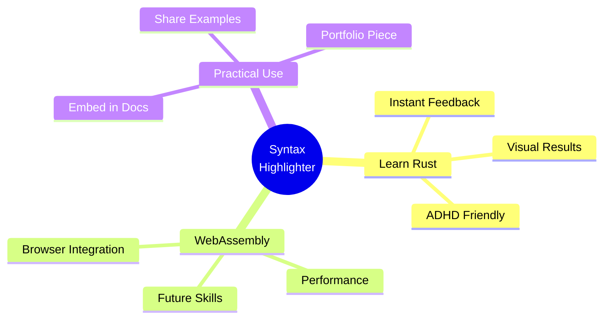
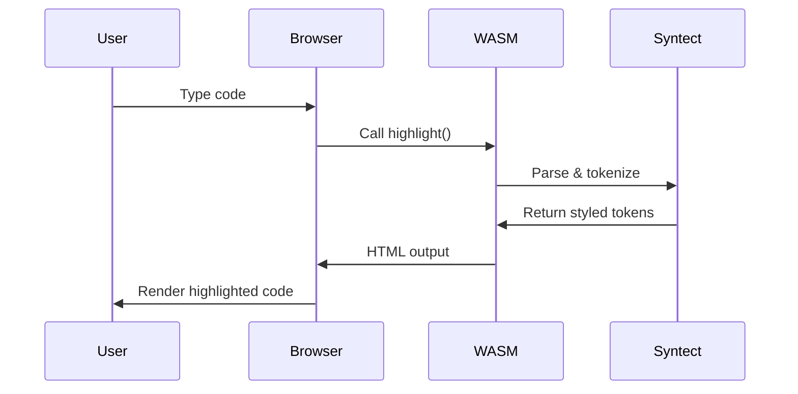

# 🎨 Syntax Highlighter Playground

**Quick Win Experiment | Rust + WebAssembly**

## Overview

Real-time syntax highlighting playground that runs entirely in your browser. Built with Rust and compiled to WebAssembly for near-native performance.

## Why Build This?



## Quick Start

```bash
# Navigate to experiment
cd experiments/syntax-highlighter-playground

# Build WASM module
wasm-pack build --target web --release

# Serve locally
python3 -m http.server 8000

# Open http://localhost:8000/web/
```

## Features Demo

Type code in the left panel → See it highlighted instantly on the right!

**Supported:**
- 50+ programming languages
- Multiple color themes (dark & light)
- Real-time updates
- Zero backend required

## Architecture



## Learning Outcomes

By building this, you'll learn:

1. **Rust Basics**
   - Project structure with Cargo
   - Ownership and borrowing
   - Error handling

2. **WebAssembly**
   - Compiling Rust to WASM
   - wasm-bindgen for JS interop
   - Optimizing bundle size

3. **Web Integration**
   - Async WASM loading
   - JavaScript ↔ Rust communication
   - DOM manipulation

## Time Investment

```mermaid
gantt
    title 2-3 Day Timeline
    dateFormat  HH:mm
    section Day 1
    Setup Rust + WASM tools     :00:00, 1h
    Build core highlighter      :01:00, 3h
    Basic WASM integration      :04:00, 2h
    section Day 2
    Build web UI                :00:00, 3h
    Add themes & languages      :03:00, 2h
    Testing & debugging         :05:00, 1h
    section Day 3
    Polish UI/UX                :00:00, 2h
    Documentation               :02:00, 2h
    Deploy & share              :04:00, 1h
```



## Next Steps

Once working:

- Embed in your MkDocs documentation
- Add to your portfolio
- Extend with custom features
- Graduate to standalone npm package

## Resources

- [Full README](../../experiments/syntax-highlighter-playground/README.md)
- [Rust WASM Book](https://rustwasm.github.io/docs/book/)
- [syntect Docs](https://docs.rs/syntect/)

---

**Status:** 🧪 Ready to build
**Difficulty:** ⭐⭐ Intermediate
**ADHD-Friendly:** ✅ High visual feedback
