# 🎤 Voice-to-Documentation

**Weekend Project | Python + Whisper + GPT-4**

## The Problem


## The Solution


## Overview

Talk your way to better documentation! Record voice notes while coding, automatically transcribe with Whisper, and format into professional markdown with GPT-4.

## Quick Start

```bash
# Install
cd experiments/voice-to-documentation
uv venv && source .venv/bin/activate
uv pip install -e ".[dev]"

# Configure
cp .env.example .env
# Add your OpenAI API key

# Record
voice2doc record -d 60

# Convert
voice2doc convert recordings/recording.wav
```

## Features

**Voice → Docs Pipeline:**
- 🎤 Record while coding
- 📝 Auto-transcribe with Whisper
- ✨ AI-format with GPT-4
- 📄 Output polished markdown

**Multiple Styles:**
- General documentation
- Code documentation
- Architecture (with Mermaid diagrams!)
- API docs
- Tutorials

## How It Works

```mermaid
sequenceDiagram
    participant You
    participant CLI
    participant Whisper
    participant GPT4
    participant File

    You->>CLI: voice2doc record
    CLI->>You: 🎙️ Recording...
    You->>CLI: voice2doc convert
    CLI->>Whisper: Send audio
    Whisper->>CLI: Raw transcript
    CLI->>GPT4: Format as docs
    GPT4->>CLI: Markdown output
    CLI->>File: Save .md file
    File->>You: ✅ Done!
```



## Use Cases

### 1. Feature Documentation

```bash
# While building auth system
voice2doc record -d 120
# Talk: "I'm building JWT authentication with FastAPI..."

voice2doc convert recording.wav --type code
# Output: Clean code documentation with examples
```

### 2. Architecture Notes

```bash
voice2doc record -d 300
# Talk: "The system has three main components..."

voice2doc convert recording.wav --type architecture
# Output: Docs with Mermaid diagrams!
```

### 3. Quick Thoughts

```bash
voice2doc quick idea.mp3
# Transcribes and copies to clipboard
```

## Time Investment

```mermaid
gantt
    title Weekend Timeline (6-8 hours)
    dateFormat  HH:mm
    section Saturday
    Setup Python + APIs        :00:00, 1h
    Build transcription        :01:00, 2h
    Add formatting             :03:00, 2h
    section Sunday
    CLI interface              :00:00, 2h
    Testing                    :02:00, 1h
    Polish & docs              :03:00, 1h
```



## Learning Outcomes

**OpenAI APIs:**
- Whisper for speech-to-text
- GPT-4 for text formatting
- Prompt engineering

**Python:**
- CLI with Click
- Audio processing
- API integration

**Practical Skill:**
- Audio handling
- File I/O
- Error handling

## Cost Estimate

Per 5-minute voice note:
- Whisper: ~$0.03
- GPT-4: ~$0.10
- **Total: ~$0.13**

Very affordable for regular use!

## Example Output

**Your Voice:**
> "So I just built this caching layer. It uses Redis with a 5-minute TTL. If the cache misses, we hit the database and then populate the cache for next time."

**Generated Docs:**
```markdown
# Caching Layer

## Overview
Redis-based caching implementation with automatic fallback.

## Configuration
- Cache TTL: 5 minutes
- Backend: Redis

## Flow
1. Check Redis cache
2. If miss → Query database
3. Populate cache with result
4. Return data

\`\`\`python
# Usage example would be here
\`\`\`
```

## Next Steps

Once working:
- Integrate with MkDocs
- Add to daily workflow
- Build custom templates
- Create keyboard shortcuts

## Advanced Ideas

- Real-time transcription
- Multi-speaker support (meetings!)
- Obsidian/Notion integration
- VS Code extension
- Mobile app

## Resources

- [Full README](../../experiments/voice-to-documentation/README.md)
- [Whisper API Docs](https://platform.openai.com/docs/guides/speech-to-text)
- [GPT-4 API Docs](https://platform.openai.com/docs/guides/gpt)

---

**Status:** 🧪 Ready to build
**Difficulty:** ⭐⭐ Intermediate
**ADHD-Friendly:** ✅ Capture thoughts without breaking flow
**Cost:** 💰 ~$0.13 per 5-min recording
