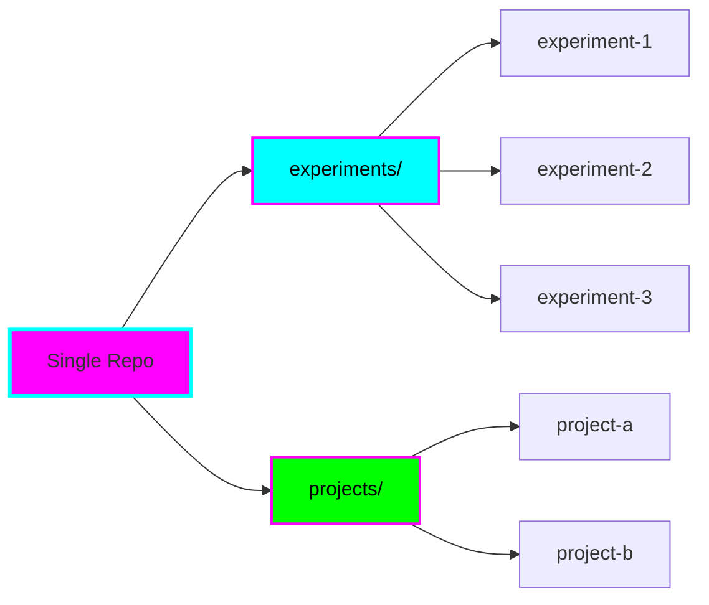
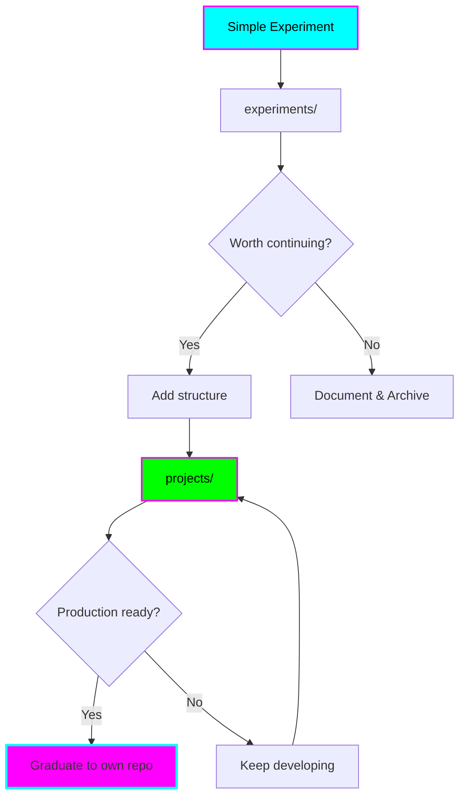
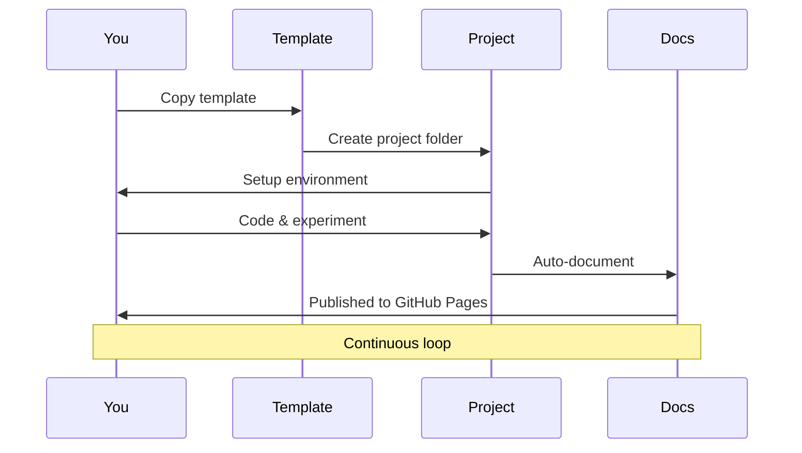

# Overview

**TL;DR:** Fantastic Engine is a playground for experimenting with different technologies using Claude Code, with built-in support for ADHD-friendly workflows.

## Purpose

This repository serves as a **unified workspace** for:

1. **Learning new technologies** without setup overhead
2. **Testing ideas** quickly with minimal friction
3. **Building projects** that might graduate to their own repos
4. **Documenting learnings** as you go

## Key Concepts

### Multi-Project Repository



Each experiment or project is **self-contained** with its own:

- Environment configuration
- Dependencies
- Documentation
- README with status

### Environment-Per-Project

No global environment pollution! Each project declares its needs:

```bash
# Project A uses Node.js 20
experiments/web-scraper/
  .nvmrc              # "20.11.0"
  package.json

# Project B uses Python 3.12
experiments/ml-test/
  .python-version     # "3.12"
  requirements.txt

# Project C uses Deno
projects/api-server/
  deno.json
```

When you `cd` into a project, activate its environment:

```bash
cd experiments/web-scraper
nvm use  # Automatically reads .nvmrc
```

### Progressive Complexity



Start simple, add complexity only when needed.

## ADHD-Friendly Design

This repository is optimized for ADHD workflows:

### Clear Structure
No guessing where things go. Fixed folder structure.

### Quick Starts
Templates eliminate "blank page syndrome".

### Visual Aids
Mermaid diagrams everywhere for visual learners.

### Time Boxing
Every guide includes time estimates.

### Progress Tracking
Status badges, checklists, clear milestones.

### Low Context Switching
Everything in one place, comprehensive documentation.

## How It Works



1. **Start** - Copy template or create folder
2. **Setup** - Add environment config
3. **Code** - Build and experiment
4. **Document** - Update README and docs
5. **Publish** - Docs auto-published
6. **Decide** - Continue, archive, or graduate

## What's Included

### Templates
- Project template with full README structure
- Environment config files for popular languages
- Documentation templates

### Custom Claude Agents
- **learn-assistant** - Learn new concepts
- **experiment-guide** - Setup and implement experiments
- **brainstorm-buddy** - Brainstorm and plan
- **doc-writer** - Create documentation

### Documentation Site
- MkDocs with cyberpunk theme
- Automatic publishing to GitHub Pages
- Mermaid diagram support
- Search and navigation

### Automation
- GitHub Actions for doc publishing
- Git workflow optimized for rapid iteration

## Philosophy

### Experiment Freely
No pressure for perfection. Test ideas quickly.

### Fail Fast
Not every experiment succeeds. That's data.

### Learn Faster
Document learnings immediately while fresh.

### Graduate Winners
When ready, move successful projects to their own repos.

## Next Steps

- [Quick Start Guide](quick-start.md) - Start your first experiment
- [Project Templates](../templates/project-template.md) - See what's available
- [Claude Agents](../../.claude/README.md) - Meet your AI assistants

---

Ready to start? Head to the [Quick Start Guide](quick-start.md)!
