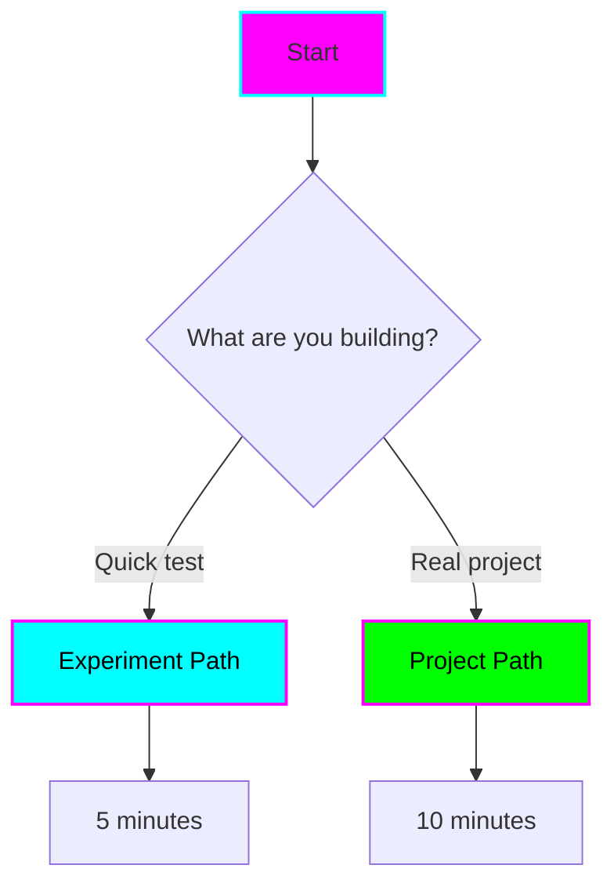
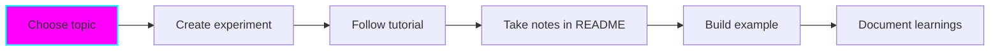
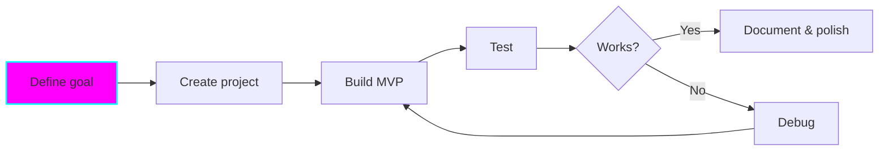
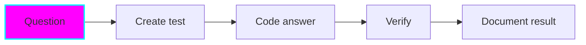

# Quick Start Guide

**Time to first experiment:** ⏱️ 5 minutes

## Prerequisites

- Git installed
- Terminal access
- Your preferred language runtime (Node.js, Python, etc.)
- Claude Code (optional but recommended)

## Step 1: Choose Your Path



## Quick Experiment (⏱️ 5 min)

### 1. Create Experiment Folder

```bash
mkdir experiments/my-test
cd experiments/my-test
```

### 2. Setup Environment

Pick your language and copy the environment file:

=== "Node.js"

    ```bash
    # Copy Node version file
    cp ../../templates/env-configs/.nvmrc .

    # Activate environment
    nvm use

    # Initialize package
    npm init -y

    # Install dependencies as needed
    npm install <packages>
    ```

=== "Python"

    ```bash
    # Copy Python version file
    cp ../../templates/env-configs/.python-version .

    # Create virtual environment
    uv venv
    source .venv/bin/activate  # or `.venv\Scripts\activate` on Windows

    # Install packages
    uv pip install <packages>
    ```

=== "Deno"

    ```bash
    # Create config
    cat > deno.json << EOF
    {
      "tasks": {
        "dev": "deno run --watch main.ts",
        "start": "deno run main.ts"
      }
    }
    EOF
    ```

=== "Rust"

    ```bash
    # Initialize Cargo project
    cargo init

    # Copy Rust toolchain file
    cp ../../templates/env-configs/rust-toolchain.toml .
    ```

### 3. Create Main File

```bash
# Create your entry point
touch main.{js,py,ts,rs,go}  # Pick your extension

# Start coding!
```

### 4. Test It Works

```bash
# Run your code
node main.js        # Node
python main.py      # Python
deno run main.ts    # Deno
cargo run           # Rust
go run main.go      # Go
```

✅ **You're done!** Start experimenting.

## Structured Project (⏱️ 10 min)

### 1. Copy Template

```bash
cp -r templates/project-template projects/my-project
cd projects/my-project
```

### 2. Customize README

Open `README.md` and update:

- `{PROJECT_NAME}` - Your project name
- `{LANGUAGE/FRAMEWORK}` - Your tech stack
- `{DATE}` - Today's date
- Status badge - Start with 🧪 Experimental

### 3. Setup Environment

Same as experiment path above - copy the appropriate environment config file.

### 4. Initialize Project

=== "Node.js"

    ```bash
    npm init -y
    npm install --save-dev typescript @types/node  # if using TypeScript

    # Create src directory
    mkdir src
    touch src/index.ts
    ```

=== "Python"

    ```bash
    uv venv
    source .venv/bin/activate

    # Create project structure
    mkdir src tests
    touch src/__init__.py src/main.py
    touch requirements.txt
    ```

=== "Deno"

    ```bash
    mkdir src
    touch src/mod.ts

    # deno.json already has good defaults
    ```

=== "Rust"

    ```bash
    cargo init

    # Cargo.toml already created
    ```

### 5. Add Architecture Diagram

Update the README with a Mermaid diagram showing your architecture:

```markdown
## Architecture

\`\`\`mermaid
graph TD
    A[Your Component] --> B[Another Component]
    B --> C[Output]
\`\`\`
```

### 6. Document As You Go

Keep the README updated with:

- Features you add (check them off: ✅)
- Learnings
- Challenges
- Next steps

✅ **Project initialized!** Start building.

## Using Claude Code Agents

If using Claude Code, leverage the custom agents:

### Learn Something New

```
@learn-assistant explain how async/await works in JavaScript
```

### Setup Experiment

```
@experiment-guide help me set up a web scraper with Python
```

### Brainstorm Features

```
@brainstorm-buddy let's plan features for my task manager
```

### Create Documentation

```
@doc-writer help me document my API
```

## Common Workflows

### Workflow 1: Learn New Tech



**Time:** ⏱️ 2-4 hours

```bash
# Example: Learning Rust
mkdir experiments/learning-rust
cd experiments/learning-rust
cp ../../templates/env-configs/rust-toolchain.toml .
cargo init

# Follow tutorial, take notes, code examples
# Update README with learning log
```

### Workflow 2: Build POC



**Time:** ⏱️ 1-2 days

```bash
# Example: API client POC
cp -r templates/project-template projects/api-client-poc
cd projects/api-client-poc

# Setup environment, build MVP, test, iterate
# Keep README updated with progress
```

### Workflow 3: Quick Test



**Time:** ⏱️ 30 minutes

```bash
# Example: "Can I use X with Y?"
mkdir experiments/test-x-with-y
cd experiments/test-x-with-y

# Quick test, document result
echo "✅ Works!" > README.md  # or "❌ Doesn't work"
```

## Tips for Success

### ✅ Do

- **Start small** - Minimal viable experiment
- **Document immediately** - While it's fresh
- **Time box** - Set a timer, stick to it
- **Update status** - Keep README badges current
- **Use templates** - Don't start from scratch

### ❌ Avoid

- **Perfectionism** - Done > Perfect
- **Scope creep** - Stick to original goal
- **Multiple projects** - Finish one first
- **No documentation** - Future you will thank present you

## Troubleshooting

### Environment not activating

**Node.js:**
```bash
# Install nvm if needed
curl -o- https://raw.githubusercontent.com/nvm-sh/nvm/v0.39.0/install.sh | bash

# Then
nvm install
nvm use
```

**Python:**
```bash
# Install uv if needed
curl -LsSf https://astral.sh/uv/install.sh | sh

# Then
uv venv
source .venv/bin/activate
```

### Can't find template files

Make sure you're in the repository root:

```bash
cd ~/path/to/fantastic-engine
ls templates  # Should see template folders
```

### Docs not building

```bash
# Install MkDocs dependencies
pip install mkdocs-material mkdocs-mermaid2-plugin

# Test locally
mkdocs serve
```

## Next Steps

You're ready to start! Here are some ideas:

- [ ] Create your first experiment
- [ ] Try a different language you're curious about
- [ ] Follow a tutorial and document your learnings
- [ ] Build a small tool you've been thinking about
- [ ] Experiment with a new API or framework

## Resources

- [Overview](overview.md) - Understand the philosophy
- [Templates](../templates/project-template.md) - See available templates
- [Full CLAUDE.md](https://github.com/AngelCantugr/fantastic-engine/blob/main/CLAUDE.md) - Complete guide

---

**Happy experimenting! 🚀**
