# 🌟 Fantastic Engine

**Welcome to the experiment playground!**

A repository for learning, experimenting, and building projects with Claude Code before graduating them to their own repositories.

```mermaid
mindmap
  root((Fantastic<br/>Engine))
    🧪 Experiments
      Quick Tests
      POCs
      Learning
    🚀 Projects
      Mature Ideas
      Ready to Graduate
    📚 Documentation
      Learning Logs
      How-Tos
      References
    🤖 Claude Tools
      Subagents
      Skills
      Automation
```



## What is This?

Fantastic Engine is a **multi-language, multi-project playground** designed for:

- 🧪 **Rapid Experimentation** - Test ideas without creating new repos
- 📚 **Active Learning** - Document as you learn new technologies
- 🎯 **Project Incubation** - Grow projects from experiments to production-ready
- 🤖 **AI-Powered Development** - Custom Claude Code agents optimized for ADHD workflows

## Quick Start

=== "Start New Experiment"

    ```bash
    # Quick experiment
    mkdir experiments/my-test
    cd experiments/my-test

    # Copy environment config
    cp ../../templates/env-configs/.nvmrc .  # or other env file

    # Start coding!
    ```

=== "Start New Project"

    ```bash
    # Structured project
    cp -r templates/project-template projects/my-project
    cd projects/my-project

    # Customize README and setup environment
    ```

=== "Preview Docs"

    ```bash
    # Install dependencies
    pip install mkdocs-material mkdocs-mermaid2-plugin

    # Serve locally
    mkdocs serve
    ```

## Repository Structure


### Folder Purposes

| Folder | Purpose | When to Use |
|--------|---------|-------------|
| **experiments/** | Quick tests, POCs, learning | Testing new tech, exploring ideas (⏱️ 30min-4hrs) |
| **projects/** | Mature experiments | When experiment shows promise and needs structure |
| **templates/** | Starter files | Copy these to bootstrap new experiments/projects |
| **docs/** | Documentation | All markdown docs auto-published to GitHub Pages |
| **.claude/** | Custom agents | Specialized AI assistants for this repo |

## Features

### 🎨 Multi-Language Support

Set up projects in any language with automatic environment configuration:

| Language | Environment File | Tool |
|----------|------------------|------|
| Node.js | `.nvmrc` | nvm |
| Python | `.python-version` | uv, pyenv |
| Deno | `deno.json` | deno |
| Rust | `rust-toolchain.toml` | rustup |
| Ruby | `.ruby-version` | rbenv |
| Go | `go.mod` | go |

### 🤖 Custom Claude Agents

ADHD-optimized AI assistants:

- **🎓 learn-assistant** - Break down complex concepts
- **🧪 experiment-guide** - Guide through setup and implementation
- **💭 brainstorm-buddy** - Facilitate idea generation and planning
- **📝 doc-writer** - Create clear, visual documentation

[Learn more about agents →](.claude/README.md)

### 📚 Auto-Published Documentation

All markdown files are automatically:

- Built with MkDocs Material (cyberpunk theme!)
- Published to GitHub Pages
- Searchable and navigable
- Enriched with Mermaid diagrams

### 🎯 ADHD-Friendly Workflows

Designed with ADHD in mind:

- ✅ **Clear structure** - No decision paralysis
- ✅ **Quick starts** - Templates and examples
- ✅ **Visual aids** - Diagrams everywhere
- ✅ **Time-boxing** - Estimated durations
- ✅ **Progress tracking** - Checklists and status badges
- ✅ **Low friction** - Easy to start, easy to continue

## Workflow

```mermaid
flowchart LR
    A[💡 Idea] --> B{Type?}
    B -->|Quick test| C[experiments/]
    B -->|Structured| D[projects/]

    C --> E[Code & Learn]
    D --> E

    E --> F{Success?}
    F -->|Yes| G[Document]
    F -->|No| H[Learn & Archive]

    G --> I{Ready?}
    I -->|Yes| J[🎓 Graduate]
    I -->|No| K[Keep developing]

    K --> E

    style A fill:#ff00ff,stroke:#00ffff,stroke-width:2px
    style J fill:#00ff00,stroke:#00ffff,stroke-width:3px
```



## Project Lifecycle

### 1. 🧪 Experimental
Just starting, testing the waters, might fail.

### 2. 🚧 In Progress
Shows promise, actively developing.

### 3. ✅ Stable
Working well, documented, ready for use.

### 4. 📦 Graduated
Moved to its own repository!

## Getting Started

1. **Read the [Quick Start Guide](getting-started/quick-start.md)**
2. **Browse [Templates](templates/project-template.md)** for boilerplate
3. **Check [Experiments](experiments/index.md)** for inspiration
4. **Start coding!** 🚀

## Philosophy

> **Experiment freely, fail fast, learn faster, graduate the winners.**

This repository embraces:

- **Rapid iteration** over perfection
- **Documentation** as learning tool
- **Visual thinking** for clarity
- **Small wins** for momentum
- **Graduation** when ready, not before

## Resources

- [Full README](https://github.com/AngelCantugr/fantastic-engine/blob/main/CLAUDE.md)
- [Claude Agent Documentation](.claude/README.md)
- [MkDocs Documentation](https://www.mkdocs.org/)
- [Mermaid Diagram Syntax](https://mermaid.js.org/)

---

**Ready to experiment? Let's build something! 🚀**
