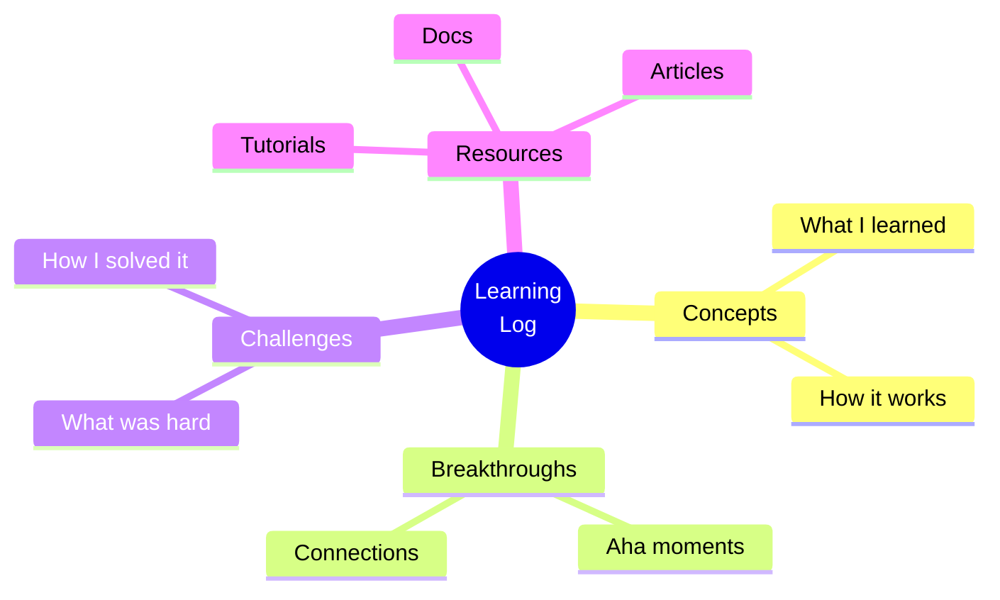
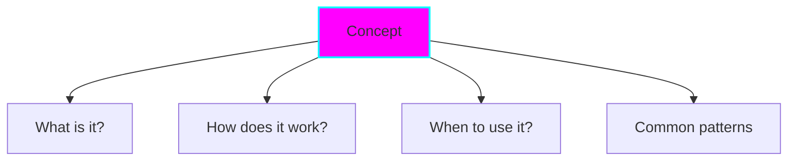
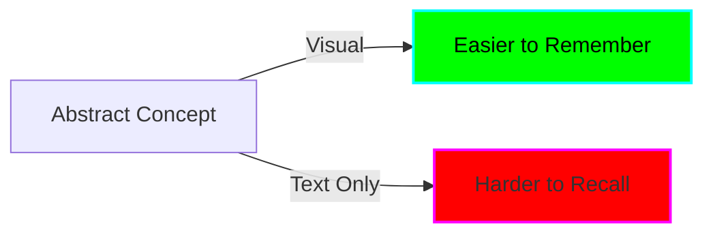
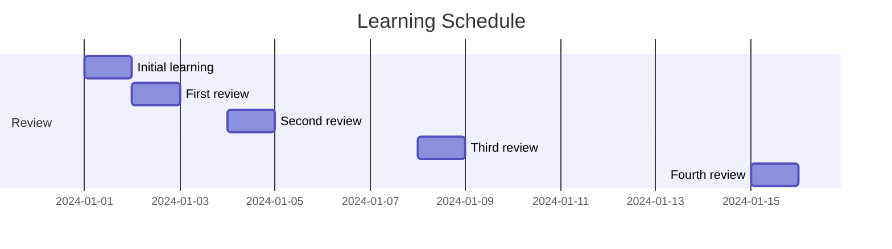
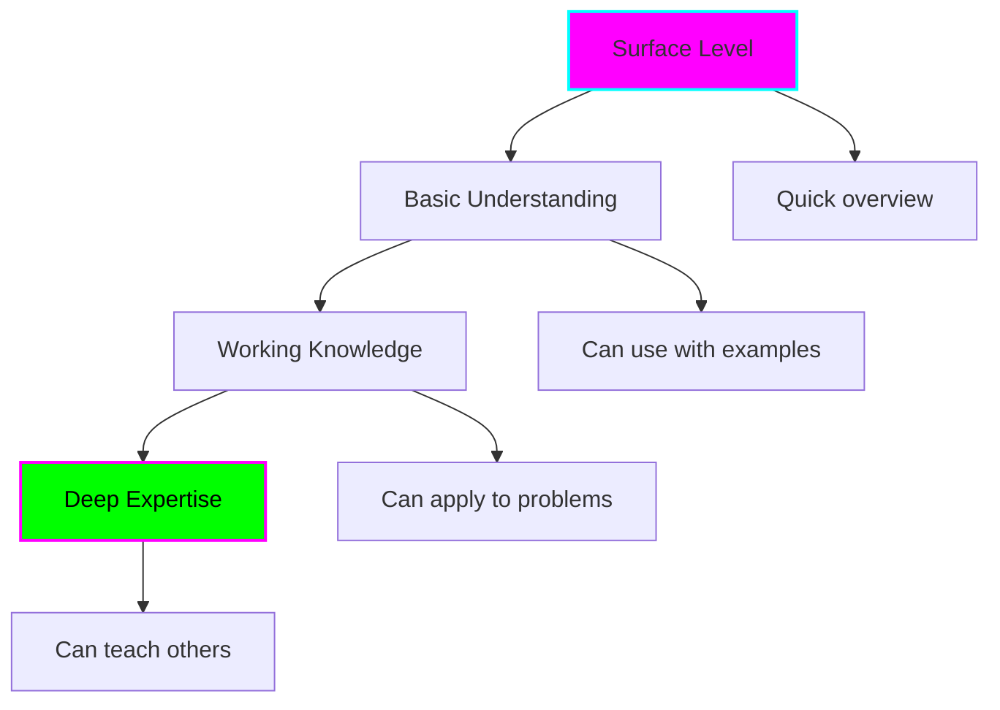

# Learning Log

Document your learning journey. Track concepts, breakthroughs, and challenges.



## Purpose

A learning log helps you:

- 📚 **Retain knowledge** - Writing reinforces learning
- 🔗 **Connect concepts** - See patterns across technologies
- 📈 **Track growth** - See how far you've come
- 🎯 **Focus learning** - Identify gaps and interests
- 💡 **Share insights** - Help others learn from your experience

## Learning Entries

!!! note "Start your learning log"
    Create your first entry when you learn something new!

<!-- Add entries as you learn:

### {Technology/Concept} - {Date}
**Time Spent:** ⏱️ {duration}
**Source:** {Tutorial/Book/Course}

{Brief summary of what you learned}

[Full entry →](../learning-log/entry-name.md)

---
-->

## Entry Template

```markdown
# Learning: {Topic}

**Date:** {YYYY-MM-DD}
**Time Spent:** ⏱️ {duration}
**Source:** [{Title}]({URL})

## TL;DR

{2-3 sentences summarizing key takeaways}

## What I Learned

### {Key Concept 1}

**Before:** I thought {misconception}
**After:** I learned {correct understanding}

**Visual Explanation:**
\`\`\`mermaid
{diagram}
\`\`\`

**Example:**
\`\`\`{language}
{code demonstrating concept}
\`\`\`

### {Key Concept 2}
...

## Aha! Moments 💡

- {Insight that clicked}
- {Connection between concepts}

## Challenges & Solutions

**Challenge:** {What was difficult}
**Why it was hard:** {Root cause}
**Solution:** {How I figured it out}

## Code Examples

\`\`\`{language}
// Annotated example showing concepts
{code with comments}
\`\`\`

## Would I Use This Again?

{Honest assessment}

**Pros:**
- {Benefit}

**Cons:**
- {Limitation}

**Best for:** {Use case}

## Related Topics

- [{Related concept}]({link})
- [{Technology}]({link})

## Next Steps

- [ ] Deep dive into {aspect}
- [ ] Try {related technology}
- [ ] Build {project using this}

## Resources

- [{Tutorial}]({url}) - {Why helpful}
- [{Docs}]({url}) - {What to look for}
```

## Types of Entries

### Concept Understanding

Focus: Understanding a specific concept



**Example topics:**
- Async/await patterns
- Closures in JavaScript
- Ownership in Rust
- Dependency injection

### Technology Exploration

Focus: Learning a new tool/framework/language

**Structure:**
- Overview and purpose
- Key features
- Getting started
- Comparison with alternatives
- Assessment

**Example topics:**
- Learning Deno
- Exploring GraphQL
- Understanding Docker
- Trying out Svelte

### Problem Solving

Focus: How you solved a challenging problem

**Structure:**
- The problem
- Approaches tried
- Solution found
- Why it works
- Lessons learned

**Example topics:**
- Debugging race condition
- Optimizing slow query
- Fixing memory leak
- Handling edge cases

### Pattern Discovery

Focus: Recognizing patterns across contexts

**Structure:**
- Pattern observed
- Where it appears
- Why it's useful
- How to apply it

**Example topics:**
- Builder pattern in different languages
- Error handling strategies
- State management approaches
- API design patterns

## Creating Entries

### Quick Entry (⏱️ 15 min)

For immediate capture:

```bash
cd docs/learning-log
touch quick-{topic}-{date}.md

# Write:
# - What I learned (3-5 bullets)
# - Example code
# - One diagram
```

### Full Entry (⏱️ 45 min)

For comprehensive documentation:

```bash
cd docs/learning-log
cp ../templates/learning-log-template.md {topic}-{date}.md

# Fill in template
# Add diagrams
# Include examples
# Document challenges
```

### Use Claude

```
@doc-writer help me create a learning log entry about {topic}
```

## Best Practices

### Write Immediately

Document while it's fresh! Don't wait until:
- "After I understand it better" - Document the journey
- "When I have time" - You never will
- "After the project" - Too late, you'll forget

### Use Visuals



Every concept deserves a diagram.

### Include Code

Show, don't just tell:

❌ "Map transforms arrays"
✅
```javascript
const numbers = [1, 2, 3];
const doubled = numbers.map(n => n * 2);
// [2, 4, 6]
```

### Document Failures

Failed attempts are valuable:

```markdown
## What Didn't Work

**Attempt 1:** Tried using {approach}
**Result:** {What went wrong}
**Why:** {Root cause}

**Attempt 2:** ...
```

### Make Connections

Link to related entries:

```markdown
## Related Learnings

This builds on [previous topic](./previous-entry.md)
and connects to [related topic](./related-entry.md).
```

## Learning Patterns

### Spaced Repetition

Revisit concepts:



Add to calendar: Review entries 1 day, 3 days, 1 week, 2 weeks later.

### Progressive Depth



Each pass goes deeper:
1. **First pass:** What is it?
2. **Second pass:** How does it work?
3. **Third pass:** Why this way?
4. **Fourth pass:** When to use?

### Teach to Learn

Best way to verify understanding:

```markdown
## Explain Like I'm 5

{Concept explained in simplest terms}

## Teach a Colleague

{How you'd explain this to a peer}
```

## Reflection Prompts

Use these to deepen learning:

### Understanding
- What surprised me most?
- What was harder than expected?
- What clicked easily?

### Application
- Where would I use this?
- What problems does this solve?
- What are the tradeoffs?

### Integration
- How does this relate to what I know?
- What patterns do I see?
- What should I learn next?

## Growth Tracking

### Skills Inventory

Track what you've learned:

```markdown
## Skills Gained

| Technology | Level | Last Used | Notes |
|------------|-------|-----------|-------|
| React | ⭐⭐⭐ | 2024-01 | Comfortable |
| Rust | ⭐⭐ | 2024-01 | Learning |
| Docker | ⭐⭐⭐⭐ | 2024-01 | Proficient |
```

Levels:
- ⭐ Aware (heard of it)
- ⭐⭐ Beginner (can follow tutorial)
- ⭐⭐⭐ Intermediate (can build with it)
- ⭐⭐⭐⭐ Advanced (can solve complex problems)
- ⭐⭐⭐⭐⭐ Expert (can teach others)

### Learning Velocity

Track learning time:

```markdown
## January 2024

- Week 1: 10 hours - Rust basics
- Week 2: 8 hours - Ownership & borrowing
- Week 3: 12 hours - Building CLI tool
- Week 4: 6 hours - Testing & documentation

**Total:** 36 hours
**Focus:** Rust fundamentals
```

## Using Learning Logs

### Before Starting New Project

Review related entries:
- What have I learned about this?
- What worked well before?
- What should I avoid?

### When Stuck

Search your logs:
- Have I seen this pattern?
- Did I solve something similar?
- What resources helped before?

### During Interviews

Your log is your portfolio:
- What have I built?
- What challenges did I overcome?
- What can I speak confidently about?

## Example Entries

### Concept Entry

**Learning: Closures in JavaScript**

- What closures are
- How they work (lexical scoping)
- Common use cases
- Gotchas (memory leaks)
- Code examples

### Technology Entry

**Learning: Deno Runtime**

- What Deno is (Node alternative)
- Key differences from Node
- Built-in features (TypeScript, testing)
- Pros/cons
- Small project built with it

### Problem Solving Entry

**Debugging: Race Condition in API Calls**

- Problem description
- Debugging steps
- Root cause (Promise.all timing)
- Solution (sequential processing)
- Prevention tips

---

**Start documenting your learning today! 📚**
