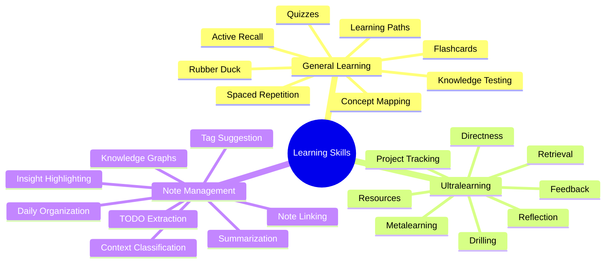
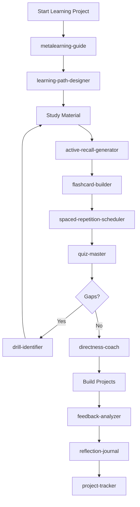
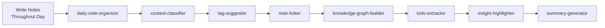

# 📚 Learning & Note Management Skills

Comprehensive skills for maximizing learning, implementing ultralearning projects, and managing daily notes.

## Overview



## 🎓 General Studying & Learning (8 Skills)

### active-recall-generator
Generate questions from material for active recall practice.

**Use when**: Finished reading/watching tutorial, want to test understanding
**MCP**: Memory, Knowledge Graph
**Output**: Formatted questions with hints and detailed answers

### spaced-repetition-scheduler
Smart review scheduling using SM-2 algorithm.

**Use when**: Want to schedule reviews, maintain long-term retention
**MCP**: Memory (essential), Knowledge Graph
**Features**: Automatic interval calculation, performance tracking, adaptive scheduling

### quiz-master
Create comprehensive, adaptive quizzes for assessment.

**Use when**: Want to test knowledge, practice for interviews
**Types**: Multiple choice, code completion, debugging, system design
**Features**: Adaptive difficulty, instant feedback, performance analytics

### concept-mapper
Visual concept maps and knowledge structure visualization.

**Use when**: Understanding relationships, building mental models
**MCP**: Knowledge Graph (essential), Memory
**Output**: Mermaid diagrams, learning paths, prerequisite chains

### rubber-duck-debugger
Solidify understanding through teaching/explanation (Feynman Technique).

**Use when**: Want to deeply understand something, explain concepts
**Method**: Explain to imaginary audience, identify knowledge gaps
**Benefits**: Exposes weak understanding, builds intuition

### learning-path-designer
Design structured, efficient learning roadmaps.

**Use when**: Starting new technology, planning learning journey
**MCP**: Knowledge Graph, Memory, Context7
**Output**: Phased learning plan, milestone projects, resource recommendations

### flashcard-builder
Create effective flashcards for technical concepts.

**Use when**: Need memorization, quick review materials
**MCP**: Memory, Spaced Repetition Scheduler
**Formats**: Anki, CSV, JSON export

### knowledge-tester
Assess comprehension using Bloom's Taxonomy levels.

**Use when**: Want deep assessment, identify knowledge gaps
**Levels**: Remember → Understand → Apply → Analyze → Evaluate → Create
**Output**: Detailed gap analysis, study recommendations

---

## 🚀 Ultralearning (8 Skills)

Based on Scott Young's "Ultralearning" methodology for intense, self-directed learning.

### metalearning-guide
**Principle #1**: Research the best way to learn before starting.

**Use when**: Beginning ultralearning project, planning approach
**Time**: Spend 10% of total project time on research
**Output**: Learning strategy, resource rankings, time allocation, benchmark projects

### directness-coach
**Principle #3**: Learn by doing in the actual context.

**Use when**: Starting practice phase, building projects
**Philosophy**: Don't just read about it - DO it
**Examples**: Build real projects, not just tutorials; conversation practice vs Duolingo

### drill-identifier
**Principle #4**: Attack weakest points through isolated drills.

**Use when**: Identified specific weakness, stuck on one aspect
**Method**: Isolate bottleneck, practice THAT specifically
**Example**: Practice only the array methods you struggle with

### retrieval-practice
**Principle #5**: Test to learn, don't learn then test.

**Use when**: Every study session (20% of time)
**Methods**: Free recall (best), cued recall, recognition (weakest)
**Benefits**: 50%+ better retention than re-reading

### feedback-analyzer
**Principle #6**: Extract signal from noise in feedback.

**Use when**: Received feedback, post-project review
**Categories**: High-signal (act on), medium-signal (consider), low-signal (ignore)
**Output**: Prioritized action plan

### project-tracker
Track progress, hours, and milestones for ultralearning projects.

**Use when**: Managing ultralearning project, weekly reviews
**MCP**: Memory, Knowledge Graph, Context7
**Features**: Progress visualization, time logging, milestone tracking

### resource-curator
Organize and rate learning resources.

**Use when**: Found good resource, overwhelmed by options
**MCP**: Memory, Knowledge Graph
**Rating**: ⭐⭐⭐⭐⭐ (Essential) to ⭐ (Skip)

### reflection-journal
Structured reflection to consolidate learning.

**Use when**: End of day/week/month, stuck or plateaued
**Frequency**: Daily (5 min), Weekly (20 min), Monthly (60 min)
**Output**: Insights, patterns, adjustments, experiments

---

## 📝 Note Management (8 Skills)

Transform daily note chaos into organized, searchable knowledge.

### daily-note-organizer
Parse and categorize daily markdown notes automatically.

**Use when**: End of day note processing, batch organization
**Input**: One messy markdown file per day
**Output**: Organized sections (Learning, Tasks, Ideas, Bugs, Meetings, etc.)
**MCP**: Memory, Knowledge Graph, Context7

### context-classifier
Automatically classify notes into contexts.

**Use when**: Processing notes, building organization
**Contexts**: WORK, LEARNING, PERSONAL, PROJECT, RESEARCH, MEETING, IDEA
**MCP**: Context7 (essential), Memory
**Confidence**: Multi-signal classification with percentage scores

### note-linker
Create bidirectional links between related notes.

**Use when**: Building connections, knowledge graph creation
**MCP**: Knowledge Graph (essential), Memory
**Link Types**: Explains, Builds On, Contradicts, Related
**Features**: Auto-detect mentions, find concept overlaps, backlinks

### knowledge-graph-builder
Build and visualize knowledge graph from notes.

**Use when**: Building knowledge base, visualizing connections
**MCP**: Knowledge Graph (essential), Memory, Context7
**Output**: Mermaid diagrams, interactive graphs, learning paths
**Features**: Node management, relationship tracking, mastery scoring

### tag-suggester
Intelligently suggest tags based on content and patterns.

**Use when**: Adding tags, organizing taxonomy
**Confidence Levels**: High (auto-apply), Medium (review), Low (consider)
**Learning**: Adapts to your tagging patterns over time
**Features**: Tag hierarchy, similar note analysis, maintenance tools

### summary-generator
Generate concise summaries of notes and learning periods.

**Use when**: End of day/week/month, creating reports
**Types**: Daily (2-3 sentences), Weekly (1 page), Monthly (2-3 pages)
**MCP**: Memory, Knowledge Graph
**Output**: Stats, insights, topic clusters, wins/challenges, next steps

### todo-extractor
Extract and organize action items from notes.

**Use when**: Processing notes with tasks, creating task lists
**Patterns**: TODO:, - [ ], FIXME:, Action item:, etc.
**Priority Detection**: Urgent, High, Medium, Low, Someday
**Export**: Markdown, GitHub Issues, task manager APIs

### insight-highlighter
Identify key insights and breakthroughs from notes.

**Use when**: Reviewing notes, creating knowledge summaries
**MCP**: Memory, Knowledge Graph
**Detection**: Breakthrough moments, patterns, misconceptions corrected
**Rating**: ⭐⭐⭐ (Game-changing) to ⭐ (Notable)

---

## 🔄 Workflow Integration

### Complete Learning Workflow



### Daily Note Workflow



## MCP Server Requirements

### Essential MCP Servers

**Memory MCP** (Used by: 20/24 skills)
- Store and retrieve structured data
- Query with filters
- Track history and patterns

**Knowledge Graph MCP** (Used by: 16/24 skills)
- Store nodes and relationships
- Query paths and connections
- Build learning maps

**Context7 MCP** (Used by: 12/24 skills)
- Maintain context across sessions
- Track learning journeys
- Personalize recommendations

### Optional but Recommended

**Sequential Thinking MCP**
- Chain of thought reasoning
- Complex problem solving

**Self-Learning Server**
- Autonomous pattern recognition
- Continuous improvement

## 🎯 Use Cases

### Software Engineer Learning React

```markdown
**Week 1: Foundation**
1. metalearning-guide → Research best React learning path
2. learning-path-designer → Create 8-week plan
3. concept-mapper → Visualize React ecosystem
4. Study → Follow primary resources
5. active-recall-generator → Create questions daily
6. daily-note-organizer → Process learning notes
7. reflection-journal → Weekly review

**Week 2-7: Deep Learning**
- directness-coach → Build real projects
- drill-identifier → Practice weak areas
- retrieval-practice → Daily testing
- quiz-master → Weekly assessments
- feedback-analyzer → Process code reviews
- project-tracker → Track 100-hour goal

**Week 8: Mastery**
- knowledge-tester → Final assessment
- summary-generator → Create learning summary
- knowledge-graph-builder → Visualize mastery
```

### Daily Note Management

```markdown
**Throughout Day**:
- Write freely in single markdown file
- Don't organize while capturing

**End of Day (10 min)**:
1. daily-note-organizer → Auto-categorize
2. context-classifier → Add contexts
3. tag-suggester → Apply tags
4. todo-extractor → Create task list
5. insight-highlighter → Capture learnings

**Weekly (30 min)**:
1. note-linker → Build connections
2. knowledge-graph-builder → Update graph
3. summary-generator → Week in review
4. reflection-journal → Meta-analysis
```

## 📊 Skill Comparison

| Feature | General Learning | Ultralearning | Note Management |
|---------|-----------------|---------------|-----------------|
| **Focus** | Techniques | Project-based | Organization |
| **Duration** | Ongoing | Time-boxed | Daily |
| **Intensity** | Moderate | High | Low |
| **Structure** | Flexible | Rigid phases | Automated |
| **Goal** | Retention | Rapid mastery | Retrieval |

## 🎓 Best Practices

### For ADHD-Friendly Learning

**General Learning**:
- 5-minute quiz sessions
- Visual progress bars
- Immediate feedback
- Gamification

**Ultralearning**:
- Time-box everything
- Clear milestones
- Daily wins
- Flexible adjustments

**Note Management**:
- One-click organization
- Auto-categorization
- Visual summaries
- Batch processing

### Integration Tips

1. **Start Small**: Use 2-3 skills, not all at once
2. **Build Habits**: Daily note organization, weekly reflection
3. **Trust Automation**: Let MCP servers handle connections
4. **Review Regularly**: Monthly skill usage review
5. **Customize**: Edit skills to fit your workflow

## 📚 Resources

**Books**:
- "Ultralearning" by Scott Young
- "Make It Stick" by Brown, Roediger & McDaniel
- "How We Learn" by Benedict Carey

**Research**:
- Spaced repetition studies
- Active recall effectiveness
- Knowledge graph applications

**Tools**:
- Anki (flashcards)
- Obsidian (note linking)
- RemNote (spaced repetition + notes)

---

<p align="center">
  <strong>🧠 Master Your Learning Journey!</strong><br>
  24 specialized skills for accelerated learning and perfect note organization.
</p>
