# Advanced Go Learning - 20 Progressive Projects

**Status:** 🚧 In Progress
**Location:** `/projects/advanced-go-learning/`
**Level:** Medium → Expert
**Duration:** 8-12 weeks

## 🎯 Overview

A comprehensive learning path through 20 progressively complex Go projects, designed to take you from medium-level competency to expert-level mastery of advanced Go concepts.

## 🗺️ Learning Path

```mermaid
graph LR
    A[🟢 Medium<br/>1-5] --> B[🟡 Advanced<br/>6-10]
    B --> C[🟠 Expert<br/>11-15]
    C --> D[🔴 Expert+<br/>16-20]

    style A fill:#00ff00,stroke:#00ffff,stroke-width:2px
    style B fill:#ffff00,stroke:#00ffff,stroke-width:2px
    style C fill:#ff9900,stroke:#00ffff,stroke-width:2px
    style D fill:#ff0000,stroke:#00ffff,stroke-width:2px
```



## 📚 All 20 Projects

### 🟢 Level 1: Medium (Projects 1-5)

| # | Project | Key Concepts | Time |
|---|---------|--------------|------|
| 01 | [Custom Memory Allocator](../../projects/advanced-go-learning/01-custom-memory-allocator/) | sync.Pool, arena, slab, unsafe | 8-10h |
| 02 | [Concurrent Cache](../../projects/advanced-go-learning/02-concurrent-cache/) | RWMutex, sharding, LRU, TTL | 6-8h |
| 03 | [Reflection Validator](../../projects/advanced-go-learning/03-reflection-validator/) | Reflection, struct tags, validation | 6-8h |
| 04 | [Context Patterns](../../projects/advanced-go-learning/04-context-patterns/) | Context, cancellation, deadlines | 5-7h |
| 05 | [Custom Error Handling](../../projects/advanced-go-learning/05-custom-error-handling/) | Error wrapping, stack traces | 5-7h |

### 🟡 Level 2: Advanced (Projects 6-10)

| # | Project | Key Concepts | Time |
|---|---------|--------------|------|
| 06 | [Generic Data Structures](../../projects/advanced-go-learning/06-generics-data-structures/) | Generics, type constraints | 8-10h |
| 07 | [Channel Patterns](../../projects/advanced-go-learning/07-channel-patterns/) | Pipelines, fan-out/in, select | 8-10h |
| 08 | [Custom HTTP Middleware](../../projects/advanced-go-learning/08-custom-http-middleware/) | Middleware chain, closures | 6-8h |
| 09 | [Worker Pool](../../projects/advanced-go-learning/09-worker-pool/) | Concurrency control, backpressure | 8-10h |
| 10 | [Rate Limiter](../../projects/advanced-go-learning/10-rate-limiter/) | Token bucket, sliding window | 8-10h |

### 🟠 Level 3: Expert (Projects 11-15)

| # | Project | Key Concepts | Time |
|---|---------|--------------|------|
| 11 | [Database Connection Pool](../../projects/advanced-go-learning/11-database-connection-pool/) | Resource management, health checks | 10-12h |
| 12 | [Distributed Cache](../../projects/advanced-go-learning/12-distributed-cache/) | Consistent hashing, replication | 12-15h |
| 13 | [Custom Scheduler](../../projects/advanced-go-learning/13-custom-scheduler/) | Work stealing, goroutine scheduling | 12-15h |
| 14 | [Memory-Mapped Files](../../projects/advanced-go-learning/14-memory-mapped-files/) | mmap, syscalls, zero-copy | 10-12h |
| 15 | [Lock-Free Structures](../../projects/advanced-go-learning/15-lock-free-structures/) | CAS, atomic operations, ABA problem | 15-18h |

### 🔴 Level 4: Expert+ (Projects 16-20)

| # | Project | Key Concepts | Time |
|---|---------|--------------|------|
| 16 | [Custom Garbage Collector](../../projects/advanced-go-learning/16-custom-garbage-collector/) | Mark-sweep, tri-color marking | 20-25h |
| 17 | [Compiler Plugin](../../projects/advanced-go-learning/17-compiler-plugin/) | AST, code generation | 18-22h |
| 18 | [Network Protocol](../../projects/advanced-go-learning/18-network-protocol/) | Binary protocols, state machines | 15-20h |
| 19 | [Distributed Consensus](../../projects/advanced-go-learning/19-distributed-consensus/) | Raft, leader election, replication | 25-30h |
| 20 | [JIT Compiler](../../projects/advanced-go-learning/20-jit-compiler/) | Runtime compilation, assembly | 30-40h |

## 🎓 Key Topics Covered

### Memory & Performance
- Custom allocators (pool, arena, slab)
- Memory-mapped files
- Lock-free data structures
- Garbage collection internals
- JIT compilation

### Concurrency & Parallelism
- Advanced synchronization primitives
- Channel patterns and pipelines
- Worker pools and scheduling
- Distributed systems
- Consensus algorithms

### Type System & Reflection
- Generics and constraints
- Reflection and struct tags
- Unsafe operations
- Code generation

### Systems Programming
- Network protocols
- Compiler internals
- AST manipulation
- Low-level I/O

## 📅 12-Week Study Plan


### Weekly Breakdown

**Weeks 1-3: Foundation** (Medium Level)
- Build fundamental skills in memory management, concurrency, and reflection
- Focus: sync.Pool, RWMutex, context patterns

**Weeks 4-6: Advanced Patterns** (Advanced Level)
- Master generics, channel patterns, and production-ready components
- Focus: Type constraints, middleware, worker pools

**Weeks 7-9: Systems Programming** (Expert Level)
- Dive into low-level programming and distributed systems
- Focus: Connection pools, consistent hashing, lock-free structures

**Weeks 10-12: Compiler & Runtime** (Expert+ Level)
- Explore compiler internals and runtime systems
- Focus: GC, AST, consensus, JIT

## 🛠️ Tools You'll Use

- **go tool pprof** - CPU/Memory profiling
- **go tool trace** - Execution tracing
- **go test -race** - Race detector
- **go tool compile -S** - View assembly
- **dlv** (Delve) - Advanced debugging

## 📖 Learning Approach

For each project:

1. **📚 Read** - Study the README and concepts (30 min)
2. **🔍 Explore** - Examine the implementation (1 hour)
3. **💻 Code** - Implement your own version (3-6 hours)
4. **🧪 Test** - Write tests and benchmarks (1-2 hours)
5. **📊 Optimize** - Profile and improve (1 hour)
6. **📝 Document** - Write what you learned (30 min)

## ✅ Progress Tracking

### Level 1: Medium (1-5)
- [ ] 01 - Custom Memory Allocator
- [ ] 02 - Concurrent Cache
- [ ] 03 - Reflection Validator
- [ ] 04 - Context Patterns
- [ ] 05 - Custom Error Handling

### Level 2: Advanced (6-10)
- [ ] 06 - Generic Data Structures
- [ ] 07 - Channel Patterns
- [ ] 08 - Custom HTTP Middleware
- [ ] 09 - Worker Pool
- [ ] 10 - Rate Limiter

### Level 3: Expert (11-15)
- [ ] 11 - Database Connection Pool
- [ ] 12 - Distributed Cache
- [ ] 13 - Custom Scheduler
- [ ] 14 - Memory-Mapped Files
- [ ] 15 - Lock-Free Structures

### Level 4: Expert+ (16-20)
- [ ] 16 - Custom Garbage Collector
- [ ] 17 - Compiler Plugin
- [ ] 18 - Network Protocol
- [ ] 19 - Distributed Consensus
- [ ] 20 - JIT Compiler

## 🚀 Getting Started

```bash
# Navigate to project
cd projects/advanced-go-learning

# Start with Project 01
cd 01-custom-memory-allocator

# Read the documentation
cat README.md

# Run the examples
go run examples/main.go

# Run tests
go test -v

# Run benchmarks
go test -bench=. -benchmem
```

## 📈 Success Metrics

Track these metrics for each project:
- **Completion time** vs estimate
- **Test coverage** (aim for >80%)
- **Benchmark results** (before/after optimization)
- **Concepts mastered** (checklist in each README)

## 🎯 Graduation Criteria

This project is ready to graduate when:
- ✅ All 20 projects completed
- ✅ >80% test coverage across all projects
- ✅ All benchmarks run successfully
- ✅ Learning journal completed
- ✅ Can explain each concept clearly

## 📚 Additional Resources

### Essential Reading
- [Go Source Code](https://go.dev/src/)
- [Effective Go](https://go.dev/doc/effective_go)
- [Go Memory Model](https://go.dev/ref/mem)

### Recommended Books
- "The Go Programming Language" (Donovan & Kernighan)
- "Concurrency in Go" (Katherine Cox-Buday)
- "Writing An Interpreter/Compiler In Go" (Thorsten Ball)

## 💡 Tips for Success

### ADHD-Friendly Approach
✅ **Do:**
- Time-box each project (use a timer!)
- Take 15-min breaks every hour
- Complete one project before starting next
- Update progress checklist immediately
- Celebrate small wins

❌ **Avoid:**
- Jumping between projects
- Perfectionism - get it working first
- Skipping tests and benchmarks
- Multi-tasking

## 🔗 Related Projects

- [Language Models from Scratch](./language-models.md)
- [Model Fine-Tuning Techniques](./model-finetuning.md)

---

**Start your journey:** [Project 01 - Custom Memory Allocator](../../projects/advanced-go-learning/01-custom-memory-allocator/README.md)
