# Projects

Mature experiments that have graduated to structured projects. These are candidates for eventual graduation to their own repositories.

```mermaid
graph TD
    A[Projects] --> B[🚧 In Development]
    A --> C[✅ Stable]
    A --> D[📦 Graduated]

    B --> E[Active work]
    C --> F[Production-ready]
    D --> G[Own repository]

    style A fill:#ff00ff,stroke:#00ffff,stroke-width:3px
    style B fill:#ffff00,stroke:#ff00ff,stroke-width:2px,color:#000
    style C fill:#00ff00,stroke:#ff00ff,stroke-width:2px,color:#000
    style D fill:#00ffff,stroke:#ff00ff,stroke-width:2px,color:#000
```



## What Goes Here?

Projects are for experiments that have proven their worth and need:

- **Structure** - Organized code, tests, documentation
- **Stability** - Reliable, tested functionality
- **Reusability** - Might be used by others
- **Longevity** - Worth maintaining

## Active Projects

### 🚧 RAG Learning Project
**Tech:** Python 3.12, LangChain, ChromaDB, OpenAI/Ollama
**Purpose:** Learn Retrieval-Augmented Generation from scratch
**Status:** 🚧 In Progress
**Started:** 2025-11-04

A comprehensive learning project that teaches you how to build RAG (Retrieval-Augmented Generation) systems. Includes three progressively advanced examples with detailed educational content, sample data, and support for both local (Ollama) and cloud (OpenAI) LLMs.

[View details](rag-learning-project.md) | [Source](../../projects/rag-learning-project/)

---

### 🚧 TickTick Priority Agent
**Tech:** Python 3.12, LangChain, Ollama, TickTick API
**Purpose:** AI agent that helps prioritize your tasks
**Status:** 🚧 In Progress
**Started:** 2025-11-04

An intelligent agent built with LangChain that connects to your TickTick account and helps you prioritize tasks using AI. Demonstrates agent architecture, tool integration, API authentication, and practical prompt engineering. Great for learning how to build autonomous AI agents.

[View details](ticktick-priority-agent.md) | [Source](../../projects/ticktick-priority-agent/)

---

## Project Lifecycle

```mermaid
stateDiagram-v2
    [*] --> Experimental: Create from experiment
    Experimental --> InProgress: Add structure
    InProgress --> Stable: Tests + docs complete
    Stable --> Graduated: Move to own repo
    Graduated --> [*]

    note right of Experimental: 🧪 Just promoted
    note right of InProgress: 🚧 Active development
    note right of Stable: ✅ Production-ready
    note right of Graduated: 📦 Moved out
```



### Status Definitions

| Status | Meaning | Criteria |
|--------|---------|----------|
| 🧪 **Experimental** | Just promoted | Experiment showed promise |
| 🚧 **In Progress** | Active development | Core features being built |
| ✅ **Stable** | Production-ready | Tests pass, docs complete |
| 📦 **Graduated** | Own repository | Moved to standalone repo |

## Creating a Project

### Option 1: From Template

```bash
cp -r templates/project-template projects/my-project
cd projects/my-project

# Customize README.md
# Setup environment
# Start building
```

### Option 2: Promote Experiment

```bash
# Copy experiment to projects
cp -r experiments/successful-poc projects/my-project
cd projects/my-project

# Add structure
mkdir -p src tests docs
mv *.{ext} src/

# Copy README template and fill it out
```

### Option 3: Use Claude

```
@experiment-guide help me set up a project for {description}
```

## Project Structure

```
projects/my-project/
├── src/               # Source code
│   ├── index.{ext}
│   └── ...
├── tests/             # Test files
│   └── ...
├── docs/              # Project-specific docs
│   └── ...
├── .{env-file}        # Environment config
├── {package-file}     # Dependencies
├── .gitignore
└── README.md          # Full documentation
```

## Documentation Requirements

Every project MUST have a comprehensive README with:

### Required Sections

1. **Header** - Name, status, tech stack
2. **Overview** - What does it do?
3. **Architecture** - Mermaid diagram
4. **Quick Start** - How to run it
5. **Features** - What's implemented
6. **How It Works** - Key concepts
7. **Learning Log** - What you learned
8. **Next Steps** - What's planned
9. **Graduation Criteria** - Checklist for readiness

See [Templates](../templates/project-template.md) for full template.

## Graduation Criteria

Before moving a project to its own repository, ensure:

```markdown
## Graduation Checklist

### Code Quality
- [ ] Core functionality complete
- [ ] Tests written and passing
- [ ] Error handling implemented
- [ ] Code reviewed and cleaned up

### Documentation
- [ ] README comprehensive
- [ ] API documented (if applicable)
- [ ] Setup instructions clear
- [ ] Examples provided

### Readiness
- [ ] No critical TODOs
- [ ] Dependencies up to date
- [ ] License chosen
- [ ] Ready to share publicly

### Testing
- [ ] Manual testing complete
- [ ] Edge cases handled
- [ ] Performance acceptable
```

## Graduation Process

When ready to graduate:

### 1. Create New Repository

```bash
# On GitHub, create new repository
# - Public or private
# - Add README, .gitignore, license
```

### 2. Copy Project Files

```bash
# Option A: Simple copy (loses git history)
cd projects/my-project
# Copy all files to new repo

# Option B: Preserve git history (advanced)
git filter-branch --subdirectory-filter projects/my-project -- --all
# Then push to new repo
```

### 3. Update fantastic-engine

```bash
# Move to graduated folder
mkdir -p projects/graduated
mv projects/my-project projects/graduated/

# Update README
echo "📦 Graduated to: https://github.com/user/new-repo" >> projects/graduated/my-project/README.md
```

### 4. Update Documentation

Add to graduated projects list below.

## Graduated Projects

🎓 Projects that have moved to their own repositories:

<!-- Template:

### 📦 project-name
**Graduated:** {Date}
**Repository:** [github.com/user/project-name](https://github.com/user/project-name)
**Description:** {What it is}

---
-->

!!! success "Congratulations!"
    Graduated projects show this workflow works! 🎉

## Best Practices

### Version Control

Use semantic commits:

```bash
git commit -m "feat: add user authentication"
git commit -m "fix: resolve rate limiting issue"
git commit -m "docs: update API documentation"
git commit -m "test: add integration tests"
```

### Testing Strategy


Start with unit tests, add integration tests as project grows.

### Documentation Updates

Update docs with each significant change:

```bash
# After adding feature
git commit -m "feat: add export functionality"
# Update README features section
git commit -m "docs: add export feature to README"
```

### Performance Tracking

For long-running projects, track performance:

```markdown
## Performance Notes

- **Startup time:** ~2s
- **API response:** <100ms avg
- **Memory usage:** ~50MB
- **Tested with:** {scale/load info}
```

## Project Ideas

### Tools
- CLI utilities
- Development tools
- Automation scripts
- Code generators

### APIs & Services
- REST APIs
- GraphQL servers
- Webhooks
- Background workers

### Libraries
- Reusable components
- Helper functions
- Framework extensions
- Protocol implementations

### Applications
- Web apps
- Desktop apps
- Mobile apps
- Browser extensions

## Getting Help

Use custom Claude agents:

- **@experiment-guide** - Project setup and structure
- **@brainstorm-buddy** - Feature planning
- **@doc-writer** - Documentation help
- **@learn-assistant** - Understanding new concepts

## Anti-Patterns

### ❌ Avoid

**Premature Structure**
Don't add complexity before you need it. Start in experiments/, promote when ready.

**Scope Creep**
Define clear goals. Use "Next Steps" section for future ideas.

**Poor Documentation**
Don't wait until "later" to document. Do it as you build.

**Skipping Tests**
Tests are graduation criteria. Write them progressively.

## Resources

- [Project Template](../templates/project-template.md)
- [Documentation Guide](../templates/documentation.md)
- [Quick Start Guide](../getting-started/quick-start.md)

---

**Ready to build something substantial? Start now! 🚀**
