# RAG Learning Project

**Status:** 🚧 In Progress
**Location:** `projects/rag-learning-project/`
**Tech Stack:** Python 3.12, LangChain, ChromaDB, OpenAI/Ollama

## Quick Links

- [Project README](../../projects/rag-learning-project/README.md)
- [Source Code](../../projects/rag-learning-project/src/)
- [Sample Data](../../projects/rag-learning-project/data/)

## What You'll Learn

This project teaches you **Retrieval-Augmented Generation (RAG)** from the ground up:

```mermaid
graph TD
    A[📚 Learn RAG Concepts] --> B[🔧 Build Basic RAG]
    B --> C[💬 Interactive RAG]
    C --> D[🚀 Advanced Features]

    style A fill:#ff00ff
    style B fill:#00ffff
    style C fill:#00ff00
    style D fill:#ffff00
```



### Core Concepts Covered

1. **Embeddings** - Converting text to numerical vectors
2. **Vector Databases** - Storing and searching embeddings (ChromaDB)
3. **Text Chunking** - Splitting documents optimally
4. **Similarity Search** - Finding relevant information
5. **LLM Integration** - Generating answers with context

## Project Structure

```
rag-learning-project/
├── src/
│   ├── basic_rag.py        # Start here! Simplest RAG
│   ├── interactive_rag.py  # See what's happening
│   └── advanced_rag.py     # Production features
├── data/
│   └── create_sample_data.py  # AI/ML sample docs
└── requirements.txt
```

## Quick Start

```bash
cd projects/rag-learning-project

# Setup
uv venv && source .venv/bin/activate
pip install -r requirements.txt

# Configure (choose Ollama or OpenAI)
cp .env.example .env
# Edit .env with your settings

# Create sample data
python data/create_sample_data.py

# Run!
python src/basic_rag.py
```

## Learning Path

### Step 1: Understand RAG (15 min)

Read the [project README](../../projects/rag-learning-project/README.md) to understand:
- What is RAG?
- Why use RAG over fine-tuning?
- Key components of a RAG system

### Step 2: Basic RAG (30 min)

Run `src/basic_rag.py` and follow along:

```python
# The RAG pipeline:
documents → chunks → embeddings → vector DB → retrieval → LLM → answer
```

**Watch for:**
- How documents are split
- How embeddings are created
- How similarity search works

### Step 3: Interactive RAG (30 min)

Run `src/interactive_rag.py` to see:
- Which chunks are retrieved for your queries
- Similarity scores
- The actual prompt sent to the LLM
- How query formulation affects results

### Step 4: Build Your Own (open-ended)

Ideas to try:
- Add your own documents
- Experiment with chunk sizes
- Try different embedding models
- Compare retrieval strategies

## Key Takeaways

!!! tip "When to Use RAG"
    - Your data changes frequently
    - You have private/proprietary data
    - You need sources/citations
    - Fine-tuning is too expensive

!!! warning "RAG Limitations"
    - Requires good document quality
    - Chunk size tuning is crucial
    - Can retrieve irrelevant context
    - Costs API calls (if using cloud LLMs)

## Next Steps

- [ ] Complete all three examples
- [ ] Try with your own documents
- [ ] Experiment with parameters
- [ ] Read academic papers (see README)
- [ ] Build evaluation metrics

## Resources

- [LangChain RAG Tutorial](https://python.langchain.com/docs/use_cases/question_answering/)
- [ChromaDB Docs](https://docs.trychroma.com/)
- [RAG Paper](https://arxiv.org/abs/2005.11401)

---

*This project is part of the [Fantastic Engine](../../index.md) experiments repository.*
