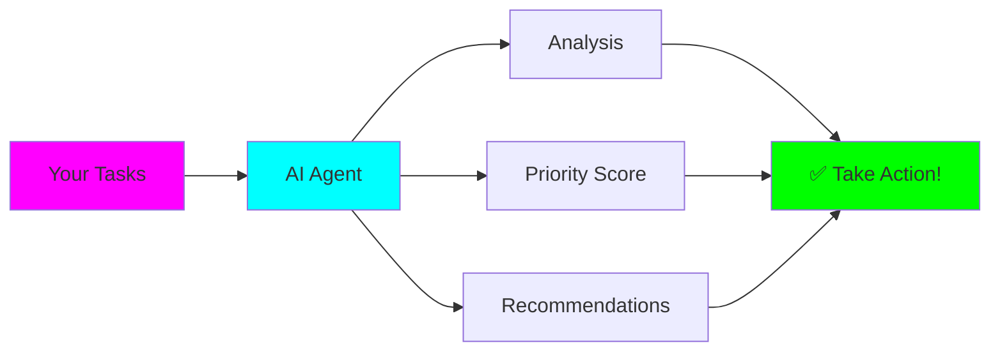
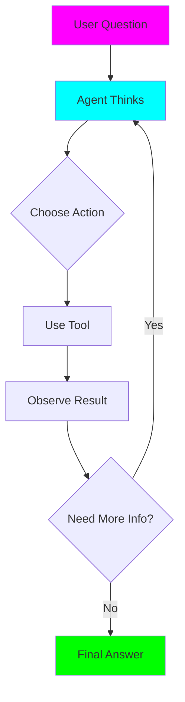

# TickTick Priority Agent

**Status:** 🚧 In Progress
**Location:** `projects/ticktick-priority-agent/`
**Tech Stack:** Python 3.12, LangChain, Ollama, TickTick API

## Quick Links

- [Project README](../../projects/ticktick-priority-agent/README.md)
- [Source Code](../../projects/ticktick-priority-agent/src/)
- [Examples](../../projects/ticktick-priority-agent/examples/)

## What You'll Learn

Build an AI agent that helps you prioritize tasks using **LangChain Agents** and the **TickTick API**:



### Core Concepts Covered

1. **LangChain Agents** - Autonomous decision-making
2. **Tool Integration** - Connecting LLMs to APIs
3. **ReAct Pattern** - Reasoning + Acting loop
4. **API Authentication** - OAuth 2.0 flow
5. **Prompt Engineering** - Guiding agent behavior

## Project Structure

```
ticktick-priority-agent/
├── src/
│   ├── api_client.py        # TickTick API wrapper
│   ├── ticktick_tools.py    # LangChain tools
│   └── priority_agent.py    # Main agent
├── examples/
│   └── simple_agent.py      # Start here!
└── requirements.txt
```

## Quick Start

```bash
cd projects/ticktick-priority-agent

# Setup
uv venv && source .venv/bin/activate
pip install -r requirements.txt

# Configure
cp .env.example .env
# Add your TickTick credentials

# Make sure Ollama is running
ollama serve
ollama pull llama2

# Run simple example first
python examples/simple_agent.py

# Then run the full agent
python src/priority_agent.py
```

## Learning Path

### Step 1: Understand Agents (20 min)

**Key Difference: Agents vs. Chains**

```python
# Chain: Fixed sequence
chain = fetch_tasks | analyze | prioritize

# Agent: Decides dynamically
"Hmm, I need task info. Let me use fetch_tasks tool..."
"Now I should analyze the urgent ones..."
"Maybe I should get statistics first..."
```

Read: [project README](../../projects/ticktick-priority-agent/README.md)

### Step 2: Simple Agent Example (30 min)

Run `examples/simple_agent.py`:

```bash
python examples/simple_agent.py
```

Watch how the agent:
1. Reads the question
2. **Thinks** about what to do
3. **Acts** by using a tool
4. **Observes** the result
5. Repeats until it has an answer

### Step 3: TickTick API (30 min)

Explore `src/api_client.py`:
- OAuth 2.0 authentication
- API request handling
- Rate limiting
- Error handling

**Test it:**
```bash
python src/api_client.py
```

### Step 4: Full Priority Agent (1 hour)

Run `src/priority_agent.py`:

```bash
python src/priority_agent.py
```

Try asking:
- "What should I work on next?"
- "Which tasks are overdue?"
- "Give me some quick wins"
- "What's most urgent?"

## How It Works

### The ReAct Loop



### Priority Analysis

The agent considers:

| Factor | Weight | Criteria |
|--------|--------|----------|
| **Urgency** | 50% | Due date, overdue status |
| **Importance** | 30% | Priority level, tags |
| **Complexity** | 20% | Quick wins vs. big projects |

### Available Tools

1. **fetch_tasks** - Get all tasks from TickTick
2. **analyze_task** - Deep analysis of specific task
3. **get_statistics** - Overview of task breakdown

## Key Insights

!!! tip "Agent Prompting"
    The system prompt is CRITICAL:
    - Define the agent's role clearly
    - Explain each tool in detail
    - Provide reasoning examples
    - Set behavioral guidelines

!!! warning "Common Pitfalls"
    - Tool descriptions too vague → Agent confused
    - Too many tools → Analysis paralysis
    - No max iterations → Infinite loops
    - Poor error handling → Crashes

!!! success "Best Practices"
    - Start with 2-3 tools maximum
    - Test tools individually first
    - Use verbose mode while learning
    - Cache API responses

## Customization Ideas

### Add Custom Priority Criteria

```python
def _calculate_energy_match(self, task: Dict, time_of_day: str) -> float:
    """Match tasks to your energy level."""
    complexity = self._estimate_complexity(task)

    if time_of_day == "morning" and complexity == "High":
        return 10.0  # Tackle hard stuff when fresh
    elif time_of_day == "afternoon" and complexity == "Low":
        return 8.0  # Quick wins for afternoon slump

    return 5.0
```

### Add New Tools

```python
Tool(
    name="suggest_schedule",
    func=self.suggest_schedule_tool,
    description="Suggest specific times to work on tasks based on deadlines and calendar"
)
```

### Tune the Agent Prompt

Experiment with different personalities:
- Strict taskmaster
- Encouraging coach
- Eisenhower Matrix enforcer
- GTD methodology guide

## Next Steps

- [ ] Run all examples
- [ ] Connect your TickTick account
- [ ] Try different queries
- [ ] Customize priority algorithm
- [ ] Add your own tools
- [ ] Experiment with agent prompts

## Troubleshooting

### Agent keeps using wrong tool?

→ Improve tool descriptions with examples

### Agent gets stuck in loops?

→ Set `max_iterations` lower (try 3-4)

### TickTick authentication fails?

→ Check credentials, API app settings

### Ollama errors?

→ Ensure `ollama serve` is running, model is pulled

## Resources

- [LangChain Agents Docs](https://python.langchain.com/docs/modules/agents/)
- [ReAct Paper](https://arxiv.org/abs/2210.03629)
- [TickTick API Docs](https://developer.ticktick.com/api)

---

*This project is part of the [Fantastic Engine](../../index.md) experiments repository.*
