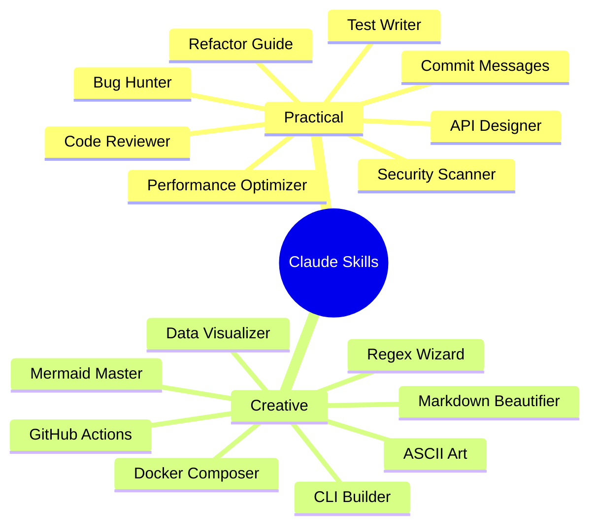
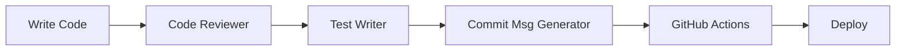
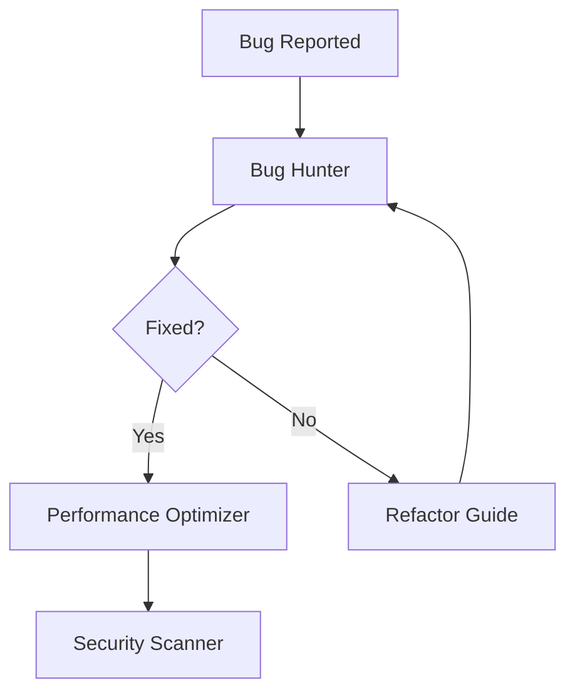
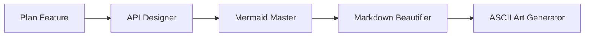
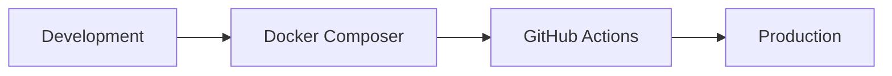

# 🎯 Claude Skills Collection

A comprehensive collection of practical and experimental Claude Skills for daily development tasks.

## 📊 Overview



## What Are Claude Skills?

Claude Skills are modular capabilities that extend Claude Code's functionality. Each skill is a folder containing instructions, examples, and best practices that Claude automatically loads when relevant to your task.

### How They Work

1. **Automatic Activation**: Claude detects when a skill is needed based on your request
2. **Lightweight**: Skills use only 30-50 tokens until loaded
3. **Context-Aware**: Full skill content loads only when relevant
4. **No Manual Selection**: Just describe your task naturally

## 🛠️ Practical Skills (Daily Use)

### Code Reviewer

**Purpose:** Automated code review with best practices and security checks

**Activates when you:**
- Ask for code review
- Request feedback on implementation
- Mention "review", "feedback", or "check my code"

**Features:**
- OWASP Top 10 security checks
- Code quality analysis
- Performance optimization suggestions
- Prioritized findings (Critical, High, Medium, Low)
- Specific file:line references

**Example Usage:**
```
"Review my authentication code"
"Check this API endpoint for security issues"
"Give me feedback on this function"
```

---

### Commit Message Generator

**Purpose:** Write clear, conventional commit messages that follow best practices

**Activates when you:**
- Ask for commit message help
- Mention "commit message" or "git commit"
- Request changelog help

**Features:**
- Conventional Commits format
- Proper type categorization (feat, fix, docs, etc.)
- Body and footer when needed
- Issue linking
- Breaking change notation

**Example Usage:**
```
"Write a commit message for my changes"
"Help me commit this authentication feature"
"Generate changelog-friendly commit message"
```

---

### Bug Hunter

**Purpose:** Systematic debugging assistance to track down and fix bugs

**Activates when you:**
- Report a bug or error
- Show error messages or stack traces
- Ask "why isn't this working?"

**Features:**
- Structured investigation process
- Root cause analysis
- Quick fix vs proper fix
- Prevention strategies
- Common bug patterns database

**Example Usage:**
```
"This authentication is failing"
"Help me debug this error: [error message]"
"Why isn't my API returning data?"
```

---

### Test Writer

**Purpose:** Generate comprehensive, maintainable tests for any codebase

**Activates when you:**
- Ask to write tests
- Mention "unit test", "integration test", "e2e test"
- Want to improve code coverage

**Features:**
- Framework auto-detection (Jest, pytest, etc.)
- AAA pattern (Arrange, Act, Assert)
- Edge case identification
- Mock/stub examples
- Test coverage planning

**Example Usage:**
```
"Write tests for my user authentication"
"Create unit tests for this function"
"How do I test this async code?"
```

---

### Refactor Guide

**Purpose:** Identify refactoring opportunities and guide code improvements

**Activates when you:**
- Ask to refactor code
- Mention "clean up", "improve", "optimize structure"
- Say code is "messy" or "duplicated"

**Features:**
- Code smell detection
- Step-by-step refactoring plans
- Before/after comparisons
- Common refactoring patterns
- Safety checklists

**Example Usage:**
```
"Refactor this messy function"
"How can I improve this code structure?"
"This has too much duplication"
```

---

### API Designer

**Purpose:** Design clean, consistent, and developer-friendly APIs

**Activates when you:**
- Ask to design an API
- Mention "REST API", "GraphQL", "API endpoints"
- Want API best practices

**Features:**
- RESTful conventions
- HTTP status codes
- Pagination patterns
- Error handling
- Authentication/authorization
- OpenAPI/Swagger specs

**Example Usage:**
```
"Design a REST API for user management"
"Help me structure these API endpoints"
"What's the best way to handle API errors?"
```

---

### Security Scanner

**Purpose:** Identify and fix common security vulnerabilities

**Activates when you:**
- Ask for security review
- Mention "security audit", "vulnerabilities"
- Ask "is this secure?"

**Features:**
- OWASP Top 10 checklist
- SQL injection detection
- XSS prevention
- Authentication issues
- Secrets exposure
- Severity categorization

**Example Usage:**
```
"Security audit this authentication code"
"Is my password handling secure?"
"Check for SQL injection vulnerabilities"
```

---

### Performance Optimizer

**Purpose:** Identify and fix performance bottlenecks

**Activates when you:**
- Complain about slow performance
- Mention "performance", "slow", "speed up"
- Report high resource usage

**Features:**
- Bottleneck identification
- N+1 query detection
- Algorithm optimization
- Caching strategies
- Memory leak detection
- Before/after metrics

**Example Usage:**
```
"This API endpoint is too slow"
"How can I optimize this database query?"
"My app is using too much memory"
```

---

## 🎨 Experimental Skills (Creative & Fun)

### ASCII Art Generator

**Purpose:** Create beautiful text-based art and diagrams

**Activates when you:**
- Ask for ASCII art
- Want text-based diagrams
- Need CLI app decorations

**Features:**
- Text banners
- Box drawings
- Flow diagrams
- Progress bars
- Trees and structures
- Status dashboards

**Example Usage:**
```
"Create an ASCII art header for my CLI"
"Draw a progress bar"
"Make a tree structure diagram"
```

---

### Mermaid Master

**Purpose:** Create comprehensive Mermaid diagrams for documentation

**Activates when you:**
- Ask for diagrams
- Mention "Mermaid", "flowchart", "sequence diagram"
- Need visual representations

**Features:**
- Flowcharts
- Sequence diagrams
- Class diagrams
- State diagrams
- ER diagrams
- Gantt charts
- Git graphs

**Example Usage:**
```
"Create a flowchart for my authentication process"
"Draw a sequence diagram for this API flow"
"Make an ER diagram for my database"
```

---

### Regex Wizard

**Purpose:** Create, explain, and debug regular expressions

**Activates when you:**
- Ask for regex help
- Mention "regular expression" or "pattern matching"
- Need to validate or extract data

**Features:**
- Common patterns library
- Step-by-step breakdown
- Test cases
- Multi-language examples
- Performance tips
- Debugging guidance

**Example Usage:**
```
"Create a regex for email validation"
"Explain this regex pattern"
"Extract phone numbers from text"
```

---

### Data Visualizer

**Purpose:** Create data visualizations using Chart.js, D3.js, and other libraries

**Activates when you:**
- Want to visualize data
- Mention "chart", "graph", "visualization"
- Have data needing visual representation

**Features:**
- Chart.js configurations
- D3.js examples
- Color schemes
- Responsive designs
- Real-time updates
- Dashboard layouts

**Example Usage:**
```
"Create a line chart for this data"
"Make an interactive dashboard"
"Visualize this API response data"
```

---

### Markdown Beautifier

**Purpose:** Create beautiful, well-formatted markdown documentation

**Activates when you:**
- Want to improve markdown
- Mention "README", "documentation"
- Need formatting help

**Features:**
- README templates
- Badges and shields
- Tables and lists
- Code examples
- Collapsible sections
- Best practices

**Example Usage:**
```
"Improve this README"
"Format this documentation better"
"Create a professional README template"
```

---

### CLI Builder

**Purpose:** Design and build command-line interface applications

**Activates when you:**
- Want to create a CLI tool
- Mention "command line", "terminal app"
- Need CLI structure help

**Features:**
- Framework comparisons
- Argument parsing
- Interactive prompts
- Progress indicators
- Color output
- Configuration management

**Example Usage:**
```
"Build a CLI for my project"
"Add interactive prompts to my CLI"
"Create a deployment CLI tool"
```

---

### Docker Composer

**Purpose:** Create Docker configurations and compose setups

**Activates when you:**
- Want to containerize an application
- Mention "Docker", "container"
- Need docker-compose setup

**Features:**
- Multi-stage builds
- Docker Compose orchestration
- Development environments
- Production configurations
- Health checks
- Resource limits

**Example Usage:**
```
"Dockerize my Node.js app"
"Create docker-compose for full stack app"
"Set up development containers"
```

---

### GitHub Actions Builder

**Purpose:** Create CI/CD workflows using GitHub Actions

**Activates when you:**
- Want to set up CI/CD
- Mention "GitHub Actions", "automation"
- Need workflow help

**Features:**
- Common workflow templates
- Multi-language support
- Docker builds
- Deployment pipelines
- Reusable workflows
- Secrets management

**Example Usage:**
```
"Set up CI/CD for my project"
"Create GitHub Actions for testing"
"Deploy to AWS with GitHub Actions"
```

---

## 📦 Skills by Category

### Development Workflow



**Skills:**
- Code Reviewer
- Test Writer
- Commit Message Generator
- GitHub Actions Builder

### Debugging & Optimization



**Skills:**
- Bug Hunter
- Refactor Guide
- Performance Optimizer
- Security Scanner

### Documentation & Design



**Skills:**
- API Designer
- Mermaid Master
- Markdown Beautifier
- ASCII Art Generator

### DevOps & Infrastructure



**Skills:**
- Docker Composer
- GitHub Actions Builder
- CLI Builder

## 🚀 Quick Start

### Using Skills

Skills activate automatically! Just describe your task:

```
# These automatically activate relevant skills:
"Review my code"
"Write tests for this function"
"Create a Docker setup"
"Design a REST API"
"Make this markdown better"
```

### No Need to Mention Skills

❌ Don't say: "Use the code-reviewer skill to review my code"

✅ Just say: "Review my code"

Claude automatically loads the appropriate skill!

## 📊 Skills Reference Table

| Skill | Type | Complexity | Use Frequency | Best For |
|-------|------|------------|---------------|----------|
| Code Reviewer | Practical | Medium | High | Code quality |
| Commit Msg Generator | Practical | Low | Very High | Git workflow |
| Bug Hunter | Practical | High | High | Debugging |
| Test Writer | Practical | Medium | High | TDD/Testing |
| Refactor Guide | Practical | High | Medium | Code maintenance |
| API Designer | Practical | High | Medium | API development |
| Security Scanner | Practical | High | Medium | Security audits |
| Performance Optimizer | Practical | High | Medium | Optimization |
| ASCII Art Generator | Creative | Low | Low | CLI decoration |
| Mermaid Master | Creative | Medium | Medium | Diagrams |
| Regex Wizard | Creative | Medium | Medium | Pattern matching |
| Data Visualizer | Creative | High | Low | Charts/graphs |
| Markdown Beautifier | Creative | Low | Medium | Documentation |
| CLI Builder | Creative | High | Low | Tool development |
| Docker Composer | Creative | High | Medium | Containerization |
| GitHub Actions | Creative | High | Medium | CI/CD |

## 💡 Tips for ADHD-Friendly Usage

### Start Simple
Pick one skill to try. Don't use them all at once!

### Let Claude Choose
Just describe what you need. Claude picks the right skill automatically.

### One Task at a Time
Focus on one improvement (e.g., just testing, or just security)

### Save Examples
When a skill creates something useful, save it as a template

### Visual Feedback
Many skills include diagrams and visual aids to help understanding

## 🔄 Skill Combinations

Skills work great together:

### Full Feature Development

```
1. "Design a REST API for users" (API Designer)
2. "Write the implementation" (Standard Claude)
3. "Review the code" (Code Reviewer)
4. "Write tests" (Test Writer)
5. "Check security" (Security Scanner)
6. "Optimize performance" (Performance Optimizer)
7. "Write commit message" (Commit Msg Generator)
8. "Create GitHub Actions" (GitHub Actions Builder)
```

### Documentation Sprint

```
1. "Create Mermaid diagram" (Mermaid Master)
2. "Add ASCII art header" (ASCII Art Generator)
3. "Format the README" (Markdown Beautifier)
```

### DevOps Setup

```
1. "Dockerize the app" (Docker Composer)
2. "Set up CI/CD" (GitHub Actions Builder)
3. "Create deployment CLI" (CLI Builder)
```

## 📚 Learn More

- **Location:** `.claude/skills/` directory
- **Format:** Each skill is a folder with `skill.md`
- **Customization:** Edit skill files to adapt to your needs

## 🤝 Contributing

Want to add your own skill?

1. Create folder: `.claude/skills/my-skill/`
2. Add `skill.md` with instructions
3. Follow the pattern from existing skills
4. Test it by using relevant keywords

## 📝 Skill Template

```markdown
# [Skill Name] Skill

You are an expert at [what this skill does].

## When to Use

Activate when the user:
- [Trigger 1]
- [Trigger 2]
- [Trigger 3]

## Output Format

[Define structure]

## Examples

[Provide examples]

## Tips

[Best practices]
```

---

<p align="center">
  <strong>🎉 You now have 16 powerful skills at your disposal!</strong><br>
  Just describe your task naturally and Claude will activate the right skill.
</p>
