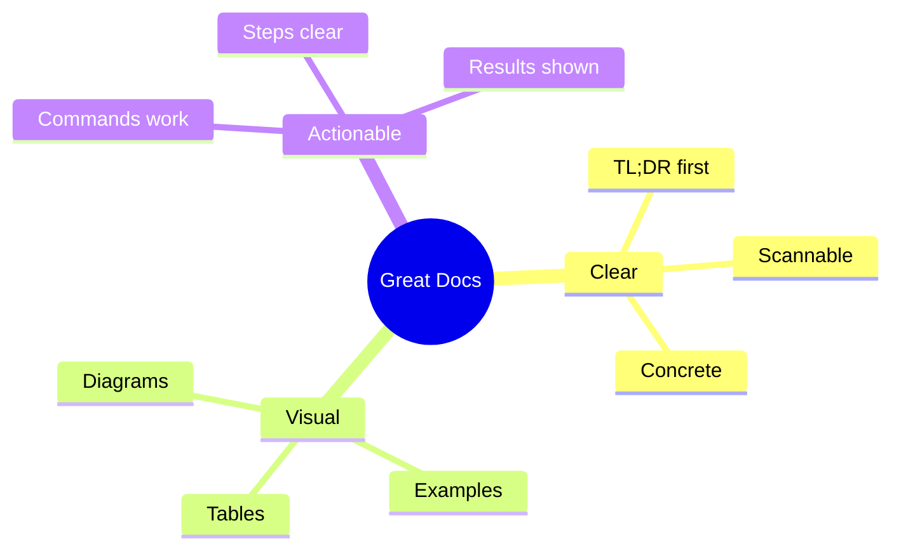
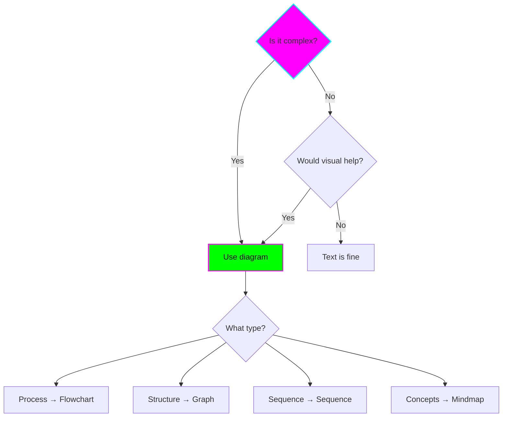
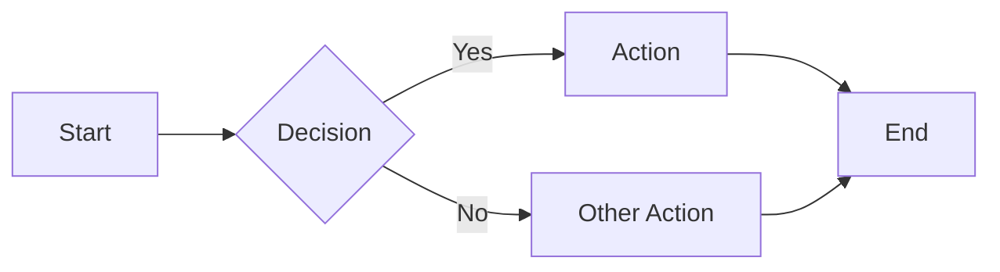
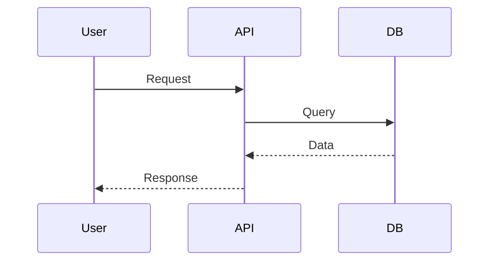
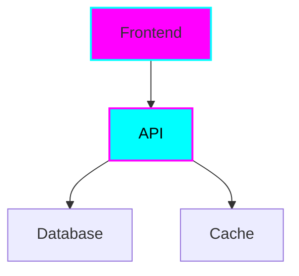
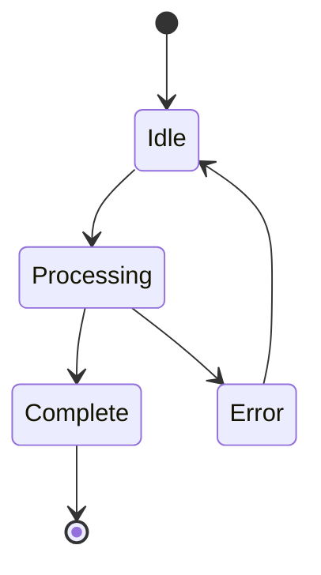
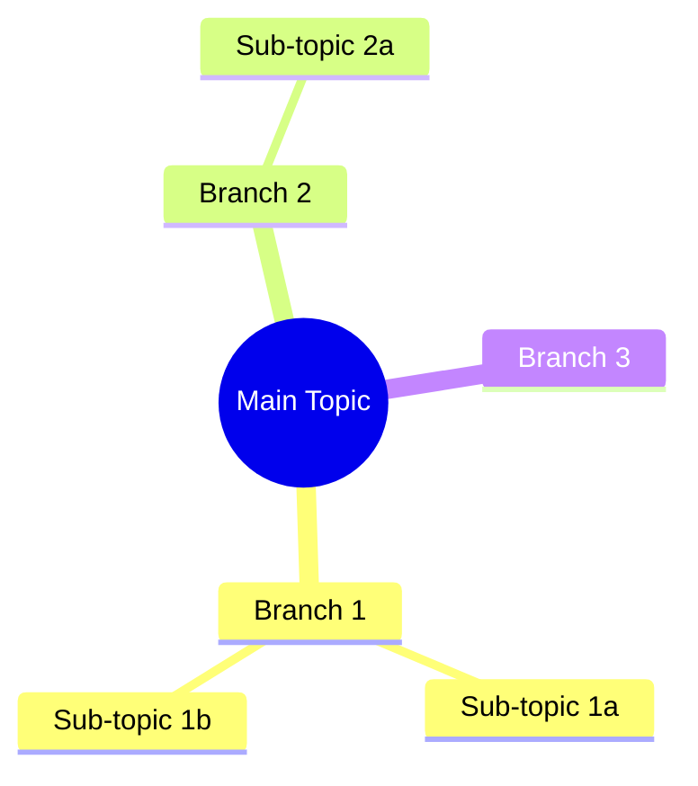
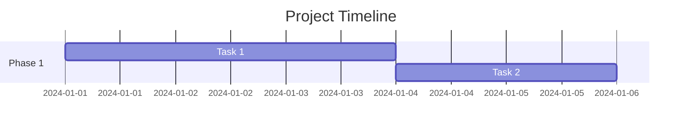
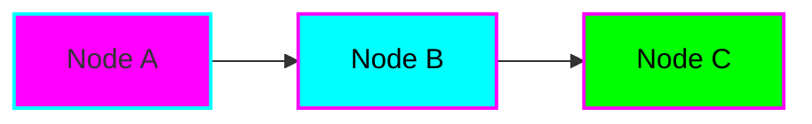

# Documentation Guides

Best practices for creating clear, ADHD-friendly documentation in this repository.

## Documentation Philosophy



### Core Principles

1. **TL;DR first** - Give the summary immediately
2. **Show, don't tell** - Examples over explanations
3. **Make it visual** - Diagrams for complex concepts
4. **Keep it scannable** - Headers, bullets, short paragraphs
5. **Be concrete** - Specific examples, not abstract theory

## ADHD-Friendly Writing

### ✅ Do

**Start with the point**
```markdown
✅ "This guide shows you how to set up a Python project."
❌ "There are many considerations when beginning a new software..."
```

**Use short paragraphs**
```markdown
✅ Each paragraph is 2-3 sentences.

    New concept gets new paragraph.

    Easy to scan and digest.

❌ Long paragraphs with multiple ideas all bundled together
    making it hard to find specific information and causing
    the reader to lose focus and...
```

**Break up text with visuals**
```markdown
✅ Text explaining concept

    [Diagram illustrating concept]

    Code example demonstrating concept

❌ Pages of text with no visual breaks
```

**Use lists liberally**
```markdown
✅ Key points:
- Point one
- Point two
- Point three

❌ Key points include point one, point two, and point three.
```

**Provide time estimates**
```markdown
✅ **Time required:** ⏱️ 15 minutes

❌ (No time estimate)
```

### ❌ Avoid

- Long paragraphs (>5 sentences)
- Wall of text
- Abstract explanations without examples
- Assuming prior knowledge
- Nested complexity (too many levels)

## Document Structure

### Every Document Should Have

```markdown
# Title

**TL;DR:** One sentence summary

## Quick Context

Why this document exists, what problem it solves.

## Main Content

[Sections with clear headings]

## Next Steps

What to do after reading this.

## Resources

Links to related docs, external resources.
```

## Using Mermaid Diagrams

### When to Use Diagrams



### Diagram Types Reference

#### Flowchart
**Use for:** Processes, decisions, workflows



```markdown
\`\`\`mermaid
flowchart LR
    A[Start] --> B{Decision}
    B -->|Yes| C[Action]
    B -->|No| D[Other Action]
\`\`\`
```

#### Sequence Diagram
**Use for:** API calls, interactions, time-based flow



```markdown
\`\`\`mermaid
sequenceDiagram
    participant User
    participant API
    User->>API: Request
    API-->>User: Response
\`\`\`
```

#### Graph/Architecture
**Use for:** Components, relationships, structure



```markdown
\`\`\`mermaid
graph TD
    A[Frontend] --> B[API]
    B --> C[Database]

    style A fill:#ff00ff,stroke:#00ffff
\`\`\`
```

#### State Diagram
**Use for:** States, transitions, lifecycle



```markdown
\`\`\`mermaid
stateDiagram-v2
    [*] --> Idle
    Idle --> Processing
    Processing --> Complete
\`\`\`
```

#### Mind Map
**Use for:** Concepts, brainstorming, organization



```markdown
\`\`\`mermaid
mindmap
  root((Main Topic))
    Branch 1
    Branch 2
\`\`\`
```

#### Gantt Chart
**Use for:** Timelines, schedules, planning



```markdown
\`\`\`mermaid
gantt
    title Timeline
    dateFormat YYYY-MM-DD
    Task: 2024-01-01, 3d
\`\`\`
```

### Diagram Styling

Apply cyberpunk theme:



```markdown
\`\`\`mermaid
graph LR
    A[Node A] --> B[Node B]

    style A fill:#ff00ff,stroke:#00ffff,stroke-width:2px
    style B fill:#00ffff,stroke:#ff00ff,color:#000
\`\`\`
```

Colors:
- `#ff00ff` - Neon pink (primary)
- `#00ffff` - Neon cyan (accent)
- `#00ff00` - Neon green (success)
- `#ffff00` - Neon yellow (warning)

## Code Examples

### Format Code Blocks

Always specify language:

```python
# Python example
def hello():
    print("Hello, world!")
```

```markdown
\`\`\`python
def hello():
    print("Hello!")
\`\`\`
```

### Annotate Complex Code

```typescript
// Create user with validation
async function createUser(data: UserData) {
  // 1. Validate input
  if (!isValid(data)) {
    throw new Error('Invalid data');
  }

  // 2. Hash password
  const hashedPassword = await hash(data.password);

  // 3. Save to database
  return await db.users.insert({
    ...data,
    password: hashedPassword
  });
}
```

### Show Expected Output

```bash
# Command
npm start

# Expected output
> app@1.0.0 start
> node index.js
Server listening on port 3000
```

## Tables

### Comparison Tables

| Feature | Option A | Option B |
|---------|----------|----------|
| Speed | ⚡ Fast | 🐌 Slow |
| Ease | 😊 Easy | 😰 Hard |
| Cost | 💰 Paid | 🆓 Free |

### Configuration Tables

| Variable | Type | Default | Description |
|----------|------|---------|-------------|
| `PORT` | number | `3000` | Server port |
| `DEBUG` | boolean | `false` | Enable debug mode |

### Status Tables

| Project | Status | Tech | Started |
|---------|--------|------|---------|
| Project A | 🚧 | Python | 2024-01 |
| Project B | ✅ | Node.js | 2023-12 |

## Callouts and Admonitions

### Note
!!! note "Optional Title"
    This is a note callout.
    Use for additional information.

```markdown
!!! note "Optional Title"
    Content here
```

### Tip
!!! tip
    This is a helpful tip!

```markdown
!!! tip
    Content here
```

### Warning
!!! warning
    Be careful about this!

```markdown
!!! warning
    Content here
```

### Danger
!!! danger
    Critical information!

```markdown
!!! danger
    Content here
```

### Success
!!! success
    Great job! It worked!

```markdown
!!! success
    Content here
```

## Formatting Elements

### Emphasis

- **Bold** for important terms, actions
- *Italic* for subtle emphasis
- `code` for file names, commands, variables

### Lists

**Unordered:**
- Item one
- Item two
  - Nested item
  - Another nested

**Ordered:**
1. First step
2. Second step
3. Third step

**Checklist:**
- [ ] Todo item
- [x] Completed item

### Links

**Internal:**
[Link text](../other-page.md)

**External:**
[Link text](https://example.com)

**Reference:**
[Link text][reference]

[reference]: https://example.com

## Document Types

### Tutorial/Guide

```markdown
# How to {Do Thing}

**Time Required:** ⏱️ {estimate}
**Prerequisites:** {list}

## Goal
{What you'll achieve}

## Steps

### Step 1: {Action}
{Instructions}

\`\`\`bash
{commands}
\`\`\`

✅ **Checkpoint:** {What you should have now}

### Step 2: {Action}
...

## Verification
{How to test it worked}

## Next Steps
{What to do now}
```

### Reference Doc

```markdown
# {Topic} Reference

**TL;DR:** {Summary}

## Quick Reference
{Table or list of key info}

## Detailed Reference

### {Item 1}
**Description:** {What it is}
**Usage:** {How to use}
**Example:** {Code example}

### {Item 2}
...
```

### Concept Explanation

```markdown
# {Concept}

**TL;DR:** {One sentence}

## Why This Matters
{Context and relevance}

## Visual Overview
{Diagram}

## How It Works
{Explanation with examples}

## Common Patterns
{Usage patterns}

## Related Concepts
{Links}
```

## MkDocs Integration

### Adding New Pages

When you create a new markdown file:

1. **Create the file**
   ```bash
   touch docs/new-section/new-page.md
   ```

2. **Add to `mkdocs.yml`**
   ```yaml
   nav:
     - Home: index.md
     - New Section:
       - New Page: new-section/new-page.md
   ```

3. **Test locally**
   ```bash
   mkdocs serve
   ```

### Front Matter

MkDocs doesn't require front matter, but you can add for clarity:

```markdown
---
title: Page Title
description: Page description
---

# Page Title

Content here...
```

## Quality Checklist

Before considering documentation complete:

- [ ] TL;DR at the top
- [ ] At least one diagram (if concept is complex)
- [ ] Code examples for every concept
- [ ] Clear next steps
- [ ] Scannable headings
- [ ] Short paragraphs (3-5 sentences max)
- [ ] No jargon without explanation
- [ ] Tested all commands/examples
- [ ] Links work
- [ ] Added to mkdocs.yml

## Getting Help

Use custom Claude agents:

```
@doc-writer help me document {topic}
```

The doc-writer agent knows these guidelines and will help you create ADHD-friendly documentation.

## Examples

Good documentation in this repo:

- [Quick Start Guide](../getting-started/quick-start.md) - Tutorial style
- [Overview](../getting-started/overview.md) - Concept explanation
- [Experiments Index](../experiments/index.md) - Reference with examples

---

**Remember:** Good documentation is a gift to future you! 🎁
