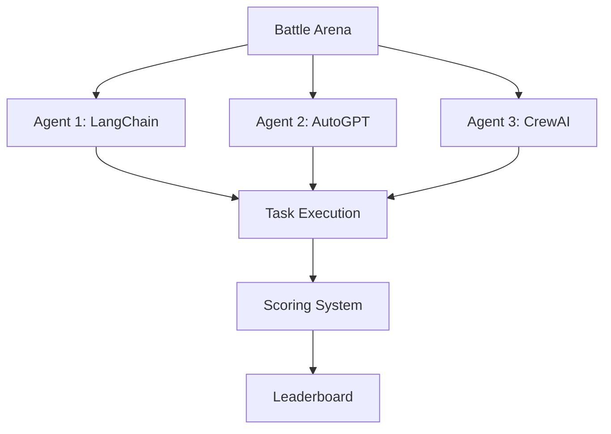

# 🤖⚔️ AI Agent Battle Arena

**Status:** 🧪 Experimental | **Tech:** Python + LangChain | **Time:** 1-2 weeks

## Overview

Gamify your multi-agent learning by pitting different agent frameworks against each other! Watch agents compete, visualize their decision trees, and crown the ultimate AI champion.



## Features

- **Multi-Framework Support**: LangChain, AutoGPT, CrewAI, Custom agents
- **Battle Scenarios**: Coding challenges, research tasks, decision-making
- **Visual Replay**: See decision trees and reasoning paths
- **Scoring**: Speed, accuracy, cost-effectiveness, creativity
- **Meme-worthy Titles**: "Token Destroyer", "Budget Optimizer", "Speed Demon"

## Quick Start

```bash
cd experiments/ai-agent-battle-arena
uv venv && source .venv/bin/activate
uv pip install -e ".[dev]"

# Run a battle
python src/battle.py --scenario code-review --agents langchain crewai

# View leaderboard
python src/leaderboard.py
```

## Battle Scenarios

1. **Code Review Challenge**: Best code review in 2 minutes
2. **Bug Hunt**: Find and fix bugs fastest
3. **Architecture Design**: Best system design proposal
4. **API Design**: Create best REST API spec
5. **Documentation**: Write clearest docs

## Scoring Metrics

- ⚡ **Speed**: Time to completion
- 🎯 **Accuracy**: Quality of output
- 💰 **Cost**: Token usage
- 🧠 **Creativity**: Novel solutions
- 📊 **Completeness**: Coverage of requirements

## How to Run

See full documentation in [experiments/ai-agent-battle-arena/docs/](./docs/)
