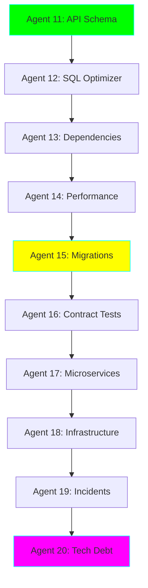

# 🚀 Advanced AI Engineer Learning Path - Agents 11-20

**Status:** 🧪 Experimental | **Tech Stack:** Python 3.11, Ollama, Advanced Frameworks

> The second set of 10 agents focusing on advanced software engineering challenges - from API design to incident response. Build production-grade DevOps and SRE tools!

---

## 🎯 What's New in This Set?

This advanced curriculum builds on the fundamentals from Agents 1-10 and introduces:

- 🔧 **DevOps & Infrastructure** - IaC generation, CI/CD automation
- 🗄️ **Database Engineering** - SQL optimization, schema analysis
- 🏗️ **System Architecture** - Microservices, API design, migrations
- 🚨 **SRE Practices** - Incident response, observability, tech debt
- 📊 **Advanced Analysis** - Performance profiling, dependency management

---

## 📚 The Advanced 10 Agents



### Complexity Progression

| Agent | Name | Complexity | Key Concepts | New Frameworks |
|-------|------|-----------|--------------|----------------|
| 11 | API Schema Generator | ⭐ | OpenAPI specs, schema inference | `pydantic`, `openapi-spec-validator` |
| 12 | SQL Query Optimizer | ⭐⭐ | Query analysis, explain plans | `sqlparse`, `sqlglot` |
| 13 | Dependency Analyzer | ⭐⭐ | Package management, CVE scanning | `safety`, `pip-audit` |
| 14 | Performance Profiler | ⭐⭐⭐ | Profiling, flame graphs, bottlenecks | `py-spy`, `memray` |
| 15 | Migration Assistant | ⭐⭐⭐ | AST transformation, codemods | `libcst`, `bowler` |
| 16 | API Contract Tester | ⭐⭐⭐⭐ | Contract testing, Pact pattern | `pact-python`, `schemathesis` |
| 17 | Microservices Decomposer | ⭐⭐⭐⭐ | Domain modeling, bounded contexts | `networkx`, graph analysis |
| 18 | Infrastructure Generator | ⭐⭐⭐⭐⭐ | IaC, Terraform, Kubernetes | `pulumi`, `cdktf` |
| 19 | Incident Commander | ⭐⭐⭐⭐⭐ | Incident response, runbooks, postmortems | State machines, workflows |
| 20 | Tech Debt Prioritizer | ⭐⭐⭐⭐⭐⭐ | Technical debt scoring, ROI analysis | Multi-dimensional analysis |

---

## 🎓 Advanced Learning Path

### Week 4: DevOps Fundamentals (Agents 11-13)

**Goal:** Master infrastructure and dependency management

- **Days 1-2:** Agent 11 - API Schema Generator
  - Learn: OpenAPI/Swagger, schema validation, API documentation
  - Practice: Generate schemas for your APIs

- **Days 3-5:** Agent 12 - SQL Query Optimizer
  - Learn: Query plans, indexing strategies, database optimization
  - Practice: Optimize slow queries in your projects

- **Days 6-7:** Agent 13 - Dependency Analyzer
  - Learn: Security scanning, dependency graphs, update strategies
  - Practice: Audit your project dependencies

### Week 5: Performance & Migrations (Agents 14-16)

**Goal:** Advanced code analysis and transformation

- **Days 8-10:** Agent 14 - Performance Profiler
  - Learn: Profiling tools, bottleneck identification, optimization
  - Practice: Profile and optimize your applications

- **Days 11-14:** Agent 15 - Migration Assistant
  - Learn: AST manipulation, automated refactoring, codemods
  - Practice: Migrate code between frameworks/versions

- **Days 15-17:** Agent 16 - API Contract Tester
  - Learn: Contract testing, consumer-driven contracts, Pact
  - Practice: Create contract tests for your APIs

### Week 6: Architecture & SRE (Agents 17-20)

**Goal:** System-level thinking and operational excellence

- **Days 18-21:** Agent 17 - Microservices Decomposer
  - Learn: Domain-driven design, service boundaries, graph analysis
  - Practice: Decompose a monolith into microservices

- **Days 22-25:** Agent 18 - Infrastructure Generator
  - Learn: Infrastructure as Code, Terraform, Kubernetes manifests
  - Practice: Generate IaC for your projects

- **Days 26-29:** Agent 19 - Incident Commander
  - Learn: Incident management, runbooks, postmortem generation
  - Practice: Simulate and respond to incidents

- **Days 30+:** Agent 20 - Tech Debt Prioritizer
  - Learn: Technical debt metrics, ROI calculation, prioritization
  - Practice: Analyze and prioritize debt in your codebase

---

## 🆕 New Concepts You'll Master

### 1. **API Design & Documentation** (Agent 11)
- OpenAPI/Swagger specifications
- Schema inference from code
- API versioning strategies
- Documentation generation

### 2. **Database Optimization** (Agent 12)
- SQL query analysis
- Execution plan interpretation
- Index recommendations
- Query rewriting

### 3. **Dependency Management** (Agent 13)
- Dependency graph analysis
- CVE vulnerability scanning
- Automated updates
- License compliance

### 4. **Performance Engineering** (Agent 14)
- CPU and memory profiling
- Flame graph generation
- Bottleneck identification
- Performance regression detection

### 5. **Code Transformation** (Agent 15)
- LibCST for Python transformations
- Automated refactoring
- Migration strategies
- Deprecation handling

### 6. **Contract Testing** (Agent 16)
- Consumer-driven contracts
- Pact workflow
- Schema validation
- API compatibility

### 7. **Domain-Driven Design** (Agent 17)
- Bounded contexts
- Aggregate identification
- Service coupling analysis
- Decomposition strategies

### 8. **Infrastructure as Code** (Agent 18)
- Terraform generation
- Kubernetes manifests
- Cloud resource modeling
- Infrastructure versioning

### 9. **Incident Management** (Agent 19)
- Runbook automation
- Incident timelines
- Postmortem generation
- Root cause analysis

### 10. **Technical Debt Management** (Agent 20)
- Debt quantification
- Impact analysis
- Prioritization algorithms
- ROI calculation

---

## 🚀 Quick Start

```bash
# Navigate to the project
cd experiments/ai-engineer-learning

# Ensure environment is set up
source .venv/bin/activate

# Install additional dependencies for advanced agents
pip install -r requirements-advanced.txt

# Start with Agent 11
cd agents/11_api_schema_generator
python agent.py --help
```

---

## 🛠️ Additional Tech Stack

### Core Libraries (in addition to basic set)

| Library | Version | Purpose | Agents |
|---------|---------|---------|--------|
| `pydantic` | ^2.0 | Data validation, schema generation | 11, 16 |
| `sqlparse` | ^0.5.0 | SQL parsing and formatting | 12 |
| `sqlglot` | ^25.0 | SQL optimization and transpiling | 12 |
| `safety` | ^3.0 | Security vulnerability scanning | 13 |
| `py-spy` | Latest | Performance profiling | 14 |
| `libcst` | ^1.0 | Python CST manipulation | 15 |
| `networkx` | ^3.0 | Graph analysis | 17 |
| `pulumi` | ^3.0 | Infrastructure as Code | 18 |

---

## 💡 What Makes These Agents Different?

### Focus on Production Engineering

While Agents 1-10 teach AI fundamentals, Agents 11-20 focus on:

1. **Operational Excellence**
   - Infrastructure automation
   - Incident response
   - Performance optimization

2. **System Architecture**
   - API design
   - Microservices
   - Service boundaries

3. **Code Quality at Scale**
   - Dependency management
   - Technical debt
   - Automated migrations

4. **Advanced Analysis**
   - Performance profiling
   - Database optimization
   - Contract testing

---

## 🎮 Advanced Challenges

### DevOps Engineer Track
- [ ] Generate complete infrastructure for a 3-tier app (Agent 18)
- [ ] Create automated incident response runbooks (Agent 19)
- [ ] Build a CI/CD pipeline generator (extend Agent 18)

### SRE Track
- [ ] Implement automated performance regression detection (Agent 14)
- [ ] Create observability dashboard generator (extend Agent 19)
- [ ] Build capacity planning assistant (extend Agent 20)

### Backend Engineer Track
- [ ] Generate OpenAPI specs from existing APIs (Agent 11)
- [ ] Optimize database queries across codebase (Agent 12)
- [ ] Decompose monolith into microservices (Agent 17)

### Staff Engineer Track
- [ ] Build complete tech debt dashboard (Agent 20)
- [ ] Create migration automation tooling (Agent 15)
- [ ] Design contract testing strategy (Agent 16)

---

## 📊 Combined Progress Tracking

After completing all 20 agents, you'll have mastered:

**Fundamentals (Agents 1-10):**
- [x] LLM basics and prompt engineering
- [x] RAG and vector databases
- [x] Multi-agent systems
- [x] ReAct pattern

**Advanced (Agents 11-20):**
- [ ] API design and documentation
- [ ] Database optimization
- [ ] Performance engineering
- [ ] Infrastructure as Code
- [ ] Incident management
- [ ] Technical debt analysis

---

## 🎯 Career Impact

These 20 agents prepare you for:

- **Senior/Staff Engineer** - System design, architecture, technical leadership
- **SRE/DevOps** - Infrastructure automation, incident response, observability
- **Backend Engineer** - API design, database optimization, performance
- **Engineering Manager** - Technical debt prioritization, team productivity

---

## 🚀 Next Steps After Completing All 20

1. **Combine Agents** - Create a unified CLI tool using all agents
2. **Build a Platform** - Web dashboard for all agent capabilities
3. **Open Source** - Package and share your agents
4. **Scale Up** - Add support for more languages and frameworks
5. **Teach Others** - Write about your learnings

---

**Prerequisites:** Complete Agents 1-10 first for foundational knowledge.

**Ready to level up?** Start with [Agent 11: API Schema Generator](./agents/11_api_schema_generator/README.md) →
