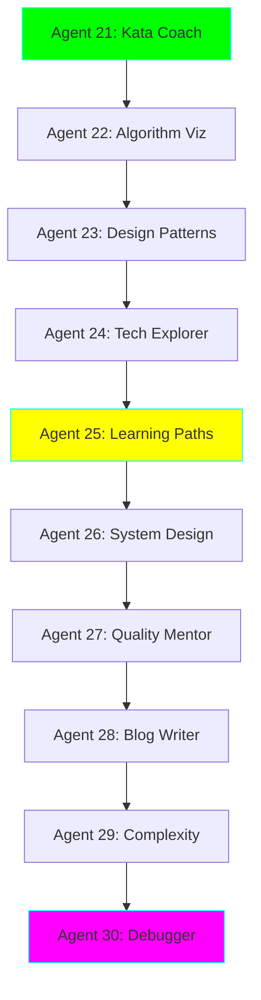

# 🎓 Learning & Skill Development Path - Agents 21-30

**Status:** 🧪 Experimental | **Focus:** Skill Building & Tech Exploration

> The third set of 10 autonomous agents designed to accelerate your learning, improve coding skills, and explore new technologies. Interactive, educational, and designed for continuous improvement!

---

## 🎯 What Makes These Agents Different?

This learning-focused curriculum emphasizes:

- 🧠 **Active Learning** - Practice-based skill development
- 🎮 **Gamification** - Challenges, achievements, progress tracking
- 🔍 **Exploration** - Discover and evaluate new technologies
- 📈 **Improvement** - Measure and track your growth
- 🤝 **Interactive Coaching** - Real-time feedback and guidance

---

## 📚 The Learning 10 Agents



### Complexity & Focus

| Agent | Name | Complexity | Focus Area | Learning Style |
|-------|------|-----------|------------|----------------|
| 21 | Coding Kata Coach | ⭐⭐ | Practice & Drills | Interactive challenges |
| 22 | Algorithm Visualizer | ⭐⭐ | Understanding Algorithms | Visual learning |
| 23 | Design Pattern Teacher | ⭐⭐⭐ | Software Design | Guided examples |
| 24 | Tech Stack Explorer | ⭐⭐⭐ | Technology Research | Comparison & analysis |
| 25 | Learning Path Generator | ⭐⭐⭐ | Career Development | Personalized roadmaps |
| 26 | System Design Interview Coach | ⭐⭐⭐⭐ | Interview Prep | Mock interviews |
| 27 | Code Quality Mentor | ⭐⭐⭐⭐ | Code Craftsmanship | Code review & feedback |
| 28 | Tech Blog Writer | ⭐⭐⭐⭐ | Knowledge Sharing | Writing & communication |
| 29 | Complexity Analyzer | ⭐⭐⭐⭐⭐ | Performance Understanding | Deep analysis |
| 30 | Interactive Debugger | ⭐⭐⭐⭐⭐⭐ | Problem Solving | Step-by-step debugging |

---

## 🎓 Learning Tracks

### Track 1: Coding Fundamentals (Agents 21-23)

**Goal:** Build strong coding foundations through practice

- **Week 1-2:** Agent 21 - Coding Kata Coach
  - Daily coding challenges
  - Multiple difficulty levels
  - Solution review and optimization
  - Track improvement over time

- **Week 3-4:** Agent 22 - Algorithm Visualizer
  - Visual algorithm explanations
  - Step-by-step execution
  - Complexity analysis
  - Pattern recognition

- **Week 5-6:** Agent 23 - Design Pattern Teacher
  - 23 Gang of Four patterns
  - Real-world examples
  - When to use each pattern
  - Anti-patterns to avoid

### Track 2: Tech Exploration (Agents 24-25)

**Goal:** Expand technical knowledge and create learning plans

- **Week 7-8:** Agent 24 - Tech Stack Explorer
  - Compare frameworks/libraries
  - Technology trend analysis
  - Proof-of-concept generation
  - Decision matrices

- **Week 9-10:** Agent 25 - Learning Path Generator
  - Personalized learning roadmaps
  - Skill gap analysis
  - Resource recommendations
  - Progress tracking

### Track 3: Professional Development (Agents 26-28)

**Goal:** Level up as a senior/staff engineer

- **Week 11-13:** Agent 26 - System Design Interview Coach
  - Mock system design interviews
  - Architecture diagrams
  - Scalability discussions
  - Trade-off analysis

- **Week 14-16:** Agent 27 - Code Quality Mentor
  - Advanced code reviews
  - SOLID principles in practice
  - Refactoring exercises
  - Clean code patterns

- **Week 17-19:** Agent 28 - Tech Blog Writer
  - Write technical articles
  - Explain complex concepts
  - Code-to-blog automation
  - SEO optimization

### Track 4: Mastery (Agents 29-30)

**Goal:** Deep technical understanding and debugging mastery

- **Week 20-23:** Agent 29 - Complexity Analyzer
  - Big O analysis
  - Space/time trade-offs
  - Optimization techniques
  - Benchmarking

- **Week 24-26:** Agent 30 - Interactive Debugger
  - Guided debugging sessions
  - Root cause analysis
  - Debugging strategies
  - Problem-solving frameworks

---

## 🎮 Gamification Features

### Achievement System

Each agent tracks your progress and awards achievements:

- 🥉 **Bronze** - Complete 10 challenges
- 🥈 **Silver** - Complete 50 challenges
- 🥇 **Gold** - Complete 100 challenges
- 💎 **Platinum** - Master level

### Streak Tracking

- Daily coding streaks
- Consistency rewards
- Skill momentum visualization

### Leaderboards

- Compare with past self
- Track improvement metrics
- Celebrate milestones

---

## 💡 What You'll Master

### Technical Skills

1. **Problem Solving** (Agent 21, 30)
   - Algorithmic thinking
   - Edge case handling
   - Optimization techniques

2. **Design Skills** (Agent 23, 26)
   - Software architecture patterns
   - System design principles
   - Scalability strategies

3. **Code Quality** (Agent 27, 29)
   - Clean code practices
   - Performance optimization
   - Complexity analysis

4. **Communication** (Agent 28)
   - Technical writing
   - Explaining complex concepts
   - Knowledge sharing

### Soft Skills

1. **Learning Agility** (Agent 24, 25)
   - Technology evaluation
   - Skill acquisition strategies
   - Continuous improvement

2. **Interview Skills** (Agent 26)
   - System design communication
   - Trade-off articulation
   - Whiteboard coding

---

## 🚀 Quick Start

```bash
cd experiments/ai-engineer-learning

# Install learning-specific dependencies
pip install -r requirements-learning.txt

# Start with daily kata practice
cd agents/21_kata_coach
python agent.py --difficulty easy --interactive

# Visualize an algorithm
cd ../22_algorithm_visualizer
python agent.py --algorithm quicksort --visualize

# Get a personalized learning path
cd ../25_learning_path_generator
python agent.py --goal "become-staff-engineer" --current-level senior
```

---

## 🎯 Use Cases by Role

### Junior/Mid-Level Engineer

**Focus:** Agents 21, 22, 23, 27
- Build coding fundamentals
- Understand algorithms deeply
- Learn design patterns
- Improve code quality

**Daily Routine:**
```bash
# Morning: 30 min kata practice
python agents/21_kata_coach/agent.py --daily

# Lunch: 15 min algorithm learning
python agents/22_algorithm_visualizer/agent.py --random

# Evening: Code review practice
python agents/27_code_quality_mentor/agent.py --review my_code.py
```

### Senior Engineer

**Focus:** Agents 24, 25, 26, 28
- Explore new technologies
- Prepare for staff promotion
- Practice system design
- Share knowledge through writing

**Weekly Routine:**
```bash
# Monday: Tech exploration
python agents/24_tech_stack_explorer/agent.py --explore "new-frameworks"

# Wednesday: System design practice
python agents/26_system_design_coach/agent.py --mock-interview

# Friday: Write about learnings
python agents/28_tech_blog_writer/agent.py --topic "this-weeks-learnings"
```

### Staff/Principal Engineer

**Focus:** Agents 26, 27, 28, 29, 30
- Master system design
- Mentor through code reviews
- Publish technical content
- Deep performance analysis

---

## 📊 Progress Tracking

Each agent maintains a profile:

```json
{
  "user": "staff_engineer_123",
  "stats": {
    "katas_completed": 156,
    "algorithms_learned": 42,
    "patterns_mastered": 18,
    "blogs_published": 12,
    "current_streak": 45
  },
  "skills": {
    "algorithms": 85,
    "design_patterns": 78,
    "system_design": 92,
    "code_quality": 88
  },
  "achievements": [
    "100_day_streak",
    "algorithm_master",
    "pattern_expert"
  ]
}
```

---

## 🛠️ New Technologies Used

| Library | Purpose | Agents |
|---------|---------|--------|
| `matplotlib` | Visualization | 22, 29 |
| `graphviz` | Diagram generation | 22, 26 |
| `pytest-benchmark` | Performance testing | 29 |
| `typer` | Interactive CLIs | All |
| `questionary` | Interactive prompts | 21, 26, 30 |
| `tabulate` | Beautiful tables | 24, 27 |
| `pygments` | Code highlighting | All |

---

## 🎨 Interactive Features

### Agent 21: Coding Kata Coach

```bash
$ python agent.py --interactive

╔════════════════════════════════╗
║   Coding Kata Coach            ║
║   Level: Intermediate          ║
║   Streak: 12 days 🔥          ║
╚════════════════════════════════╝

Today's Challenge: Two Sum
Difficulty: ⭐⭐

Given an array of integers, return indices of two
numbers that add up to a target.

Example:
  Input: [2, 7, 11, 15], target = 9
  Output: [0, 1]

Your solution:
>>> def two_sum(nums, target):
...     # Your code here

✓ Tests passed: 8/10
⚠ Edge case failed: empty array
💡 Hint: Consider using a hash map...
```

### Agent 26: System Design Coach

```bash
$ python agent.py --mock-interview

🎤 System Design Interview Simulator

Interviewer: "Design a URL shortener like bit.ly"

You have 45 minutes. Let's start with requirements.

> What are the functional requirements?

Interviewer: Good question! Users should be able to:
1. Create short URLs from long URLs
2. Redirect from short to long URLs
3. Optional: Custom short URLs
4. Optional: Analytics

> How many URLs per day?

Interviewer: Let's say 100M new URLs per day...

[Interactive session continues with diagram generation]
```

---

## 🏆 Learning Outcomes

After completing all 30 agents:

**Technical Mastery:**
- ✅ Solid algorithmic foundation
- ✅ Design pattern expertise
- ✅ System design proficiency
- ✅ Performance optimization skills
- ✅ Debugging mastery

**Career Advancement:**
- ✅ Interview readiness (all levels)
- ✅ Technical writing ability
- ✅ Technology evaluation skills
- ✅ Mentorship capabilities
- ✅ Staff+ engineer mindset

**Continuous Learning:**
- ✅ Personalized learning paths
- ✅ Daily practice habits
- ✅ Knowledge sharing routine
- ✅ Growth tracking system

---

## 🎯 Next Steps

1. **Start with Agent 21** - Build daily coding habit
2. **Progress through tracks** - Follow the 26-week plan
3. **Track your progress** - Use built-in metrics
4. **Share your learnings** - Use Agent 28 to blog
5. **Help others** - Become a mentor with Agent 27

---

**Ready to level up your skills?** Start with [Agent 21: Coding Kata Coach](./agents/21_kata_coach/README.md) →
