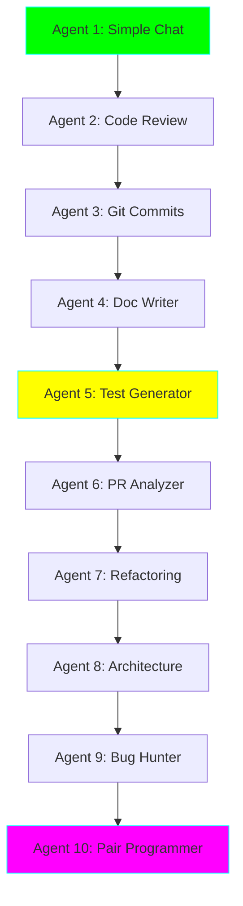

# 🤖 AI Engineer Learning Path - 10 Ollama Agents

**Status:** 🧪 Experimental | **Tech Stack:** Python 3.11, Ollama, LangChain, LlamaIndex, CrewAI

> A hands-on learning curriculum to master AI engineering through building 10 progressively complex agents that connect to your local Ollama models. Perfect for staff software engineers looking to integrate AI into their daily workflow.

---

## 🎯 Learning Objectives

By completing this curriculum, you will:

- ✅ Master local LLM integration with Ollama on M4 Mac
- ✅ Learn 5+ Python AI frameworks (LangChain, LlamaIndex, CrewAI, etc.)
- ✅ Understand agent patterns: ReAct, RAG, multi-agent coordination
- ✅ Build production-ready tools for your engineering workflow
- ✅ Implement vector embeddings and semantic search
- ✅ Create agentic workflows with tool calling and planning

---

## 📚 Curriculum Overview



### Complexity Progression

| Agent | Name | Complexity | Key Concepts | Framework |
|-------|------|-----------|--------------|-----------|
| 01 | Simple Chat Agent | ⭐ | Basic Ollama API, HTTP requests | `ollama` library |
| 02 | Code Review Assistant | ⭐⭐ | Structured prompts, system messages | `ollama` + templates |
| 03 | Git Commit Message Generator | ⭐⭐ | Tool integration, file I/O | `langchain-ollama` |
| 04 | Documentation Writer | ⭐⭐⭐ | RAG basics, document loading | `llamaindex` |
| 05 | Test Generator | ⭐⭐⭐ | Code parsing, AST analysis | `langchain` + tree-sitter |
| 06 | PR Analyzer | ⭐⭐⭐⭐ | Multi-step reasoning, chains | `langchain` + LCEL |
| 07 | Refactoring Suggester | ⭐⭐⭐⭐ | Vector embeddings, similarity | `chromadb` + embeddings |
| 08 | Architecture Advisor | ⭐⭐⭐⭐⭐ | Multi-agent coordination | `crewai` |
| 09 | Bug Hunter | ⭐⭐⭐⭐⭐ | ReAct pattern, agent loops | `langgraph` |
| 10 | AI Pair Programmer | ⭐⭐⭐⭐⭐⭐ | Full agentic workflow | `langgraph` + tools |

---

## 🚀 Quick Start

### Prerequisites

1. **M4 Mac** with Ollama installed
2. **Python 3.11+**
3. **Ollama running** with models pulled

### Installation

```bash
# Navigate to the project
cd experiments/ai-engineer-learning

# Create virtual environment (using uv - recommended)
uv venv
source .venv/bin/activate

# Or using standard venv
python -m venv .venv
source .venv/bin/activate

# Install dependencies
pip install -r requirements.txt

# Verify Ollama is running
ollama list
```

### Pull Recommended Models

```bash
# For general coding tasks
ollama pull qwen2.5-coder:7b

# For faster responses (optional)
ollama pull qwen2.5:3b

# For advanced reasoning (optional)
ollama pull deepseek-r1:7b
```

### Run Your First Agent

```bash
# Start with the simple chat agent
cd agents/01_simple_chat
python agent.py

# Or run any agent directly
python agents/05_test_generator/agent.py --file path/to/code.py
```

---

## 🎓 Learning Path

### Week 1: Foundations (Agents 1-3)

**Goal:** Understand basic Ollama integration and prompt engineering

- **Day 1-2:** Build Agent 1 - Simple Chat
  - Learn: HTTP requests to Ollama, streaming responses
  - Practice: Chat with different models, adjust temperature

- **Day 3-4:** Build Agent 2 - Code Review Assistant
  - Learn: System prompts, structured outputs, few-shot examples
  - Practice: Review real code, customize review criteria

- **Day 5-7:** Build Agent 3 - Git Commit Message Generator
  - Learn: Tool calling, file I/O, git integration
  - Practice: Generate commits for your projects

### Week 2: Intermediate (Agents 4-6)

**Goal:** Master RAG, code analysis, and reasoning chains

- **Day 8-10:** Build Agent 4 - Documentation Writer
  - Learn: RAG fundamentals, vector stores, retrieval
  - Practice: Generate docs from existing codebases

- **Day 11-13:** Build Agent 5 - Test Generator
  - Learn: AST parsing, code analysis, template generation
  - Practice: Generate unit tests for your functions

- **Day 14:** Build Agent 6 - PR Analyzer
  - Learn: Multi-step reasoning, LCEL chains, context management
  - Practice: Analyze your team's PRs

### Week 3: Advanced (Agents 7-10)

**Goal:** Build production-grade agentic systems

- **Day 15-17:** Build Agent 7 - Refactoring Suggester
  - Learn: Embeddings, semantic similarity, code search
  - Practice: Find similar code patterns, suggest refactors

- **Day 18-20:** Build Agent 8 - Architecture Advisor
  - Learn: Multi-agent systems, role-based agents, coordination
  - Practice: Design system architectures collaboratively

- **Day 21-24:** Build Agent 9 - Bug Hunter
  - Learn: ReAct pattern, agent loops, tool usage
  - Practice: Hunt bugs in complex codebases

- **Day 25-30:** Build Agent 10 - AI Pair Programmer
  - Learn: Full agentic workflows, planning, execution
  - Practice: Pair program on real features

---

## 📖 Documentation Structure

Each agent has comprehensive documentation:

```
agents/XX_agent_name/
├── agent.py           # Main agent implementation
├── README.md          # Agent-specific documentation
├── config.py          # Configuration settings
├── examples/          # Example usage
│   ├── input/         # Sample inputs
│   └── output/        # Expected outputs
└── tests/             # Unit tests
```

**Documentation includes:**
- 🎯 Learning objectives
- 🧠 Key concepts explained
- 💻 Code walkthrough with comments
- 🔧 Tools and dependencies
- 📝 Usage examples
- 🐛 Common issues and solutions
- 🚀 Extension ideas

---

## 🛠️ Tech Stack

### Core Libraries

| Library | Version | Purpose | Agents Using It |
|---------|---------|---------|-----------------|
| `ollama` | Latest | Direct Ollama API access | 1, 2 |
| `langchain` | ^0.3.0 | LLM orchestration | 3, 5, 6 |
| `langchain-ollama` | Latest | Ollama integration for LangChain | 3, 5, 6, 9, 10 |
| `llamaindex` | ^0.12.0 | RAG and data connectors | 4 |
| `chromadb` | ^0.6.0 | Vector database | 4, 7 |
| `crewai` | Latest | Multi-agent framework | 8 |
| `langgraph` | ^0.2.0 | Graph-based agents | 9, 10 |

### Utilities

| Library | Purpose | Optional? |
|---------|---------|-----------|
| `tree-sitter` | Code parsing for AST analysis | Agent 5 |
| `pygments` | Syntax highlighting | Multiple |
| `gitpython` | Git operations | Agent 3, 6 |
| `rich` | Beautiful terminal output | All |
| `pydantic` | Data validation | All |

---

## 💡 Key Concepts You'll Learn

### 1. **LLM Basics** (Agents 1-2)
- API communication
- Streaming vs. non-streaming
- Temperature and sampling
- System vs. user messages

### 2. **Prompt Engineering** (Agents 2-3)
- Few-shot learning
- Chain-of-thought prompting
- Structured outputs
- Template management

### 3. **RAG (Retrieval-Augmented Generation)** (Agent 4)
- Document loaders
- Text splitting strategies
- Vector embeddings
- Similarity search

### 4. **Code Analysis** (Agents 5, 7)
- Abstract Syntax Trees (AST)
- Static code analysis
- Pattern matching
- Semantic code search

### 5. **Agent Patterns** (Agents 6, 9, 10)
- **ReAct:** Reasoning + Acting loops
- **Chain-of-Thought:** Multi-step reasoning
- **Tool Calling:** External function execution
- **Planning:** Goal decomposition

### 6. **Multi-Agent Systems** (Agent 8)
- Role specialization
- Inter-agent communication
- Collaborative problem-solving
- Consensus mechanisms

### 7. **Production Considerations** (All)
- Error handling
- Rate limiting
- Context window management
- Cost optimization (even for local!)

---

## 🎮 Hands-On Challenges

After completing each agent, try these challenges:

### Beginner
- [ ] Modify Agent 1 to support multi-turn conversations with memory
- [ ] Customize Agent 2's review criteria for your team's standards
- [ ] Extend Agent 3 to follow conventional commit formats

### Intermediate
- [ ] Add caching to Agent 4 to avoid re-indexing documents
- [ ] Make Agent 5 support multiple programming languages
- [ ] Connect Agent 6 to GitHub API for real PR analysis

### Advanced
- [ ] Build a web UI for Agent 7 using Streamlit
- [ ] Create custom tools for Agent 9 (debugger, profiler)
- [ ] Deploy Agent 10 as a VS Code extension

---

## 🔍 Troubleshooting

### Common Issues

**Ollama not responding:**
```bash
# Check if Ollama is running
ps aux | grep ollama

# Restart Ollama
killall ollama
ollama serve

# Check models
ollama list
```

**Import errors:**
```bash
# Ensure virtual environment is activated
source .venv/bin/activate

# Reinstall dependencies
pip install -r requirements.txt --force-reinstall
```

**Performance issues on M4 Mac:**
```bash
# Use smaller models
ollama pull qwen2.5:3b

# Reduce context window in config
MAX_CONTEXT_TOKENS = 2048
```

---

## 📊 Progress Tracking

Track your learning progress:

- [ ] **Agent 1:** Simple Chat - Basic Ollama connection ⭐
- [ ] **Agent 2:** Code Review - Structured prompts ⭐⭐
- [ ] **Agent 3:** Commit Messages - Tool integration ⭐⭐
- [ ] **Agent 4:** Doc Writer - RAG basics ⭐⭐⭐
- [ ] **Agent 5:** Test Generator - Code analysis ⭐⭐⭐
- [ ] **Agent 6:** PR Analyzer - Multi-step reasoning ⭐⭐⭐⭐
- [ ] **Agent 7:** Refactoring - Vector embeddings ⭐⭐⭐⭐
- [ ] **Agent 8:** Architecture - Multi-agent ⭐⭐⭐⭐⭐
- [ ] **Agent 9:** Bug Hunter - ReAct pattern ⭐⭐⭐⭐⭐
- [ ] **Agent 10:** Pair Programmer - Full agentic workflow ⭐⭐⭐⭐⭐⭐

---

## 🚀 Next Steps

After completing all 10 agents:

1. **Combine Agents:** Create a unified CLI that uses all agents
2. **Build a Dashboard:** Web interface to manage and run agents
3. **Contribute:** Share your learnings and improvements
4. **Graduate:** Move your favorite agent to a standalone project
5. **Teach Others:** Write about your experience

---

## 📚 Additional Resources

### Official Documentation
- [Ollama Documentation](https://ollama.ai/docs)
- [LangChain Docs](https://python.langchain.com/)
- [LlamaIndex Docs](https://docs.llamaindex.ai/)
- [LangGraph Docs](https://langchain-ai.github.io/langgraph/)
- [CrewAI Docs](https://docs.crewai.com/)

### Learning Materials
- [Prompt Engineering Guide](https://www.promptingguide.ai/)
- [RAG From Scratch (Videos)](https://www.youtube.com/playlist?list=PLfaIDFEXuae2LXbO1_PKyVJiQ23ZztA0x)
- [Building AI Agents Guide](https://www.deeplearning.ai/short-courses/)

### Community
- [Ollama Discord](https://discord.gg/ollama)
- [LangChain Discord](https://discord.gg/langchain)

---

## 🤝 Contributing

Found a bug? Have an improvement? This is a learning playground!

1. Document what you learned
2. Share your modifications
3. Create issues for questions
4. Help others on their journey

---

## 📄 License

MIT License - Learn freely, build freely, share freely!

---

**Ready to become an AI Engineer?** Start with [Agent 1: Simple Chat](./agents/01_simple_chat/README.md) →
