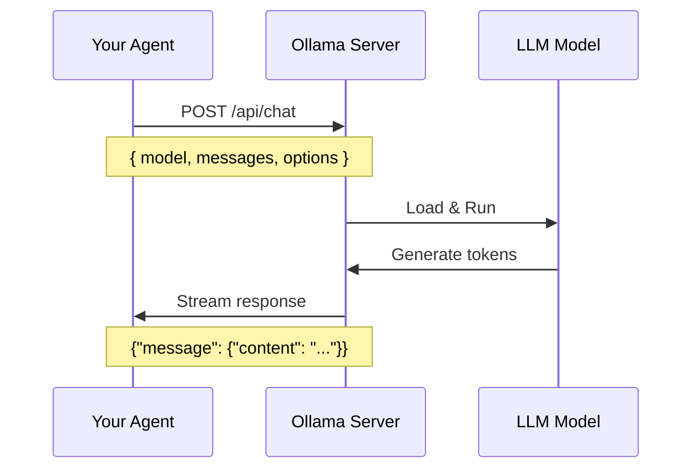
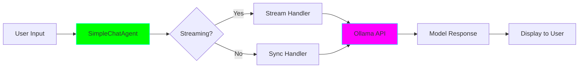

# Agent 1: Simple Chat Agent ⭐

**Complexity:** Beginner | **Framework:** Native `ollama` library | **Estimated Time:** 1-2 hours

---

## 🎯 Learning Objectives

After completing this agent, you will understand:

- ✅ How to connect to Ollama's local API
- ✅ The difference between streaming and non-streaming responses
- ✅ How to send messages and receive completions
- ✅ Basic prompt structure (system vs. user messages)
- ✅ How to adjust temperature and other parameters
- ✅ Error handling for LLM requests

---

## 🧠 Key Concepts

### What is Ollama?

Ollama is a tool that lets you run Large Language Models (LLMs) locally on your machine. Instead of sending requests to external APIs (like OpenAI), you run models directly on your M4 Mac.

**Benefits:**
- 🔒 **Privacy:** Your code never leaves your machine
- 💰 **Cost:** Completely free (no API tokens)
- ⚡ **Speed:** No network latency for small models
- 🎮 **Control:** Full control over model parameters

### Ollama API Structure

Ollama exposes a REST API at `http://localhost:11434`. The main endpoint is `/api/chat`:



### Streaming vs. Non-Streaming

**Streaming:**
- Tokens arrive as they're generated
- Better UX (see response in real-time)
- Slightly more complex to handle

**Non-Streaming:**
- Wait for complete response
- Simpler code
- Feels slower for long responses

### Temperature Parameter

Temperature controls randomness:

- **0.0-0.3:** Deterministic, focused (good for code)
- **0.4-0.7:** Balanced (default)
- **0.8-1.0:** Creative, varied (good for brainstorming)
- **>1.0:** Very random (usually not recommended)

---

## 💻 Code Walkthrough

### Architecture



### Main Components

1. **SimpleChatAgent Class:** Main agent logic
2. **HTTP Client:** Uses `httpx` to call Ollama
3. **Rich Console:** Beautiful terminal output
4. **Message History:** Maintains conversation context

### Code Structure

```python
class SimpleChatAgent:
    def __init__(self, model: str):
        # Initialize with specific Ollama model
        self.model = model
        self.conversation_history = []

    def chat(self, message: str, stream: bool = True):
        # Add user message to history
        # Call Ollama API
        # Stream or wait for response
        # Add assistant response to history
        pass

    def _stream_response(self, payload):
        # Handle streaming responses
        pass

    def _sync_response(self, payload):
        # Handle synchronous responses
        pass
```

---

## 🔧 How It Works

### Step-by-Step Flow

1. **User enters a message**
   ```
   You: "Explain what a decorator is in Python"
   ```

2. **Agent formats the request**
   ```json
   {
     "model": "qwen2.5-coder:7b",
     "messages": [
       {"role": "system", "content": "You are a helpful coding assistant."},
       {"role": "user", "content": "Explain what a decorator is in Python"}
     ],
     "stream": true,
     "options": {
       "temperature": 0.7
     }
   }
   ```

3. **Send to Ollama via HTTP POST**
   ```python
   response = httpx.post("http://localhost:11434/api/chat", json=payload)
   ```

4. **Receive streaming response**
   ```
   A decorator... is a... function... that... modifies...
   ```

5. **Display to user in real-time**

---

## 🚀 Usage

### Basic Usage

```bash
# Activate your virtual environment
source ../../.venv/bin/activate

# Run the agent
python agent.py

# Or specify a model
python agent.py --model qwen2.5:3b

# Or disable streaming
python agent.py --no-stream
```

### Example Session

```
╭─────────────────────────────────────────╮
│  Simple Chat Agent                      │
│  Model: qwen2.5-coder:7b               │
│  Type 'quit' to exit                    │
╰─────────────────────────────────────────╯

You: What's the difference between a list and a tuple?