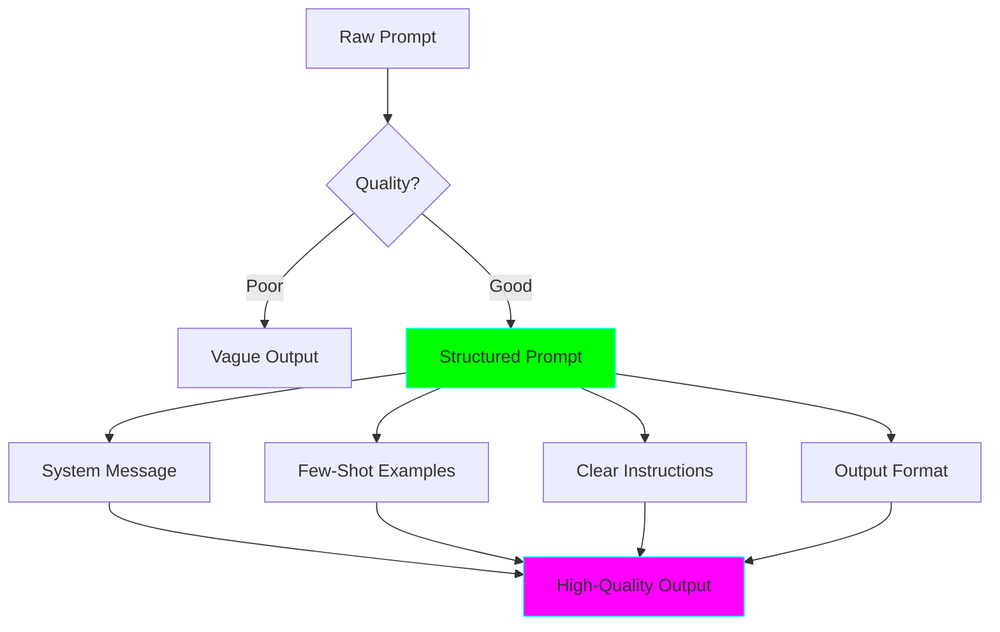
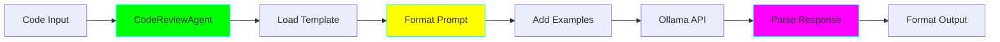
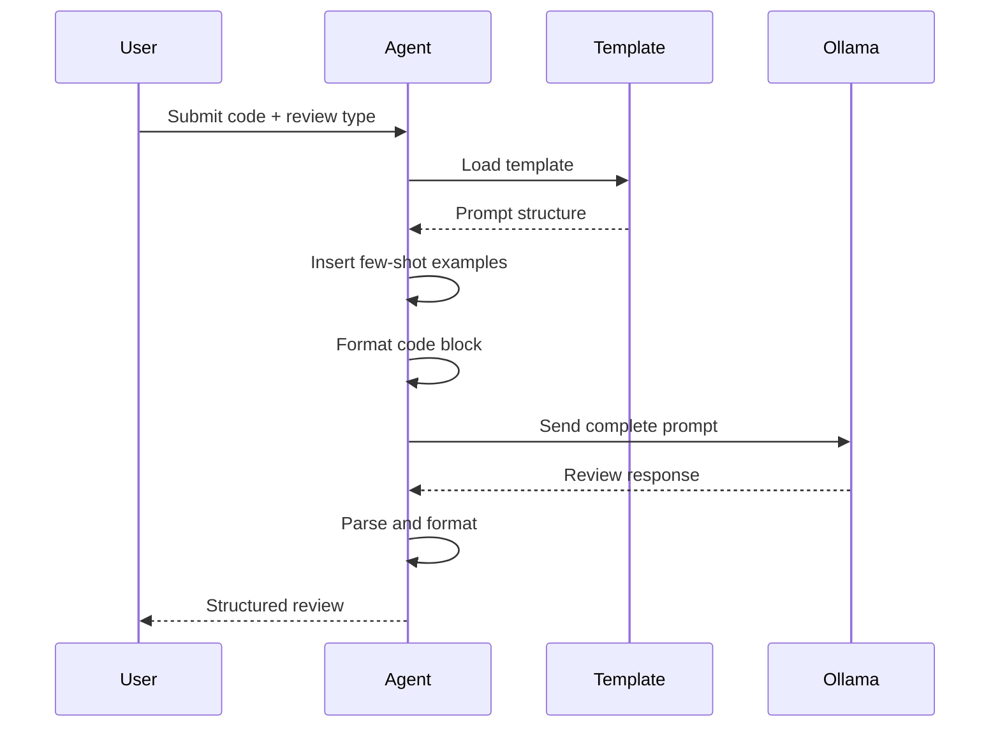

# Agent 2: Code Review Assistant ⭐⭐

**Complexity:** Beginner-Intermediate | **Framework:** `ollama` + Prompt Templates | **Estimated Time:** 2-3 hours

---

## 🎯 Learning Objectives

After completing this agent, you will understand:

- ✅ How to structure effective prompts for specific tasks
- ✅ Few-shot learning with examples
- ✅ Using system messages to control behavior
- ✅ Template-based prompt engineering
- ✅ Parsing and formatting code for analysis
- ✅ Structured output formats (JSON, Markdown)

---

## 🧠 Key Concepts

### Prompt Engineering

**Prompt engineering** is the art of crafting effective instructions for LLMs. A well-structured prompt can dramatically improve output quality.



### Components of a Good Prompt

1. **Role Definition** (System Message)
   - Who is the AI?
   - What expertise does it have?
   - What is its goal?

2. **Context**
   - What is being analyzed?
   - What's the background?

3. **Few-Shot Examples**
   - Show the AI what "good" looks like
   - Demonstrate the expected format

4. **Instructions**
   - Clear, specific tasks
   - Step-by-step if complex

5. **Output Format**
   - How should the response be structured?
   - JSON? Markdown? Bullet points?

### Few-Shot Learning

**Few-shot learning** means providing examples in your prompt:

```
Example 1:
Code: def add(a, b): return a + b
Review: ✅ Good - Simple and clear

Example 2:
Code: def x(a,b):return a+b
Review: ❌ Issues - Poor naming, no spaces

Now review this code:
[actual code to review]
```

### Code Review Criteria

Good code reviews check for:

- **Correctness:** Does it work?
- **Readability:** Is it clear?
- **Performance:** Is it efficient?
- **Security:** Any vulnerabilities?
- **Best Practices:** Follows conventions?
- **Testing:** Is it testable?

---

## 💻 Code Walkthrough

### Architecture



### Key Features

1. **Review Templates:**
   ```python
   TEMPLATES = {
       "general": "Review code for quality...",
       "security": "Focus on security issues...",
       "performance": "Analyze performance...",
   }
   ```

2. **Few-Shot Examples:**
   ```python
   EXAMPLES = [
       {"code": "...", "review": "..."},
       {"code": "...", "review": "..."},
   ]
   ```

3. **Structured Output:**
   ```python
   {
       "summary": "Overall assessment",
       "issues": [...],
       "suggestions": [...],
       "rating": "8/10"
   }
   ```

---

## 🔧 How It Works

### Review Types

1. **General Review**
   - Overall code quality
   - Best practices
   - Readability

2. **Security Review**
   - SQL injection
   - XSS vulnerabilities
   - Authentication issues

3. **Performance Review**
   - Time complexity
   - Memory usage
   - Optimization opportunities

4. **Style Review**
   - Naming conventions
   - Formatting
   - Documentation

### Review Process



---

## 🚀 Usage

### Command Line

```bash
# Basic usage
python agent.py --file mycode.py

# Specific review type
python agent.py --file mycode.py --review-type security

# From stdin
cat mycode.py | python agent.py

# Custom model
python agent.py --file mycode.py --model qwen2.5-coder:7b
```

### Example Output

```
╭──────────────────────────────────╮
│  Code Review Results             │
╰──────────────────────────────────╯

📊 Overall Rating: 7/10

✅ Strengths:
  • Clear function names
  • Good type hints
  • Proper error handling

❌ Issues Found:
  1. Missing docstrings
  2. No input validation
  3. Long function (consider refactoring)

💡 Suggestions:
  • Add docstring explaining parameters
  • Validate input types explicitly
  • Extract helper functions

🔒 Security:
  No critical security issues found

⚡ Performance:
  O(n) complexity - acceptable for this use case
```

---

## 📚 Learning Points

### 1. System Messages Matter

Bad system message:
```python
"You are helpful."
```

Good system message:
```python
"You are a senior software engineer with 10 years of experience
conducting thorough code reviews. You focus on security, performance,
and maintainability. Provide actionable feedback with examples."
```

### 2. Structure Your Prompts

Bad prompt:
```
Review this code: [code]
```

Good prompt:
```
Role: Senior Code Reviewer
Task: Review the following Python code
Focus: Security, Performance, Best Practices
Output Format: JSON with sections for issues, suggestions, rating

Few-shot examples:
[example 1]
[example 2]

Code to review:
[code]
```

### 3. Use Few-Shot Examples

Including 2-3 examples of good reviews helps the model understand:
- The level of detail you want
- The tone and format
- What constitutes a "good" vs "bad" review

### 4. Specify Output Format

Explicitly request structured output:
```python
"Provide review as JSON with these keys:
- summary: brief overview
- issues: list of problems
- suggestions: list of improvements
- rating: score out of 10"
```

---

## 🎮 Challenges

### Beginner
- [ ] Modify templates to match your team's review guidelines
- [ ] Add more few-shot examples for your language/framework
- [ ] Create a "beginner-friendly" review mode (gentler feedback)

### Intermediate
- [ ] Add support for multiple programming languages
- [ ] Integrate with git to review only changed lines
- [ ] Create custom review rules (configurable)

### Advanced
- [ ] Build a diff-based reviewer (only review changes)
- [ ] Add automatic fix suggestions
- [ ] Create a learning mode that explains WHY something is an issue

---

## 🐛 Common Issues

**Issue:** Reviews are too generic

**Solution:** Add more specific few-shot examples and clearer criteria

**Issue:** Model misses obvious bugs

**Solution:** Add examples of those specific bugs in your prompt

**Issue:** Reviews are too harsh/gentle

**Solution:** Adjust tone in system message

---

## 📖 Further Reading

- [Prompt Engineering Guide](https://www.promptingguide.ai/)
- [OpenAI Prompt Engineering Best Practices](https://platform.openai.com/docs/guides/prompt-engineering)
- [Few-Shot Learning Explained](https://arxiv.org/abs/2005.14165)

---

**Ready to learn?** Run `python agent.py --help` to get started!

**Next:** [Agent 3: Git Commit Message Generator](../03_commit_message/README.md) →
