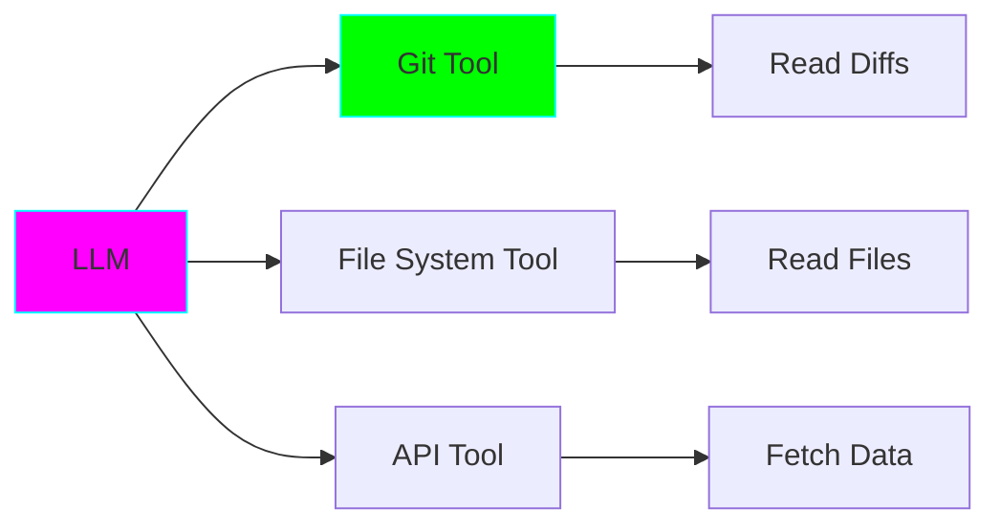

# Agent 3: Git Commit Message Generator ⭐⭐

**Complexity:** Intermediate | **Framework:** `langchain-ollama` + `gitpython` | **Estimated Time:** 2-3 hours

---

## 🎯 Learning Objectives

- ✅ Integrate LLMs with external tools (Git)
- ✅ Process structured data (git diffs)
- ✅ Introduction to LangChain framework
- ✅ Parse and analyze file changes
- ✅ Follow commit message conventions
- ✅ Handle multi-file changes

---

## 🧠 Key Concepts

### Tool Integration

**Tools** extend what LLMs can do by connecting them to external systems:



### Conventional Commits

Good commit messages follow a convention:

```
<type>(<scope>): <description>

[optional body]

[optional footer]
```

**Types:**
- `feat`: New feature
- `fix`: Bug fix
- `docs`: Documentation
- `style`: Formatting
- `refactor`: Code restructuring
- `test`: Adding tests
- `chore`: Maintenance

### Why LangChain?

**LangChain** is a framework for building LLM applications. It provides:
- Abstraction over different LLM providers
- Tool integration
- Chain composition
- Memory management

---

## 🚀 Usage

```bash
# Generate commit message for staged changes
python agent.py

# For specific files
python agent.py --files src/main.py tests/test_main.py

# Custom commit type
python agent.py --type feat

# With conventional commits format
python agent.py --conventional
```

---

**Next:** [Agent 4: Documentation Writer](../04_doc_writer/README.md) →
