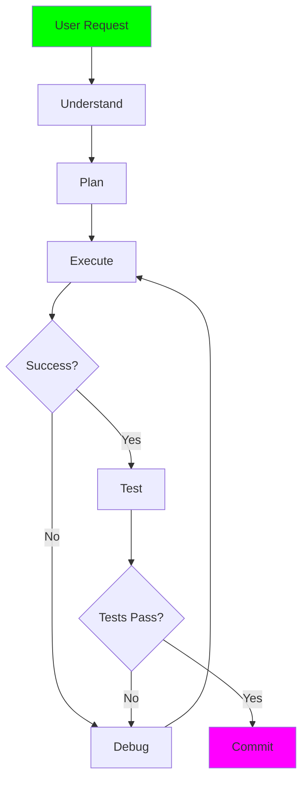

# Agent 10: AI Pair Programmer ⭐⭐⭐⭐⭐⭐

**Complexity:** Expert | **Framework:** `langgraph` + all concepts | **Estimated Time:** 8-10 hours

## 🎯 Learning Objectives

- ✅ Full agentic workflow implementation
- ✅ Planning and execution loops
- ✅ Complex tool orchestration
- ✅ State management and memory
- ✅ Interactive coding sessions
- ✅ All concepts from previous agents

## 🧠 Key Concepts

### Agentic Workflow

A complete AI pair programmer needs:



### Components

1. **Planner**: Breaks down tasks
2. **Coder**: Writes code
3. **Tester**: Runs tests
4. **Debugger**: Fixes issues
5. **Reviewer**: Checks quality

## 🚀 Usage

```bash
# Interactive pair programming
python agent.py

# Execute a task
python agent.py --task "Add a caching layer to the API"

# With specific context
python agent.py --task "Fix the authentication bug" --context src/auth.py
```

## 🎓 What You've Learned

Congratulations! You've mastered:

1. **Basics** (Agents 1-2): Ollama API, prompt engineering
2. **Integration** (Agents 3-4): Tools, RAG, document processing
3. **Analysis** (Agents 5-7): Code parsing, embeddings, semantic search
4. **Coordination** (Agent 8): Multi-agent systems
5. **Advanced Patterns** (Agents 9-10): ReAct, LangGraph, full workflows

You're now ready to build production AI systems!
