# 🎮 AI Kit: Gamified Agent System

**Status:** 🧪 Experimental
**Created:** 2025-11-05
**Complexity:** Varies by solution (Low-High)
**Tech Stack:** Multiple options (Python, TypeScript, Claude Code)

## Overview

This experiment explores building an **AI Agent Kit** based on the "Beyond Code Generation" gamified approach. Instead of a single AI assistant, we create specialized agent personas that collaborate throughout the development lifecycle.

### Core Concept


## The Five Agent Personas

| Agent | Role | Emoji | Primary Use Cases | Personality |
|-------|------|-------|-------------------|-------------|
| **Pathfinder** | Navigation & Planning | 🧭 | Project planning, debugging, tech selection | Analytical, solution-oriented |
| **Architect** | System Design | 🏗️ | Architecture design, patterns, scalability | Strategic, thoughtful |
| **Autofisher** | Code Implementation | 🎣 | Feature implementation, refactoring | Pragmatic, detail-oriented |
| **Scribe** | Documentation | 📝 | Docs, API references, comments | Thorough, communicative |
| **Sentinel** | Security & Quality | 🛡️ | Security review, vulnerability detection | Vigilant, cautious |

---

## Solution Approaches

### 📊 Complexity & Features Comparison

```mermaid
graph LR
    subgraph "Complexity Scale"
        A[🟢 Low] --> B[🟡 Medium] --> C[🟠 Med-High] --> D[🔴 High]
    end

    subgraph "Solutions"
        S1[Solution 1:<br/>Claude Subagents<br/>🟢]
        S2[Solution 2:<br/>Python CLI<br/>🟡]
        S3[Solution 3:<br/>Multi-Agent Framework<br/>🟡]
        S4[Solution 4:<br/>Web Dashboard<br/>🟠]
        S5[Solution 5:<br/>VSCode Extension<br/>🔴]
    end

    style S1 fill:#00ff00,stroke:#00ffff
    style S2 fill:#ffff00,stroke:#00ffff
    style S3 fill:#ffff00,stroke:#00ffff
    style S4 fill:#ff8c00,stroke:#00ffff
    style S5 fill:#ff0000,stroke:#00ffff
```



---

## Solution 1: Claude Code Subagents 🟢

**Complexity:** Low-Medium
**Time to MVP:** 2-4 hours
**Tech Stack:** Claude Code, Markdown
**Best For:** Quick experimentation, leveraging existing Claude Code infrastructure

### Architecture


### Implementation

Each agent is a specialized subagent in `.claude/agents/` with a custom prompt:

**File:** `.claude/agents/pathfinder.md`
```markdown
You are Pathfinder 🧭, the Navigation and Planning Guide.

Your expertise: Project planning, technology selection, debugging strategies, breaking down complex problems.

Your personality: Analytical, solution-oriented, excellent at charting courses through complexity.

When activated:
1. Assess the current situation and goal
2. Break down complex problems into manageable steps
3. Recommend appropriate technologies or approaches
4. Create actionable roadmaps
5. Identify potential obstacles and mitigation strategies

Always respond with clear, step-by-step guidance and use visual diagrams when helpful.
```

### Pros & Cons

✅ **Pros:**
- Minimal setup - works with existing Claude Code
- Easy to iterate and refine agent prompts
- Native integration with development workflow
- No additional infrastructure needed

❌ **Cons:**
- Manual agent selection (not automatic routing)
- Limited to text-based interaction
- No persistent state between sessions
- Can't run agents in parallel easily

### Example Workflow

```bash
# In Claude Code
"Hey @pathfinder, I need to build a REST API for user authentication"
# Pathfinder provides planning guidance

"@architect, based on this plan, what should the architecture look like?"
# Architect proposes design

"@autofisher, implement the user registration endpoint"
# Autofisher generates code

"@sentinel, review this code for security issues"
# Sentinel performs security analysis

"@scribe, document this API endpoint"
# Scribe creates documentation
```

---

## Solution 2: Python CLI with Agent Framework 🟡

**Complexity:** Medium
**Time to MVP:** 1-2 weeks
**Tech Stack:** Python, Click, Anthropic API, Rich (for UI)
**Best For:** Command-line power users, CI/CD integration

### Architecture


### Implementation Example

**Project Structure:**
```
ai-kit/
├── pyproject.toml
├── src/
│   └── aikit/
│       ├── __init__.py
│       ├── cli.py
│       ├── agents/
│       │   ├── __init__.py
│       │   ├── base.py
│       │   ├── pathfinder.py
│       │   ├── architect.py
│       │   ├── autofisher.py
│       │   ├── scribe.py
│       │   └── sentinel.py
│       ├── orchestrator.py
│       └── config.py
└── tests/
```

**Core Implementation:** `src/aikit/agents/base.py`
```python
from abc import ABC, abstractmethod
from anthropic import Anthropic
from typing import Dict, List, Optional

class BaseAgent(ABC):
    """Base class for all agent personas"""

    def __init__(self, api_key: str):
        self.client = Anthropic(api_key=api_key)
        self.conversation_history: List[Dict] = []

    @property
    @abstractmethod
    def name(self) -> str:
        """Agent name"""
        pass

    @property
    @abstractmethod
    def emoji(self) -> str:
        """Agent emoji identifier"""
        pass

    @property
    @abstractmethod
    def system_prompt(self) -> str:
        """Agent's specialized system prompt"""
        pass

    def chat(self, message: str, context: Optional[Dict] = None) -> str:
        """Send message to agent and get response"""

        # Add context to system prompt if provided
        system = self.system_prompt
        if context:
            system += f"\n\nContext:\n{self._format_context(context)}"

        # Build messages
        messages = self.conversation_history + [
            {"role": "user", "content": message}
        ]

        # Call Claude API
        response = self.client.messages.create(
            model="claude-sonnet-4-5-20250929",
            max_tokens=4096,
            system=system,
            messages=messages
        )

        # Extract response
        assistant_message = response.content[0].text

        # Update history
        self.conversation_history.append({"role": "user", "content": message})
        self.conversation_history.append({"role": "assistant", "content": assistant_message})

        return assistant_message

    def _format_context(self, context: Dict) -> str:
        """Format context dictionary for system prompt"""
        return "\n".join([f"- {k}: {v}" for k, v in context.items()])

    def reset(self):
        """Clear conversation history"""
        self.conversation_history = []
```

**Pathfinder Agent:** `src/aikit/agents/pathfinder.py`
```python
from .base import BaseAgent

class PathfinderAgent(BaseAgent):
    """🧭 Navigation and Planning Guide"""

    @property
    def name(self) -> str:
        return "Pathfinder"

    @property
    def emoji(self) -> str:
        return "🧭"

    @property
    def system_prompt(self) -> str:
        return """You are Pathfinder 🧭, the Navigation and Planning Guide.

Your expertise:
- Project planning and roadmap creation
- Technology selection and evaluation
- Debugging strategies and troubleshooting
- Breaking down complex problems into manageable tasks
- Identifying potential obstacles and solutions

Your personality:
- Analytical and solution-oriented
- Excellent at seeing the big picture
- Strategic thinker who considers multiple paths
- Clear communicator who makes complex things simple

Your approach:
1. Understand the goal and current situation
2. Analyze constraints and requirements
3. Propose multiple approaches with trade-offs
4. Break down into actionable steps
5. Identify risks and mitigation strategies
6. Provide clear, step-by-step guidance

Always structure your responses clearly with:
- Summary of the situation
- Recommended approach (and alternatives)
- Step-by-step action plan
- Potential challenges and solutions
- Success criteria

Use markdown formatting, bullet points, and be concise but thorough."""
```

**CLI Interface:** `src/aikit/cli.py`
```python
import click
from rich.console import Console
from rich.markdown import Markdown
from rich.panel import Panel
from .agents import PathfinderAgent, ArchitectAgent, AutofisherAgent, ScribeAgent, SentinelAgent
from .orchestrator import AgentOrchestrator
import os

console = Console()

@click.group()
@click.pass_context
def cli(ctx):
    """AI Kit - Gamified Agent System for Development"""
    ctx.ensure_object(dict)
    ctx.obj['api_key'] = os.getenv('ANTHROPIC_API_KEY')
    if not ctx.obj['api_key']:
        console.print("[red]Error: ANTHROPIC_API_KEY environment variable not set[/red]")
        exit(1)

@cli.command()
@click.argument('message')
@click.pass_context
def pathfinder(ctx, message):
    """🧭 Get planning and navigation guidance"""
    agent = PathfinderAgent(ctx.obj['api_key'])
    _chat_with_agent(agent, message)

@cli.command()
@click.argument('message')
@click.pass_context
def architect(ctx, message):
    """🏗️ Get architecture and design advice"""
    agent = ArchitectAgent(ctx.obj['api_key'])
    _chat_with_agent(agent, message)

@cli.command()
@click.argument('message')
@click.pass_context
def autofisher(ctx, message):
    """🎣 Generate code implementation"""
    agent = AutofisherAgent(ctx.obj['api_key'])
    _chat_with_agent(agent, message)

@cli.command()
@click.argument('message')
@click.pass_context
def scribe(ctx, message):
    """📝 Generate documentation"""
    agent = ScribeAgent(ctx.obj['api_key'])
    _chat_with_agent(agent, message)

@cli.command()
@click.argument('message')
@click.pass_context
def sentinel(ctx, message):
    """🛡️ Perform security review"""
    agent = SentinelAgent(ctx.obj['api_key'])
    _chat_with_agent(agent, message)

@cli.command()
@click.argument('workflow')
@click.argument('message')
@click.pass_context
def workflow(ctx, workflow, message):
    """Execute a multi-agent workflow"""
    orchestrator = AgentOrchestrator(ctx.obj['api_key'])

    workflows = {
        'feature': ['pathfinder', 'architect', 'autofisher', 'sentinel', 'scribe'],
        'refactor': ['pathfinder', 'architect', 'autofisher'],
        'security': ['sentinel', 'pathfinder', 'autofisher'],
        'docs': ['scribe'],
    }

    if workflow not in workflows:
        console.print(f"[red]Unknown workflow: {workflow}[/red]")
        console.print(f"Available: {', '.join(workflows.keys())}")
        return

    result = orchestrator.run_workflow(workflows[workflow], message)
    console.print(result)

def _chat_with_agent(agent, message):
    """Helper to chat with an agent and display response"""
    console.print(Panel(
        f"[cyan]{message}[/cyan]",
        title=f"You → {agent.emoji} {agent.name}",
        border_style="cyan"
    ))

    with console.status(f"[bold green]{agent.emoji} {agent.name} is thinking..."):
        response = agent.chat(message)

    console.print(Panel(
        Markdown(response),
        title=f"{agent.emoji} {agent.name}",
        border_style="green"
    ))

if __name__ == '__main__':
    cli(obj={})
```

### Usage Examples

```bash
# Install the CLI
pip install -e .

# Single agent interaction
aikit pathfinder "I need to build a user authentication system"
aikit architect "Design a scalable REST API architecture"
aikit autofisher "Implement JWT token validation middleware"
aikit sentinel "Review this authentication code for vulnerabilities"
aikit scribe "Document the authentication API endpoints"

# Multi-agent workflow
aikit workflow feature "Add password reset functionality"
# This runs: pathfinder → architect → autofisher → sentinel → scribe

# Interactive mode (planned)
aikit interactive
```

### Pros & Cons

✅ **Pros:**
- Scriptable and automatable
- Works in CI/CD pipelines
- Persistent conversation history per session
- Can integrate with other CLI tools
- Rich terminal UI with colors and formatting

❌ **Cons:**
- Requires API key configuration
- No GUI for less technical users
- Manual workflow orchestration
- Limited context awareness of project files

---

## Solution 3: Multi-Agent Framework (CrewAI/LangGraph) 🟡

**Complexity:** Medium
**Time to MVP:** 1-2 weeks
**Tech Stack:** Python, CrewAI or LangGraph, Anthropic API
**Best For:** Complex autonomous workflows, advanced agent collaboration

### Architecture


### Implementation Example

**Using CrewAI:**

```python
from crewai import Agent, Task, Crew, Process
from langchain_anthropic import ChatAnthropic

# Initialize LLM
llm = ChatAnthropic(
    model="claude-sonnet-4-5-20250929",
    anthropic_api_key=os.getenv('ANTHROPIC_API_KEY')
)

# Define Agents
pathfinder = Agent(
    role='Navigation and Planning Guide',
    goal='Plan project roadmaps and break down complex problems',
    backstory="""You are Pathfinder 🧭, an analytical and solution-oriented guide.
    You excel at seeing the big picture, evaluating options, and creating clear paths forward.
    Your strategic thinking helps teams navigate complexity with confidence.""",
    verbose=True,
    allow_delegation=True,
    llm=llm
)

architect = Agent(
    role='System Design Advisor',
    goal='Design scalable, maintainable software architectures',
    backstory="""You are Architect 🏗️, a strategic system designer.
    You think long-term about structure, patterns, and relationships between components.
    Your designs balance current needs with future extensibility.""",
    verbose=True,
    allow_delegation=True,
    llm=llm
)

autofisher = Agent(
    role='Code Implementation Specialist',
    goal='Write clean, efficient, production-ready code',
    backstory="""You are Autofisher 🎣, a pragmatic code craftsperson.
    You transform designs and requirements into working, well-structured code.
    You care deeply about code quality, readability, and maintainability.""",
    verbose=True,
    allow_delegation=False,
    llm=llm
)

sentinel = Agent(
    role='Security and Quality Guardian',
    goal='Identify and mitigate security vulnerabilities',
    backstory="""You are Sentinel 🛡️, a vigilant security expert.
    You think like an attacker to find vulnerabilities before they can be exploited.
    Your thorough reviews keep systems safe and compliant.""",
    verbose=True,
    allow_delegation=False,
    llm=llm
)

scribe = Agent(
    role='Documentation Expert',
    goal='Create clear, comprehensive documentation',
    backstory="""You are Scribe 📝, a communication specialist.
    You make complex topics accessible through clear, well-structured documentation.
    You ensure knowledge is preserved and shared effectively.""",
    verbose=True,
    allow_delegation=False,
    llm=llm
)

# Define Tasks
task_plan = Task(
    description="""Analyze the requirement: {feature_request}
    Create a detailed implementation plan with:
    - Technical approach
    - Required components
    - Step-by-step roadmap
    - Potential challenges""",
    agent=pathfinder,
    expected_output="Detailed implementation plan with steps and considerations"
)

task_design = Task(
    description="""Based on the plan, design the system architecture for: {feature_request}
    Include:
    - Component structure
    - Data models
    - API contracts
    - Design patterns to use""",
    agent=architect,
    expected_output="System architecture design with diagrams and specifications"
)

task_implement = Task(
    description="""Implement the designed solution for: {feature_request}
    Generate:
    - Production-ready code
    - Unit tests
    - Error handling
    - Code comments""",
    agent=autofisher,
    expected_output="Working code implementation with tests"
)

task_security = Task(
    description="""Review the implementation for security issues:
    - Input validation
    - Authentication/authorization
    - Data protection
    - Common vulnerabilities (OWASP Top 10)""",
    agent=sentinel,
    expected_output="Security analysis report with findings and recommendations"
)

task_document = Task(
    description="""Document the feature: {feature_request}
    Create:
    - User-facing documentation
    - API documentation
    - Code comments review
    - Usage examples""",
    agent=scribe,
    expected_output="Complete documentation package"
)

# Create Crew
feature_crew = Crew(
    agents=[pathfinder, architect, autofisher, sentinel, scribe],
    tasks=[task_plan, task_design, task_implement, task_security, task_document],
    process=Process.sequential,
    verbose=True
)

# Execute
result = feature_crew.kickoff(inputs={
    'feature_request': 'OAuth2 authentication with Google and GitHub providers'
})

print(result)
```

### Workflow Visualization

```mermaid
stateDiagram-v2
    [*] --> Planning
    Planning --> Design: Plan approved
    Design --> Implementation: Design approved
    Implementation --> SecurityReview: Code complete
    SecurityReview --> FixIssues: Issues found
    SecurityReview --> Documentation: Security OK
    FixIssues --> SecurityReview: Issues fixed
    Documentation --> [*]: Complete

    note right of Planning
        🧭 Pathfinder
        Creates roadmap
    end note

    note right of Design
        🏗️ Architect
        Designs system
    end note

    note right of Implementation
        🎣 Autofisher
        Writes code
    end note

    note right of SecurityReview
        🛡️ Sentinel
        Checks security
    end note

    note right of Documentation
        📝 Scribe
        Documents feature
    end note
```



### Pros & Cons

✅ **Pros:**
- Autonomous multi-agent workflows
- Built-in task delegation and collaboration
- Shared memory between agents
- Sophisticated error handling and retry logic
- Supports parallel agent execution

❌ **Cons:**
- Steeper learning curve
- Can be unpredictable with complex workflows
- Higher API costs (multiple LLM calls)
- Requires careful prompt engineering
- Less control over exact agent behavior

---

## Solution 4: Interactive Web Dashboard 🟠

**Complexity:** Medium-High
**Time to MVP:** 2-4 weeks
**Tech Stack:** React/Next.js, FastAPI, Anthropic API, WebSockets
**Best For:** Team collaboration, visual workflows, non-technical users

### Architecture


### Key Features

1. **Visual Agent Selection**
   - Card-based UI for each agent persona
   - Quick description and use cases
   - One-click agent activation

2. **Interactive Chat Interface**
   - Real-time streaming responses
   - Conversation history per agent
   - Context-aware suggestions

3. **Workflow Builder**
   - Drag-and-drop workflow creation
   - Visual pipeline editor
   - Save and reuse workflows

4. **Team Collaboration**
   - Shared agent sessions
   - Workspace for project teams
   - Export/import conversations

5. **Analytics Dashboard**
   - Agent usage statistics
   - Performance metrics
   - Cost tracking

### UI Mockup (ASCII)

```
╔════════════════════════════════════════════════════════════════════╗
║  AI Agent Kit Dashboard                              [@user] [⚙️]  ║
╠════════════════════════════════════════════════════════════════════╣
║                                                                    ║
║  ┌──────────┐  ┌──────────┐  ┌──────────┐  ┌──────────┐  ┌─────┐ ║
║  │ 🧭       │  │ 🏗️       │  │ 🎣       │  │ 📝       │  │ 🛡️  │ ║
║  │Pathfinder│  │Architect │  │Autofisher│  │  Scribe  │  │Sent │ ║
║  │ ACTIVE   │  │          │  │          │  │          │  │inel │ ║
║  └──────────┘  └──────────┘  └──────────┘  └──────────┘  └─────┘ ║
║                                                                    ║
║  ┌────────────────────────────────────────────────────────────┐   ║
║  │ Conversation with Pathfinder 🧭                            │   ║
║  ├────────────────────────────────────────────────────────────┤   ║
║  │ You: I need to add OAuth authentication                    │   ║
║  │                                                             │   ║
║  │ Pathfinder: Let me break this down into steps:            │   ║
║  │ 1. Choose OAuth providers (Google, GitHub, etc.)           │   ║
║  │ 2. Set up OAuth application credentials                    │   ║
║  │ 3. Implement OAuth flow (authorization code grant)         │   ║
║  │ 4. Handle token management and refresh                     │   ║
║  │ 5. Integrate with your user system                         │   ║
║  │                                                             │   ║
║  │ Would you like me to hand this to Architect for design?    │   ║
║  │                                                             │   ║
║  │ [Pass to Architect] [Continue Planning] [Start Workflow]   │   ║
║  ├────────────────────────────────────────────────────────────┤   ║
║  │ Your message: __________________________________ [Send]     │   ║
║  └────────────────────────────────────────────────────────────┘   ║
║                                                                    ║
║  Recent Workflows:                                                 ║
║  • Feature: OAuth Authentication (in progress) 🟡                  ║
║  • Refactor: Database layer (completed) ✅                         ║
║  • Security Review: API endpoints (pending) ⏳                     ║
╚════════════════════════════════════════════════════════════════════╝
```

### Implementation Highlights

**Backend API (FastAPI):**
```python
from fastapi import FastAPI, WebSocket
from fastapi.middleware.cors import CORSMiddleware
import asyncio
from typing import Dict, List

app = FastAPI()

app.add_middleware(
    CORSMiddleware,
    allow_origins=["*"],
    allow_methods=["*"],
    allow_headers=["*"],
)

# Active connections per session
connections: Dict[str, WebSocket] = {}

# Agent instances
agents = {
    'pathfinder': PathfinderAgent(),
    'architect': ArchitectAgent(),
    'autofisher': AutofisherAgent(),
    'scribe': ScribeAgent(),
    'sentinel': SentinelAgent(),
}

@app.websocket("/ws/{session_id}/{agent_name}")
async def agent_chat(websocket: WebSocket, session_id: str, agent_name: str):
    await websocket.accept()
    connections[session_id] = websocket

    try:
        agent = agents.get(agent_name)
        if not agent:
            await websocket.send_json({"error": "Unknown agent"})
            return

        while True:
            # Receive message
            data = await websocket.receive_json()
            message = data.get('message')

            # Stream response
            async for chunk in agent.chat_stream(message):
                await websocket.send_json({
                    "type": "chunk",
                    "content": chunk
                })

            await websocket.send_json({"type": "complete"})

    except Exception as e:
        print(f"Error: {e}")
    finally:
        del connections[session_id]

@app.post("/api/workflows/{workflow_name}")
async def run_workflow(workflow_name: str, request: dict):
    """Execute a multi-agent workflow"""
    # Implementation for orchestrating multiple agents
    pass
```

### Pros & Cons

✅ **Pros:**
- Intuitive visual interface
- Great for non-technical users
- Real-time collaboration
- Workflow reusability
- Rich analytics and insights
- Mobile-friendly

❌ **Cons:**
- Significant development effort
- Requires hosting and infrastructure
- More complex deployment
- Authentication and security considerations
- Higher maintenance burden

---

## Solution 5: VSCode Extension 🔴

**Complexity:** High
**Time to MVP:** 4-8 weeks
**Tech Stack:** TypeScript, VSCode Extension API, Anthropic API
**Best For:** Deep IDE integration, context-aware assistance

### Architecture


### Key Features

1. **Inline Agent Actions**
   - Right-click context menu for agent commands
   - Quick fixes powered by agents
   - Inline suggestions as you type

2. **Side Panel Dashboard**
   - Agent chat interface
   - Workflow runner
   - History and favorites

3. **Context-Aware Assistance**
   - Automatically includes relevant files
   - Understands project structure
   - Accesses git history and changes

4. **Code Annotations**
   - Security warnings from Sentinel
   - Architecture suggestions from Architect
   - Documentation prompts from Scribe

### Usage Flow

```mermaid
sequenceDiagram
    participant Dev as Developer
    participant VS as VSCode
    participant Ext as Extension
    participant Agent as Agent

    Dev->>VS: Select code
    Dev->>VS: Right-click → "Ask Architect"
    VS->>Ext: Trigger command
    Ext->>Ext: Collect context (file, selection, project)
    Ext->>Agent: Send request with context
    Agent->>Ext: Stream response
    Ext->>VS: Display in panel
    Dev->>VS: Click "Apply suggestion"
    Ext->>VS: Insert code
```



### Implementation Sketch

**Extension Entry:** `extension.ts`
```typescript
import * as vscode from 'vscode';
import { AgentPanel } from './panels/AgentPanel';
import { ArchitectProvider } from './providers/ArchitectProvider';
import { SentinelDiagnostics } from './diagnostics/SentinelDiagnostics';

export function activate(context: vscode.ExtensionContext) {
    // Register agent panel
    const agentPanel = new AgentPanel(context.extensionUri);
    context.subscriptions.push(
        vscode.window.registerWebviewViewProvider('aikit.agentPanel', agentPanel)
    );

    // Register commands
    context.subscriptions.push(
        vscode.commands.registerCommand('aikit.askPathfinder', async () => {
            const selection = vscode.window.activeTextEditor?.selection;
            const text = vscode.window.activeTextEditor?.document.getText(selection);
            await agentPanel.activateAgent('pathfinder', text);
        })
    );

    context.subscriptions.push(
        vscode.commands.registerCommand('aikit.askArchitect', async () => {
            const selection = vscode.window.activeTextEditor?.selection;
            const text = vscode.window.activeTextEditor?.document.getText(selection);
            await agentPanel.activateAgent('architect', text);
        })
    );

    // Register code actions
    context.subscriptions.push(
        vscode.languages.registerCodeActionsProvider(
            { scheme: 'file' },
            new ArchitectProvider(),
            { providedCodeActionKinds: [vscode.CodeActionKind.Refactor] }
        )
    );

    // Register diagnostics (security warnings)
    const sentinelDiagnostics = new SentinelDiagnostics();
    context.subscriptions.push(
        vscode.workspace.onDidSaveTextDocument(doc => {
            sentinelDiagnostics.analyzeSecurity(doc);
        })
    );
}
```

### Pros & Cons

✅ **Pros:**
- Seamless workflow integration
- Rich context awareness
- No context switching
- Familiar IDE environment
- Powerful VSCode API

❌ **Cons:**
- Complex development
- VSCode-specific (not portable)
- Extension marketplace submission process
- Limited to VSCode users
- Maintenance overhead

---

## Comparative Analysis

### Decision Matrix

| Criteria | Solution 1<br/>Claude Subagents | Solution 2<br/>Python CLI | Solution 3<br/>Multi-Agent Framework | Solution 4<br/>Web Dashboard | Solution 5<br/>VSCode Extension |
|----------|------|------|------|------|------|
| **Time to MVP** | ⭐⭐⭐⭐⭐ | ⭐⭐⭐⭐ | ⭐⭐⭐ | ⭐⭐ | ⭐ |
| **Ease of Use** | ⭐⭐⭐⭐ | ⭐⭐⭐ | ⭐⭐ | ⭐⭐⭐⭐⭐ | ⭐⭐⭐⭐ |
| **Automation** | ⭐⭐ | ⭐⭐⭐⭐ | ⭐⭐⭐⭐⭐ | ⭐⭐⭐ | ⭐⭐⭐ |
| **Flexibility** | ⭐⭐⭐⭐⭐ | ⭐⭐⭐⭐ | ⭐⭐⭐ | ⭐⭐⭐ | ⭐⭐⭐ |
| **Context Awareness** | ⭐⭐⭐ | ⭐⭐ | ⭐⭐⭐ | ⭐⭐ | ⭐⭐⭐⭐⭐ |
| **Team Collaboration** | ⭐⭐ | ⭐⭐ | ⭐⭐ | ⭐⭐⭐⭐⭐ | ⭐⭐ |
| **Maintenance** | ⭐⭐⭐⭐⭐ | ⭐⭐⭐⭐ | ⭐⭐⭐ | ⭐⭐ | ⭐⭐ |

### Cost Analysis


---

## Recommended Starting Path

### 🎯 Phase 1: Quick Validation (Week 1)

**Start with Solution 1: Claude Code Subagents**

1. Create 5 agent files in `.claude/agents/`
2. Test each agent individually
3. Document usage patterns
4. Gather feedback on usefulness

**Success Criteria:**
- [ ] All 5 agents created and tested
- [ ] At least 3 real-world use cases validated
- [ ] Clear understanding of limitations
- [ ] Decision on next phase

### 🎯 Phase 2: Enhanced Tooling (Weeks 2-3)

**Upgrade to Solution 2: Python CLI**

1. Port agent prompts to Python framework
2. Add conversation history
3. Implement basic workflows
4. Create rich terminal UI

**Success Criteria:**
- [ ] Installable CLI package
- [ ] 3-5 predefined workflows
- [ ] Persistent conversation state
- [ ] User documentation

### 🎯 Phase 3: Advanced Features (Optional)

**Choose based on needs:**

- **Need automation?** → Solution 3 (Multi-Agent Framework)
- **Need team features?** → Solution 4 (Web Dashboard)
- **Need IDE integration?** → Solution 5 (VSCode Extension)

---

## Next Steps

### Immediate Actions

1. **Pick a solution** based on your constraints:
   - Time-constrained? → Solution 1
   - CLI power user? → Solution 2
   - Need automation? → Solution 3
   - Building for team? → Solution 4
   - Want IDE integration? → Solution 5

2. **Set up experiment structure**
   - Create solution subdirectory
   - Copy relevant templates
   - Set up environment

3. **Start with one agent**
   - Implement Pathfinder first (most versatile)
   - Test thoroughly
   - Iterate on prompt quality

4. **Expand gradually**
   - Add one agent at a time
   - Validate each before moving on
   - Document learnings

### Evaluation Criteria

Track these metrics to determine success:

- **Usage frequency**: How often do you actually use the agents?
- **Quality of output**: Are responses helpful and accurate?
- **Time savings**: Does it actually save time vs. manual work?
- **Developer satisfaction**: Is it enjoyable to use?
- **Workflow integration**: Does it fit naturally into your process?

### Graduation Criteria

This experiment is ready to graduate when:

- [ ] All 5 agents implemented and tested
- [ ] At least 10 real-world use cases documented
- [ ] Positive feedback from 3+ users
- [ ] Clear ROI demonstrated (time saved, quality improved)
- [ ] Comprehensive documentation created
- [ ] Decision made on which solution to productionize

---

## Resources

### Documentation

- [Anthropic Claude API Docs](https://docs.anthropic.com/)
- [CrewAI Documentation](https://docs.crewai.com/)
- [LangChain Documentation](https://python.langchain.com/)
- [VSCode Extension API](https://code.visualstudio.com/api)

### Example Repositories

- TBD: Link to implementation examples once created

### Related Experiments

- None yet - this is the first!

---

## Learning Log

### 2025-11-05: Experiment Setup
- Created experiment structure
- Documented 5 solution approaches
- Identified trade-offs and complexity levels
- Ready to begin implementation

### Key Learnings

- Agent personas make AI assistance more intuitive
- Different solutions serve different use cases
- Start simple, expand based on proven value
- Context awareness is critical for quality

### Challenges Anticipated

- Prompt engineering for consistent agent behavior
- Managing conversation context and history
- Balancing automation with user control
- Cost management with API usage

### Next Actions

- [ ] Choose starting solution
- [ ] Implement first agent (Pathfinder)
- [ ] Test with real use cases
- [ ] Document learnings and iterate

---

**Status:** 🧪 Ready to implement
**Maintainer:** Your Name
**Last Updated:** 2025-11-05
