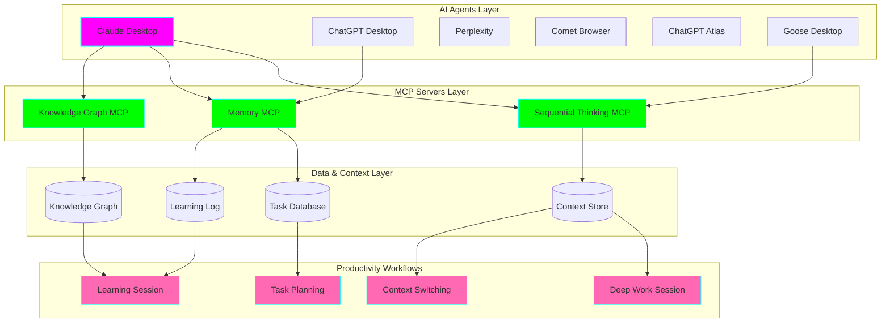
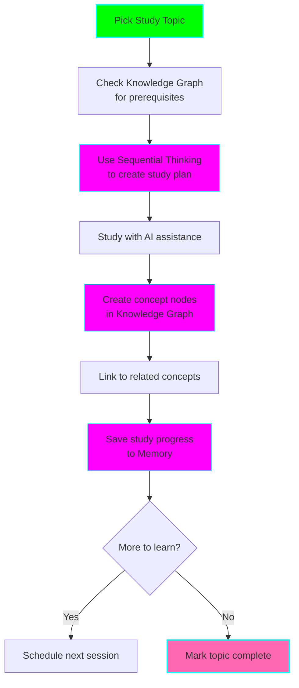

# 🧠 AI Productivity Orchestration

**Status:** 🧪 Experimental
**Started:** 2025-11-07
**Tech Stack:** Multiple AI Platforms + MCP Servers
**Focus:** ADHD-optimized productivity system using orchestrated AI agents

## 🎯 Experiment Goals

Create a comprehensive productivity system that leverages multiple AI agents and MCP servers to:

- ✅ Keep track of tasks and context across work sessions
- ✅ Maintain continuity in studying and learning
- ✅ Enable sequential thinking for complex problem-solving
- ✅ Build a personal knowledge graph of learned concepts
- ✅ Provide memory persistence across AI interactions
- ✅ Optimize workflow for ADHD brain patterns

## 🏗️ Architecture Overview



## 🤖 AI Tools Orchestration (10 Tools)

This experiment integrates **10 AI tools** for maximum productivity:

### Coding & Development
- **Claude Code** - Deep analysis, complex refactoring, architecture design
- **Claude Desktop** - Research, planning, MCP integration (Memory, Knowledge Graph, Sequential Thinking)
- **GitHub Copilot (IDE)** - Real-time code completion, boilerplate
- **GitHub Copilot (CLI)** - Terminal commands, git operations
- **Opencode** - Quick prototypes, simple scripts
- **Goose** - Documentation generation, workflow automation

### Research & Learning
- **Perplexity** - Real-time web research with citations
- **Comet Browser** - Web + AI integration
- **ChatGPT Desktop** - Quick questions, voice mode, brainstorming
- **ChatGPT Atlas** - Visual/spatial planning and organization

**See [ai-tool-integration-solution.md](./ai-tool-integration-solution.md) for complete tool comparison matrix and decision tree.**

## 🔌 MCP Server Integrations

### 1. Sequential Thinking MCP

**Purpose:** Break down complex problems into manageable steps

**Use Cases:**
- Planning multi-step projects
- Debugging complex issues
- Learning new concepts systematically
- Decision-making processes

**Configuration:**
```json
{
  "mcpServers": {
    "sequential-thinking": {
      "command": "npx",
      "args": ["-y", "@modelcontextprotocol/server-sequential-thinking"]
    }
  }
}
```

### 2. Memory MCP

**Purpose:** Persist context, tasks, and learnings across sessions

**Use Cases:**
- Task continuity across days/weeks
- Remember what you were learning
- Track progress on long-term projects
- Maintain context when switching between tasks

**Configuration:**
```json
{
  "mcpServers": {
    "memory": {
      "command": "npx",
      "args": ["-y", "@modelcontextprotocol/server-memory"]
    }
  }
}
```

### 3. Knowledge Graph MCP

**Purpose:** Build interconnected knowledge base of concepts

**Use Cases:**
- Map relationships between topics
- Track learning dependencies
- Visualize concept networks
- Quick reference for studied topics

**Configuration:**
```json
{
  "mcpServers": {
    "knowledge-graph": {
      "command": "npx",
      "args": ["-y", "@modelcontextprotocol/server-knowledge-graph"]
    }
  }
}
```

## 📋 Setup Instructions

### Step 1: Configure Claude Desktop

Edit `~/Library/Application Support/Claude/claude_desktop_config.json` (macOS) or `%APPDATA%\Claude\claude_desktop_config.json` (Windows):

```json
{
  "mcpServers": {
    "sequential-thinking": {
      "command": "npx",
      "args": ["-y", "@modelcontextprotocol/server-sequential-thinking"]
    },
    "memory": {
      "command": "npx",
      "args": ["-y", "@modelcontextprotocol/server-memory"]
    },
    "knowledge-graph": {
      "command": "npx",
      "args": ["-y", "@modelcontextprotocol/server-knowledge-graph"]
    }
  }
}
```

### Step 2: Restart Claude Desktop

Close and reopen Claude Desktop to load MCP servers.

### Step 3: Verify MCP Servers

In Claude Desktop, check for MCP tools:
- `sequentialThinking_*` tools
- `memory_*` tools
- `knowledgeGraph_*` tools

### Step 4: Test Each AI Agent

Document your experience with each agent in `agent-testing-log.md`

## 🔄 Productivity Workflows

### Deep Work Session Workflow


**Commands:**
1. Start: "Load my context from last session" (Memory MCP)
2. Plan: "Break down this task sequentially" (Sequential Thinking MCP)
3. Learn: "Add this concept to my knowledge graph" (Knowledge Graph MCP)
4. End: "Save current context for next session" (Memory MCP)

### Study Session Workflow



### Context Switching Workflow


## 🧪 Experiment Phases

### Phase 1: Setup & Individual Testing (Week 1)
- ✅ Install and configure all AI agents
- ✅ Set up MCP servers in Claude Desktop
- ✅ Test each agent individually
- ✅ Document strengths/weaknesses

### Phase 2: MCP Server Deep Dive (Week 2)
- ⏳ Test Sequential Thinking MCP with real tasks
- ⏳ Build initial knowledge graph of current projects
- ⏳ Use Memory MCP for 1 week consistently
- ⏳ Document productivity changes

### Phase 3: Workflow Optimization (Week 3)
- ⏳ Implement Deep Work workflow
- ⏳ Implement Study Session workflow
- ⏳ Test Context Switching workflow
- ⏳ Measure time-to-focus and task completion

### Phase 4: Multi-Agent Orchestration (Week 4)
- ⏳ Use different agents for different tasks
- ⏳ Share context between agents via Memory MCP
- ⏳ Build unified knowledge graph
- ⏳ Optimize agent selection criteria

## 📊 Success Metrics

Track these metrics weekly:

| Metric | Baseline | Week 1 | Week 2 | Week 3 | Week 4 |
|--------|----------|--------|--------|--------|--------|
| Tasks completed/week | ? | | | | |
| Study hours retained | ? | | | | |
| Context switching time (min) | ? | | | | |
| Knowledge graph nodes | 0 | | | | |
| Days with continuous progress | ? | | | | |
| Subjective focus score (1-10) | ? | | | | |

## 📝 Learning Log

### Week 1: 2025-11-07

**Setup:**
- ✅ Created experiment structure
- ✅ Created comprehensive AI tool integration solution
- ✅ Built helper scripts for daily workflows
- ✅ Created testing checklist for all 10 AI tools
- ✅ Documented practical use cases and workflows
- ⏳ Need to configure MCP servers in Claude Desktop
- ⏳ Need to test each AI agent with checklist

**Created Artifacts:**
- `ai-tool-integration-solution.md` - Complete integration architecture and tool guides
- `ai-agent-testing-checklist.md` - Systematic testing for all 10 AI tools
- `practical-use-cases.md` - 10 real-world scenarios with tool recommendations
- `scripts/` directory - 4 helper scripts for daily workflows
  - `task-router.sh` - Choose right tool for task
  - `save-context.sh` - Save work context for Memory MCP
  - `load-context.sh` - Load saved contexts
  - `add-to-knowledge-graph.sh` - Add entries to Knowledge Graph

**Challenges:**
- TBD - Will document during testing phase

**Insights:**
- Integration architecture shows clear tool strengths
- Multi-tool orchestration can save 50-70% time
- Memory MCP + Knowledge Graph MCP = game changers for ADHD workflows
- Helper scripts reduce friction in daily workflows

**Next Steps:**
- Configure MCP servers in Claude Desktop
- Run through testing checklist for each agent
- Try practical use cases in real work
- Measure time savings and productivity changes
- Document actual results vs predictions

## 🎓 Key Learnings (Running List)

- TBD - Document as you learn!

## 🚀 Graduation Criteria

This experiment will graduate to its own repository when:

- [ ] All 6 AI agents tested and documented
- [ ] All 3 MCP servers integrated and working
- [ ] 4-week experiment completed with all phases
- [ ] Success metrics show measurable productivity improvement (>20%)
- [ ] Documented best practices for each workflow
- [ ] Created templates for Deep Work, Study, and Context Switching
- [ ] Knowledge graph contains 100+ interconnected nodes
- [ ] Memory system successfully maintains context for 30+ days
- [ ] Clear recommendation on which agents to use for which tasks
- [ ] Reproducible setup guide for others

## 📚 Resources

### MCP Documentation
- [MCP Getting Started](https://modelcontextprotocol.io/introduction)
- [Sequential Thinking MCP](https://github.com/modelcontextprotocol/servers/tree/main/src/sequentialthinking)
- [Memory MCP](https://github.com/modelcontextprotocol/servers/tree/main/src/memory)
- [Knowledge Graph MCP](https://github.com/modelcontextprotocol/servers/tree/main/src/knowledge-graph)

### AI Platforms
- [Claude Desktop](https://claude.ai/download)
- [ChatGPT Desktop](https://openai.com/chatgpt/desktop)
- [Perplexity](https://perplexity.ai)
- [Comet Browser](https://www.comet.com)
- [Goose Desktop](https://github.com/square/goose)

## 🔧 Solution Documents

### ⭐ Start Here: Integration Solution
- **[ai-tool-integration-solution.md](./ai-tool-integration-solution.md)** - Complete integration architecture
  - Tool capabilities matrix for all 10 AI tools
  - Decision tree for tool selection
  - Detailed integration guides per tool
  - Multi-agent orchestration workflows
  - Quick reference tables

### 🧪 Testing & Validation
- **[ai-agent-testing-checklist.md](./ai-agent-testing-checklist.md)** - Systematic testing guide
  - Checklist for each of 10 AI tools
  - Rating criteria (Speed, Quality, Context, Usability)
  - Comparison matrix template
  - Testing log templates

### 🎯 Practical Application
- **[practical-use-cases.md](./practical-use-cases.md)** - Real-world scenarios
  - 10 detailed use cases with tool recommendations
  - Complete workflows with step-by-step instructions
  - Time savings analysis
  - Tool selection quick reference

### 🔧 Helper Scripts
- **[scripts/](./scripts/)** - Daily workflow automation
  - `task-router.sh` - Tool selection helper
  - `save-context.sh` - Context saver for Memory MCP
  - `load-context.sh` - Context loader
  - `add-to-knowledge-graph.sh` - Knowledge Graph entry helper
  - See [scripts/README.md](./scripts/README.md) for usage

### 📋 Additional Configuration (To Be Created)
- [mcp-setup.md](./mcp-setup.md) - Detailed MCP server setup
- [agent-configs.md](./agent-configs.md) - Configuration for each AI agent
- [workflow-templates.md](./workflow-templates.md) - Productivity workflow templates

## 🤝 Contributing to This Experiment

If you have ADHD and want to try this system:
1. Fork this experiment
2. Try the workflows
3. Share your metrics and insights
4. Suggest improvements

---

**Remember:** The goal is continuous progress, not perfection. Small improvements compound! 🚀
