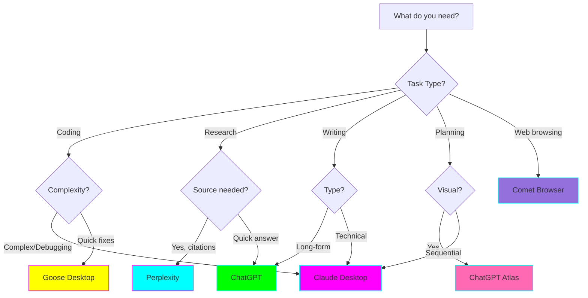
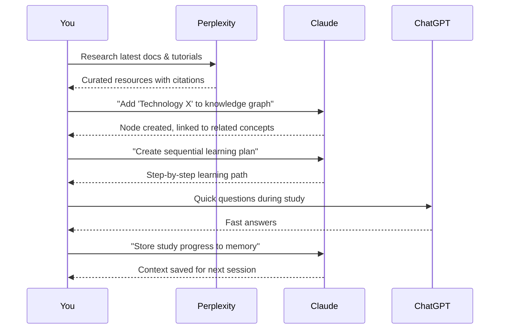
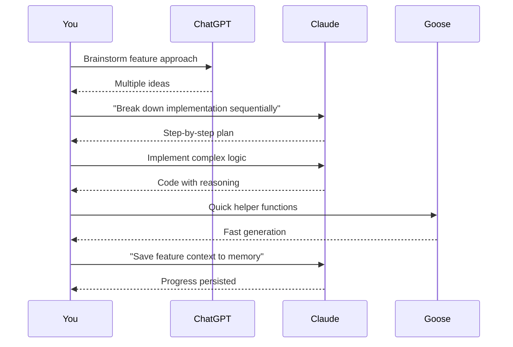
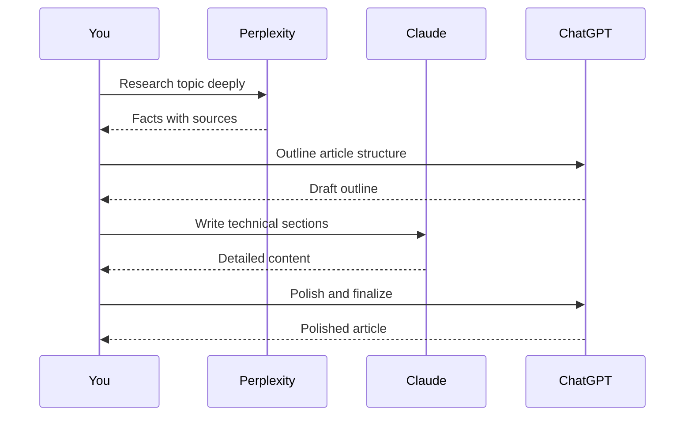

# 🤖 AI Agent Configuration & Comparison

**Purpose:** Detailed comparison and optimal use cases for each AI agent

## Quick Decision Matrix



## Detailed Agent Profiles

### 1. Claude Desktop (Primary Workhorse)

**Best For:**
- Complex coding tasks
- Deep analytical thinking
- File system access
- MCP server integration
- Sequential problem-solving
- Technical writing

**Strengths:**
- 🧠 Best reasoning capabilities
- 📁 Direct file system access
- 🔌 Full MCP support
- 📊 Handles complex context
- 🔍 Excellent at debugging
- 📝 Great technical documentation

**Limitations:**
- ❌ No real-time web access
- ❌ Knowledge cutoff (check version)
- ⏱️ Can be slower than ChatGPT

**MCP Configuration:**
See [mcp-setup.md](./mcp-setup.md) for complete setup.

**Optimal Workflows:**
- Deep work sessions on coding projects
- Debugging complex issues with sequential thinking
- Building knowledge graphs of technical concepts
- Long-term project memory via Memory MCP

**Example Prompts:**
```
# Starting deep work
"Load my context from last session. I was working on the authentication module."

# Using sequential thinking
"Help me debug this issue using sequential thinking. Break it down step by step."

# Building knowledge
"Add 'React Server Components' to my knowledge graph and link it to 'Next.js 14' and 'Suspense'"
```

---

### 2. ChatGPT Desktop

**Best For:**
- Quick questions
- Brainstorming
- Content drafting
- Conversational tasks
- Fast iterations

**Strengths:**
- ⚡ Fastest response time
- 💬 Most conversational
- 🎨 Good for creative tasks
- 🔄 Quick iteration cycles
- 📱 Cross-platform sync

**Limitations:**
- ❌ Limited MCP support
- 🧠 Less sophisticated reasoning than Claude
- 📁 No direct file access

**Configuration:**

Currently ChatGPT Desktop has limited MCP support. Check for updates:
- [ChatGPT Desktop Download](https://openai.com/chatgpt/desktop)
- Settings → Beta Features → Check for MCP options

**Optimal Workflows:**
- Quick questions during coding
- Brainstorming session ideas
- Drafting documentation outlines
- Getting unstuck with fresh perspective

**Example Prompts:**
```
# Quick coding help
"What's the syntax for array destructuring in JavaScript?"

# Brainstorming
"Give me 10 project ideas for learning Rust"

# Drafting
"Help me outline a technical blog post about React hooks"
```

---

### 3. Perplexity

**Best For:**
- Research with citations
- Fact-checking
- Current events
- Finding latest documentation
- Academic research

**Strengths:**
- 🌐 Real-time web access
- 📚 Citations and sources
- 🔍 Excellent for research
- 📰 Current information
- 🎓 Academic mode available

**Limitations:**
- ❌ No MCP support
- ❌ Not great for coding
- ❌ Limited file handling
- 💬 Less conversational

**Configuration:**

No special configuration needed. Use web interface or app.

**Optimal Workflows:**
- Pre-coding research phase
- Finding latest library documentation
- Fact-checking technical concepts
- Discovering new tools/libraries
- Studying session background research

**Example Prompts:**
```
# Library research
"What are the latest features in Next.js 15? Include official sources."

# Fact-checking
"What's the current best practice for React state management in 2025?"

# Finding docs
"Find the official documentation for Rust async/await with examples"
```

---

### 4. Comet Browser

**Best For:**
- Web browsing with AI
- Web app interactions
- Online research
- Filling forms with AI
- Web automation

**Strengths:**
- 🌐 Full browser functionality
- 🤖 AI integrated into browsing
- 📝 Can interact with web pages
- 🔗 Context from current page

**Limitations:**
- ⚠️ MCP support unknown (needs testing)
- 🆕 Relatively new platform
- 📚 Less documentation

**Configuration:**

Download and install: [Comet Browser](https://www.comet.com)

**Optimal Workflows:**
- Researching while browsing documentation
- Learning from interactive tutorials
- AI-assisted form filling
- Web-based productivity tasks

**Testing Checklist:**
- [ ] Download and install
- [ ] Test basic AI features
- [ ] Check for MCP support
- [ ] Test web page interaction
- [ ] Document unique features
- [ ] Compare to traditional browser + Claude

---

### 5. ChatGPT Atlas (Spatial AI)

**Best For:**
- Visual organization
- Spatial thinking
- Mind mapping
- Geographic data
- Visual planning

**Strengths:**
- 🗺️ Map-based interface
- 📍 Spatial reasoning
- 🎨 Visual organization
- 🔗 Concept mapping

**Limitations:**
- ⚠️ MCP support unknown (needs testing)
- 🆕 New feature (needs testing)
- 📚 Limited documentation
- 🤔 Use cases still emerging

**Configuration:**

Enable in ChatGPT settings or interface.

**Optimal Workflows:**
- Planning project architecture visually
- Organizing study topics spatially
- Mind mapping complex systems
- Visual brainstorming

**Testing Checklist:**
- [ ] Access ChatGPT Atlas
- [ ] Test mind mapping features
- [ ] Try project planning
- [ ] Check MCP compatibility
- [ ] Document unique use cases
- [ ] Compare to traditional mind mapping

---

### 6. Goose Desktop

**Best For:**
- Developer workflows
- Code generation
- Git operations
- Terminal automation
- Development tasks

**Strengths:**
- 💻 Developer-focused
- 🔧 Tool integrations
- 📂 File system access
- 🐚 Terminal integration
- ⚡ Dev workflow optimization

**Limitations:**
- ⚠️ MCP support needs testing
- 🎯 Narrow focus (dev only)
- 📚 Smaller community

**Configuration:**

Install from: [Goose GitHub](https://github.com/square/goose)

```bash
# Installation (macOS/Linux)
brew install square/goose/goose

# Or with pip
pip install goose-ai
```

**Optimal Workflows:**
- Quick code generation
- Git operations
- Terminal command assistance
- DevOps tasks
- Script writing

**Testing Checklist:**
- [ ] Install Goose Desktop
- [ ] Test code generation
- [ ] Try git integration
- [ ] Test with Sequential Thinking MCP (if supported)
- [ ] Compare to Claude Desktop for coding
- [ ] Document speed differences

---

## Agent Selection Guide

### By Task Category

| Category | Primary Agent | Backup Agent | Why |
|----------|---------------|--------------|-----|
| **Complex Coding** | Claude Desktop | Goose Desktop | Best reasoning + MCP |
| **Quick Coding** | Goose Desktop | ChatGPT | Speed matters |
| **Debugging** | Claude Desktop | - | Sequential thinking |
| **Research** | Perplexity | ChatGPT | Citations needed |
| **Learning** | Claude Desktop | Perplexity | Knowledge Graph MCP |
| **Writing** | ChatGPT | Claude Desktop | Speed + conversational |
| **Planning** | Claude Desktop | ChatGPT Atlas | Sequential Thinking MCP |
| **Web Tasks** | Comet Browser | Perplexity | Browser context |
| **Brainstorming** | ChatGPT | Claude Desktop | Fast iteration |

### By ADHD Workflow Needs

| ADHD Challenge | Best Agent | Features That Help |
|----------------|------------|-------------------|
| **Context switching** | Claude Desktop | Memory MCP persists context |
| **Task overwhelm** | Claude Desktop | Sequential Thinking breaks down tasks |
| **Learning retention** | Claude Desktop | Knowledge Graph MCP |
| **Maintaining focus** | Claude Desktop | Structured workflows with MCP |
| **Quick answers** | ChatGPT | Fast, low-friction |
| **Visual thinking** | ChatGPT Atlas | Spatial organization |
| **Getting unstuck** | Perplexity | Fresh research perspective |

### By Time Available

| Time Available | Agent Choice | Strategy |
|----------------|--------------|----------|
| **< 5 minutes** | ChatGPT | Quick question, quick answer |
| **5-15 minutes** | Perplexity or Goose | Focused research or coding task |
| **15-60 minutes** | Claude Desktop | Deep work with MCP support |
| **1-4 hours** | Claude Desktop | Deep work session with Memory MCP |
| **Multi-day** | Claude Desktop | Use Memory MCP to maintain context |

## Multi-Agent Workflows

### Learning New Technology



### Building New Feature



### Research & Write Article



## Testing Log Template

Use this template to test each agent:

```markdown
## Agent: [Name]
**Date Tested:** YYYY-MM-DD

### Setup
- [ ] Downloaded/installed
- [ ] Configuration complete
- [ ] MCP tested (if applicable)

### Test Cases
1. **Quick question:**
   - Prompt:
   - Response time:
   - Quality (1-10):

2. **Complex task:**
   - Prompt:
   - Response time:
   - Quality (1-10):

3. **Coding task:**
   - Prompt:
   - Response time:
   - Quality (1-10):

### Strengths Observed
-

### Limitations Observed
-

### Best Use Cases
-

### MCP Integration
- [ ] Sequential Thinking: Works / Doesn't work / Not tested
- [ ] Memory: Works / Doesn't work / Not tested
- [ ] Knowledge Graph: Works / Doesn't work / Not tested

### Would I use again for this task?
Yes / No / Maybe

### Notes
```

## Next Steps

1. Test each agent using the template above
2. Document findings in `agent-testing-log.md`
3. Refine your personal agent selection criteria
4. Build custom workflows combining multiple agents
5. Update this guide with your learnings

---

**Remember:** Different agents for different jobs. The goal is to have the right tool ready for each task! 🛠️
