# 🔌 AI Tool Integration Solution

**Version:** 1.0
**Created:** 2025-11-07
**Status:** 🧪 Experimental

## 🎯 Solution Overview

This document provides a comprehensive integration solution for orchestrating multiple AI tools to maximize productivity. Each tool has unique strengths - this solution helps you pick the right tool for the right task.


## 🤖 AI Tool Capabilities Matrix

### Detailed Tool Analysis

| Tool | Core Strength | Speed | Context Size | MCP Support | Code Quality | Best For | Avoid For |
|------|--------------|-------|--------------|-------------|--------------|----------|-----------|
| **Claude Code** | Deep code analysis & refactoring | Medium | Massive (200K) | ✅ Full | Excellent | Complex refactoring, architecture design | Quick snippets |
| **Claude Desktop** | Complex reasoning & problem-solving | Medium | Massive (200K) | ✅ Full | Excellent | Research, planning, analysis | Code editing in IDE |
| **ChatGPT Desktop** | Fast conversational AI | Fast | Large (128K) | ⚠️ Limited | Good | Quick questions, brainstorming | Long-form analysis |
| **GitHub Copilot IDE** | Real-time code completion | Instant | Small (local) | ❌ No | Good | Writing code inline | Complex logic |
| **GitHub Copilot CLI** | Terminal command suggestions | Fast | Small | ❌ No | N/A | CLI operations, git commands | Code analysis |
| **Goose** | Developer workflow automation | Medium | Medium | ⚠️ Testing | Good | Documentation, repetitive tasks | New feature development |
| **Perplexity** | Real-time web research with sources | Fast | Medium | ❌ No | N/A | Fact-checking, current events | Code generation |
| **Comet Browser** | Web context + AI integration | Fast | Medium | ❌ No | N/A | Web-based workflows | Offline work |
| **ChatGPT Atlas** | Spatial & visual organization | Medium | Large | ❌ No | N/A | Project mapping, visual planning | Linear tasks |
| **Opencode** | AI-native code editor | Fast | Medium | ⚠️ Unknown | Good | Quick prototypes, scripts | Complex projects |

## 🎯 Decision Tree: Which Tool When?


## 📋 Tool-Specific Integration Guides

### 1. Claude Code (Primary Development Tool)

**When to Use:**
- Complex refactoring across multiple files
- Architecture design and planning
- Deep code analysis and debugging
- Learning new codebases
- Building new features with many dependencies

**Setup:**
```bash
# Already configured in your environment
# MCP servers can be added to Claude Code settings
```

**Best Practices:**
- Use with Sequential Thinking MCP for complex problems
- Keep context focused on relevant files
- Use /commands for repetitive workflows
- Create custom subagents for specialized tasks

**Example Prompts:**
```
"Analyze the authentication flow and suggest improvements"
"Refactor the UserService class to follow SOLID principles"
"Break down this feature implementation into sequential steps"
```

**Integration Points:**
- ✅ File system access
- ✅ Git operations
- ✅ Terminal commands
- ✅ MCP servers (Sequential Thinking, Memory, Knowledge Graph)
- ✅ Custom agents and skills

---

### 2. Claude Desktop (Research & Analysis)

**When to Use:**
- Research and learning
- Document analysis
- Complex problem-solving without code editing
- Planning before coding
- Knowledge graph building

**Setup:**
```json
// ~/Library/Application Support/Claude/claude_desktop_config.json
{
  "mcpServers": {
    "sequential-thinking": {
      "command": "npx",
      "args": ["-y", "@modelcontextprotocol/server-sequential-thinking"]
    },
    "memory": {
      "command": "npx",
      "args": ["-y", "@modelcontextprotocol/server-memory"]
    },
    "knowledge-graph": {
      "command": "npx",
      "args": ["-y", "@modelcontextprotocol/server-knowledge-graph"]
    }
  }
}
```

**Best Practices:**
- Use Memory MCP to persist learnings
- Build knowledge graphs for study topics
- Use Sequential Thinking for complex analysis
- Copy code to Claude Code for actual editing

**Example Prompts:**
```
"Add to my knowledge graph: How Redux works and relates to React state management"
"Remember: I'm working on the authentication refactor project, currently stuck on JWT validation"
"Break down learning Rust: what should I study first?"
```

**Integration Points:**
- ✅ MCP servers (full support)
- ✅ File uploads
- ❌ Direct file system access
- ❌ Terminal commands

---

### 3. ChatGPT Desktop (Quick Queries)

**When to Use:**
- Quick questions that don't need deep context
- Brainstorming ideas
- Drafting content (emails, documentation)
- Explaining concepts
- When you need speed over depth

**Setup:**
```bash
# Download from: https://openai.com/chatgpt/desktop
# Limited MCP support - check latest docs
```

**Best Practices:**
- Keep sessions focused on single topics
- Use Voice Mode for hands-free brainstorming
- Quick prototyping before deep implementation
- Copy results to Claude Code for refinement

**Example Prompts:**
```
"Quick: What's the difference between async/await and promises?"
"Help me draft an email explaining technical debt"
"Brainstorm 10 names for a task management app"
```

**Integration Points:**
- ⚠️ Limited MCP support
- ✅ File uploads
- ✅ Voice mode
- ❌ Direct file system access

---

### 4. GitHub Copilot (IDE & CLI)

**When to Use (IDE):**
- Writing new code with autocomplete
- Generating boilerplate
- Writing tests
- Quick function implementations
- Inline code suggestions while typing

**When to Use (CLI):**
- Git commands
- Terminal operations
- DevOps commands
- Shell script assistance

**Setup:**
```bash
# IDE: Install extension in VS Code/JetBrains
# CLI: Install GitHub Copilot CLI
gh extension install github/gh-copilot
gh copilot config
```

**Best Practices:**
- Let Copilot handle boilerplate
- Use comments to guide generation
- Review suggestions carefully
- Use CLI for complex git operations

**Example Usage:**
```typescript
// IDE: Type a comment and let Copilot complete
// Function to validate email format
// Copilot suggests full implementation

// CLI: Ask for help
gh copilot suggest "git command to undo last commit"
gh copilot explain "git rebase -i HEAD~3"
```

**Integration Points:**
- ✅ IDE integration
- ✅ Terminal integration
- ❌ MCP support
- ❌ File system operations

---

### 5. Goose (Developer Workflows)

**When to Use:**
- Documentation generation and updates
- Repetitive development tasks
- Project setup and scaffolding
- Code formatting and linting
- Batch file operations

**Setup:**
```bash
# Install Goose
pip install goose-ai

# Or use Goose Desktop
# Download from: https://github.com/square/goose
```

**Best Practices:**
- Use for documentation-heavy tasks
- Create Goose toolkits for common workflows
- Combine with Claude Code for complex tasks
- Let Goose handle repetitive operations

**Example Tasks:**
```bash
# Generate API documentation
goose "Update README with new API endpoints"

# Setup project structure
goose "Create a React TypeScript project with Vite"

# Batch operations
goose "Add error handling to all API calls"
```

**Integration Points:**
- ⚠️ Testing MCP support
- ✅ File system access
- ✅ Terminal commands
- ✅ Toolkit extensions

---

### 6. Perplexity (Real-time Research)

**When to Use:**
- Current events and news
- Technical documentation lookup
- Fact-checking
- Comparing technologies
- Research with citations

**Setup:**
```bash
# Web: https://perplexity.ai
# Mobile app: Download from App Store/Play Store
```

**Best Practices:**
- Use Pro Search for complex queries
- Verify sources before implementing
- Use Focus modes (Academic, Writing, etc.)
- Copy research to Claude Desktop for deeper analysis

**Example Queries:**
```
"What are the latest best practices for React Server Components?"
"Compare Rust async runtimes: Tokio vs async-std in 2025"
"Find security vulnerabilities in JWT implementation patterns"
```

**Integration Points:**
- ❌ MCP support
- ✅ Citation tracking
- ✅ Multi-source research
- ⚠️ No direct coding interface

---

### 7. Comet Browser (Web + AI)

**When to Use:**
- Web-based research with AI assistance
- Analyzing web pages with AI
- Testing web applications with AI help
- Document web findings
- Browser-based workflows

**Setup:**
```bash
# Download: https://www.comet.com
# Configure AI integration settings
```

**Best Practices:**
- Use for web-specific tasks
- Combine with Perplexity for research
- Document findings in Claude Desktop
- Use for testing web apps with AI assistance

**Example Use Cases:**
- Research competitor websites with AI analysis
- Debug web applications with AI suggestions
- Analyze documentation sites efficiently
- Test web features with AI guidance

**Integration Points:**
- ⚠️ Unknown MCP support
- ✅ Browser context
- ✅ Web page analysis
- ⚠️ Integration level unclear

---

### 8. ChatGPT Atlas (Spatial Planning)

**When to Use:**
- Visual project planning
- Mapping complex systems
- Spatial organization of ideas
- Geographic or location-based planning
- Visual brainstorming

**Setup:**
```bash
# Access through ChatGPT Plus
# Check for Atlas feature availability
```

**Best Practices:**
- Use for initial project mapping
- Visualize system architecture
- Plan feature relationships spatially
- Export to standard tools for implementation

**Example Use Cases:**
- Map microservices architecture
- Plan database schema visually
- Organize feature dependencies
- Visualize user journey flows

**Integration Points:**
- ⚠️ Unknown MCP support
- ⚠️ Integration level unclear
- ✅ Visual representation
- ❓ Export capabilities TBD

---

### 9. Opencode (AI-Native Editor)

**When to Use:**
- Quick prototypes
- Learning new languages/frameworks
- Simple scripts and tools
- Rapid iteration on small projects
- Experimenting with code ideas

**Setup:**
```bash
# Check Opencode documentation for latest setup
# Installation varies by platform
```

**Best Practices:**
- Use for quick experimentation
- Graduate complex projects to Claude Code
- Good for learning new syntax
- Fast iteration on small problems

**Example Use Cases:**
- Prototype a quick API client
- Test algorithm implementations
- Learn new framework syntax
- Create utility scripts

**Integration Points:**
- ⚠️ Unknown MCP support
- ⚠️ Integration level unclear
- ✅ Code generation
- ❓ File system access TBD

---

## 🔄 Multi-Agent Orchestration Workflows

### Workflow 1: New Feature Development


**Steps:**
1. **Research Phase** (Perplexity + Comet Browser)
   - Look up current best practices
   - Find similar implementations
   - Check for security considerations

2. **Planning Phase** (Claude Desktop + Atlas)
   - Use Sequential Thinking MCP to break down feature
   - Map architecture in Atlas
   - Save plan to Memory MCP

3. **Implementation Phase** (Claude Code + GitHub Copilot)
   - Use Claude Code for complex logic
   - Let Copilot handle boilerplate
   - Use Opencode for quick utilities

4. **Documentation Phase** (Goose + Claude Desktop)
   - Generate docs with Goose
   - Review and refine with Claude
   - Update knowledge graph

5. **Persistence** (Memory MCP)
   - Save implementation notes
   - Document learnings
   - Link concepts in knowledge graph

---

### Workflow 2: Learning New Technology


**Steps:**
1. **Research** (Perplexity): Find best learning resources
2. **Plan** (Claude Desktop): Break into sequential topics with MCP
3. **Quick Q&A** (ChatGPT Desktop): Fast concept clarification
4. **Practice** (Opencode + Copilot): Hands-on coding
5. **Deep Understanding** (Claude Code): Complex implementations
6. **Persist** (Knowledge Graph MCP): Build concept network

---

### Workflow 3: Debug Complex Issue


**Steps:**
1. **Document** (Memory MCP): Save bug details and context
2. **Research** (Perplexity): Look for similar issues
3. **Analyze** (Claude Code): Deep code analysis
4. **Break Down** (Sequential Thinking MCP): Systematic debugging
5. **Fix** (Claude Code + Copilot): Implement solution
6. **Persist** (Knowledge Graph): Save debugging approach

---

### Workflow 4: Quick Question / Task

```mermaid
flowchart LR
    A[Quick Question] --> B{Need Current Info?}
    B -->|Yes| C[Perplexity or<br/>Comet Browser]
    B -->|No| D{Code Related?}
    D -->|Yes| E[ChatGPT Desktop or<br/>GitHub Copilot CLI]
    D -->|No| F[ChatGPT Desktop<br/>Voice Mode]
    C --> G[Done ✓]
    E --> G
    F --> G

    style A fill:#ffff00,stroke:#00ffff,stroke-width:2px
    style G fill:#00ff00,stroke:#00ffff,stroke-width:2px
```



**Use the fastest tool for simple queries:**
- Current info → Perplexity
- Code snippet → ChatGPT Desktop or Copilot
- Explanation → ChatGPT Desktop
- CLI command → GitHub Copilot CLI

---

## 🎯 Task-to-Tool Quick Reference

### By Task Type

| Task | Primary Tool | Secondary Tool | Why |
|------|-------------|----------------|-----|
| **Complex Refactoring** | Claude Code | GitHub Copilot | Deep analysis + completion |
| **Quick Code Snippet** | ChatGPT Desktop | Opencode | Speed over depth |
| **Real-time Research** | Perplexity | Comet Browser | Current info + sources |
| **Learning New Tech** | Claude Desktop | ChatGPT Desktop | Deep analysis + quick Q&A |
| **Writing Documentation** | Goose | Claude Code | Automation + quality |
| **Architecture Planning** | Claude Desktop | ChatGPT Atlas | Sequential thinking + visualization |
| **Code Completion** | GitHub Copilot | Opencode | Real-time + context-aware |
| **Debugging** | Claude Code | GitHub Copilot | Deep analysis + suggestions |
| **Git Operations** | GitHub Copilot CLI | Claude Code | CLI expert + analysis |
| **Quick Brainstorming** | ChatGPT Desktop | Claude Desktop | Speed + voice mode |
| **Knowledge Management** | Claude Desktop | Memory MCP | Graph building + persistence |
| **Task Planning** | Claude Desktop | Sequential Thinking MCP | Break down + context |

### By Context Type

| Context | Tool Choice | Reason |
|---------|------------|--------|
| In IDE, writing code | GitHub Copilot IDE | Real-time completion |
| Terminal, need commands | GitHub Copilot CLI | Command suggestions |
| Browser, researching | Perplexity / Comet | Web context |
| No specific context | ChatGPT Desktop | Fast, flexible |
| Need deep analysis | Claude Code/Desktop | Best reasoning |
| Need file system access | Claude Code / Goose | File operations |
| Need MCP servers | Claude Desktop/Code | Full MCP support |

---

## 🔧 Integration Helper Scripts

### Script 1: Task Router

```bash
#!/bin/bash
# task-router.sh - Helps you pick the right AI tool

echo "🤖 AI Tool Router"
echo ""
echo "What do you need help with?"
echo "1) Complex code refactoring"
echo "2) Quick code snippet"
echo "3) Research current information"
echo "4) Learn new technology"
echo "5) Plan a feature"
echo "6) Debug an issue"
echo "7) Write documentation"
echo "8) Quick question"
echo ""
read -p "Enter number (1-8): " choice

case $choice in
  1)
    echo "✨ Use Claude Code with Sequential Thinking MCP"
    echo "   Open Claude Code and describe the refactoring goal"
    ;;
  2)
    echo "⚡ Use ChatGPT Desktop or GitHub Copilot"
    echo "   For fastest results, use voice mode in ChatGPT"
    ;;
  3)
    echo "🔍 Use Perplexity or Comet Browser"
    echo "   Pro Search mode for complex queries"
    ;;
  4)
    echo "📚 Multi-tool approach:"
    echo "   1. Research with Perplexity"
    echo "   2. Plan with Claude Desktop + Sequential Thinking MCP"
    echo "   3. Practice with Opencode + Copilot"
    echo "   4. Build knowledge graph in Claude Desktop"
    ;;
  5)
    echo "🎯 Use Claude Desktop with Sequential Thinking MCP"
    echo "   Optionally visualize in ChatGPT Atlas"
    ;;
  6)
    echo "🐛 Use Claude Code"
    echo "   1. Document bug in Memory MCP"
    echo "   2. Research with Perplexity"
    echo "   3. Analyze and fix in Claude Code"
    ;;
  7)
    echo "📝 Use Goose for generation, Claude Code for review"
    ;;
  8)
    echo "❓ Use ChatGPT Desktop (fastest)"
    echo "   Or GitHub Copilot CLI for terminal questions"
    ;;
  *)
    echo "Invalid choice"
    ;;
esac
```

### Script 2: Context Saver

```bash
#!/bin/bash
# save-context.sh - Save current work context

echo "💾 Saving work context..."
echo ""
echo "What are you working on?"
read -p "Task description: " task
echo ""
echo "Current progress?"
read -p "Progress notes: " progress
echo ""
echo "What's next?"
read -p "Next steps: " next

# Format for Memory MCP
cat > /tmp/context.txt << EOF
Task: $task
Progress: $progress
Next Steps: $next
Date: $(date)
EOF

echo ""
echo "✅ Context saved to /tmp/context.txt"
echo "📋 Copy this to Claude Desktop and say:"
echo "   'Remember this context for my next session: [paste content]'"
```

### Script 3: Knowledge Graph Entry

```bash
#!/bin/bash
# add-to-knowledge-graph.sh - Quick knowledge graph entries

echo "🧠 Add to Knowledge Graph"
echo ""
read -p "Concept/Topic: " concept
read -p "Brief description: " description
read -p "Related to (comma separated): " related
echo ""
echo "Category?"
echo "1) Programming Language"
echo "2) Framework/Library"
echo "3) Design Pattern"
echo "4) Tool/Service"
echo "5) Concept/Theory"
read -p "Choose (1-5): " category

cat > /tmp/kg-entry.txt << EOF
Add to my knowledge graph:

Concept: $concept
Description: $description
Related to: $related
Category: $category
Date learned: $(date +%Y-%m-%d)
EOF

echo ""
echo "✅ Entry prepared!"
echo "📋 Copy /tmp/kg-entry.txt to Claude Desktop"
```

---

## 📊 Testing Checklist

Use this checklist to test each tool systematically:

### Claude Code
- [ ] Complex refactoring (multi-file)
- [ ] Architecture planning
- [ ] Code analysis
- [ ] Sequential Thinking MCP integration
- [ ] Custom agent creation
- [ ] File system operations
- [ ] Git operations

### Claude Desktop
- [ ] Research and analysis
- [ ] Memory MCP (save/recall)
- [ ] Knowledge Graph MCP (add nodes/relations)
- [ ] Sequential Thinking for planning
- [ ] Document analysis
- [ ] Learning session workflow

### ChatGPT Desktop
- [ ] Quick questions
- [ ] Voice mode
- [ ] Brainstorming
- [ ] Draft generation
- [ ] Speed comparison vs Claude

### GitHub Copilot
- [ ] IDE code completion
- [ ] Test generation
- [ ] CLI command suggestions
- [ ] Git command help
- [ ] Boilerplate generation

### Goose
- [ ] Documentation generation
- [ ] Project scaffolding
- [ ] Batch file operations
- [ ] Workflow automation
- [ ] MCP integration (if supported)

### Perplexity
- [ ] Current tech research
- [ ] Pro Search mode
- [ ] Citation tracking
- [ ] Focus modes
- [ ] Fact verification

### Comet Browser
- [ ] Web page analysis with AI
- [ ] Research workflow
- [ ] Integration features
- [ ] Context handling

### ChatGPT Atlas
- [ ] Visual project mapping
- [ ] Spatial planning
- [ ] Architecture visualization
- [ ] Export capabilities

### Opencode
- [ ] Quick prototyping
- [ ] Script generation
- [ ] Learning new syntax
- [ ] Integration features

---

## 🚀 Quick Start Guide

### Day 1: Setup
1. Install all AI tools
2. Configure Claude Desktop MCP servers
3. Test each tool with simple task
4. Bookmark this document

### Week 1: Individual Testing
1. Use checklist above to test each tool
2. Document strengths and weaknesses
3. Note speed and quality differences
4. Identify your preferences

### Week 2: Workflow Integration
1. Pick one workflow to implement
2. Follow multi-agent orchestration steps
3. Document what works and what doesn't
4. Optimize tool selection

### Week 3: Daily Practice
1. Use Task Router script daily
2. Save context with helper scripts
3. Build knowledge graph consistently
4. Measure productivity changes

### Week 4: Optimization
1. Refine tool selection criteria
2. Create custom workflows
3. Automate tool switching
4. Document best practices

---

## 📈 Success Metrics

Track these weekly:

| Metric | Baseline | Week 1 | Week 2 | Week 3 | Week 4 |
|--------|----------|--------|--------|--------|--------|
| Avg. time to pick right tool | ? | | | | |
| Tasks completed with multiple tools | 0 | | | | |
| Context switches saved by Memory MCP | 0 | | | | |
| Knowledge graph nodes | 0 | | | | |
| Tools used per day | ? | | | | |
| Satisfaction score (1-10) | ? | | | | |

---

## 🎓 Key Learnings

### Tool Selection Principles

1. **Depth vs Speed**: Claude > ChatGPT for depth, reverse for speed
2. **Context Matters**: Use tools with native file access when possible
3. **MCP Multiplier**: MCP servers 10x the value of Claude Desktop/Code
4. **Right Tool, Right Job**: Don't use Claude Code for quick questions
5. **Integration Over Isolation**: Multi-tool workflows beat single-tool
6. **Save Context**: Memory MCP prevents re-explaining context
7. **Build Knowledge**: Knowledge Graph compounds learning over time

### Common Pitfalls

- ❌ Using Claude Code for every task (too slow for simple queries)
- ❌ Forgetting to save context in Memory MCP
- ❌ Not using Sequential Thinking for complex problems
- ❌ Skipping research phase (Perplexity)
- ❌ Not building knowledge graph consistently
- ❌ Using wrong tool due to habit, not strategy

---

## 🔗 Resources

### Official Documentation
- [Claude Desktop MCP Setup](https://docs.anthropic.com/claude/docs/mcp)
- [GitHub Copilot Docs](https://docs.github.com/copilot)
- [ChatGPT Desktop](https://help.openai.com/en/articles/desktop-app)
- [Perplexity Help](https://www.perplexity.ai/hub/faq)
- [Goose Documentation](https://github.com/square/goose)

### MCP Servers
- [Sequential Thinking MCP](https://github.com/modelcontextprotocol/servers/tree/main/src/sequentialthinking)
- [Memory MCP](https://github.com/modelcontextprotocol/servers/tree/main/src/memory)
- [Knowledge Graph MCP](https://github.com/modelcontextprotocol/servers/tree/main/src/knowledge-graph)

---

## 📝 Implementation Notes

**Version History:**
- v1.0 (2025-11-07): Initial integration solution

**Status:** Ready for testing

**Next Steps:**
1. Test each tool with provided checklist
2. Implement at least one multi-agent workflow
3. Document actual results vs predictions
4. Refine tool selection criteria based on real usage

---

**Remember:** The best tool is the one that fits the task. Don't force a tool because you like it - let the work guide your choice! 🎯
