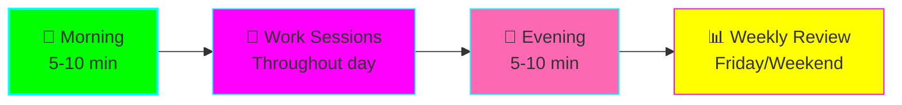

# 📅 Daily Routine Checklists

**Purpose:** Simple, repeatable routines to build consistency



---

## 🌅 Morning Routine (5-10 minutes)

**Goal:** Load context and set clear direction for the day

### Quick Version (5 min)

**Open Claude Desktop and paste:**

```
Good morning! Help me start the day.

1. Load yesterday's context from memory
2. Show my active projects
3. Suggest 1-3 focus tasks for today

Available time: [X hours]
Energy level: [HIGH/MEDIUM/LOW]
```

**Then:**
- [ ] Review what Claude shows
- [ ] Pick ONE primary focus
- [ ] Time-block it in your calendar

---

### Full Version (10 min)

**Step 1: Check Memory (2 min)**
```
Show me what I was working on yesterday.
Any blockers or open questions?
```

**Step 2: Review Knowledge (2 min)**
```
Show my knowledge graph growth this week.
What did I learn recently?
```

**Step 3: Plan Today (3 min)**
```
Help me plan today:
- Available time: [X hours]
- Energy: [HIGH/MED/LOW]
- Priority: [What's most important?]

Create a realistic plan with time blocks.
```

**Step 4: Set Up First Task (3 min)**
```
I'm starting with [TASK].
Load context for this and create a sequential plan.
```

**Action:**
- [ ] Copy the plan somewhere visible
- [ ] Start timer for first work block
- [ ] Begin!

---

## 💼 Work Session Routine

### Starting a Session

**Every time you sit down to work:**

```
Starting work session on [PROJECT/TASK].

Load context from memory and show:
1. Where I left off
2. Next steps
3. Any notes or blockers
```

---

### During Session (Every 25-50 min)

**Quick save:**
```
Save progress: [ONE SENTENCE ABOUT WHAT YOU'RE DOING]
```

**When stuck:**
```
Stuck on [PROBLEM]. Use sequential thinking to break it down.
```

**When learning:**
```
Add [CONCEPT] to knowledge graph, link to [RELATED TOPICS]
```

---

### Ending a Session

**Before you switch tasks or take a break:**

```
Pausing work on [PROJECT].

Current state: [WHERE YOU ARE]
Next step: [WHAT TO DO WHEN BACK]
Blockers: [ANY ISSUES]

Save this to memory with tags: [project-name, task-name]
```

---

## 🌙 Evening Routine (5-10 minutes)

**Goal:** Save context and acknowledge progress

### Quick Version (5 min)

**Paste in Claude Desktop:**

```
End of day review.

Today I worked on:
- [Project/task 1]
- [Project/task 2]

Save all current context to memory for tomorrow.
```

**Then:**
- [ ] Check off what you accomplished
- [ ] Feel good about progress!
- [ ] Close laptop

---

### Full Version (10 min)

**Step 1: Capture Accomplishments (2 min)**
```
What did I accomplish today?
```

**Review and add anything Claude missed:**
```
Also add: [things you remember]
```

**Step 2: Capture Learnings (2 min)**
```
What did I learn today? Add to knowledge graph.
```

**Step 3: Save All Context (2 min)**
```
Save context for all active projects to memory:
- [Project 1]: [current state]
- [Project 2]: [current state]
```

**Step 4: Note Blockers (2 min)**
```
Tomorrow's priorities and any blockers:
- [What should I focus on?]
- [What's blocking me?]
```

**Step 5: Quick Metrics (2 min)**
- [ ] How many tasks completed?
- [ ] Focus score today (1-10)?
- [ ] Did memory help with continuity?

**Write these in:** [weekly-tracker.md](./weekly-tracker.md)

---

## 🔄 Context Switch Routine (3 minutes)

**When you need to switch tasks mid-day:**

### Leaving Current Task

```
Switching contexts.

Save [CURRENT TASK]:
- State: [where you are]
- Next: [what to do when back]
- Notes: [anything important]

Tags: [task-tags]
```

### Loading New Task

```
Load context for [NEW TASK]
```

**Then:**
- [ ] Quick mental reset (30 sec)
- [ ] Review what Claude showed
- [ ] Start new task

---

## 📊 Weekly Review Routine (15 minutes)

**Do this Friday afternoon or weekend**

### Step 1: Progress Check (5 min)

```
Weekly review for [WEEK OF DATE].

Show me:
1. All projects I worked on this week
2. Knowledge graph growth (new nodes)
3. Key learnings saved to memory
```

**Paste results into:** [weekly-tracker.md](./weekly-tracker.md)

---

### Step 2: Metrics Update (5 min)

**Update the table in README.md:**

| Metric | This Week |
|--------|-----------|
| Tasks completed | ? |
| Study hours | ? |
| Context switches handled | ? |
| New knowledge nodes | ? |
| Days with progress | ? |
| Focus score (1-10) | ? |

---

### Step 3: Plan Next Week (5 min)

```
Help me plan next week.

This week I worked on:
- [List projects]

Next week I want to focus on:
- [What's important?]

Create a weekly plan.
```

**Action:**
- [ ] Block time for priorities
- [ ] Set ONE main goal for the week
- [ ] Update experiment phase if needed

---

## 🎯 Habit Building Tips

### Week 1: Just Morning & Evening

**Only do:**
- Morning: Load context
- Evening: Save context

**That's it.** Build this habit first.

---

### Week 2: Add Work Sessions

**Now add:**
- Session start: Load context
- Session end: Save progress

**Still doing:**
- Morning & evening routines

---

### Week 3: Add Context Switching

**Now add:**
- Context switch routine when interrupted

**Still doing:**
- Morning, evening, and session routines

---

### Week 4: Add Weekly Review

**Now add:**
- Friday/weekend weekly review

**You now have a complete system!**

---

## 📋 Daily Checklist Templates

### Minimal Daily (If Low Energy)

```
Morning:
[ ] Load context: "What was I doing yesterday?"
[ ] Pick ONE focus task

Work:
[ ] Save progress once mid-day

Evening:
[ ] Save context: "Save today's progress"
```

---

### Standard Daily

```
Morning (5 min):
[ ] Load yesterday's context
[ ] Review active projects
[ ] Plan today with time blocks

Work Sessions:
[ ] Load context at session start
[ ] Save progress every 30-50 min
[ ] Save state when switching tasks

Evening (5 min):
[ ] Review accomplishments
[ ] Save all active project states
[ ] Note tomorrow's priorities
```

---

### Full Daily (When Building Habit)

```
Morning (10 min):
[ ] Load yesterday's context
[ ] Review knowledge graph
[ ] Plan today with energy levels
[ ] Set up first task with sequential thinking

Work Sessions:
[ ] Load context at start
[ ] Sequential thinking for complex tasks
[ ] Add learnings to knowledge graph
[ ] Save progress regularly
[ ] Context switch routine when needed

Evening (10 min):
[ ] Capture all accomplishments
[ ] Add learnings to knowledge graph
[ ] Save all project contexts
[ ] Note blockers and priorities
[ ] Update weekly metrics
```

---

## 🎨 Customize Your Routine

Copy this template and adjust:

```markdown
## My Morning Routine

Time budget: [X minutes]

Claude Desktop prompt:
[Your customized prompt]

Then I:
- [ ] [Your action]
- [ ] [Your action]
- [ ] [Your action]

## My Evening Routine

Time budget: [X minutes]

Claude Desktop prompt:
[Your customized prompt]

Then I:
- [ ] [Your action]
- [ ] [Your action]
```

---

## 🔔 Reminder Systems

### Phone Alarms

Set these recurring alarms:

- **9:00 AM:** "☀️ Morning routine - Load context"
- **5:00 PM:** "🌙 Evening routine - Save progress"
- **Friday 4:00 PM:** "📊 Weekly review"

---

### Calendar Blocks

Create recurring calendar events:

**Daily:**
- 9:00-9:10 AM: "Morning Planning (Claude)"
- 5:00-5:10 PM: "Evening Review (Claude)"

**Weekly:**
- Friday 4:00-4:30 PM: "Weekly Review"

---

### Desktop Reminders

**macOS/Linux (.bashrc or .zshrc):**
```bash
alias morning="echo '☀️ Time for morning routine with Claude!'"
alias evening="echo '🌙 Time for evening routine with Claude!'"
```

**Windows (PowerShell profile):**
```powershell
function morning { Write-Host "☀️ Time for morning routine with Claude!" }
function evening { Write-Host "🌙 Time for evening routine with Claude!" }
```

---

## 🎯 Success Patterns

### Good Signs
- ✅ Routines feel automatic after 2 weeks
- ✅ Less time wondering "what was I doing?"
- ✅ Context switches don't derail your day
- ✅ Knowledge graph shows learning progress
- ✅ Morning planning takes < 5 minutes

### Warning Signs
- ⚠️ Routines feel like a chore (simplify!)
- ⚠️ Skipping routines regularly (too complex?)
- ⚠️ Not using memory retrieval (not seeing value?)
- ⚠️ Evening routine takes > 15 min (too detailed?)

**Fix:** Make it simpler. Start with minimal version.

---

## 💡 ADHD-Specific Tips

### Keep It Stupid Simple
If you're not doing the routine, it's too complex. Simplify.

### Visual Cues
- Post-it on monitor with prompt
- Desktop wallpaper with routine
- Phone wallpaper reminder

### Pair with Existing Habits
- Morning routine → after first coffee
- Evening routine → before closing laptop
- Weekly review → Friday shutdown ritual

### Forgiveness
Missed a day? That's fine. Just do today's routine.

### Variety
Routines feel stale? Change the prompt wording. Same action, fresh words.

---

## 📈 Progression Path

### Week 1-2: Foundation
**Focus:** Morning + evening only
**Goal:** Build habit of loading/saving context

### Week 3-4: Work Sessions
**Focus:** Add session start/end
**Goal:** Continuous context through work

### Week 5-6: Switching
**Focus:** Add context switch routine
**Goal:** Interruptions don't derail you

### Week 7-8: Optimization
**Focus:** Weekly reviews + metrics
**Goal:** System that compounds

### Week 9+: Maintenance
**Focus:** Minimal routines that work
**Goal:** Automatic productivity system

---

## 🎊 Celebrate Milestones

- ✨ **Day 1:** First routine completed
- ✨ **Week 1:** Routine 5 days in a row
- ✨ **Week 2:** Memory saved your context successfully
- ✨ **Week 4:** One month of consistency
- ✨ **Week 8:** System feels automatic

**You're building something that will compound!** 🚀

---

**Start with just ONE routine from this page. Build from there.** ⬆️
