# 🔌 MCP Server Setup Guide

**Purpose:** Step-by-step instructions for setting up each MCP server

## Prerequisites

- Node.js 18+ installed (`node --version`)
- Claude Desktop app installed
- Text editor for JSON configuration

## Configuration File Locations

| Platform | Path |
|----------|------|
| **macOS** | `~/Library/Application Support/Claude/claude_desktop_config.json` |
| **Windows** | `%APPDATA%\Claude\claude_desktop_config.json` |
| **Linux** | `~/.config/Claude/claude_desktop_config.json` |

## Complete Configuration

Copy this entire configuration into your `claude_desktop_config.json`:

```json
{
  "mcpServers": {
    "sequential-thinking": {
      "command": "npx",
      "args": ["-y", "@modelcontextprotocol/server-sequential-thinking"]
    },
    "memory": {
      "command": "npx",
      "args": ["-y", "@modelcontextprotocol/server-memory"]
    },
    "knowledge-graph": {
      "command": "npx",
      "args": ["-y", "@modelcontextprotocol/server-knowledge-graph"]
    }
  }
}
```

## Setup Process

```mermaid
flowchart TD
    A[Start] --> B[Locate config file]
    B --> C[Open in text editor]
    C --> D[Paste MCP configuration]
    D --> E[Save file]
    E --> F[Close Claude Desktop]
    F --> G[Reopen Claude Desktop]
    G --> H[Verify MCP servers loaded]
    H --> I{All servers working?}
    I -->|Yes| J[✅ Setup Complete!]
    I -->|No| K[Check troubleshooting]

    style A fill:#00ff00,stroke:#00ffff,stroke-width:2px
    style J fill:#00ff00,stroke:#00ffff,stroke-width:2px
    style K fill:#ff0000,stroke:#00ffff,stroke-width:2px
```



## Step-by-Step Instructions

### 1. Find Your Configuration File

**macOS:**
```bash
# Open config file in default editor
open -a TextEdit ~/Library/Application\ Support/Claude/claude_desktop_config.json

# Or use VS Code
code ~/Library/Application\ Support/Claude/claude_desktop_config.json
```

**Windows (PowerShell):**
```powershell
# Open config file in Notepad
notepad $env:APPDATA\Claude\claude_desktop_config.json

# Or use VS Code
code $env:APPDATA\Claude\claude_desktop_config.json
```

**Linux:**
```bash
# Open config file in default editor
nano ~/.config/Claude/claude_desktop_config.json

# Or use VS Code
code ~/.config/Claude/claude_desktop_config.json
```

### 2. Edit Configuration

If file doesn't exist, create it with the complete configuration above.

If file exists but is empty or has `{}`, replace with complete configuration.

If file has other MCP servers, add new servers to the `mcpServers` object:

```json
{
  "mcpServers": {
    "existing-server": {
      "command": "some-command",
      "args": ["arg1", "arg2"]
    },
    "sequential-thinking": {
      "command": "npx",
      "args": ["-y", "@modelcontextprotocol/server-sequential-thinking"]
    },
    "memory": {
      "command": "npx",
      "args": ["-y", "@modelcontextprotocol/server-memory"]
    },
    "knowledge-graph": {
      "command": "npx",
      "args": ["-y", "@modelcontextprotocol/server-knowledge-graph"]
    }
  }
}
```

### 3. Restart Claude Desktop

1. Completely quit Claude Desktop (not just close window)
   - macOS: Cmd+Q or Claude → Quit Claude
   - Windows: Right-click taskbar icon → Quit
   - Linux: Quit from application menu

2. Reopen Claude Desktop

3. Wait for MCP servers to initialize (5-10 seconds)

### 4. Verify Installation

In Claude Desktop chat, check for MCP tools:

**Test Sequential Thinking:**
```
Can you show me your sequential thinking tools?
```

Expected response should mention tools like:
- `sequentialThinking_createTask`
- `sequentialThinking_updateTask`
- `sequentialThinking_listTasks`

**Test Memory:**
```
Can you show me your memory tools?
```

Expected tools:
- `memory_store`
- `memory_retrieve`
- `memory_delete`

**Test Knowledge Graph:**
```
Can you show me your knowledge graph tools?
```

Expected tools:
- `knowledgeGraph_createNode`
- `knowledgeGraph_createEdge`
- `knowledgeGraph_query`

## Individual Server Details

### Sequential Thinking MCP

**What it does:**
- Breaks down complex tasks into sequential steps
- Tracks progress through multi-step processes
- Helps maintain focus on current step

**Key Tools:**
- `createTask` - Start a new sequential thinking task
- `updateTask` - Update progress on current step
- `listTasks` - See all active tasks
- `completeTask` - Mark task as done

**Example Usage:**
```
I need to implement a new feature. Can you help me break it down sequentially?
```

### Memory MCP

**What it does:**
- Stores information across chat sessions
- Retrieves context from previous conversations
- Maintains continuity of work

**Key Tools:**
- `store` - Save information to memory
- `retrieve` - Get information from memory
- `delete` - Remove outdated information
- `search` - Find related memories

**Example Usage:**
```
Please remember that I'm working on the authentication module and I left off at implementing JWT tokens.
```

### Knowledge Graph MCP

**What it does:**
- Creates nodes for concepts/topics
- Links related concepts together
- Enables graph queries to find connections

**Key Tools:**
- `createNode` - Add a new concept
- `createEdge` - Link two concepts
- `query` - Search the graph
- `getNode` - Get details about a concept

**Example Usage:**
```
Add "React Hooks" to my knowledge graph and link it to "useState" and "useEffect"
```

## Troubleshooting

### MCP Servers Not Loading

**Symptom:** No MCP tools available in Claude Desktop

**Solutions:**
1. Check JSON syntax is valid (use JSONLint.com)
2. Verify Node.js is installed: `node --version`
3. Check Claude Desktop logs:
   - macOS: `~/Library/Logs/Claude/`
   - Windows: `%APPDATA%\Claude\logs\`
   - Linux: `~/.config/Claude/logs/`
4. Try installing servers manually:
   ```bash
   npx -y @modelcontextprotocol/server-sequential-thinking
   npx -y @modelcontextprotocol/server-memory
   npx -y @modelcontextprotocol/server-knowledge-graph
   ```

### Individual Server Failing

**Symptom:** Some MCP tools work, others don't

**Solutions:**
1. Test each server individually by temporarily removing others
2. Check for error messages in Claude Desktop
3. Verify package names are correct
4. Try updating npx cache: `npx clear-npx-cache`

### Slow MCP Server Startup

**Symptom:** Long delay before MCP tools available

**Expected behavior:** First startup downloads packages (30-60 seconds)

**Solutions if slower:**
1. Check internet connection
2. Clear npm cache: `npm cache clean --force`
3. Disable other MCP servers temporarily
4. Use local installation instead of npx (advanced)

### Permission Errors

**Symptom:** "Permission denied" errors

**Solutions:**
1. Check file permissions on config file
2. Run Claude Desktop with appropriate permissions
3. On macOS, check System Preferences → Privacy → Full Disk Access

## Advanced Configuration

### Local Installation (Faster Startup)

Instead of using `npx`, install servers globally:

```bash
npm install -g @modelcontextprotocol/server-sequential-thinking
npm install -g @modelcontextprotocol/server-memory
npm install -g @modelcontextprotocol/server-knowledge-graph
```

Then update config to use direct commands:

```json
{
  "mcpServers": {
    "sequential-thinking": {
      "command": "mcp-server-sequential-thinking"
    },
    "memory": {
      "command": "mcp-server-memory"
    },
    "knowledge-graph": {
      "command": "mcp-server-knowledge-graph"
    }
  }
}
```

### Custom Data Directories

Some MCP servers support custom data locations:

```json
{
  "mcpServers": {
    "memory": {
      "command": "npx",
      "args": ["-y", "@modelcontextprotocol/server-memory"],
      "env": {
        "MEMORY_DATA_DIR": "/path/to/your/memory/data"
      }
    }
  }
}
```

## Testing Checklist

Use this checklist after setup:

- [ ] Configuration file saved correctly
- [ ] Claude Desktop restarted
- [ ] No error messages on startup
- [ ] Sequential Thinking tools available
- [ ] Memory tools available
- [ ] Knowledge Graph tools available
- [ ] Can create a sequential task
- [ ] Can store a memory
- [ ] Can create a knowledge node
- [ ] Can retrieve stored information
- [ ] Servers persist across restarts

## Next Steps

Once MCP servers are working:

1. Read [workflow-templates.md](./workflow-templates.md) for usage patterns
2. Start with simple tests (store one memory, create one node)
3. Build up to full workflows
4. Track your experience in the main README learning log

## Additional Resources

- [MCP Documentation](https://modelcontextprotocol.io)
- [Claude Desktop MCP Guide](https://docs.anthropic.com/claude/docs/mcp)
- [MCP Server Repository](https://github.com/modelcontextprotocol/servers)

---

**Need Help?** Document issues in the main README learning log and troubleshoot systematically!
