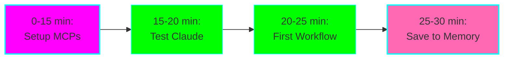

# ⚡ Quick Start Guide

**Goal:** Get started in 30 minutes or less!

## 🎯 Your First 30 Minutes



---

## Step 1: Configure MCP Servers (15 minutes)

### macOS

1. **Open config file:**
   ```bash
   code ~/Library/Application\ Support/Claude/claude_desktop_config.json
   ```

2. **Paste this configuration:**
   ```json
   {
     "mcpServers": {
       "sequential-thinking": {
         "command": "npx",
         "args": ["-y", "@modelcontextprotocol/server-sequential-thinking"]
       },
       "memory": {
         "command": "npx",
         "args": ["-y", "@modelcontextprotocol/server-memory"]
       },
       "knowledge-graph": {
         "command": "npx",
         "args": ["-y", "@modelcontextprotocol/server-knowledge-graph"]
       }
     }
   }
   ```

3. **Save and restart Claude Desktop**

### Windows

1. **Open config file:**
   ```powershell
   code $env:APPDATA\Claude\claude_desktop_config.json
   ```

2. **Paste the same configuration** (from above)

3. **Save and restart Claude Desktop**

### Linux

1. **Open config file:**
   ```bash
   code ~/.config/Claude/claude_desktop_config.json
   ```

2. **Paste the same configuration** (from above)

3. **Save and restart Claude Desktop**

---

## Step 2: Verify MCP Setup (5 minutes)

Open Claude Desktop and paste this:

```
Do you have sequential thinking, memory, and knowledge graph tools available?
```

**Expected response:** Claude should confirm it has access to these MCP tools.

**If not working:** See [mcp-setup.md](./mcp-setup.md) troubleshooting section.

---

## Step 3: Your First Workflow Test (5 minutes)

### Test Memory MCP

**Paste this:**
```
Please remember: I'm experimenting with AI productivity orchestration.
Today is my first day testing the system.
My main goal is to improve focus and task continuity.

Tag this memory with: productivity-experiment, day-1
```

**Expected:** Claude confirms it saved to memory.

---

### Test Sequential Thinking

**Paste this:**
```
I need to set up my productivity tracking system.
Use sequential thinking to break this down into steps.
```

**Expected:** Claude creates a sequential task breakdown.

---

### Test Knowledge Graph

**Paste this:**
```
Add "AI Productivity Orchestration" to my knowledge graph.
Description: Experiment using multiple AI agents and MCP servers to improve productivity.
Link it to: ADHD, Claude Desktop, MCP
```

**Expected:** Claude creates the node and relationships.

---

## Step 4: Test Memory Persistence (5 minutes)

1. **Close Claude Desktop completely** (Cmd+Q / Quit)
2. **Reopen Claude Desktop**
3. **Start a new conversation**
4. **Paste this:**

```
What was I working on in my last session? Check memory.
```

**Expected:** Claude retrieves your saved memory about the productivity experiment.

**If this works, you're all set!** 🎉

---

## ✅ Setup Complete Checklist

- [ ] MCP servers configured
- [ ] Claude Desktop restarted
- [ ] Sequential Thinking tools confirmed
- [ ] Memory tools confirmed
- [ ] Knowledge Graph tools confirmed
- [ ] Test memory saved
- [ ] Memory persistence verified across sessions

---

## 🚀 What's Next?

### Option A: Start Using Immediately

**Copy this prompt to begin your first deep work session:**

```
I'm starting a deep work session on [PROJECT/TASK].

Please:
1. Check if we have any memory about this project
2. Help me create a sequential plan for today's work
3. Set up tracking so we can save progress later

I have [X] hours available.
```

---

### Option B: Test All AI Agents (Recommended)

Over the next week, test each AI agent:

1. **Day 1-2:** Claude Desktop (you just did this!)
2. **Day 3:** ChatGPT Desktop - test speed vs quality
3. **Day 4:** Perplexity - research a technical topic
4. **Day 5:** Goose Desktop - coding tasks
5. **Day 6:** Comet Browser - browsing + AI
6. **Day 7:** ChatGPT Atlas - visual planning

**Use:** [agent-testing-log.md](./agent-testing-log.md)

---

### Option C: Learn One Workflow At A Time

**Week 1:** Deep Work Session
- Use [workflow-templates.md](./workflow-templates.md#deep-work-session)
- Practice daily
- Build the habit

**Week 2:** Study Session
- Use [workflow-templates.md](./workflow-templates.md#study-session)
- Track with Knowledge Graph
- See your learning compound

**Week 3:** Add Context Switching
- Master interruption recovery
- Never lose your place again

**Week 4:** Multi-Agent Orchestration
- Use the right AI for each task
- Maximize efficiency

---

## 📌 Bookmark These Prompts

### Daily Startup
```
Good morning! Load my work context from yesterday and help me plan today.
Available time: [X hours]
```

### Daily Shutdown
```
End of day. Save my progress to memory for all active projects.
Summary: [what you accomplished]
```

### When Stuck
```
I'm stuck on [PROBLEM]. Use sequential thinking to break this down.
```

### Learning Something New
```
Add [CONCEPT] to my knowledge graph and link to [RELATED CONCEPTS].
Also save to memory: [key insight]
```

---

## 🆘 Quick Troubleshooting

### MCP Servers Not Loading

**Try:**
```bash
# Verify Node.js installed
node --version

# Should show v18 or higher
```

**If no Node.js:**
```bash
# macOS
brew install node

# Windows (with chocolatey)
choco install nodejs

# Or download from nodejs.org
```

---

### Memory Not Persisting

**Check:**
1. Did you fully quit Claude Desktop? (Not just close window)
2. Did you restart after config change?
3. Is the JSON valid? (Use jsonlint.com)

---

### Slow Performance

**Normal:** First startup downloads packages (30-60 sec)

**If always slow:**
- Install MCP servers locally (see [mcp-setup.md](./mcp-setup.md#advanced-configuration))
- Disable other MCP servers temporarily
- Check internet connection

---

## 💡 Pro Tips for ADHD

### Start Small
Don't try to use all features at once. Master ONE workflow first.

**Suggested order:**
1. Memory (for context continuity)
2. Sequential Thinking (for breaking down tasks)
3. Knowledge Graph (for learning)

### Build the Habit
Use the same prompts daily for 2 weeks to build muscle memory.

**Copy these to a note:**
- Morning: "Load context and plan day"
- Evening: "Save progress to memory"

### Visual Reminders
Put a sticky note on your monitor:
```
📝 Save to Memory!
🧠 Sequential Thinking for complex tasks
🕸️ Knowledge Graph for learning
```

### Time-Box Everything
- Deep work: 25-50 min sessions
- Testing: 15 min per agent
- Daily review: 5 min max

---

## 📚 Full Documentation

- **[Main README](./README.md)** - Complete experiment overview
- **[MCP Setup](./mcp-setup.md)** - Detailed configuration guide
- **[Agent Configs](./agent-configs.md)** - Compare all 6 AI agents
- **[Workflow Templates](./workflow-templates.md)** - Copy-paste workflows
- **[Testing Log](./agent-testing-log.md)** - Track your experience

---

## 🎯 Your First Week Goals

### Day 1 (Today)
- [ ] MCP servers working
- [ ] First memory saved and retrieved
- [ ] Knowledge graph initialized

### Day 2-3
- [ ] One full deep work session with Memory MCP
- [ ] Save and retrieve context successfully
- [ ] Try Sequential Thinking for a complex task

### Day 4-5
- [ ] Build knowledge graph with 10+ concepts
- [ ] Test ChatGPT Desktop comparison
- [ ] Document findings in testing log

### Day 6-7
- [ ] Practice context switching workflow
- [ ] Week 1 review
- [ ] Plan week 2 focus

---

## 🚦 Success Indicators

**You're on track if:**
- ✅ Memory persists across Claude restarts
- ✅ You can retrieve yesterday's context
- ✅ Sequential thinking helps break down tasks
- ✅ Knowledge graph is growing
- ✅ Less time lost to context switching

**Need help if:**
- ❌ MCP tools not showing up
- ❌ Memory not persisting
- ❌ Confused about which AI agent to use
- ❌ Workflows feel overwhelming

**→ Check troubleshooting sections in each guide**

---

## 🎊 Celebrate Small Wins

- ✨ First memory retrieved? That's huge!
- ✨ Made it through a deep work session? Progress!
- ✨ Knowledge graph has 5 nodes? You're building!
- ✨ Remembered to save context? Habit forming!

**Remember:** This is about continuous progress, not perfection. You're building a system that works with your brain, not against it! 🧠💪

---

**Ready? Start with Step 1 above!** ⬆️

Questions? Check the [main README](./README.md) or document them in your [testing log](./agent-testing-log.md).
