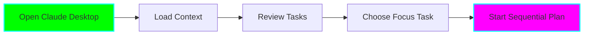
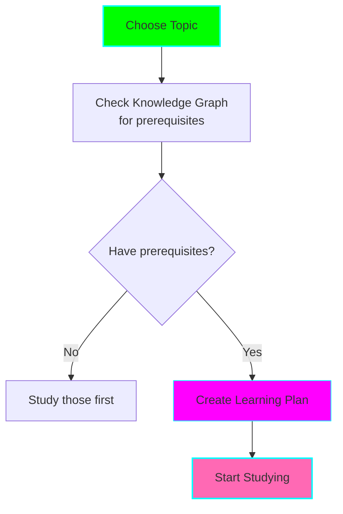
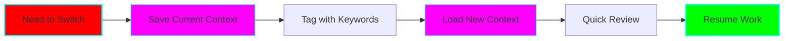
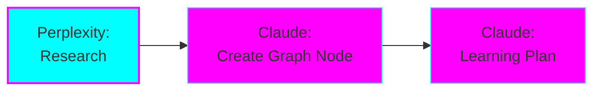
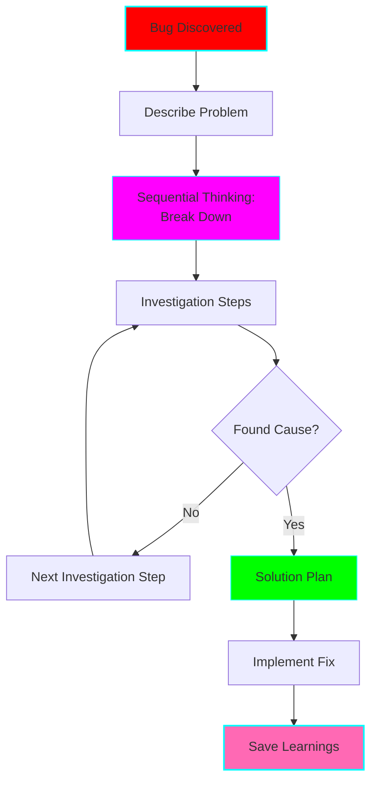
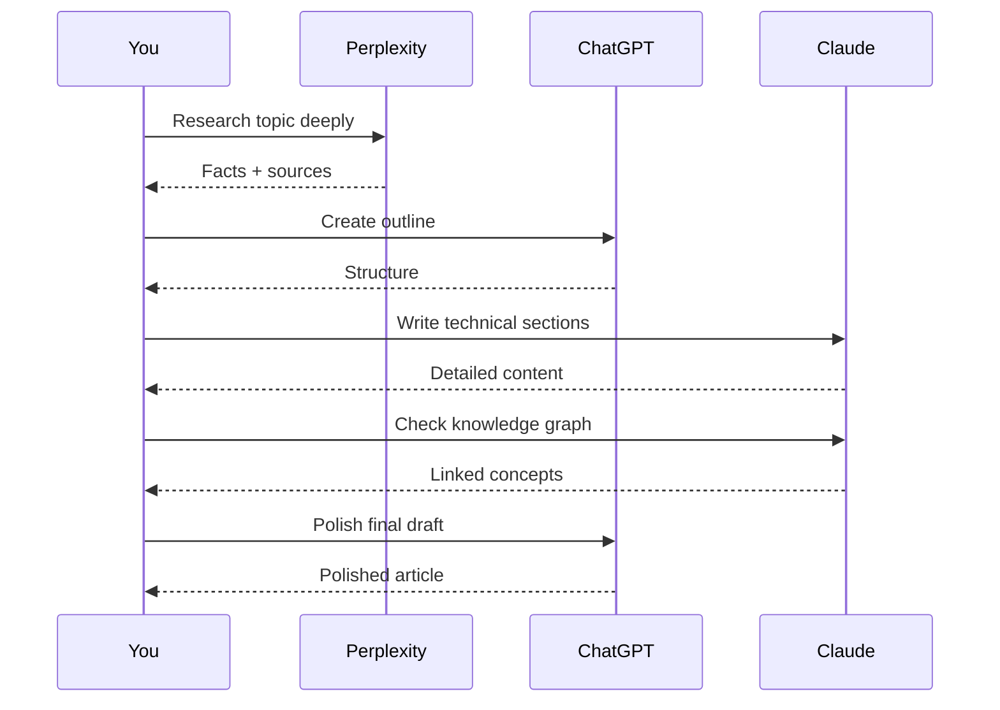
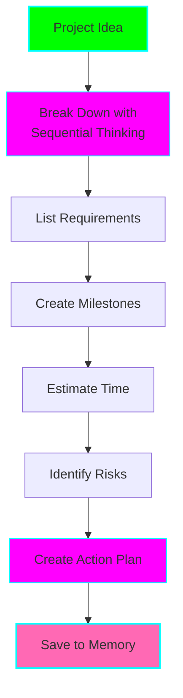
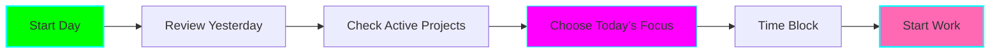

# 🔄 Productivity Workflow Templates

**Purpose:** Copy-paste workflow templates for common scenarios

## 📋 Workflow Categories

- [Deep Work Session](#deep-work-session)
- [Study Session](#study-session)
- [Context Switching](#context-switching)
- [Learning New Technology](#learning-new-technology)
- [Debugging Complex Issue](#debugging-complex-issue)
- [Writing Technical Content](#writing-technical-content)
- [Project Planning](#project-planning)
- [Daily Review & Planning](#daily-review--planning)

---

## Deep Work Session

**Duration:** 1-4 hours
**Agent:** Claude Desktop (Primary)
**MCP Tools:** Memory, Sequential Thinking

### Pre-Session (5 minutes)



**Prompt Template:**
```
Load my work context from last session.

I want to work on: [PROJECT/TASK NAME]

Please:
1. Show me what I was working on last
2. What tasks are pending
3. Help me create a sequential plan for today's session
```

### During Session

**Every 30 minutes:**
```
Save my current progress to memory. Current step: [WHAT YOU'RE DOING]
```

**When stuck:**
```
I'm stuck on [PROBLEM]. Use sequential thinking to help me break this down.
```

**When learning something new:**
```
Add [CONCEPT] to my knowledge graph and link it to [RELATED CONCEPTS]
```

### Post-Session (5 minutes)

**Prompt Template:**
```
Session ending. Please help me:
1. Save current context and progress to memory
2. List what I accomplished
3. Note any blockers or questions for next session
4. Suggest next steps for when I return
```

---

## Study Session

**Duration:** 30-90 minutes
**Agents:** Claude Desktop (Primary), Perplexity (Research)
**MCP Tools:** Knowledge Graph, Memory, Sequential Thinking

### Pre-Study (5 minutes)



**Claude Desktop:**
```
I want to study [TOPIC].

Please:
1. Check my knowledge graph for related concepts I've already learned
2. Identify any prerequisites I should review first
3. Create a sequential learning plan for this session (aim for [X] minutes)
```

**Perplexity (if needed):**
```
Find the best current resources for learning [TOPIC] including official documentation, tutorials, and examples.
```

### During Study

**After each concept (every 15-20 min):**

**Claude Desktop:**
```
I just learned about [CONCEPT]. Please:
1. Add it to my knowledge graph
2. Link it to: [RELATED CONCEPTS]
3. Store this learning note to memory: [KEY INSIGHT]
4. Quiz me to check understanding
```

**Understanding Check:**
```
Create 3 questions to test my understanding of [CONCEPT]
```

### Post-Study (5 minutes)

**Prompt Template:**
```
Study session complete. Please:
1. Show me my knowledge graph progress (new nodes added)
2. Save study session summary to memory
3. Identify gaps or areas for next session
4. Rate my understanding of today's topics (1-10 for each)
```

---

## Context Switching

**Duration:** 5 minutes
**Agent:** Claude Desktop
**MCP Tools:** Memory



### Leaving Current Task

**Prompt Template:**
```
I need to switch contexts.

Current task: [TASK NAME]
Current state: [WHERE YOU ARE, WHAT YOU WERE DOING]
Next step when I return: [WHAT TO DO NEXT]
Blockers/questions: [ANY ISSUES]

Please save this to memory with tags: [project-name, feature-name, etc]
```

### Switching to New Task

**Prompt Template:**
```
Switching to: [NEW TASK/PROJECT]

Please load context for this task from memory.

Show me:
1. What was I last working on
2. What's the current state
3. What are the next steps
4. Any notes or blockers I left
```

---

## Learning New Technology

**Duration:** Multiple sessions
**Agents:** Perplexity → Claude Desktop → ChatGPT
**MCP Tools:** All (Sequential Thinking, Memory, Knowledge Graph)

### Phase 1: Research (30 min)



**Perplexity:**
```
Research [TECHNOLOGY NAME]:
1. What is it and what problems does it solve?
2. Current version and latest features
3. Best learning resources (official docs, tutorials)
4. Common use cases
5. Prerequisites I should know
```

**Claude Desktop:**
```
Based on my Perplexity research, please:
1. Create a knowledge graph node for [TECHNOLOGY]
2. Link it to technologies I already know: [LIST]
3. Identify prerequisite concepts
4. Create a sequential learning plan for mastering this over [X weeks/days]
5. Save this plan to memory
```

### Phase 2: Hands-On Learning (Multiple sessions)

**Session Start:**
```
Continue learning [TECHNOLOGY].

Load progress from memory and show:
1. What I've learned so far
2. Today's learning goals (next step in sequential plan)
3. My knowledge graph for this technology
```

**During Learning:**
```
I just learned [CONCEPT/FEATURE]. Please:
1. Add to knowledge graph
2. Create practical example
3. Link to related concepts
4. Save to memory
```

**ChatGPT (for quick questions):**
```
Quick question about [TECHNOLOGY]: [SPECIFIC QUESTION]
```

### Phase 3: Project Application

**Claude Desktop:**
```
I want to build a practice project with [TECHNOLOGY].

Help me:
1. Choose appropriate project based on my skill level
2. Create sequential implementation plan
3. Track progress in memory
4. Add practical learnings to knowledge graph
```

---

## Debugging Complex Issue

**Duration:** Variable
**Agent:** Claude Desktop
**MCP Tools:** Sequential Thinking, Memory



### Step 1: Define Problem

**Prompt Template:**
```
I have a bug to debug.

Symptoms:
- [WHAT'S HAPPENING]
- [WHAT SHOULD HAPPEN INSTEAD]

Environment:
- [LANGUAGE/FRAMEWORK/VERSION]

Context:
- [WHEN IT HAPPENS]
- [WHAT CHANGED RECENTLY]

Please use sequential thinking to help me debug this systematically.
```

### Step 2: Investigation

**Claude will guide you through steps. After each:**
```
Update: [WHAT YOU FOUND/TRIED]

Next step?
```

### Step 3: Solution

**Once solved:**
```
Bug resolved!

Cause: [WHAT CAUSED IT]
Solution: [WHAT FIXED IT]

Please:
1. Save this debugging session to memory
2. Add any new learnings to knowledge graph
3. Suggest how to prevent similar bugs
```

---

## Writing Technical Content

**Duration:** 1-3 hours
**Agents:** Perplexity → ChatGPT → Claude Desktop
**MCP Tools:** Memory, Knowledge Graph



### Phase 1: Research (Perplexity)

```
Research [TOPIC] for technical article:
- Key concepts and terminology
- Latest developments
- Common misconceptions
- Best practices
- Code examples or case studies

Include citations.
```

### Phase 2: Outline (ChatGPT)

```
Create an outline for technical article about [TOPIC].

Audience: [BEGINNER/INTERMEDIATE/ADVANCED]
Length: [X words]
Focus: [WHAT ASPECT]

Include:
- Hook/introduction
- Main sections
- Examples to include
- Conclusion
```

### Phase 3: Technical Sections (Claude Desktop)

```
Write the [SECTION NAME] section for my article on [TOPIC].

Context from outline: [PASTE OUTLINE]

Requirements:
- Technical accuracy
- Code examples if relevant
- Reference my knowledge graph for related concepts
- [ANY SPECIFIC REQUIREMENTS]
```

### Phase 4: Polish (ChatGPT)

```
Polish this technical content:
[PASTE CONTENT]

Make it:
- Clear and concise
- Engaging
- Grammatically correct
- Well-structured

Maintain technical accuracy.
```

---

## Project Planning

**Duration:** 30-60 minutes
**Agent:** Claude Desktop (or ChatGPT Atlas for visual)
**MCP Tools:** Sequential Thinking, Memory



**Prompt Template:**
```
I want to plan a new project: [PROJECT NAME]

Goal: [WHAT YOU WANT TO BUILD]
Why: [MOTIVATION/PURPOSE]
Skills: [CURRENT SKILL LEVEL]
Time available: [HOW MUCH TIME]

Please use sequential thinking to help me:
1. Break down into major milestones
2. Identify technical requirements
3. Estimate time for each phase
4. Spot potential challenges
5. Create week-by-week action plan
6. Save this plan to memory for tracking
```

**For Visual Planning (ChatGPT Atlas):**
```
Create a visual project map for [PROJECT].
Show dependencies between components and milestones.
```

---

## Daily Review & Planning

**Duration:** 10-15 minutes (morning/evening)
**Agent:** Claude Desktop
**MCP Tools:** Memory, Knowledge Graph

### Morning Planning



**Prompt Template:**
```
Good morning! Help me plan today.

Please:
1. Show what I worked on yesterday
2. List active projects from memory
3. Show my knowledge graph growth this week
4. Suggest 1-3 focus tasks for today
5. Create time blocks for deep work

Available time today: [X hours]
Energy level: [HIGH/MEDIUM/LOW]
```

### Evening Review

**Prompt Template:**
```
End of day review.

Please:
1. What did I accomplish today?
2. What did I learn? (add to knowledge graph)
3. What's incomplete? (save to memory)
4. Blockers or questions?
5. Suggest priority for tomorrow

Also:
- Update my knowledge graph with today's learnings
- Save context for all active projects
```

---

## Quick Reference: Prompt Patterns

### Memory Management

**Save Context:**
```
Save to memory: [WHAT TO REMEMBER]
Tags: [tag1, tag2, tag3]
Project: [PROJECT NAME]
```

**Load Context:**
```
Load memory for: [PROJECT/TAG/TOPIC]
```

**Review Memory:**
```
Show me all saved memories for [PROJECT]
```

### Knowledge Graph

**Add Node:**
```
Add [CONCEPT] to knowledge graph
Description: [SHORT DESCRIPTION]
```

**Link Concepts:**
```
Link [CONCEPT A] to [CONCEPT B]
Relationship: [HOW THEY RELATE]
```

**Query Graph:**
```
Show me concepts related to [TOPIC]
```

### Sequential Thinking

**Start Task:**
```
Use sequential thinking to break down: [TASK]
```

**Update Progress:**
```
Update step [N]: [STATUS/FINDINGS]
Next step?
```

**Complete Task:**
```
Sequential task complete. Summary: [WHAT ACCOMPLISHED]
```

---

## Creating Custom Workflows

Use this template to create your own workflows:

```markdown
## [Workflow Name]

**Duration:** [TIME]
**Agents:** [WHICH AI AGENTS]
**MCP Tools:** [WHICH MCP SERVERS]

### Goal
[What this workflow achieves]

### When to Use
[Scenarios where this workflow applies]

### Steps

1. **[Phase Name]** (X minutes)
   - Agent: [Which agent]
   - Prompt: `[Prompt template]`
   - Expected outcome: [What you get]

2. **[Next Phase]** (X minutes)
   - ...

### Mermaid Diagram
[Visual flow]

### Success Criteria
- [ ] [How to know it worked]
- [ ] [Measurable outcomes]

### Tips
- [ADHD-specific tips]
- [Common pitfalls to avoid]
```

---

## Workflow Combinations

**For Complex Projects:**
1. Start with **Project Planning**
2. Daily: **Morning Planning** → **Deep Work** → **Evening Review**
3. Weekly: Review knowledge graph growth and memory

**For Learning:**
1. Start with **Learning New Technology**
2. Multiple **Study Sessions**
3. Apply with **Deep Work Session**
4. Document with **Writing Technical Content**

**For Productivity:**
1. Daily **Morning Planning**
2. **Deep Work Sessions** with **Context Switching** as needed
3. Daily **Evening Review**
4. Weekly: Review and refine

---

**Remember:** These are templates. Adjust to your needs, energy levels, and ADHD patterns! 🚀

**Next Steps:**
1. Try one workflow at a time
2. Document what works in the main README learning log
3. Customize prompts to your style
4. Build your own workflows based on these patterns
