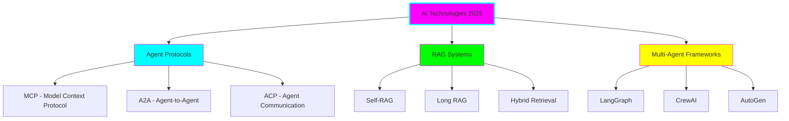

# 🤖 AI Technologies 2025 - Learning Hub

**Status:** 🧪 Experimental | **Tech Stack:** Python 3.11+ | **Created:** 2025-11-08

## Overview

A comprehensive learning resource and practical implementation guide for cutting-edge AI technologies in 2025, including:

- **Agent-to-Agent Communication** (MCP, A2A, ACP)
- **RAG Systems** (Self-RAG, Long RAG, Hybrid Retrieval)
- **Multi-Agent Orchestration** (LangGraph, CrewAI, AutoGen)
- **Hybrid Architectures** (Combining multiple paradigms)



## Project Structure

```
ai-technologies-2025/
├── docs/                    # Theoretical documentation
│   ├── 01-overview.md
│   ├── 02-agent-protocols.md
│   ├── 03-rag-systems.md
│   ├── 04-multi-agent-frameworks.md
│   └── 05-best-practices.md
├── examples/
│   ├── practical/           # Production-ready implementations
│   │   ├── rag-implementation/
│   │   ├── mcp-server/
│   │   └── multi-agent-crew/
│   ├── theoretical/         # Architecture designs & patterns
│   │   └── architectures/
│   └── experimental/        # Cutting-edge hybrid approaches
│       ├── hybrid-rag-agents/
│       └── cross-protocol-integration/
└── .python-version         # Python 3.11
```

## Quick Start

### Setup Environment

```bash
# Navigate to project
cd experiments/ai-technologies-2025

# Create virtual environment
uv venv
source .venv/bin/activate

# Install dependencies (once created)
pip install -r requirements.txt
```

### Learning Path

1. **Start with Theory** - Read `docs/01-overview.md` for foundations
2. **Understand Protocols** - Deep dive into agent communication standards
3. **Explore RAG** - Learn retrieval-augmented generation patterns
4. **Multi-Agent Systems** - Understand orchestration frameworks
5. **Hands-on Practice** - Work through practical examples
6. **Experiment** - Try hybrid experimental implementations

## What You'll Learn

### 📚 Theoretical Knowledge

- Agent communication protocols (MCP, A2A, ACP, ANP)
- RAG architecture patterns and best practices
- Multi-agent coordination strategies
- System design principles for agentic AI

### 💻 Practical Skills

- Building MCP servers for Claude
- Implementing production RAG systems
- Creating multi-agent crews with CrewAI
- Using LangGraph for complex workflows

### 🧪 Experimental Concepts

- Combining RAG with multi-agent systems
- Cross-protocol agent integration
- Self-correcting retrieval systems
- Adaptive agentic workflows

## Key Technologies Covered

| Technology | Type | Primary Use Case |
|-----------|------|------------------|
| **MCP** | Protocol | Connecting AI to data sources |
| **A2A** | Protocol | Agent-to-agent coordination |
| **Self-RAG** | Architecture | Self-correcting retrieval |
| **Long RAG** | Architecture | Document-level context |
| **LangGraph** | Framework | Stateful agent graphs |
| **CrewAI** | Framework | Role-based agent teams |
| **Hybrid Retrieval** | Pattern | Dense + Sparse retrieval |

## Learning Objectives

By completing this material, you will be able to:

- ✅ Explain the differences between MCP, A2A, and other agent protocols
- ✅ Design and implement production RAG systems
- ✅ Build multi-agent systems using modern frameworks
- ✅ Choose the right architecture for specific use cases
- ✅ Understand security considerations for agentic AI
- ✅ Implement hybrid approaches combining multiple paradigms

## Prerequisites

- **Python 3.11+** - Modern Python features
- **Basic LLM Knowledge** - Understanding of language models
- **API Familiarity** - REST APIs and JSON
- **Git & Terminal** - Command line basics

## Graduation Criteria

This project is ready to graduate when:

- [ ] All documentation is complete and reviewed
- [ ] All practical examples run successfully
- [ ] At least 3 experimental approaches are validated
- [ ] Security best practices are documented
- [ ] Performance benchmarks are established
- [ ] Community feedback is incorporated

## Resources

### Official Documentation
- [Anthropic MCP Docs](https://docs.anthropic.com/en/docs/agents-and-tools/mcp)
- [Google A2A Specification](https://github.com/google/agent-to-agent)
- [LangGraph Documentation](https://langchain-ai.github.io/langgraph/)
- [CrewAI Documentation](https://docs.crewai.com/)

### Research Papers
- "A Survey of Agent Interoperability Protocols" (arXiv:2505.02279)
- "Enhancing RAG: A Study of Best Practices" (arXiv:2501.07391)

## Contributing

This is a personal learning project, but suggestions are welcome! Create an issue or PR if you spot improvements.

## License

MIT License - Use freely for learning and experimentation

---

**Last Updated:** 2025-11-08
**Maintainer:** Learning & Experimentation
**Status:** Active Development 🚀
