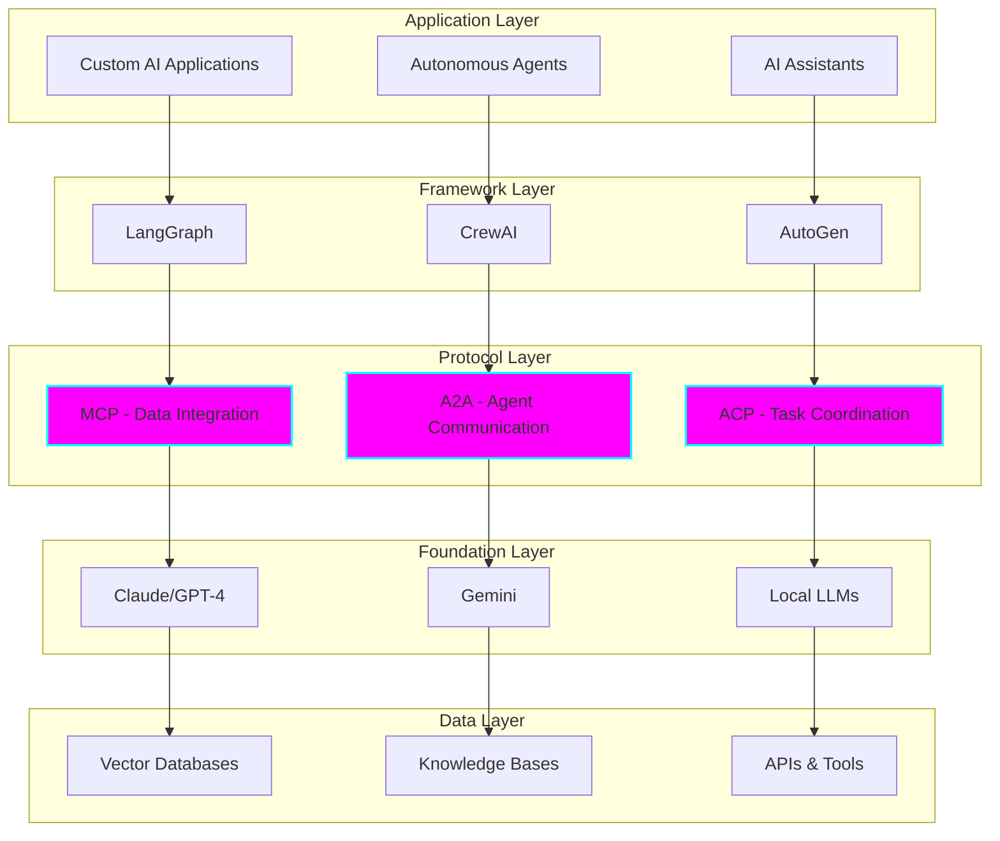
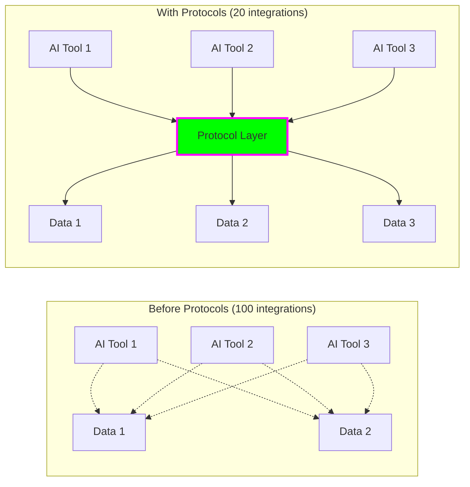
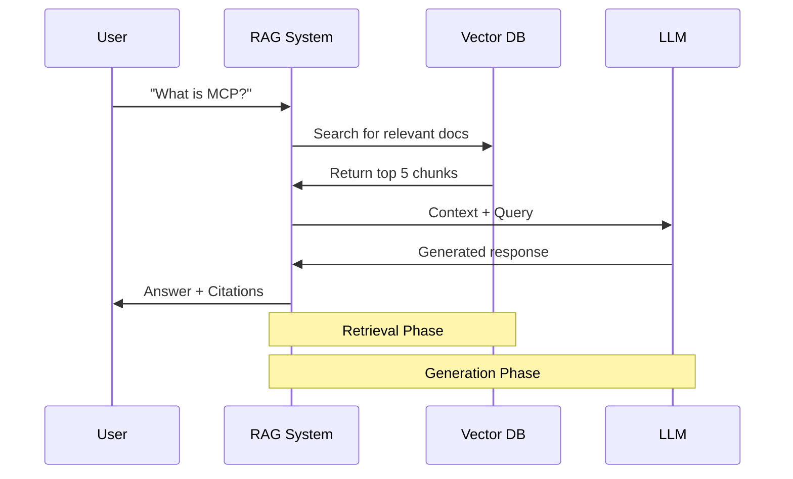
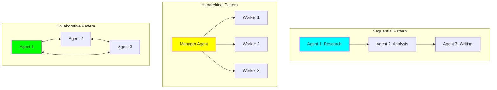
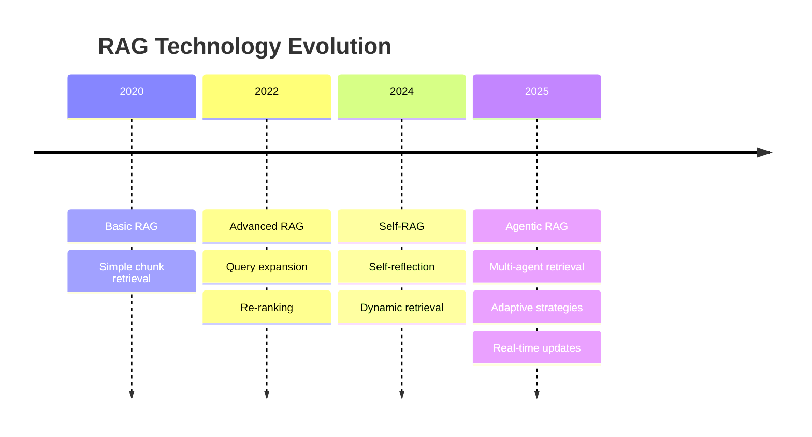
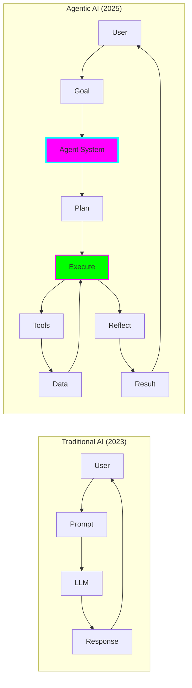
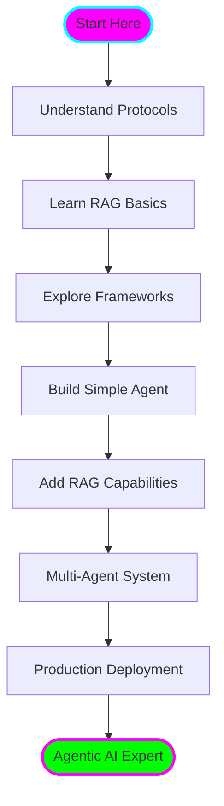

# 📖 AI Technologies 2025 - Overview

## Introduction

The AI landscape in 2025 has evolved significantly with the emergence of **agentic AI** - systems where AI agents can autonomously perform tasks, make decisions, and collaborate with other agents. Three key technological pillars enable this evolution:

1. **Agent Communication Protocols** - Standardized ways for agents to interact
2. **RAG Systems** - Retrieval-augmented generation for grounded responses
3. **Multi-Agent Frameworks** - Orchestration tools for agent collaboration

## The Agentic AI Stack

## Key Concepts

### 1. Agent Communication Protocols

Standardized protocols enable different AI systems to communicate without custom integrations.

**Problem Solved:** Before 2024, each AI tool needed custom integrations with every data source. A system with 10 AI tools and 10 data sources needed 100 separate integrations.

**Solution:** Universal protocols reduce this to N + M integrations (10 + 10 = 20).

### 2. RAG (Retrieval-Augmented Generation)

RAG combines the power of LLMs with external knowledge retrieval to provide accurate, up-to-date, and grounded responses.

**Key Benefits:**
- ✅ Reduces hallucinations by grounding responses in real data
- ✅ Enables domain specialization without retraining
- ✅ Provides citations and sources for trustworthy responses
- ✅ Allows knowledge updates without model retraining

**Basic RAG Flow:**

### 3. Multi-Agent Systems

Multiple specialized agents work together to solve complex problems that would be difficult for a single agent.

**Coordination Patterns:**

## The 2025 AI Technology Landscape

### Major Protocol Developments

| Protocol | Organization | Purpose | Status (2025) |
|----------|-------------|---------|---------------|
| **MCP** | Anthropic | Connect AI to data sources | Widely adopted, OpenAI integrated |
| **A2A** | Google | Agent-to-agent communication | Growing adoption, Microsoft joined |
| **ACP** | IBM | Agent task coordination | Enterprise focus |
| **ANP** | Community | Agent networking | Emerging standard |

### RAG Evolution Timeline

### Framework Comparison

| Framework | Best For | Architecture | Complexity |
|-----------|----------|--------------|------------|
| **LangGraph** | Complex workflows | Graph-based, stateful | High |
| **CrewAI** | Role-based teams | Sequential/hierarchical | Medium |
| **AutoGen** | Multi-agent conversations | Conversational | Medium |
| **Swarm** | Lightweight coordination | Function-calling | Low |

## Why This Matters

### The Shift from Models to Agents

**Key Differences:**

- **Traditional:** Single interaction, stateless, limited context
- **Agentic:** Multi-step planning, stateful, tool use, self-correction

## Market Impact

- **RAG Market:** Expected to reach **$40.34 billion by 2035** (35% annual growth)
- **Agent Adoption:** Major tech companies (Google, Microsoft, OpenAI) embracing protocols
- **Security Concerns:** Authentication and prompt injection remain challenges

## Learning Path

## Next Steps

1. **Deep Dive into Protocols** → Read `02-agent-protocols.md`
2. **Master RAG Systems** → Read `03-rag-systems.md`
3. **Explore Frameworks** → Read `04-multi-agent-frameworks.md`
4. **Best Practices** → Read `05-best-practices.md`
5. **Hands-on Practice** → Try the practical examples

## Key Takeaways

- 🔌 **Protocols standardize** how agents communicate and access data
- 📚 **RAG grounds** LLM responses in factual, retrievable knowledge
- 🤝 **Multi-agent systems** enable complex problem-solving through collaboration
- 🚀 **The future is agentic** - autonomous AI systems that plan and execute
- ⚠️ **Security matters** - authentication and safety are critical considerations

---

**Next:** [Agent Communication Protocols →](02-agent-protocols.md)
