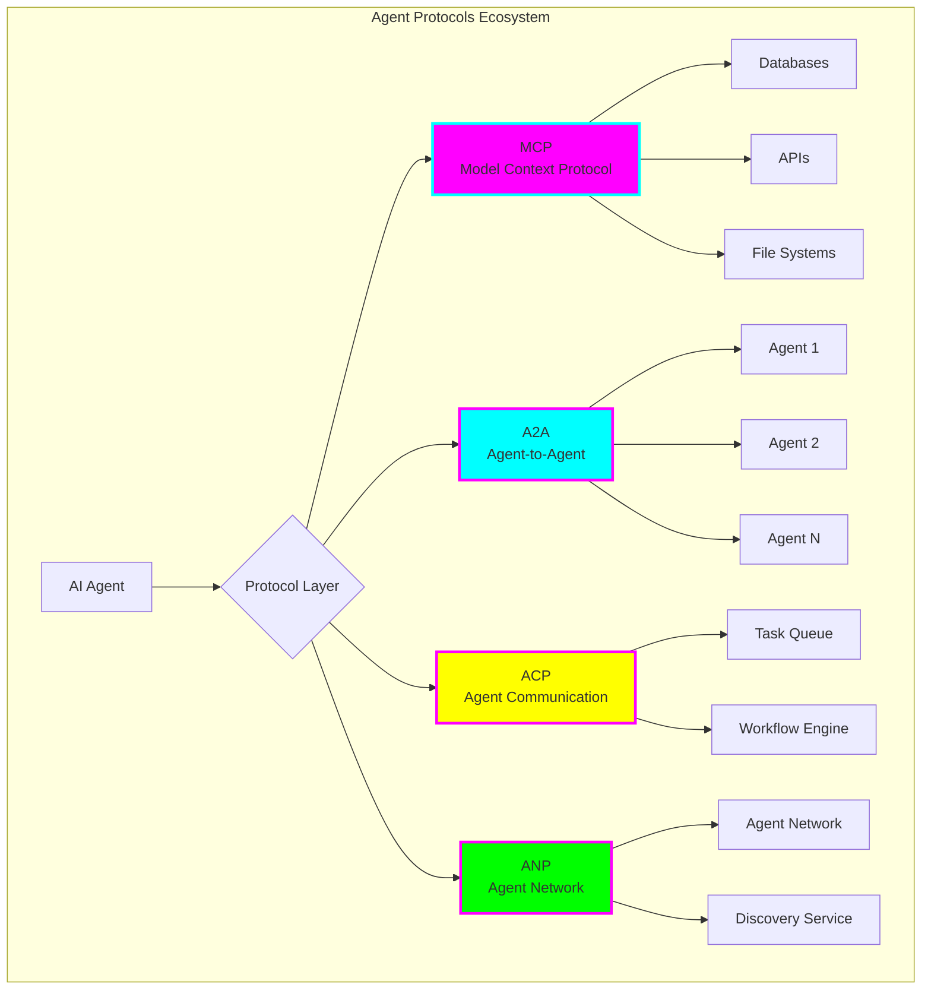
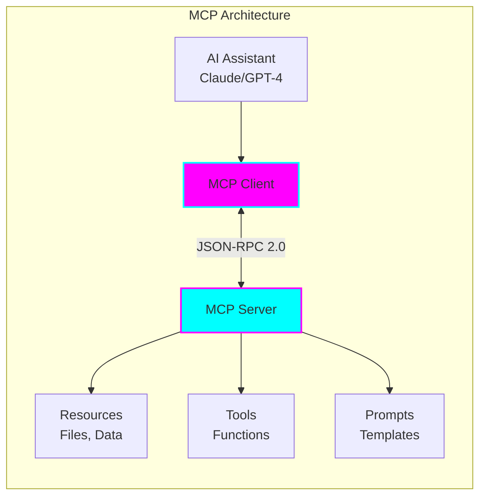
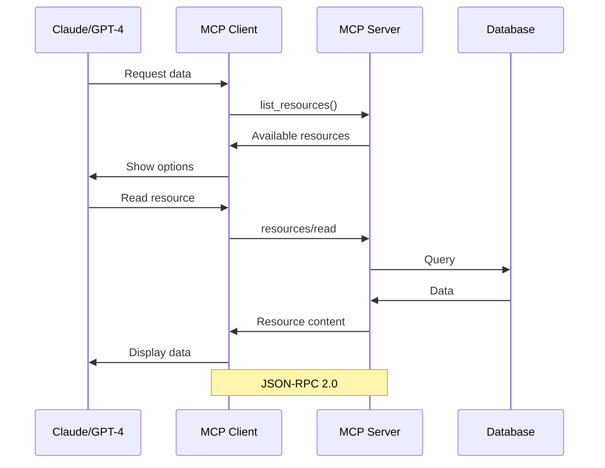
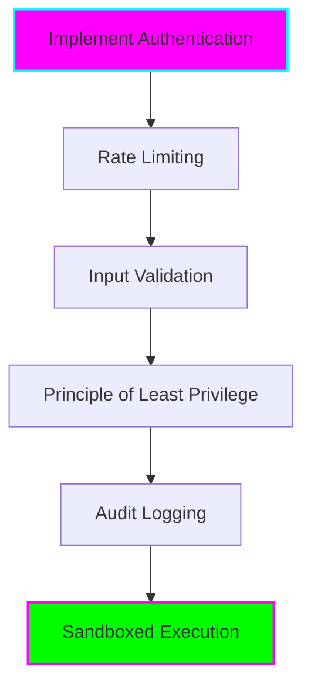
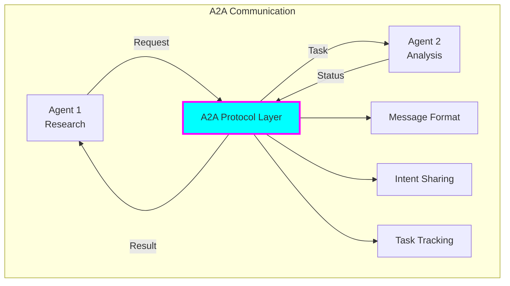
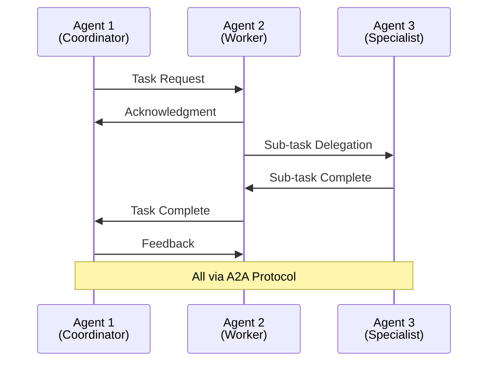
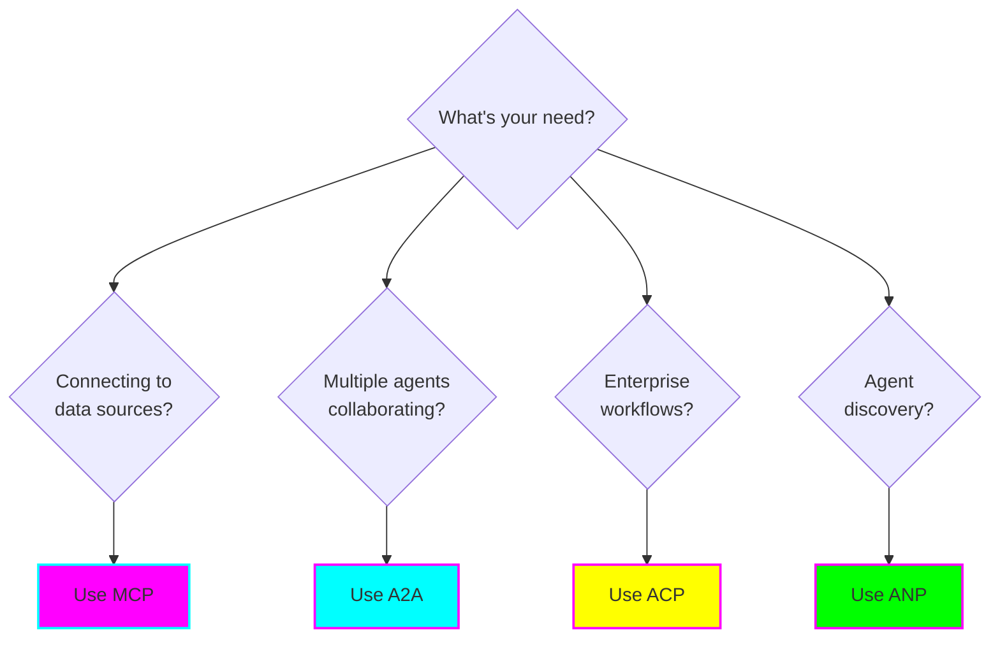
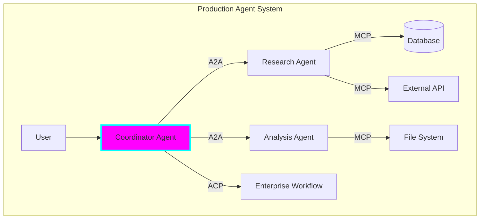

# 🔌 Agent Communication Protocols

## Introduction

Agent communication protocols are the **"USB-C for AI"** - standardized interfaces that enable AI agents to connect with data sources, tools, and other agents without custom integrations.

## The Protocol Landscape (2025)



## 1. MCP (Model Context Protocol)

**Creator:** Anthropic
**Released:** November 2024
**Status:** Industry standard (adopted by OpenAI, Google in 2025)

### Overview

MCP standardizes how AI assistants connect to data sources, enabling seamless integration with content repositories, business tools, and development environments.

### Architecture



### Key Features

**1. Resources** - Read-only data sources
```json
{
  "resource": {
    "uri": "file:///project/README.md",
    "mimeType": "text/markdown",
    "text": "# Project Documentation..."
  }
}
```

**2. Tools** - Executable functions
```json
{
  "tool": {
    "name": "search_database",
    "description": "Search the product database",
    "inputSchema": {
      "type": "object",
      "properties": {
        "query": {"type": "string"}
      }
    }
  }
}
```

**3. Prompts** - Reusable templates
```json
{
  "prompt": {
    "name": "code_review",
    "description": "Review code for best practices",
    "arguments": ["file_path", "language"]
  }
}
```

### MCP Communication Flow



### Real-World MCP Servers

**Popular MCP Servers (2025):**
- **@modelcontextprotocol/server-filesystem** - File system access
- **@modelcontextprotocol/server-github** - GitHub integration
- **@modelcontextprotocol/server-postgres** - PostgreSQL database
- **@modelcontextprotocol/server-google-drive** - Google Drive
- **@modelcontextprotocol/server-slack** - Slack integration

### MCP Implementation Example

```python
# Simple MCP Server (Python)
from mcp import Server, Resource, Tool

server = Server("my-mcp-server")

@server.resource("config://settings")
async def get_settings():
    return {
        "uri": "config://settings",
        "mimeType": "application/json",
        "text": '{"theme": "dark", "language": "en"}'
    }

@server.tool("calculate")
async def calculate(expression: str):
    """Safely evaluate math expressions"""
    # Implementation here
    return {"result": eval(expression)}

# Run server
server.run()
```

### Security Concerns (2025 Research)

⚠️ **Critical Issues:**
- **No authentication** - Most public MCP servers lack auth
- **Prompt injection** - Malicious prompts can exploit tools
- **Tool permissions** - Combining tools can exfiltrate data
- **Lookalike tools** - Malicious tools can replace trusted ones

**Best Practices:**


## 2. A2A (Agent-to-Agent Protocol)

**Creator:** Google
**Released:** April 2025
**Status:** Growing adoption (Microsoft joined working group)

### Overview

A2A defines how autonomous agents interact directly, enabling coordination, task delegation, and outcome tracking.

### Architecture



### Message Structure

```json
{
  "protocol": "a2a",
  "version": "1.0",
  "from": "research-agent-001",
  "to": "analysis-agent-002",
  "messageType": "task_request",
  "payload": {
    "taskId": "task-123",
    "action": "analyze_data",
    "data": {...},
    "priority": "high",
    "deadline": "2025-11-08T18:00:00Z"
  },
  "tracking": {
    "correlationId": "corr-456",
    "timestamp": "2025-11-08T12:00:00Z"
  }
}
```

### A2A Communication Patterns



### Use Cases

1. **Multi-Agent Research**
   - Coordinator agent delegates to research, analysis, and writing agents

2. **Distributed Processing**
   - Load balancing across multiple agent instances

3. **Specialized Collaboration**
   - Agents with different capabilities work together

## 3. ACP (Agent Communication Protocol)

**Creator:** IBM
**Released:** 2024
**Focus:** Enterprise task coordination

### Key Features

- **Workflow Integration** - Connects with enterprise workflow engines
- **Task Queues** - Asynchronous task processing
- **State Management** - Maintains agent and task states
- **Enterprise Security** - Built-in authentication and authorization

## 4. ANP (Agent Network Protocol)

**Status:** Emerging community standard
**Focus:** Agent discovery and networking

### Features

- **Agent Discovery** - Find agents by capabilities
- **Capability Negotiation** - Determine agent abilities
- **Network Topology** - Manage agent networks

## Protocol Comparison

| Feature | MCP | A2A | ACP | ANP |
|---------|-----|-----|-----|-----|
| **Purpose** | Data integration | Agent communication | Task coordination | Agent discovery |
| **Transport** | JSON-RPC 2.0 | Custom | Enterprise bus | Network protocol |
| **Adoption** | Very High | Growing | Enterprise | Emerging |
| **Complexity** | Low | Medium | High | Medium |
| **Best For** | Connecting to data | Multi-agent systems | Enterprise workflows | Large agent networks |

## When to Use Which Protocol



## Combining Protocols

Most production systems use multiple protocols:



## Future Trends

1. **Protocol Convergence** - Standards bodies working on unified approach
2. **Enhanced Security** - Better authentication and authorization
3. **Performance Optimization** - Faster message passing
4. **Cross-Platform** - Better interoperability between vendors

## Practical Next Steps

1. **Start with MCP** - Easiest to learn and widely supported
2. **Add A2A** - When you need multi-agent coordination
3. **Consider ACP** - For enterprise integrations
4. **Explore ANP** - For large-scale agent networks

## Resources

- [MCP Specification](https://spec.modelcontextprotocol.io/)
- [A2A GitHub](https://github.com/google/agent-to-agent)
- [MCP Python SDK](https://github.com/anthropics/python-sdk)
- [MCP TypeScript SDK](https://github.com/anthropics/typescript-sdk)

---

**Previous:** [← Overview](01-overview.md) | **Next:** [RAG Systems →](03-rag-systems.md)
