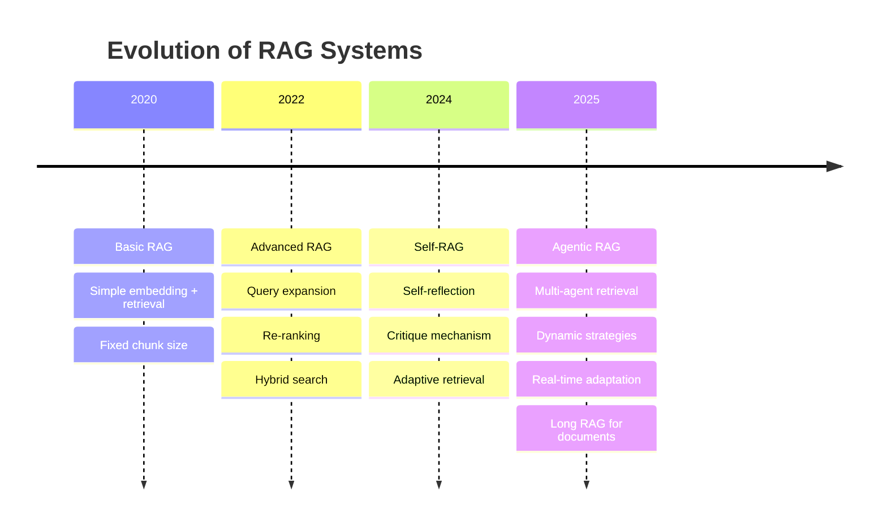
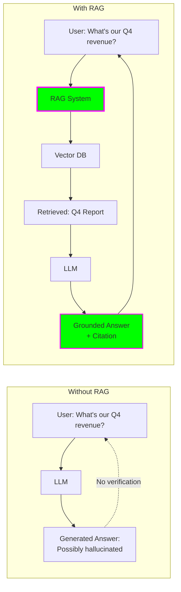
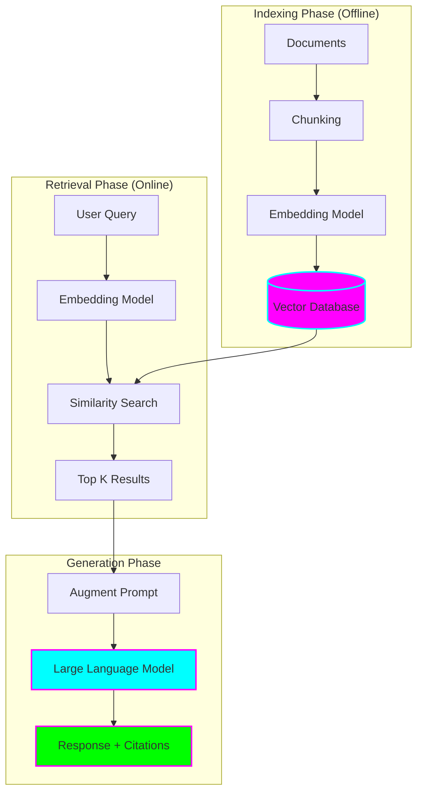
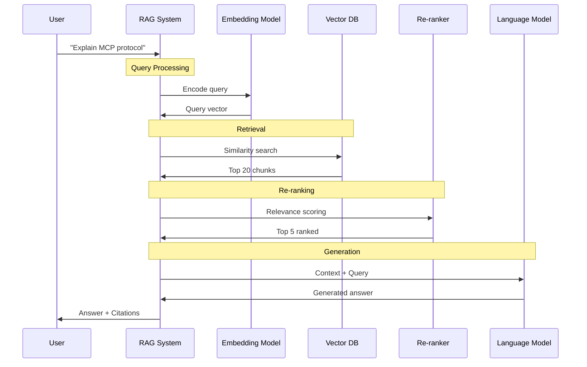
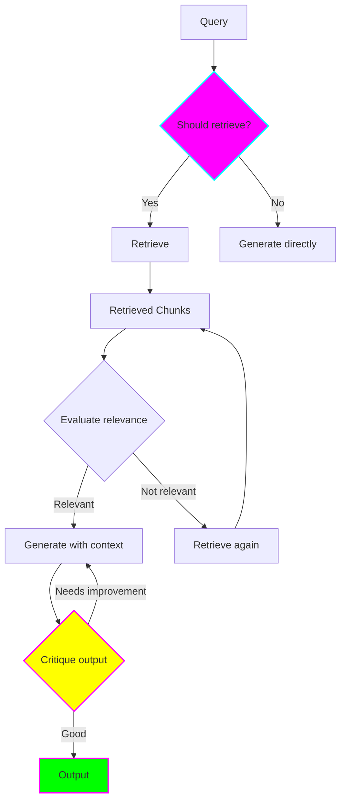
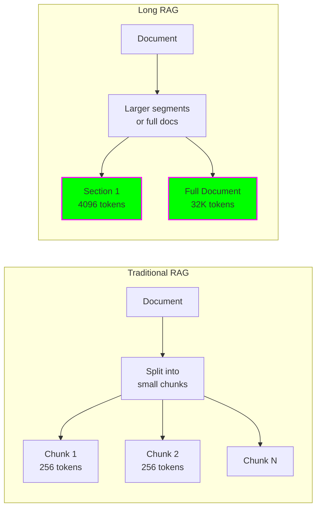
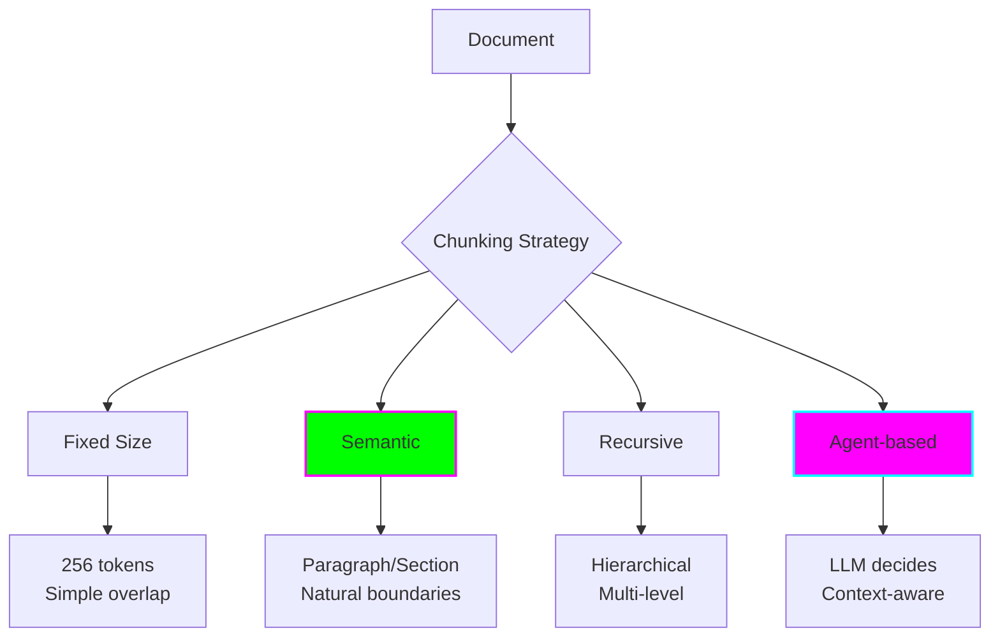
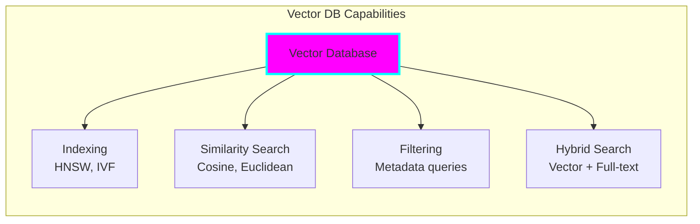
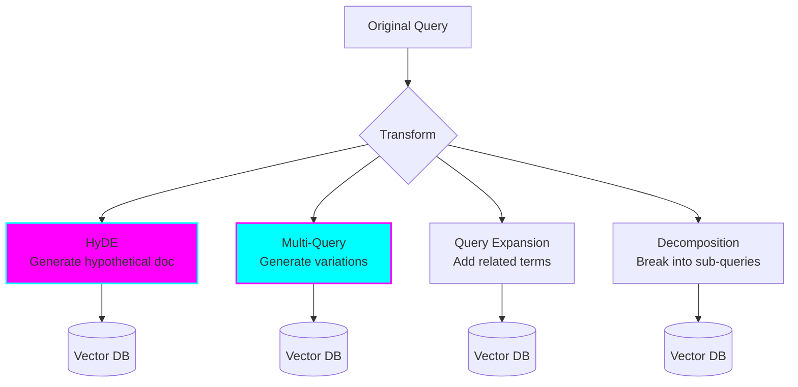
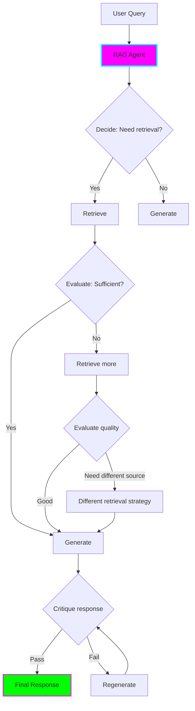

# 📚 RAG (Retrieval-Augmented Generation) Systems

## Introduction

RAG combines the generative power of Large Language Models (LLMs) with the precision of information retrieval to create AI systems that provide **accurate, grounded, and up-to-date responses**.

## The RAG Revolution



## Why RAG?

### The Hallucination Problem



### Key Benefits

| Benefit | Description | Impact |
|---------|-------------|--------|
| **Reduced Hallucinations** | Grounds responses in real data | 60-80% reduction |
| **Domain Expertise** | Use proprietary knowledge | No retraining needed |
| **Citations** | Traceable sources | Builds trust |
| **Fresh Information** | Always up-to-date | Real-time accuracy |
| **Cost Effective** | No model fine-tuning | Lower compute costs |

## RAG Architecture

### Basic RAG Pipeline



### Detailed RAG Flow



## 2025 RAG Architectures

### 1. Self-RAG

**Innovation:** Adds self-reflection and critique mechanisms



**Key Features:**
- **Reflection tokens** - Special tokens indicating confidence
- **Adaptive retrieval** - Only retrieves when needed
- **Self-critique** - Evaluates own responses
- **Iterative refinement** - Improves until quality threshold met

### 2. Long RAG

**Innovation:** Processes entire documents instead of small chunks



**Benefits:**
- Better context preservation
- No information loss at chunk boundaries
- Better for complex documents
- Improved coherence

**Requirements:**
- Long-context LLMs (100K+ tokens)
- More compute resources
- Smart document segmentation

### 3. Hybrid Retrieval

**Innovation:** Combines dense (semantic) and sparse (keyword) search

```mermaid
graph TB
    Q[Query: "How to implement MCP?"]

    subgraph "Dense Retrieval"
        Q --> E[Embedding Model]
        E --> V[(Vector DB)]
        V --> D[Dense Results<br/>Semantic matches]
    end

    subgraph "Sparse Retrieval"
        Q --> K[Keyword Extraction]
        K --> I[(Inverted Index)]
        I --> S[Sparse Results<br/>Keyword matches]
    end

    D --> F[Fusion Algorithm<br/>RRF / Score Norm]
    S --> F

    F --> R[Final Ranked Results]

    style F fill:#ff00ff,stroke:#00ffff,stroke-width:3px
    style R fill:#00ff00,stroke:#ff00ff,stroke-width:2px
```

**Fusion Strategies:**

1. **Reciprocal Rank Fusion (RRF)**
   ```
   RRF_score = Σ(1 / (k + rank_i))
   where k = 60 (constant)
   ```

2. **Score Normalization**
   ```
   normalized_score = (score - min) / (max - min)
   combined_score = α * dense + (1-α) * sparse
   ```

**Performance Gains:** 18-22% improvement in retrieval accuracy

## RAG Components Deep Dive

### 1. Document Chunking Strategies



**Best Practices (2025):**
- **Chunk Size:** 512-1024 tokens for most use cases
- **Overlap:** 20-30% to preserve context
- **Metadata:** Include source, section, timestamp
- **Hierarchy:** Maintain document structure

### 2. Embedding Models

**Popular Choices (2025):**

| Model | Dimensions | Max Tokens | Use Case |
|-------|-----------|------------|----------|
| **OpenAI text-embedding-3-large** | 3072 | 8191 | General purpose |
| **Cohere embed-v3** | 1024 | 512 | Multilingual |
| **Voyage AI voyage-2** | 1024 | 16000 | Long documents |
| **BGE-large-en-v1.5** | 1024 | 512 | Open source |

### 3. Vector Databases



**Popular Options:**

- **Pinecone** - Managed, serverless
- **Weaviate** - Open source, GraphQL
- **Qdrant** - Rust-based, fast filtering
- **Chroma** - Embedded, simple
- **Milvus** - Scalable, distributed

### 4. Re-ranking

Re-ranking improves retrieval quality by re-scoring candidates.

```python
# Conceptual re-ranking flow
initial_results = vector_db.search(query_vector, top_k=20)

# Re-rank using cross-encoder
reranked = reranker.rerank(
    query=user_query,
    documents=initial_results,
    top_n=5
)

# Use top 5 for generation
context = "\n".join([doc.text for doc in reranked[:5]])
```

**Re-ranking Models:**
- **Cohere Rerank** - API-based
- **Cross-encoders** - BERT-based
- **ColBERT** - Late interaction

## Advanced RAG Patterns

### Query Transformation



**Techniques:**

1. **HyDE (Hypothetical Document Embeddings)**
   - Generate hypothetical answer
   - Embed the answer
   - Search with answer embedding

2. **Multi-Query**
   - Generate 3-5 query variations
   - Search with each
   - Combine results

3. **Step-back Prompting**
   - Ask broader question first
   - Use broader context

### Agentic RAG

Combines RAG with agent capabilities for adaptive retrieval.



## RAG Evaluation

### Key Metrics

```mermaid
graph LR
    subgraph "Retrieval Metrics"
        R1[Precision@K]
        R2[Recall@K]
        R3[MRR]
        R4[NDCG]
    end

    subgraph "Generation Metrics"
        G1[Faithfulness]
        G2[Answer Relevance]
        G3[Context Precision]
        G4[Context Recall]
    end

    subgraph "End-to-End"
        E1[Human Eval]
        E2[LLM-as-Judge]
        E3[RAGAS Score]
    end

    style G1 fill:#ff00ff,stroke:#00ffff,stroke-width:2px
    style E3 fill:#00ff00,stroke:#ff00ff,stroke-width:2px
```

**Faithfulness:** Does the answer stick to the retrieved context?
**Answer Relevance:** Does it answer the actual question?
**Context Precision:** Are retrieved chunks relevant?
**Context Recall:** Did we retrieve all necessary information?

## Implementation Example

```python
# Modern RAG Pipeline (2025)
from langchain_community.vectorstores import Chroma
from langchain_openai import OpenAIEmbeddings, ChatOpenAI
from langchain.text_splitter import RecursiveCharacterTextSplitter
from langchain.chains import RetrievalQA

# 1. Document Processing
splitter = RecursiveCharacterTextSplitter(
    chunk_size=1024,
    chunk_overlap=256,
    separators=["\n\n", "\n", " ", ""]
)
chunks = splitter.split_documents(documents)

# 2. Embedding & Indexing
embeddings = OpenAIEmbeddings(model="text-embedding-3-large")
vectorstore = Chroma.from_documents(chunks, embeddings)

# 3. Hybrid Retrieval
retriever = vectorstore.as_retriever(
    search_type="similarity_score_threshold",
    search_kwargs={
        "k": 5,
        "score_threshold": 0.7
    }
)

# 4. RAG Chain
llm = ChatOpenAI(model="gpt-4", temperature=0)
qa_chain = RetrievalQA.from_chain_type(
    llm=llm,
    retriever=retriever,
    return_source_documents=True
)

# 5. Query
result = qa_chain({"query": "How does MCP work?"})
print(result["result"])
print("Sources:", result["source_documents"])
```

## Best Practices (2025)

### ✅ Do

1. **Use hybrid retrieval** for best accuracy
2. **Implement re-ranking** for top results
3. **Add metadata filtering** for precision
4. **Include citations** for trust
5. **Monitor retrieval quality** continuously
6. **Use Self-RAG** for critical applications
7. **Optimize chunk size** per use case
8. **Test with real queries** from users

### ❌ Avoid

1. **Too small chunks** - Loss of context
2. **No overlap** - Missing boundary information
3. **Single retrieval strategy** - Misses keyword matches
4. **No re-ranking** - Lower precision
5. **Ignoring metadata** - Harder filtering
6. **Static parameters** - Not adaptive
7. **No evaluation** - Can't improve

## Future Trends

- **Multimodal RAG** - Images, audio, video
- **Real-time RAG** - Live data streams
- **Federated RAG** - Distributed knowledge bases
- **Personalized RAG** - User-specific context
- **Agentic RAG** - Self-improving systems

## Resources

- [LangChain RAG Guide](https://python.langchain.com/docs/use_cases/question_answering/)
- [RAG Best Practices Paper](https://arxiv.org/abs/2501.07391)
- [Self-RAG Paper](https://arxiv.org/abs/2310.11511)
- [RAGAS Evaluation Framework](https://docs.ragas.io/)

---

**Previous:** [← Agent Protocols](02-agent-protocols.md) | **Next:** [Multi-Agent Frameworks →](04-multi-agent-frameworks.md)
