# 🤝 Multi-Agent Frameworks

## Introduction

Multi-agent frameworks enable multiple AI agents to collaborate on complex tasks, each with specialized roles and capabilities. This mirrors how human teams work together to solve problems that are too complex for individuals.

## Why Multi-Agent Systems?


**Advantages:**
- **Specialization** - Each agent excels at specific tasks
- **Parallel Processing** - Multiple agents work simultaneously
- **Modularity** - Easy to add/remove agents
- **Resilience** - System continues if one agent fails
- **Scalability** - Add more agents as needed

## Framework Landscape (2025)

| Framework | Developer | Architecture | Best For | Complexity |
|-----------|-----------|--------------|----------|------------|
| **LangGraph** | LangChain | Graph-based, stateful | Complex workflows | High |
| **CrewAI** | CrewAI Inc | Role-based teams | Business processes | Medium |
| **AutoGen** | Microsoft | Conversational | Research & analysis | Medium |
| **Swarm** | OpenAI | Lightweight | Simple coordination | Low |
| **Agency Swarm** | VRSEN | OpenAI-based | Production apps | Medium |

## 1. LangGraph

### Overview

**Philosophy:** Agents as stateful graphs, not linear chains

LangGraph models agent workflows as directed graphs where:
- **Nodes** = Functions/agents
- **Edges** = Control flow
- **State** = Shared data structure

### Architecture


### Key Concepts

**1. State Management**

```python
from typing import TypedDict, Annotated
from langgraph.graph import StateGraph

class AgentState(TypedDict):
    messages: Annotated[list, "Chat messages"]
    research_data: str
    analysis_result: str
    final_output: str
```

**2. Nodes (Functions)**

```python
def research_node(state: AgentState) -> AgentState:
    """Research information"""
    result = do_research(state["messages"][-1])
    state["research_data"] = result
    return state

def analysis_node(state: AgentState) -> AgentState:
    """Analyze research data"""
    analysis = analyze(state["research_data"])
    state["analysis_result"] = analysis
    return state
```

**3. Conditional Edges**

```python
def should_continue(state: AgentState) -> str:
    """Decide next step based on state"""
    if quality_check(state["research_data"]):
        return "analysis"
    else:
        return "research"  # Loop back
```

**4. Building the Graph**

```python
workflow = StateGraph(AgentState)

# Add nodes
workflow.add_node("research", research_node)
workflow.add_node("analysis", analysis_node)
workflow.add_node("write", write_node)

# Add edges
workflow.add_edge("research", "quality_check")
workflow.add_conditional_edges(
    "quality_check",
    should_continue,
    {
        "analysis": "analysis",
        "research": "research"
    }
)
workflow.add_edge("analysis", "write")

# Set entry and exit
workflow.set_entry_point("research")
workflow.set_finish_point("write")

# Compile
app = workflow.compile()
```

### Advanced Features

**Persistence:**
```python
from langgraph.checkpoint import MemorySaver

# Add memory to graph
memory = MemorySaver()
app = workflow.compile(checkpointer=memory)

# Resume from checkpoint
result = app.invoke(input, config={"thread_id": "123"})
```

**Human-in-the-Loop:**
```python
from langgraph.prebuilt import create_react_agent

agent = create_react_agent(
    model,
    tools,
    interrupt_before=["sensitive_action"]
)
```

### LangGraph Use Cases


**Best For:**
- Complex decision trees
- Cyclic workflows (loops)
- Stateful conversations
- Human oversight needed

## 2. CrewAI

### Overview

**Philosophy:** AI agents as a crew with roles, goals, and backstories

CrewAI focuses on **role-playing agents** that work together like a human team.

### Architecture


### Core Components

**1. Agents**

```python
from crewai import Agent

researcher = Agent(
    role="Senior Research Analyst",
    goal="Uncover cutting-edge developments in AI",
    backstory="""You are an expert at finding and analyzing
    the latest AI research papers and industry trends.""",
    verbose=True,
    allow_delegation=False,
    tools=[search_tool, scrape_tool]
)

analyst = Agent(
    role="Data Analyst",
    goal="Analyze research data and extract insights",
    backstory="""You excel at finding patterns in data
    and creating actionable insights.""",
    verbose=True,
    tools=[analysis_tool]
)

writer = Agent(
    role="Tech Content Writer",
    goal="Create engaging technical content",
    backstory="""You are skilled at translating complex
    technical concepts into clear, compelling content.""",
    verbose=True,
    tools=[grammar_tool]
)
```

**2. Tasks**

```python
from crewai import Task

research_task = Task(
    description="""Research the latest developments in
    multi-agent AI systems. Focus on frameworks released
    in 2024-2025.""",
    agent=researcher,
    expected_output="A comprehensive research report"
)

analysis_task = Task(
    description="""Analyze the research findings and
    identify key trends and patterns.""",
    agent=analyst,
    expected_output="An analytical summary with insights"
)

writing_task = Task(
    description="""Create a blog post about multi-agent
    AI systems based on the research and analysis.""",
    agent=writer,
    expected_output="A 1000-word blog post",
    output_file="blog_post.md"
)
```

**3. Crew**

```python
from crewai import Crew, Process

crew = Crew(
    agents=[researcher, analyst, writer],
    tasks=[research_task, analysis_task, writing_task],
    process=Process.sequential,  # or Process.hierarchical
    verbose=True
)

# Execute
result = crew.kickoff()
print(result)
```

### Process Types


### Advanced Features

**Agent Collaboration:**
```python
researcher = Agent(
    role="Researcher",
    allow_delegation=True  # Can delegate to other agents
)
```

**Memory & Context:**
```python
from crewai import Crew

crew = Crew(
    agents=[agent1, agent2],
    tasks=[task1, task2],
    memory=True,  # Enable short-term memory
    verbose=True
)
```

### CrewAI Use Cases

**Best For:**
- Content creation pipelines
- Business process automation
- Research & analysis workflows
- Customer support systems

**Example: Marketing Content Pipeline**

```python
# Define marketing crew
marketing_crew = Crew(
    agents=[
        trend_researcher,    # Finds trending topics
        content_strategist,  # Plans content strategy
        copywriter,          # Writes content
        seo_specialist,      # Optimizes for SEO
        editor               # Final review
    ],
    tasks=[research, strategy, writing, seo, editing],
    process=Process.sequential
)
```

## 3. AutoGen

### Overview

**Philosophy:** Conversational agents that talk to each other

Developed by Microsoft Research, AutoGen enables agents to have multi-turn conversations to solve problems.

### Architecture


### Core Concepts

**1. Agent Types**

```python
from autogen import AssistantAgent, UserProxyAgent

# Assistant: LLM-powered agent
assistant = AssistantAgent(
    name="assistant",
    llm_config={
        "model": "gpt-4",
        "temperature": 0.7,
    }
)

# UserProxy: Executes code, represents user
user_proxy = UserProxyAgent(
    name="user_proxy",
    human_input_mode="NEVER",  # or "TERMINATE" or "ALWAYS"
    code_execution_config={
        "work_dir": "coding",
        "use_docker": False
    }
)
```

**2. Conversation Initiation**

```python
user_proxy.initiate_chat(
    assistant,
    message="""Analyze the sales data and create
    a visualization of trends over the last quarter."""
)
```

**3. Group Chat**

```python
from autogen import GroupChat, GroupChatManager

# Multiple agents
researcher = AssistantAgent(name="researcher", ...)
coder = AssistantAgent(name="coder", ...)
critic = AssistantAgent(name="critic", ...)

# Group chat
groupchat = GroupChat(
    agents=[user_proxy, researcher, coder, critic],
    messages=[],
    max_round=12
)

manager = GroupChatManager(groupchat=groupchat)

user_proxy.initiate_chat(
    manager,
    message="Build a web scraper for AI news"
)
```

### Advanced Patterns

**Custom Speaker Selection:**
```python
def custom_speaker_selection(last_speaker, groupchat):
    """Control who speaks next"""
    if last_speaker == researcher:
        return coder
    elif last_speaker == coder:
        return critic
    else:
        return researcher

groupchat = GroupChat(
    agents=[...],
    speaker_selection_method=custom_speaker_selection
)
```

### AutoGen Use Cases

**Best For:**
- Code generation & debugging
- Research & experimentation
- Problem-solving conversations
- Teaching & tutoring

## 4. OpenAI Swarm

### Overview

**Philosophy:** Lightweight, educational multi-agent orchestration

Swarm is OpenAI's experimental framework focused on simplicity and educational purposes.

### Architecture

```python
from swarm import Swarm, Agent

client = Swarm()

# Define agents
triage_agent = Agent(
    name="Triage Agent",
    instructions="Classify user requests and route to specialist",
    functions=[transfer_to_sales, transfer_to_support]
)

sales_agent = Agent(
    name="Sales Agent",
    instructions="Help with product information and purchases"
)

support_agent = Agent(
    name="Support Agent",
    instructions="Help with technical support issues"
)

# Run
response = client.run(
    agent=triage_agent,
    messages=[{"role": "user", "content": "I need help"}]
)
```

**Best For:**
- Learning multi-agent concepts
- Simple routing/handoff patterns
- Prototyping agent interactions

## Framework Comparison

### Performance Benchmark

Based on latency and token usage tests:

```mermaid
graph LR
    subgraph "Latency (Lower is Better)"
        L1[LangGraph: ⚡⚡⚡⚡⚡ Fastest]
        L2[Swarm: ⚡⚡⚡⚡ Fast]
        L3[CrewAI: ⚡⚡⚡⚡ Fast]
        L4[AutoGen: ⚡⚡⚡ Moderate]
    end

    style L1 fill:#00ff00,stroke:#ff00ff,stroke-width:2px
```



### When to Use Which Framework


## Design Patterns

### 1. Supervisor Pattern


**Use When:** Clear task delegation, central coordination needed

### 2. Pipeline Pattern


**Use When:** Sequential processing, output of one feeds next

### 3. Debate/Consensus Pattern


**Use When:** Need diverse perspectives, critical decisions

### 4. Reflection Pattern


**Use When:** Quality control needed, iterative refinement

## Best Practices

### ✅ Do

1. **Define clear roles** - Each agent should have specific responsibilities
2. **Limit agent count** - 3-5 agents optimal for most tasks
3. **Use appropriate process** - Sequential vs hierarchical vs collaborative
4. **Add memory** - Enable context across conversations
5. **Implement guardrails** - Prevent infinite loops
6. **Log everything** - Debug multi-agent interactions
7. **Start simple** - Add complexity gradually

### ❌ Avoid

1. **Too many agents** - Coordination overhead
2. **Unclear handoffs** - Agents don't know when to pass control
3. **No termination** - Conversations that never end
4. **Overlapping roles** - Agents compete or duplicate work
5. **No error handling** - One agent failure breaks system

## Future Trends

- **Agent-to-Agent protocols** (A2A) becoming standard
- **Better observability** tools for multi-agent systems
- **Automatic agent composition** - AI creates agent teams
- **Federated agents** - Agents across organizations
- **Specialized agent marketplaces**

## Resources

- [LangGraph Documentation](https://langchain-ai.github.io/langgraph/)
- [CrewAI Documentation](https://docs.crewai.com/)
- [AutoGen Documentation](https://microsoft.github.io/autogen/)
- [OpenAI Swarm](https://github.com/openai/swarm)

---

**Previous:** [← RAG Systems](03-rag-systems.md) | **Next:** [Best Practices →](05-best-practices.md)
