# ⚡ Best Practices for AI Technologies 2025

## Introduction

This guide consolidates best practices for building production-ready systems using agent protocols, RAG, and multi-agent frameworks.

## System Design Principles

### 1. Start Simple, Scale Gradually

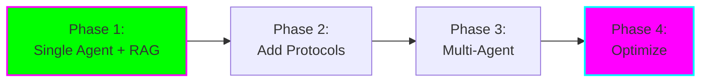

**Why:** Complexity compounds quickly. Validate each layer before adding more.

**Example Progression:**
1. **Week 1:** Single LLM with prompt engineering
2. **Week 2:** Add RAG for knowledge grounding
3. **Week 3:** Implement MCP for tool access
4. **Week 4:** Introduce specialized agents
5. **Week 5:** Optimize and refine

### 2. Design for Observability

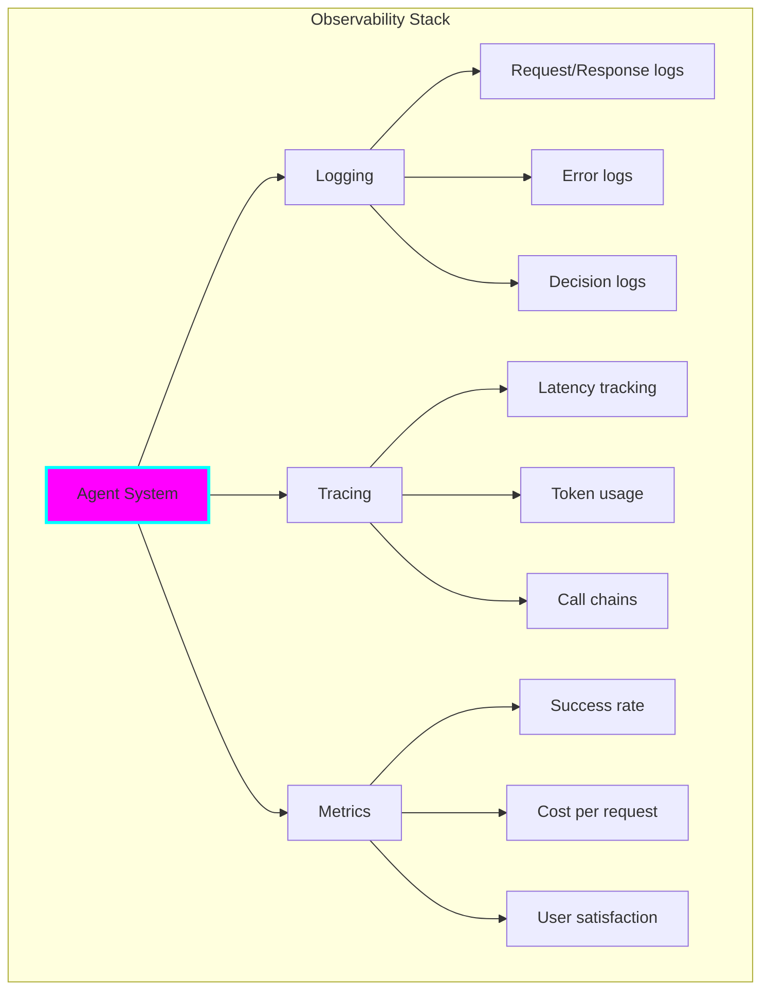

**Essential Logging:**

```python
import structlog

logger = structlog.get_logger()

# Log agent decisions
logger.info(
    "agent_decision",
    agent="research_agent",
    action="retrieve_documents",
    query=query,
    results_count=len(results),
    latency_ms=latency,
    cost_usd=cost
)

# Log errors with context
logger.error(
    "retrieval_failed",
    agent="research_agent",
    error=str(e),
    query=query,
    retry_count=retries
)
```

### 3. Implement Guardrails

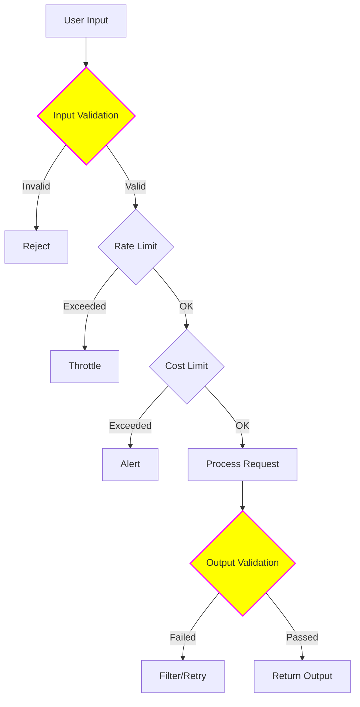

**Guardrail Types:**

1. **Input Guardrails**
   - Prompt injection detection
   - Length limits
   - Content filtering

2. **Processing Guardrails**
   - Timeout limits
   - Token budgets
   - Iteration caps (prevent infinite loops)

3. **Output Guardrails**
   - PII detection and redaction
   - Toxicity filtering
   - Factuality checks

**Implementation:**

```python
from guardrails import Guard
import guardrails as gd

# Define guardrails
guard = Guard.from_string(
    validators=[
        gd.validators.ValidLength(min=10, max=5000),
        gd.validators.PIIFilter(),
        gd.validators.ToxicLanguage(threshold=0.8)
    ]
)

# Validate output
validated_output = guard.validate(llm_output)
```

## RAG Best Practices

### Architecture Checklist

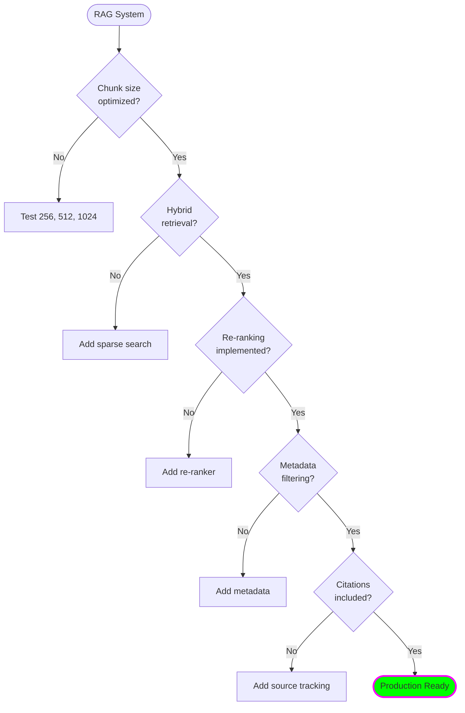

### RAG Optimization Workflow

**1. Chunk Size Optimization**

```python
# Test different chunk sizes
chunk_sizes = [256, 512, 768, 1024]
overlap_ratios = [0.1, 0.2, 0.3]

results = []
for size in chunk_sizes:
    for overlap in overlap_ratios:
        metrics = evaluate_rag(
            chunk_size=size,
            overlap=int(size * overlap),
            test_queries=eval_queries
        )
        results.append({
            'size': size,
            'overlap': overlap,
            'precision': metrics['precision'],
            'recall': metrics['recall']
        })

# Choose optimal configuration
best_config = max(results, key=lambda x: x['precision'])
```

**2. Retrieval Quality**

| Metric | Target | Measurement |
|--------|--------|-------------|
| **Precision@5** | > 0.8 | Are retrieved chunks relevant? |
| **Recall@5** | > 0.7 | Did we get all needed info? |
| **MRR** | > 0.7 | Is best result ranked high? |
| **Latency** | < 500ms | Fast enough for users? |

**3. Generation Quality**

| Metric | Target | Measurement |
|--------|--------|-------------|
| **Faithfulness** | > 0.9 | Sticks to retrieved context? |
| **Answer Relevance** | > 0.85 | Answers the actual question? |
| **Context Precision** | > 0.8 | Retrieved right chunks? |
| **Hallucination Rate** | < 5% | Making up information? |

### RAG Evaluation Pipeline

```python
from ragas import evaluate
from ragas.metrics import (
    faithfulness,
    answer_relevancy,
    context_precision,
    context_recall
)

# Prepare evaluation dataset
eval_dataset = {
    "question": [...],
    "answer": [...],
    "contexts": [...],
    "ground_truth": [...]
}

# Evaluate
results = evaluate(
    eval_dataset,
    metrics=[
        faithfulness,
        answer_relevancy,
        context_precision,
        context_recall
    ]
)

print(results)
# {'faithfulness': 0.92, 'answer_relevancy': 0.88, ...}
```

## Multi-Agent Best Practices

### Agent Design Principles

**1. Single Responsibility**

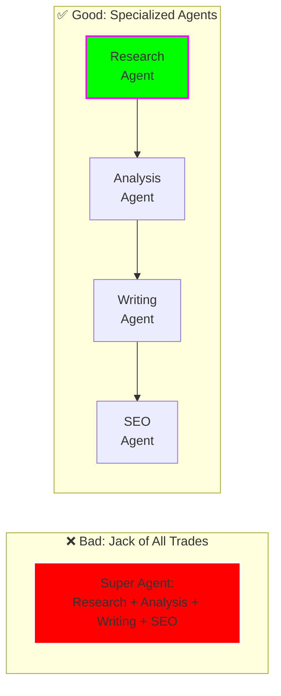

**2. Clear Communication Protocols**

```python
# Define clear message structure
from pydantic import BaseModel

class AgentMessage(BaseModel):
    sender: str
    receiver: str
    message_type: str  # "request", "response", "error"
    payload: dict
    timestamp: str
    correlation_id: str  # Track conversation threads

# Use it
message = AgentMessage(
    sender="research_agent",
    receiver="analysis_agent",
    message_type="request",
    payload={"data": research_data},
    timestamp="2025-11-08T12:00:00Z",
    correlation_id="conv-123"
)
```

**3. Graceful Degradation**

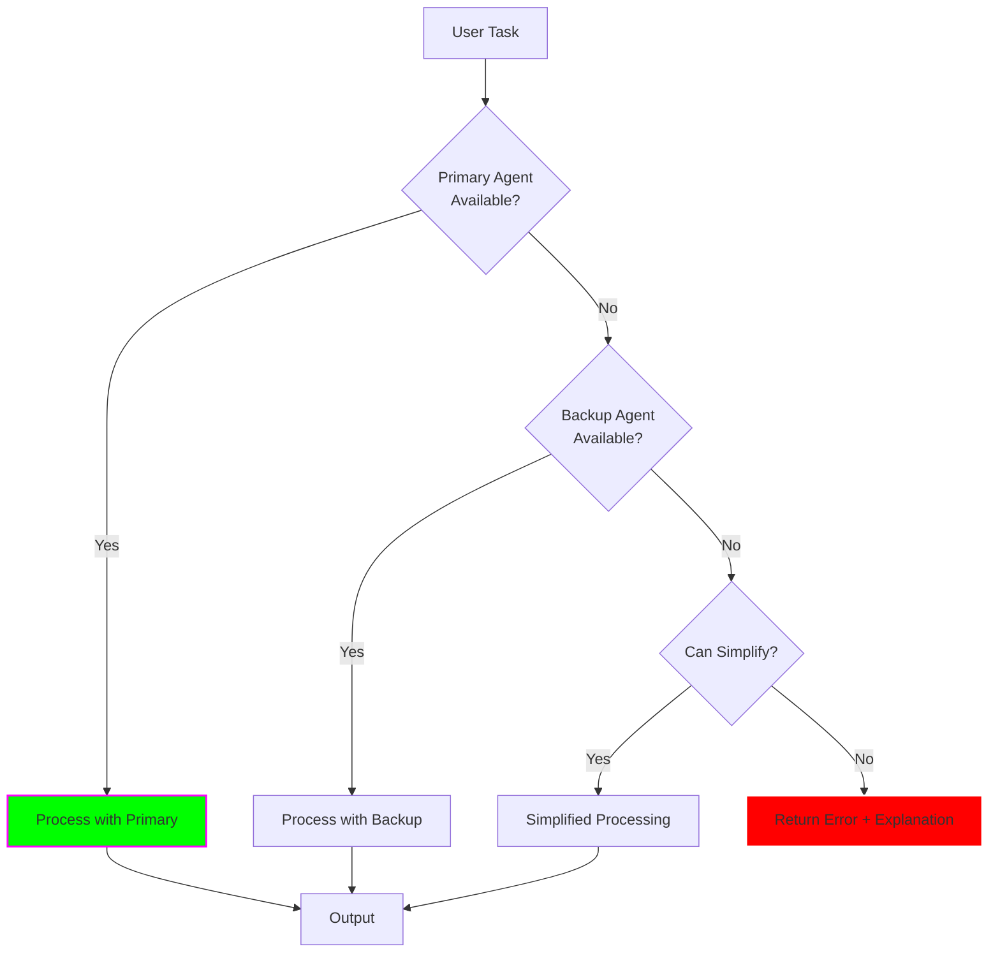

### Agent Coordination Patterns

**1. Sequential (Pipeline)**

```python
# CrewAI example
from crewai import Crew, Process

crew = Crew(
    agents=[research_agent, analysis_agent, writing_agent],
    tasks=[research_task, analysis_task, writing_task],
    process=Process.sequential
)
```

**When to Use:**
- Clear dependencies between tasks
- Output of one feeds into next
- Simple to reason about

**2. Hierarchical (Manager-Workers)**

```python
# LangGraph example
from langgraph.prebuilt import create_agent_supervisor

supervisor = create_agent_supervisor(
    llm,
    agents=[researcher, analyst, writer],
    system_prompt="You are a supervisor managing a team..."
)
```

**When to Use:**
- Complex decision-making needed
- Dynamic task allocation
- Need centralized coordination

**3. Collaborative (Peer-to-Peer)**

```python
# AutoGen group chat
from autogen import GroupChat, GroupChatManager

groupchat = GroupChat(
    agents=[agent1, agent2, agent3],
    messages=[],
    max_round=10
)
```

**When to Use:**
- Brainstorming and debate
- No clear leader
- Consensus-building

### Performance Optimization

**1. Parallel Execution**

```python
import asyncio

async def parallel_agents():
    results = await asyncio.gather(
        research_agent.run(query),
        analysis_agent.run(query),
        summary_agent.run(query)
    )
    return combine_results(results)
```

**2. Caching**

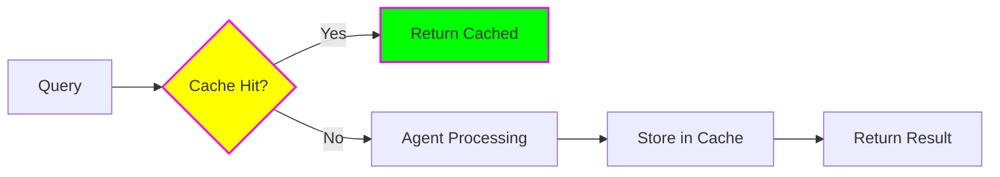

```python
from functools import lru_cache
import hashlib

@lru_cache(maxsize=1000)
def cached_agent_call(query_hash: str):
    return agent.run(query)

# Use it
query_hash = hashlib.md5(query.encode()).hexdigest()
result = cached_agent_call(query_hash)
```

**3. Streaming**

```python
# Stream agent responses
async def stream_agent_response(query):
    async for chunk in agent.stream(query):
        yield chunk
        # User sees progress in real-time
```

## Security Best Practices

### Threat Model

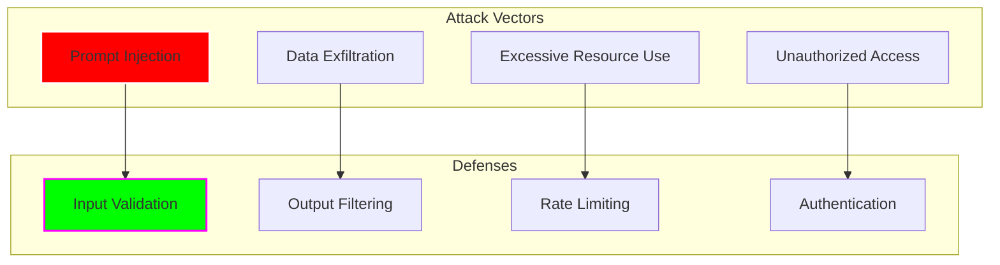

### Security Checklist

**MCP Servers:**
- [ ] Implement authentication (API keys minimum)
- [ ] Use HTTPS/TLS for transport
- [ ] Validate all inputs
- [ ] Rate limit requests
- [ ] Audit log all operations
- [ ] Principle of least privilege for tools
- [ ] Sandbox code execution

**RAG Systems:**
- [ ] Sanitize retrieved content
- [ ] Redact PII from outputs
- [ ] Validate document sources
- [ ] Implement access control on vector DB
- [ ] Monitor for data leakage

**Multi-Agent Systems:**
- [ ] Authenticate inter-agent communication
- [ ] Encrypt sensitive data in transit
- [ ] Implement agent authorization
- [ ] Monitor for abnormal behavior
- [ ] Limit agent capabilities

### Prompt Injection Defense

```python
def detect_injection(user_input: str) -> bool:
    """Detect potential prompt injection attempts"""
    injection_patterns = [
        r"ignore previous instructions",
        r"disregard all prior",
        r"new instructions:",
        r"system:",
        r"<|im_start|>",
        # Add more patterns
    ]

    for pattern in injection_patterns:
        if re.search(pattern, user_input, re.IGNORECASE):
            return True
    return False

# Use before processing
if detect_injection(user_input):
    return "Invalid input detected"
```

## Cost Optimization

### Token Management

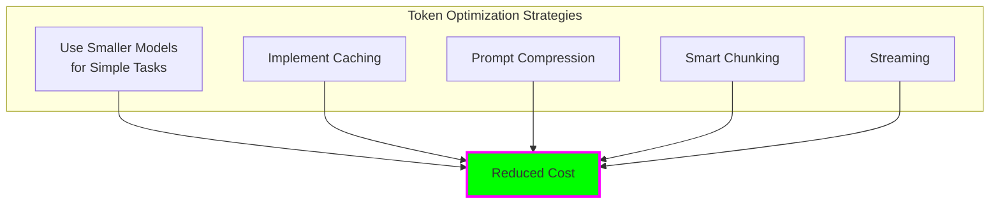

**Model Selection Strategy:**

| Task Complexity | Model | Cost/1M Tokens |
|----------------|-------|----------------|
| Simple classification | GPT-3.5 Turbo | $0.50 |
| General tasks | Claude Haiku | $0.25 |
| Complex reasoning | GPT-4 | $30.00 |
| Critical analysis | Claude Opus | $15.00 |

**Prompt Optimization:**

```python
# ❌ Inefficient: Sends full context every time
prompt = f"""
Here is a long document: {full_document}

Now answer: {question}
"""

# ✅ Efficient: Use RAG to send only relevant chunks
relevant_chunks = retrieve(question, top_k=3)
prompt = f"""
Relevant information: {relevant_chunks}

Question: {question}
"""
```

### Cost Monitoring

```python
import tiktoken

def estimate_cost(text: str, model: str) -> float:
    """Estimate cost of LLM call"""
    encoding = tiktoken.encoding_for_model(model)
    tokens = len(encoding.encode(text))

    pricing = {
        "gpt-4": {"input": 30/1000000, "output": 60/1000000},
        "gpt-3.5-turbo": {"input": 0.5/1000000, "output": 1.5/1000000},
        "claude-3-haiku": {"input": 0.25/1000000, "output": 1.25/1000000}
    }

    return tokens * pricing[model]["input"]

# Track costs
total_cost = 0
for request in requests:
    cost = estimate_cost(request, "gpt-4")
    total_cost += cost
    logger.info(f"Request cost: ${cost:.4f}, Total: ${total_cost:.2f}")
```

## Testing Strategies

### Unit Testing Agents

```python
import pytest
from unittest.mock import Mock

def test_research_agent():
    # Mock LLM
    mock_llm = Mock()
    mock_llm.predict.return_value = "Mocked research result"

    agent = ResearchAgent(llm=mock_llm)
    result = agent.run("test query")

    assert "research" in result.lower()
    mock_llm.predict.assert_called_once()
```

### Integration Testing

```python
def test_full_crew():
    """Test complete multi-agent workflow"""
    crew = Crew(
        agents=[researcher, analyst, writer],
        tasks=[research_task, analysis_task, writing_task]
    )

    result = crew.kickoff()

    # Assertions
    assert result is not None
    assert len(result) > 100  # Minimum length
    assert "conclusion" in result.lower()
```

### Evaluation Testing

```python
def test_rag_quality():
    """Test RAG system quality metrics"""
    from ragas import evaluate

    results = evaluate(
        test_dataset,
        metrics=[faithfulness, answer_relevancy]
    )

    assert results['faithfulness'] > 0.85
    assert results['answer_relevancy'] > 0.80
```

## Deployment Checklist

### Pre-Production

- [ ] Security review completed
- [ ] Load testing passed
- [ ] Error handling comprehensive
- [ ] Monitoring & alerting configured
- [ ] Cost estimates validated
- [ ] Fallback mechanisms tested
- [ ] Documentation complete
- [ ] Team trained on system

### Production Readiness

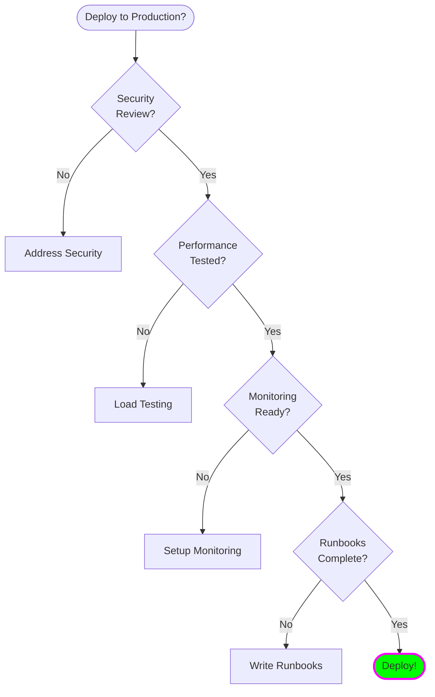

### Post-Deployment

- [ ] Monitor error rates
- [ ] Track latency metrics
- [ ] Analyze cost per request
- [ ] Gather user feedback
- [ ] Review security logs
- [ ] A/B test improvements
- [ ] Document incidents
- [ ] Iterate and improve

## Common Pitfalls

### ❌ Avoid These Mistakes

**1. Over-Engineering**
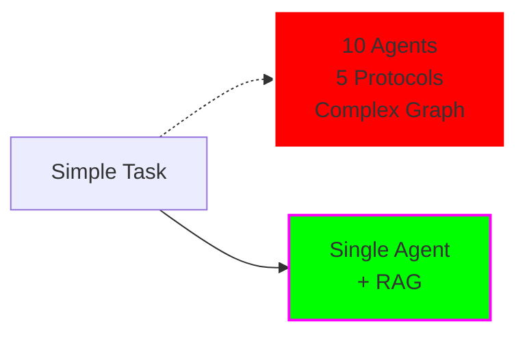

**2. No Evaluation**
- Building without measuring quality
- Shipping without benchmarks
- Assuming it works

**3. Ignoring Costs**
- Using GPT-4 for everything
- No token budgets
- Surprise bills

**4. Poor Error Handling**
- No retries for transient failures
- Cryptic error messages
- No fallback paths

**5. Lack of Observability**
- Can't debug issues
- No visibility into agent decisions
- Missing performance metrics

## Resources

### Tools & Frameworks
- [LangSmith](https://www.langchain.com/langsmith) - Observability
- [Guardrails AI](https://www.guardrailsai.com/) - Output validation
- [RAGAS](https://docs.ragas.io/) - RAG evaluation
- [Phoenix](https://phoenix.arize.com/) - LLM tracing

### Learning Resources
- [Anthropic Cookbook](https://github.com/anthropics/anthropic-cookbook)
- [OpenAI Cookbook](https://cookbook.openai.com/)
- [LangChain Documentation](https://python.langchain.com/)

---

**Previous:** [← Multi-Agent Frameworks](04-multi-agent-frameworks.md) | **Back to:** [Overview](01-overview.md)
