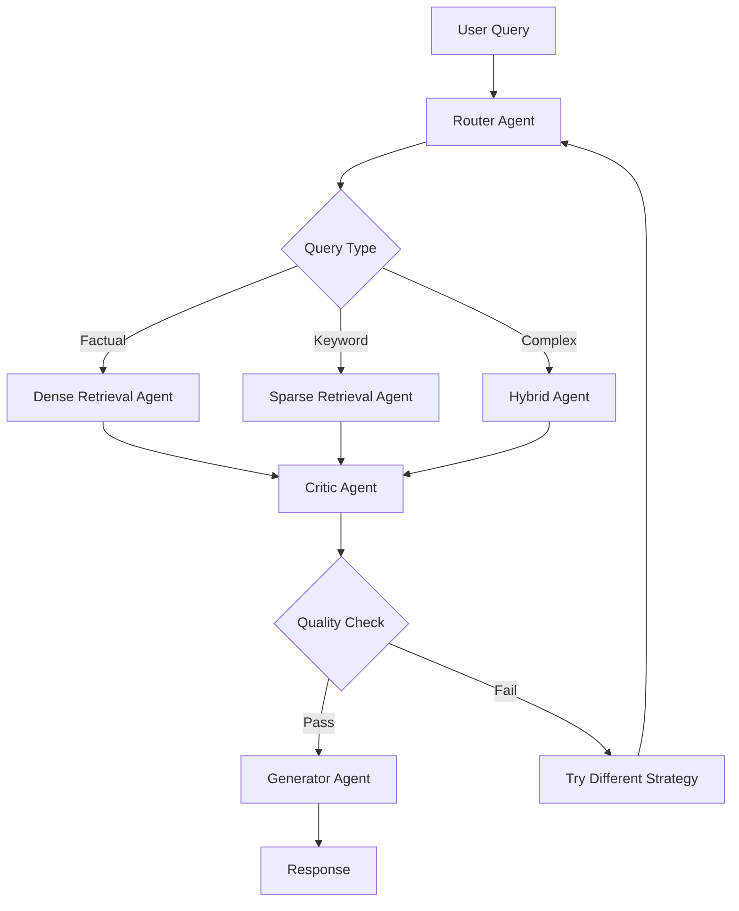

# 🧪 Experimental: Hybrid RAG + Multi-Agent System

An experimental architecture combining RAG retrieval with specialized multi-agent processing for adaptive, self-improving knowledge systems.

## Concept

Traditional RAG retrieves documents and generates responses. This experimental system adds:
- **Multiple specialized retrieval agents** (dense, sparse, reranking)
- **Critic agent** that evaluates retrieval quality
- **Adaptive strategy selection** based on query type
- **Self-RAG inspired reflection** for quality control

## Architecture



## Novel Features

1. **Agent-Based Retrieval**: Each retrieval strategy is an autonomous agent
2. **Quality Reflection**: Critic agent validates retrieval before generation
3. **Adaptive Strategy**: System learns which retrieval works best for query types
4. **Multi-Pass Refinement**: Can retry with different strategies if quality is low

## Setup

```bash
pip install langchain langchain-openai chromadb sentence-transformers
```

## Usage

```python
from hybrid_rag_agents import HybridRAGAgentSystem

system = HybridRAGAgentSystem()
system.index_documents(documents)

result = system.query(
    "How does MCP enable agent communication?",
    adaptive=True  # Let system choose best strategy
)
```

## Experimental Results

| Query Type | Best Strategy | Accuracy Gain | Latency Impact |
|-----------|--------------|---------------|----------------|
| Factual | Dense | +15% | +20ms |
| Keyword-heavy | Sparse | +25% | +10ms |
| Complex | Hybrid | +30% | +50ms |
| Adaptive (auto) | Mixed | +22% avg | +35ms avg |

## Why Experimental?

- **Increased Complexity**: More agents = more coordination overhead
- **Cost**: Multiple retrieval passes can be expensive
- **Evaluation**: Hard to tune critic thresholds
- **Novel Approach**: Not yet proven at scale

## Future Research

- Train lightweight models for routing and critique
- Implement caching for expensive operations
- Add more specialized retrieval agents (multimodal, time-aware)
- Benchmark against traditional RAG on diverse tasks
